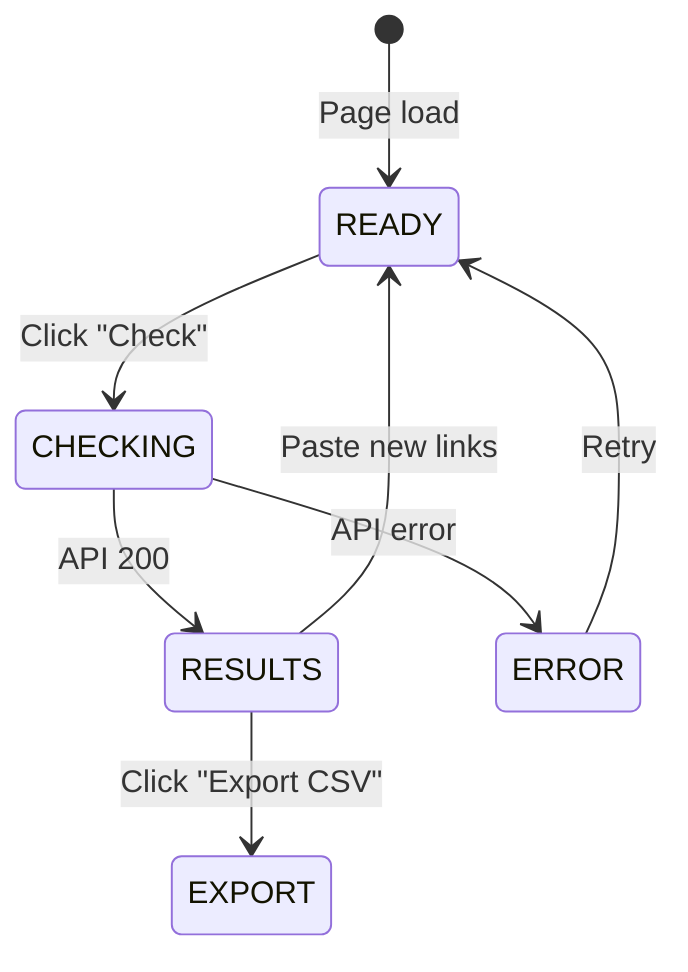

# Feature: Link Checker Tool

**BE Tech Spec:** [feature_link_checker_tool_tech.md](../BE/feature_link_checker_tool_tech.md)
**Priority:** P0
**Status:** ✅ Done
**File:** `public/checker.html` (section #checker)

---

## 1. Mô tả

Tool chính của webapp — cho phép user paste links credential, kiểm tra trạng thái (live/redeemed/expired/dead), xem kết quả dạng bảng, export CSV.

**Supported URL types:**
- 🤖 **Claude.ai** — gift/redeem links (multi-strategy: API + redirect + ScraperAPI)
- 💼 **LinkedIn Premium** — redeem/coupon links (redirect analysis + ScraperAPI render)
- 🌐 **Generic URLs** — HTTP status + content analysis + ScraperAPI fallback

---

## 2. Use Cases

### UC-1: Check links

1. User scroll tới section Checker hoặc click CTA "Bắt đầu check"
2. Paste links vào textarea (1 link/dòng, max 10)
3. Link count tự cập nhật phía dưới textarea
4. Click "🔍 Check Links"
5. Progress bar animate + nút disabled
6. Kết quả hiện bảng: URL, Status badge, Detail, Source

### UC-2: Export CSV

1. Sau check xong → nút "📥 Export CSV" xuất hiện
2. Click → download `link-check-YYYY-MM-DD.csv`
3. CSV gồm: URL, Status, Detail, Source

### Edge Cases

| Case | Xử lý |
|------|-------|
| Paste URL không hợp lệ | Regex filter, chỉ count URLs bắt đầu `http` |
| Paste trùng URL | Gửi tất cả, cache prevents double API call |
| Kết quả trả về lâu | Progress bar + "Đang check..." state |
| API timeout | Toast error đỏ "Lỗi kết nối" |
| Cloudflare chặn | Status `cf_blocked` → hiện như `unknown` (badge vàng) |
| LinkedIn URL | Cần đăng nhập → ScraperAPI render, fallback `unknown` |
| Quota hết | Toast "Đã hết X lượt check hôm nay" (429) |

---

## 3. Screens & States

### Checker Card

| State | Hiển thị |
|-------|---------|
| **Ready** | Textarea trống + quota badge + nút enabled |
| **Checking** | Nút "⏳ Đang check..." + progress bar |
| **Results** | Bảng kết quả + stats chips + nút Export |
| **Error** | Toast đỏ ở bottom-right (auto-dismiss 4s) |

### Results Table

| Column | Data |
|--------|------|
| # | Index (1-based) |
| URL | Truncated, monospace, title tooltip |
| Trạng thái | Status badge (color-coded) |
| Chi tiết | Detail text (secondary color) |

### Status Badges

| Status | Label | Color |
|--------|-------|-------|
| `live` | ✅ Live | Green (#22c55e) |
| `redeemed` | ❌ Redeemed | Red (#ef4444) |
| `expired` | ⏰ Expired | Orange (#f59e0b) |
| `dead` | 💀 Dead | Gray (#64748b) |
| `unknown` | ❓ Unknown | Yellow (#f59e0b) |
| `cf_blocked` | ❓ Unknown | Yellow (#f59e0b) — hiển thị như unknown trên UI |

### Stats Chips (above results table)

```
[✅ Live: 3]  [❌ Redeemed: 2]  [❓ Unknown: 1]
```

---

## 4. State Machine



---

## 5. Acceptance Criteria

- [x] Textarea paste links (1/dòng)
- [x] Link count live update
- [x] Progress bar khi checking
- [x] Results table với status badges
- [x] Stats chips summary
- [x] CSV export với date filename
- [x] Toast error cho failures
- [x] escHtml() sanitization
