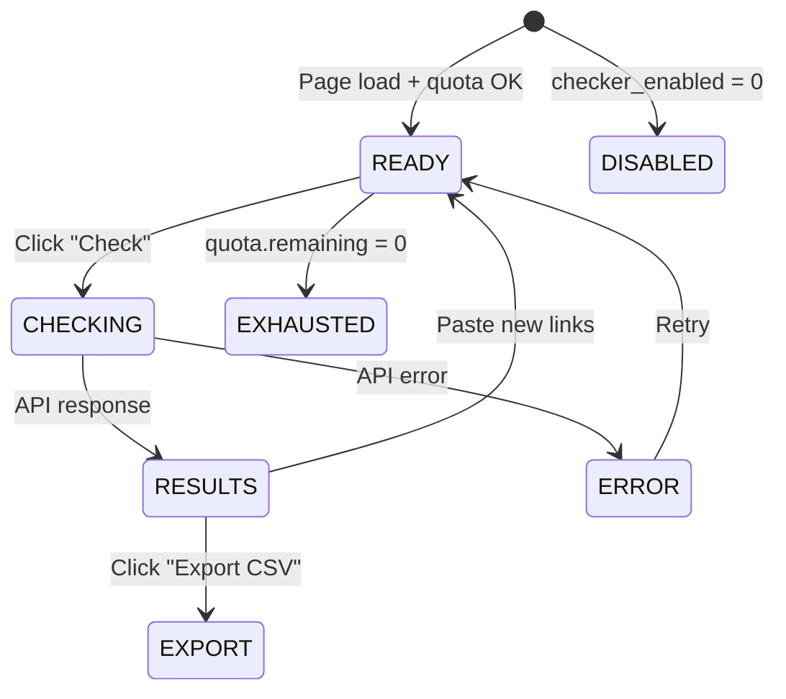

# Link Checker Webapp — Frontend Feature Spec

**BE Tech Spec:** [feature_link_checker_webapp_tech.md](../BE/feature_link_checker_webapp_tech.md)
**Status:** ✅ Done
**File:** `public/checker.html` (single-page app)

---

## 1. Mô tả

Standalone web page cho phép shop check trạng thái link credential miễn phí. Thiết kế premium dark mode, đồng thời quảng bá BotShop SaaS.

---

## 2. Use Cases

### UC-1: Check links

1. User truy cập `/checker.html`
2. Xem Hero giới thiệu tool
3. Scroll xuống hoặc click CTA → Checker tool
4. Paste links vào textarea (1/dòng, max 10)
5. Click "Check Links" → progress bar → kết quả

### UC-2: Export kết quả

1. Sau khi check xong → nút "Export CSV" xuất hiện
2. Click → download file CSV chứa URL, Status, Detail, Source

### UC-3: Hết quota

1. Check đến hết lượt → badge đỏ "Hết lượt hôm nay"
2. Nút Check disabled → user quay lại ngày mai

### UC-4: Tool bị tắt

1. Admin tắt `checker_enabled` → UI ẩn checker card
2. Hiển thị overlay "Link Checker tạm dừng"

---

## 3. Screens & States

### Page Layout (3 sections)

| # | Section | Nội dung |
|---|---------|---------|
| 1 | **Hero** | Badge "Miễn phí", headline, sub-text, CTA "Bắt đầu check" |
| 2 | **Checker Tool** | Textarea, quota badge, results table, export |
| 3 | **BotShop Promo** | Icon 🚀, headline, 4 features grid, CTA "Đăng ký BotShop" |

### Checker Tool States

| State | Hiển thị |
|-------|---------|
| **Ready** | Textarea empty, quota badge "Còn X/Y lượt", nút Check enabled |
| **Checking** | Nút "⏳ Đang check...", progress bar animate |
| **Results** | Bảng URL + status badges + nút Export |
| **Quota Exhausted** | Badge đỏ "Hết lượt", nút disabled |
| **Disabled** | Overlay "🔒 Link Checker tạm dừng" |
| **Error** | Toast đỏ ở bottom-right |

### Status Badges

| Status | Icon | Color |
|--------|------|-------|
| live | ✅ Live | Green |
| redeemed | ❌ Redeemed | Red |
| expired | ⏰ Expired | Orange |
| dead | 💀 Dead | Gray |
| unknown | ❓ Unknown | Yellow |

### BotShop Promo Features Grid

| Feature | Icon | Mô tả |
|---------|------|-------|
| Bot Telegram tự động | 🤖 | Khách chọn SP → thanh toán → nhận link |
| VietQR + SePay | 💳 | Thanh toán bank transfer, xác nhận tự động |
| Mã giảm giá linh hoạt | 🎟 | Group, user cụ thể, khách mới |
| Dashboard quản lý | 📊 | Doanh thu, đơn hàng, khách hàng |

---

## 4. Design System

| Token | Value |
|-------|-------|
| Font | Inter (Google Fonts) |
| Background | `#0a0e1a` (dark) |
| Card BG | `#111827` |
| Primary | `#6366f1` (indigo) |
| Text | `#f1f5f9` |
| Text secondary | `#94a3b8` |
| Radius | 12px (card), 8px (button) |
| Hero gradient | `135deg, #0a0e1a → #1a1040 → #0a0e1a` |

---

## 5. State Machine

---

## 6. Responsive Breakpoints

| Breakpoint | Thay đổi |
|-----------|---------|
| ≥ 1024px | Full layout, 3-column promo grid |
| 768px | Narrower cards, 2-column promo |
| ≤ 375px | Single column, smaller hero text, truncated URLs |

---

## 7. Acceptance Criteria

- [x] Hero landing với CTA scroll xuống checker
- [x] Textarea paste links (max 10/batch)
- [x] Quota badge realtime (API call on load)
- [x] Progress bar khi đang check
- [x] Results table với status badges
- [x] Export CSV output
- [x] Quota exhausted → badge đỏ + button disabled
- [x] Feature disabled → overlay "Tạm dừng"
- [x] Toast error cho API failures
- [x] BotShop promo với 4 features + CTA
- [x] Responsive 375px / 768px / 1440px
- [x] Dark mode, premium glassmorphism design
