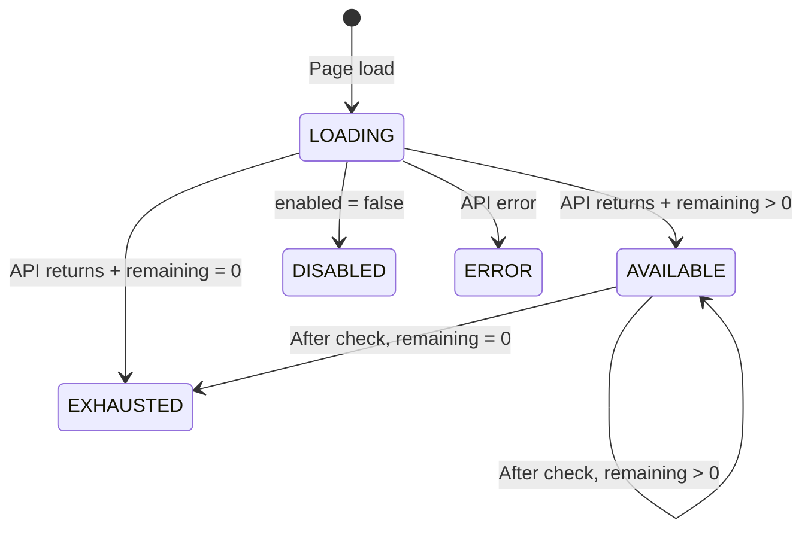

# Feature: Quota System

**BE Tech Spec:** [feature_quota_system_tech.md](../BE/feature_quota_system_tech.md)
**Priority:** P0
**Status:** ✅ Done
**File:** `public/checker.html` (quota badge) + Admin panel Settings tab

---

## 1. Mô tả

Hệ thống giới hạn lượt check/ngày/IP. User thấy quota badge trên checker tool. Admin cấu hình quota, max batch, bật/tắt feature tại tab Cài đặt.

---

## 2. Use Cases

### UC-1: User xem quota

1. Page load → GET `/api/checker/quota`
2. Quota badge hiện: "⚡ Còn 17/20 lượt"
3. Sau mỗi check → badge cập nhật

### UC-2: User hết quota

1. Quota remaining = 0 → badge đỏ "Hết lượt hôm nay"
2. Nút Check disabled
3. User quay lại ngày mai → quota reset

### UC-3: Admin cấu hình quota

1. Admin panel → tab Cài đặt → section "Public Link Checker"
2. Fields: Toggle bật/tắt, Quota/ngày (number), Max links/batch (number)
3. Save → settings cập nhật ngay

### UC-4: Admin tắt tool

1. Admin toggle OFF `checker_enabled`
2. checker.html hiển thị overlay "🔒 Link Checker tạm dừng"
3. Checker card bị ẩn

### Edge Cases

| Case | Xử lý |
|------|-------|
| API unreachable | Badge: "Không tải được quota" |
| Quota = 0 setting | Tool bật nhưng 0 lượt → mọi check bị deny |
| Mid-day quota change | Áp dụng ngay cho requests tiếp theo |

---

## 3. Screens & States

### Quota Badge (checker card header)

| State | Hiển thị | Style |
|-------|---------|-------|
| **Available** | "⚡ Còn 17/20 lượt" | Purple background |
| **Exhausted** | "Hết lượt hôm nay" | Red background |
| **Loading** | "Đang tải..." | Purple background |
| **Error** | "Không tải được quota" | Gray text |

### Tool Disabled Overlay

```
🔒
Link Checker tạm dừng
Tính năng kiểm tra link đang tạm ngưng hoạt động.
Vui lòng quay lại sau.
```

### Admin — Checker Config Section (Settings tab)

| Field | Type | Default | Mô tả |
|-------|------|---------|-------|
| Bật/tắt | toggle | ON | `checker_enabled` |
| Quota/ngày/IP | number | 20 | `checker_daily_quota` |
| Max links/batch | number | 10 | `checker_max_batch` |

---

## 4. State Machine



---

## 5. Acceptance Criteria

- [x] Quota badge loads on page init
- [x] Badge updates after each check
- [x] Exhausted state: red badge + disabled button
- [x] Disabled state: overlay, checker hidden
- [x] Admin toggle bật/tắt
- [x] Admin set quota/ngày
- [x] Admin set max links/batch
- [x] Daily reset (no cron needed)
