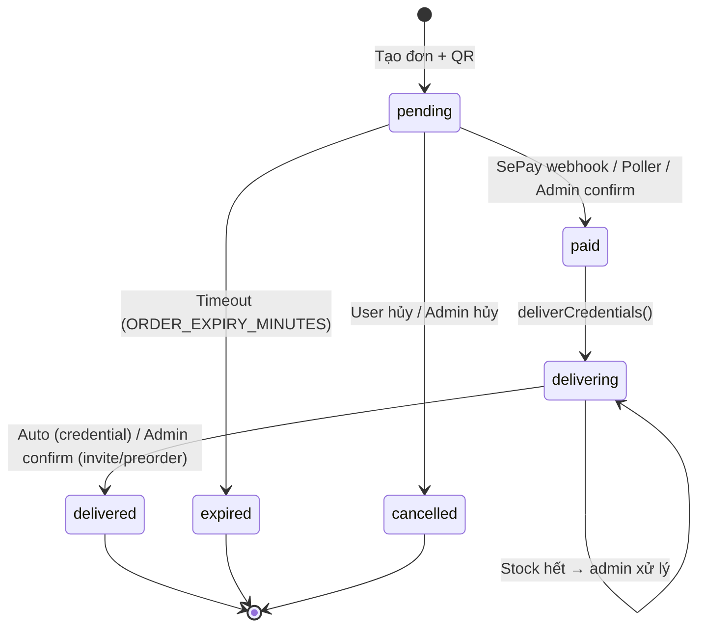

# Feature: Order Flow — Tech Spec (BE)

**Product Spec:** [feature_order_flow.md](../FE/feature_order_flow.md)
**Backend:** Node.js + sql.js (SQLite)
**Handlers:** `orderHandler.js`, `webhookHandler.js`, `deliveryHandler.js`, `sepayPoller.js`, `database.js`

---

## 1. Database Schema

### Bảng `orders`

```sql
CREATE TABLE IF NOT EXISTS orders (
  id INTEGER PRIMARY KEY AUTOINCREMENT,
  order_code TEXT UNIQUE NOT NULL,
  telegram_user_id INTEGER NOT NULL,
  telegram_username TEXT,
  product_id INTEGER,
  product_name TEXT,
  quantity INTEGER DEFAULT 1,
  unit_price INTEGER,
  total_amount INTEGER NOT NULL,
  discount_code TEXT,
  discount_amount INTEGER DEFAULT 0,
  customer_email TEXT,
  status TEXT DEFAULT 'pending',
  -- Statuses: pending → paid → delivering → delivered
  --                    → expired
  --                    → cancelled
  payment_qr_url TEXT,
  expires_at TEXT,
  paid_at TEXT,
  delivered_at TEXT,
  subscription_expires_at TEXT,
  expiry_reminded INTEGER DEFAULT 0,
  created_at TEXT DEFAULT (datetime('now')),
  FOREIGN KEY (product_id) REFERENCES products(id)
);
```

### Bảng `credentials`

```sql
CREATE TABLE IF NOT EXISTS credentials (
  id INTEGER PRIMARY KEY AUTOINCREMENT,
  product_id INTEGER NOT NULL,
  credential_data TEXT NOT NULL,
  is_sold INTEGER DEFAULT 0,
  order_id INTEGER,
  sold_at TEXT,
  created_at TEXT DEFAULT (datetime('now')),
  FOREIGN KEY (product_id) REFERENCES products(id)
);
```

---

## 2. API Contract

### POST `{WEBHOOK_PATH}` — SePay Payment Webhook

**Request (from SePay):**

```json
{
  "id": 12345,
  "transferType": "in",
  "transferAmount": 65000,
  "content": "ORD1710567890123 thanh toan",
  "code": "ORD1710567890123",
  "gateway": "Vietcombank",
  "accountNumber": "1234567890"
}
```

**Response:** Always `200 { success: true }` (kể cả khi lỗi — SePay không retry)

### Admin API

| Method | Path | Mô tả |
| ------ | ---- | ----- |
| GET | `/api/admin/orders` | List orders (filter, sort, paginate) |
| POST | `/api/admin/orders/:code/confirm` | Confirm manual order |
| POST | `/api/admin/orders/:code/cancel` | Cancel order |
| POST | `/api/admin/orders/:code/deliver` | Mark delivered |
| POST | `/api/admin/orders/:code/resend` | Resend credentials |

---

## 3. Backend Implementation

### 3.1 Order Creation (`orderHandler.js`)

```
createOrder(bot, { chatId, userId, username, productId, quantity, customerEmail, discountCode, discountId, discountAmount }):
  1. Validate product exists
  2. Check stock >= quantity
  3. Check max_per_user limit (if configured)
     - getUserProductPurchaseCount(userId, productId)
     - remaining = max_per_user - purchased
     - If remaining <= 0 → reject "đã mua tối đa"
     - If quantity > remaining → reject "chỉ có thể mua thêm N"
  4. Calculate: originalAmount = price × qty, totalAmount = original - discount
  5. Set expiresAt = now + ORDER_EXPIRY_MINUTES
  6. createOrder() → orderCode (format: ORD + timestamp13 + random4)
  7. Generate VietQR URL (no API key needed)
  8. Send QR photo + order info to user
     - If sendPhoto fails → fallback gửi text + link QR
  9. Buttons: [❌ Hủy đơn] [🏠 Menu chính]
```

### 3.2 Payment Verification — Dual Layer

#### Layer 1: Webhook (real-time) — `webhookHandler.js`

```
processSepayWebhook(payload):
  1. Only process transferType === 'in'
  2. Extract order code:
     a. payload.code starts with 'ORD' → use directly
     b. Fallback: regex ORD\d{13,20} from content
  3. No order code found → log + ignore (return 200)
  4. Find pending order: getPendingOrderByCode(orderCode)
     - Not found → log "No pending order" + ignore (order may be expired/processed)
  5. Verify amount: transferAmount >= total_amount
     - If underpaid → notify user: "Số tiền chưa đủ, vui lòng CK thêm hoặc liên hệ admin"
     - Order stays 'pending' (NOT rejected)
  6. ✅ Confirm: updateOrderStatus → 'paid' + set paid_at
  7. Record discount usage (if has discount_code)
  8. Notify user: "Đã xác nhận thanh toán"
  9. Call deliverCredentials(bot, order)
     - If returns false → notify admin "GIAO HÀNG THẤT BẠI"
     - If throws → notify admin "LỖI GIAO HÀNG" + error message
  10. Notify admin: payment received info
```

#### Layer 2: Polling (backup) — `sepayPoller.js`

```
pollAndReconcile(bot):  // runs every 2 minutes
  1. Get all pending orders from DB
  2. Fetch today's transactions from SePay API:
     GET https://my.sepay.vn/userapi/transactions/list?transaction_date_min={today}&limit=50
     Authorization: Bearer {SEPAY_API_KEY}
  3. For each pending order:
     a. Find matching transaction (by order code in content/code field + amount >= total)
     b. If matched:
        - Double-check order still pending (race condition with webhook)
        - Confirm payment (same flow as webhook)
        - Admin message includes "(via poller — webhook missed)"
     c. If not matched + pending > 10 min:
        - Alert admin: "Đơn pending lâu, kiểm tra SePay"
```

**Why polling exists:** SePay does NOT retry failed webhooks. Server restart, cold start, network issues → webhook lost → customer paid but order stays pending → auto-expires → money lost.

### 3.3 Credential Delivery (`deliveryHandler.js`)

```
deliverCredentials(bot, order):
  → Determine product_type from product table

  CREDENTIAL type (auto):
    1. Set status → 'delivering'
    2. getAvailableCredentials(productId, quantity) — FIFO
    3. If not enough stock → notify user "tạm hết stock, admin liên hệ sớm"
       → status stays 'delivering' (admin can see)
       → return false
    4. Build delivery message with credential_fields config
    5. Send credentials to user via bot
    6. markCredentialsSold(credIds, orderId) — AFTER message sent
    7. updateOrderStatus → 'delivered'
    8. If product has subscription_days → setSubscriptionExpiry()

  INVITE type (manual):
    1. Set status → 'delivering'
    2. Notify admin with [✅ Đã invite] button
    3. Notify user: "Admin đang xử lý, sẽ thông báo khi hoàn tất"
    4. Admin clicks "Đã invite" →
       a. status → 'delivered'
       b. Set subscription expiry (if applicable)
       c. Customer notification depends on customer_fields:
          - Has password field → "đã thiết lập thành công"
          - Email only → "đã gửi invite, kiểm tra email"

  PREORDER type (manual):
    1. Set status → 'delivering'
    2. Notify admin with delivery_hours ETA + [✅ Đã giao] button
    3. Notify user: "giao trong X giờ"
    4. Admin clicks "Đã giao" →
       a. status → 'delivered'
       b. Set subscription expiry
       c. Notify user: "đã giao, kiểm tra email"
```

### 3.4 Order Expiry (`orderExpiry.js`)

```
checkExpiredOrders():  // every 30 seconds
  1. Find orders: status='pending' AND expires_at < now
  2. For each: status → 'expired'
  3. Notify customer: "Đơn hết hạn" + [🛍 Mua hàng]
  Note: invite/preorder stock is computed dynamically, no explicit restore needed
```

### 3.5 Order History & Detail (`orderHandler.js`)

```
showUserOrders(bot, chatId, messageId, userId, page):
  - Pagination: 5 orders/page
  - Each order = clickable button: emoji + code + product + quantity + status
  - Navigation: [⬅️ Trước] [1/3] [Sau ➡️]

showOrderDetail(bot, chatId, messageId, orderCode):
  - Full info: code, status, product, quantity, price, discount, email
  - Timeline: created_at, paid_at, delivered_at
  - Pending: show remaining minutes + [❌ Hủy đơn]
  - Has subscription: show subscription_expires_at
```

---

## 4. State Machine



---

## 5. Edge Cases (Backend)

| # | Category | Case | Xử lý |
| - | -------- | ---- | ----- |
| 1 | Concurrency | Duplicate SePay webhook | `getPendingOrderByCode` chỉ lấy status=pending, idempotent |
| 2 | Concurrency | Webhook + Poller chạy cùng lúc | Poller re-check `getPendingOrderByCode` trước khi process |
| 3 | Concurrency | 2 users buy last stock | SQLite single-writer, first wins |
| 4 | Data Integrity | Thanh toán thiếu tiền | Notify user "CK thêm hoặc liên hệ admin", đơn giữ pending |
| 5 | Data Integrity | Hết stock sau thanh toán | Notify user "tạm hết stock", status='delivering', admin xử lý |
| 6 | Data Integrity | Delivery message fail | Status stays 'delivering', admin can resend |
| 7 | Reliability | Webhook fail (server down) | **SePay Poller** polls API mỗi 2 phút → auto-reconcile |
| 8 | Reliability | Railway cold start | Poller start sau 30s delay, sweep pending orders |
| 9 | Reliability | SePay API down | Poller log warning, retry next interval |
| 10 | Security | Webhook spoofing | Secret webhook path (WEBHOOK_PATH env var) |
| 11 | Security | Amount manipulation | Server-side price calculation |
| 12 | Cross-Feature | Mã giảm giá hết hạn giữa flow | Discount recorded on payment, not on order creation |
| 13 | Cross-Feature | Bank thay đổi mid-order | QR dùng bank config lúc tạo đơn |
| 14 | Cross-Feature | max_per_user limit | Check trước createOrder, reject nếu vượt |
| 15 | Data Integrity | Order expire trước webhook đến | Poller KHÔNG match expired orders (chỉ check pending) |
| 16 | UX | QR image send fails | Fallback gửi text + QR link |

---

## 6. Security Considerations

| Concern | Solution |
| ------- | -------- |
| Webhook auth | Secret path (`WEBHOOK_PATH` env var) |
| Replay attack | Status check: only process `pending` orders |
| Amount manipulation | Server-side price calculation |
| Admin API | API key required for all endpoints |
| SePay API key | `SEPAY_API_KEY` env var, Bearer token auth |

---

## 7. Environment Variables

| Variable | Required | Default | Mô tả |
| -------- | -------- | ------- | ----- |
| `SEPAY_API_KEY` | Yes* | — | SePay API key (dùng cho cả webhook auth + polling) |
| `WEBHOOK_PATH` | No | `/webhook/sepay` | Secret webhook endpoint path |
| `ORDER_EXPIRY_MINUTES` | No | `5` | Thời gian hết hạn đơn (phút) |

*Required for poller to work. Without it, only webhook-based verification is active.

---

## 8. Testing Plan

### Unit Tests

- `generateOrderCode()`: unique format ORD + 13-20 digits
- Webhook processing: match → paid, no match → ignore, duplicate → skip
- Amount validation: exact OK, over OK, under → notify + keep pending
- max_per_user: under limit OK, at limit → reject, over limit → reject
- Poller: match transaction → confirm, no match → skip, race condition → skip

### Integration Tests

- Full flow: create order → webhook → delivery → status check
- Poller flow: create order → skip webhook → poller match → delivery
- Expiry: pending > 5 min → auto-expire → notify user
- Resend: delivered order → resend credentials
- Invite flow: paid → admin button → delivered → customer notified

---

## 9. Acceptance Criteria

- [x] Order code generation: `ORD{timestamp}{random}`
- [x] VietQR URL generation (no API key)
- [x] max_per_user limit enforcement
- [x] SePay webhook: extract code, verify amount, update status
- [x] SePay poller: backup reconciliation every 2 min
- [x] Underpayment: notify user, keep order pending
- [x] Auto-deliver credentials (FIFO) with stock check
- [x] Invite/preorder: manual confirm with admin buttons
- [x] Order auto-expire + notify user
- [x] Delivery failure → admin alert
- [x] Subscription expiry auto-set on delivery
- [x] Resend credentials from admin panel
- [x] Discount usage recording on payment confirmation
- [x] QR image fallback to text link
