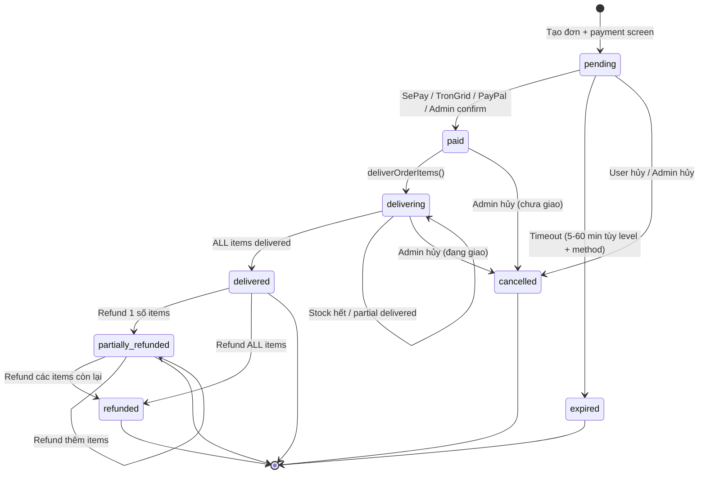

# Feature: Order Flow — Tech Spec (BE)

**Product Spec:** [feature_order_flow.md](../FE/feature_order_flow.md)
**Backend:** Node.js + sql.js (SQLite)
**Handlers:** `orderHandler.js`, `webhookHandler.js`, `deliveryHandler.js`, `sepayPoller.js`, `database.js`

> **Xem thêm:** [feature_international_payment_tech.md](feature_international_payment_tech.md) — USDT & PayPal integration

---

## 1. Database Schema

### Bảng `orders`

```sql
CREATE TABLE IF NOT EXISTS orders (
  id INTEGER PRIMARY KEY AUTOINCREMENT,
  order_code TEXT UNIQUE NOT NULL,
  telegram_user_id INTEGER NOT NULL,
  telegram_username TEXT,
  email TEXT,
  total_amount INTEGER NOT NULL,
  discount_code TEXT,
  discount_amount INTEGER DEFAULT 0,
  status TEXT DEFAULT 'pending',
  -- Statuses: pending → paid → delivering → delivered
  --           → expired | cancelled
  --           delivered → partially_refunded | refunded
  --           partially_refunded → refunded
  payment_qr_url TEXT,
  payment_method TEXT DEFAULT 'vietqr',       -- 'vietqr' | 'usdt' | 'paypal'
  payment_currency TEXT DEFAULT 'VND',         -- 'VND' | 'USD' | 'USDT'
  payment_amount_foreign REAL,                 -- amount in foreign currency (NULL for VND)
  exchange_rate REAL,                          -- VND per 1 USD/USDT at order time
  payment_tx_ref TEXT,                         -- USDT: tx hash | PayPal: order ID
  expires_at TEXT,
  paid_at TEXT,
  delivered_at TEXT,
  refund_type TEXT,                            -- 'full' | 'partial' | NULL
  refund_amount INTEGER DEFAULT 0,             -- SUM of item refunds
  refund_reason TEXT,
  refunded_at TEXT,
  refunded_by TEXT,                            -- admin username
  created_at TEXT DEFAULT (datetime('now'))
);
```

### Bảng `order_items` **(NEW v2)**

```sql
CREATE TABLE IF NOT EXISTS order_items (
  id INTEGER PRIMARY KEY AUTOINCREMENT,
  order_id INTEGER NOT NULL,
  product_id INTEGER,
  product_name TEXT NOT NULL,
  quantity INTEGER DEFAULT 1,
  unit_price INTEGER NOT NULL,
  subtotal INTEGER NOT NULL,
  delivery_status TEXT DEFAULT 'pending',   -- 'pending' | 'delivered' | 'failed'
  subscription_days INTEGER DEFAULT 0,
  subscription_expires_at TEXT,
  warranty_days INTEGER DEFAULT 0,
  warranty_expires_at TEXT,
  refund_status TEXT DEFAULT 'none',        -- 'none' | 'full' | 'partial'
  refund_amount INTEGER DEFAULT 0,
  refund_reason TEXT,
  refunded_at TEXT,
  created_at TEXT DEFAULT (datetime('now')),
  FOREIGN KEY (order_id) REFERENCES orders(id),
  FOREIGN KEY (product_id) REFERENCES products(id)
);
```

### Bảng `cart_items` **(NEW v2)**

```sql
CREATE TABLE IF NOT EXISTS cart_items (
  id INTEGER PRIMARY KEY AUTOINCREMENT,
  telegram_user_id INTEGER NOT NULL,
  shop_id INTEGER NOT NULL,
  product_id INTEGER NOT NULL,
  quantity INTEGER DEFAULT 1,
  created_at TEXT DEFAULT (datetime('now')),
  FOREIGN KEY (product_id) REFERENCES products(id)
);
```

### Bảng `credentials`

```sql
CREATE TABLE IF NOT EXISTS credentials (
  id INTEGER PRIMARY KEY AUTOINCREMENT,
  product_id INTEGER NOT NULL,
  credential_data TEXT NOT NULL,
  is_sold INTEGER DEFAULT 0,
  order_item_id INTEGER,                     -- v2: FK to order_items (was order_id)
  sold_at TEXT,
  created_at TEXT DEFAULT (datetime('now')),
  FOREIGN KEY (product_id) REFERENCES products(id),
  FOREIGN KEY (order_item_id) REFERENCES order_items(id)
);
```

---

## 2. API Contract

### POST `{WEBHOOK_PATH}` — SePay Payment Webhook

**Request (from SePay):**

```json
{
  "id": 12345,
  "transferType": "in",
  "transferAmount": 65000,
  "content": "ORD1710567890123 thanh toan",
  "code": "ORD1710567890123",
  "gateway": "Vietcombank",
  "accountNumber": "1234567890"
}
```

**Response:** Always `200 { success: true }` (kể cả khi lỗi — SePay không retry)

### Admin API

| Method | Path | Mô tả |
| ------ | ---- | ----- |
| GET | `/api/admin/orders` | List orders (filter, sort, paginate) |
| POST | `/api/admin/orders/:code/confirm` | Confirm manual order |
| POST | `/api/admin/orders/:code/cancel` | Cancel order (+ rollback credentials) |
| POST | `/api/admin/orders/:code/deliver` | Mark delivered (per-item) |
| POST | `/api/admin/orders/:code/resend` | Resend credentials |
| POST | `/api/admin/orders/:code/refund` | **[NEW]** Per-item refund (delivered → partially_refunded/refunded) |
| POST | `/api/admin/orders/:code/replace-credential` | **[NEW]** Replace credential per-item (warranty) |
| POST | `/api/admin/orders/:code/set-expiry` | **[NEW]** Set subscription expiry per-item |

### Cart API (Bot)

| Method | Path | Mô tả |
| ------ | ---- | ----- |
| GET | `/api/cart/:userId` | Get cart items |
| POST | `/api/cart/:userId/add` | Add item to cart |
| PUT | `/api/cart/:userId/:itemId` | Update quantity |
| DELETE | `/api/cart/:userId/:itemId` | Remove item |
| DELETE | `/api/cart/:userId` | Clear cart |

---

## 3. Backend Implementation

### 3.1 Order Creation (`orderHandler.js`)

```
createOrder(bot, { chatId, userId, username, cartItems, customerEmail, discountCode, discountId, discountAmount, paymentMethod }):
  1. Validate all cart items exist + active
  2. Check stock >= quantity for each item
  3. Check max_per_user limit per product
  4. Calculate: totalAmount = SUM(item.price × item.qty) - discount
  5. Set expiresAt = now + ORDER_EXPIRY (varies by payment method + level)
  6. BEGIN TRANSACTION:
     a. INSERT order (order_code, total_amount, payment_method, ...)
     b. INSERT order_items for each cart item (product_name, qty, unit_price, subtotal, subscription_days, warranty_days)
     c. DELETE cart_items for user
  7. Generate payment screen (QR/USDT/PayPal)
  8. Send payment info to user
  9. Buttons: [❌ Hủy đơn] [🏠 Menu chính]
```

### 3.2 Payment Verification — Dual Layer

#### Layer 1: Webhook (real-time) — `webhookHandler.js`

```
processSepayWebhook(payload):
  1. Only process transferType === 'in'
  2. Extract order code:
     a. payload.code starts with 'ORD' → use directly
     b. Fallback: regex ORD\d{13,20} from content
  3. No order code found → log + ignore (return 200)
  4. Find pending order: getPendingOrderByCode(orderCode)
     - Not found → log "No pending order" + ignore (order may be expired/processed)
  5. Verify amount: transferAmount >= total_amount
     - If underpaid → notify user: "Số tiền chưa đủ, vui lòng CK thêm hoặc liên hệ admin"
     - Order stays 'pending' (NOT rejected)
  6. ✅ Confirm: updateOrderStatus → 'paid' + set paid_at
  7. Record discount usage (if has discount_code)
  8. Notify user: "Đã xác nhận thanh toán"
  9. Call deliverCredentials(bot, order)
     - If returns false → notify admin "GIAO HÀNG THẤT BẠI"
     - If throws → notify admin "LỖI GIAO HÀNG" + error message
  10. Notify admin: payment received info
```

#### Layer 2: Polling (backup) — `sepayPoller.js`

```
pollAndReconcile(bot):  // runs every 2 minutes
  1. Get all pending orders from DB
  2. Fetch today's transactions from SePay API:
     GET https://my.sepay.vn/userapi/transactions/list?transaction_date_min={today}&limit=50
     Authorization: Bearer {SEPAY_API_KEY}
  3. For each pending order:
     a. Find matching transaction (by order code in content/code field + amount >= total)
     b. If matched:
        - Double-check order still pending (race condition with webhook)
        - Confirm payment (same flow as webhook)
        - Admin message includes "(via poller — webhook missed)"
     c. If not matched + pending > 10 min:
        - Alert admin: "Đơn pending lâu, kiểm tra SePay"
```

**Why polling exists:** SePay does NOT retry failed webhooks. Server restart, cold start, network issues → webhook lost → customer paid but order stays pending → auto-expires → money lost.

### 3.3 Credential Delivery (`deliveryHandler.js`)

```text
deliverOrderItems(bot, order):
  → Get all order_items for order
  → Loop through each item:

  CREDENTIAL type (auto):
    1. Set item.delivery_status → 'delivering'
    2. getAvailableCredentials(productId, quantity) — FIFO
    3. If not enough stock → notify user "tạm hết {product_name}"
       → item.delivery_status stays 'pending'
    4. Build delivery message with credential_fields config
    5. Send credentials to user via bot
    6. markCredentialsSold(credIds, orderItemId) — v2: FK to order_item_id
    7. item.delivery_status → 'delivered'
    8. If subscription_days > 0 → set subscription_expires_at
    9. If warranty_days > 0 → set warranty_expires_at

  INVITE type (manual):
    1. Set item.delivery_status → 'pending'
    2. Notify admin with [✅ Đã invite] button (per item)
    3. Notify user: "Admin đang xử lý {product_name}. ⏱ Giao trong tối đa {delivery_hours}h"
    4. Admin clicks "Đã invite" →
       a. item.delivery_status → 'delivered'
       b. Set subscription/warranty expiry (if applicable)
       c. Notify user

  PREORDER type (manual):
    1. Set item.delivery_status → 'pending'
    2. Notify admin with delivery_hours ETA + [✅ Đã giao] button
    3. Notify user: "Đang chuẩn bị {product_name}. ⏱ Giao trong tối đa {delivery_hours}h"
    4. Admin clicks "Đã giao" → same as invite

  AFTER all items processed:
    - ALL items delivered? → order.status = 'delivered'
    - SOME items delivered (mixed)? → order.status = 'delivering'
    - Send summary: "✅ 2/3 items đã giao, 1 chờ admin"
```

### 3.4 Per-Item Refund (`refundHandler.js`) **(NEW v2)**

```text
refundOrderItems(bot, orderCode, refundItems, reason, adminId):
  1. Find order by code, verify status IN ('delivered', 'partially_refunded')
  2. For each refundItem: { orderItemId, refundType, refundAmount, revokeCredential }
     a. Validate item belongs to order + refund_status = 'none'
     b. If refundType = 'full': refund_amount = item.subtotal
     c. If refundType = 'partial': validate 0 < refundAmount <= item.subtotal
     d. Update item: refund_status, refund_amount, refund_reason, refunded_at
     e. If revokeCredential: mark credential is_sold=0, order_item_id=NULL
  3. Calculate order.refund_amount = SUM(items.refund_amount)
  4. Determine order status:
     - ALL items refunded → 'refunded' + refund_type='full'
     - SOME items refunded → 'partially_refunded' + refund_type='partial'
  5. Notify user: "Item X đã được hoàn {amount}đ"
  6. Log audit: refunded_by = adminId, refunded_at = now
```

### 3.4 Order Expiry (`orderExpiry.js`)

```
checkExpiredOrders():  // every 30 seconds
  1. Find orders: status='pending' AND expires_at < now
  2. For each: status → 'expired'
  3. Notify customer: "Đơn hết hạn" + [🛍 Mua hàng]
  Note: invite/preorder stock is computed dynamically, no explicit restore needed
```

### 3.5 Order History & Detail (`orderHandler.js`)

```text
showUserOrders(bot, chatId, messageId, userId, page):
  - Pagination: 5 orders/page
  - Each order = clickable button: emoji + code + items count + status
  - Navigation: [⬅️ Trước] [1/3] [Sau ➡️]

showOrderDetail(bot, chatId, messageId, orderCode):
  - Full info: code, status, items list with per-item details
  - Per-item: product_name, qty, subscription/warranty remaining
  - Timeline: created_at, paid_at, delivered_at
  - Pending: show remaining minutes + [❌ Hủy đơn]
  - Has subscription: show subscription_expires_at per item
```

### 3.6 Cart Management (`cartHandler.js`) **(NEW v2)**

```text
addToCart(userId, shopId, productId, quantity):
  1. Validate product exists + active + has stock
  2. Check if already in cart → increment qty OR insert new
  3. Return updated cart

getCart(userId, shopId):
  1. SELECT cart_items JOIN products (name, price, stock, type)
  2. Calculate total
  3. Return items + summary

updateCartItem(userId, itemId, quantity):
  1. Validate stock >= new qty
  2. UPDATE quantity

removeCartItem(userId, itemId):
  1. DELETE FROM cart_items

clearCart(userId, shopId):
  1. DELETE FROM cart_items WHERE telegram_user_id = ? AND shop_id = ?
```

---

## 4. State Machine



---

## 5. Edge Cases (Backend)

| # | Category | Case | Xử lý | Status |
| - | -------- | ---- | ----- | ------ |
| 1 | Concurrency | Duplicate SePay webhook | `getPendingOrderByCode` chỉ lấy status=pending, idempotent | ✅ Done |
| 2 | Concurrency | Webhook + Poller chạy cùng lúc | Poller re-check `getPendingOrderByCode` trước khi process | ✅ Done |
| 3 | Concurrency | 2 users buy last stock | SQLite single-writer, first wins | ✅ Done |
| 4 | Data Integrity | Thanh toán thiếu tiền (underpaid) | Notify user "CK thêm hoặc liên hệ admin", đơn giữ pending | ✅ Done |
| 5 | Data Integrity | Thanh toán dư tiền (overpaid) | `>=` check pass → confirm bình thường, admin hoàn dư thủ công | ✅ Done |
| 6 | Data Integrity | Hết stock sau thanh toán | Notify user "tạm hết stock", status='delivering', admin xử lý | ✅ Done |
| 7 | Data Integrity | Delivery message fail | Status stays 'delivering', admin can resend | ✅ Done |
| 8 | Reliability | Webhook fail (server down) | **SePay Poller** polls API mỗi 2 phút → auto-reconcile | ✅ Done |
| 9 | Reliability | Railway cold start | Poller start sau 30s delay, sweep pending orders | ✅ Done |
| 10 | Reliability | SePay API down | Poller log warning, retry next interval | ✅ Done |
| 11 | Security | Webhook spoofing | Secret webhook path (WEBHOOK_PATH env var) | ✅ Done |
| 12 | Security | Amount manipulation | Server-side price calculation | ✅ Done |
| 13 | Cross-Feature | Mã giảm giá hết hạn giữa flow | Discount recorded on payment, not on order creation | ✅ Done |
| 14 | Cross-Feature | Bank thay đổi mid-order | QR dùng bank config lúc tạo đơn | ✅ Done |
| 15 | Cross-Feature | max_per_user limit | Check trước createOrder, reject nếu vượt | ✅ Done |
| 16 | Data Integrity | Order expire trước webhook đến | Poller KHÔNG match expired orders (chỉ check pending) | ✅ Done |
| 17 | UX | QR image send fails | Fallback gửi text + QR link | ✅ Done |
| 18 | Payment | CK sai nội dung (unmatched) | Không match order_code → ignore → đơn expire | ⚠️ Gap |
| 19 | Payment | CK 2 lần (duplicate payment) | Lần 2 ignore (đơn đã paid) → tiền dư không alert | ⚠️ Gap |
| 20 | Payment | CK sau khi đơn expire (late) | Webhook/poller chỉ query pending → miss expired | ⚠️ Gap |
| 21 | Payment | Giao dịch lạ không rõ đơn | Không alert admin → tiền vào mà không ai biết | ⚠️ Gap |

### 5.1 Gap Analysis — Payment Anomalies

> Các case #18-21 chưa có alert mechanism. Với VietQR auto-fill, tỉ lệ xảy ra rất thấp nhưng khi xảy ra dẫn đến **mất tiền khách** hoặc **admin không biết**.

**Đề xuất cải thiện (ưu tiên cao → thấp):**

| Priority | Gap | Giải pháp đề xuất | Effort |
| -------- | --- | ------------------ | ------ |
| P1 | #21 Unmatched transfers | Poller: log giao dịch "incoming" không match đơn nào → alert admin | Thấp |
| P1 | #20 Late payment (CK sau expire) | Webhook/poller: nếu match expired order → alert admin kèm order_code | Thấp |
| P2 | #19 Duplicate payment | Webhook: nếu order đã `paid/delivered` mà nhận thêm CK → alert admin "CK trùng" | Thấp |
| P3 | #18 CK sai nội dung | Poller: fuzzy match (amount + time window) khi có pending order → suggest match | Trung bình |

---

## 6. Security Considerations

| Concern | Solution |
| ------- | -------- |
| Webhook auth | Secret path (`WEBHOOK_PATH` env var) |
| Replay attack | Status check: only process `pending` orders |
| Amount manipulation | Server-side price calculation |
| Admin API | API key required for all endpoints |
| SePay API key | `SEPAY_API_KEY` env var, Bearer token auth |

---

## 7. Environment Variables

| Variable | Required | Default | Mô tả |
| -------- | -------- | ------- | ----- |
| `SEPAY_API_KEY` | Yes* | — | SePay API key (dùng cho cả webhook auth + polling) |
| `WEBHOOK_PATH` | No | `/webhook/sepay` | Secret webhook endpoint path |
| `ORDER_EXPIRY_MINUTES` | No | `5` | Thời gian hết hạn đơn (phút) |

*Required for poller to work. Without it, only webhook-based verification is active.

---

## 8. API Idempotency & Rate Limits

### Idempotency

| Endpoint | Idempotent? | Behavior khi gọi 2 lần |
|----------|-------------|------------------------|
| POST webhook (SePay) | ✅ | Lần 2 ignore (order đã paid, `getPendingOrderByCode` trả null) |
| POST `/confirm` | ✅ | Lần 2 reject 400 `ALREADY_CONFIRMED` |
| POST `/cancel` | ✅ | Lần 2 cancel lại (đã cancelled → cancelled, no-op) |
| POST `/deliver` | Không | Status phải = paid/delivering, reject nếu đã delivered |
| POST `/resend` | ✅ | Gửi lại credentials, set delivered_at lại |

### Rate Limits

| Endpoint | Rate Limit | Scope | Error Code |
|----------|-----------|-------|------------|
| POST webhook | Không limit | SePay system | — |
| POST `/confirm` | 10 req/min | per admin | 429 `CONFIRM_RATE_LIMIT` |
| POST `/cancel` | 10 req/min | per admin | 429 `CANCEL_RATE_LIMIT` |
| POST `/resend` | 5 req/min | per order | 429 `RESEND_RATE_LIMIT` |

### Audit Trail

| Action | Fields |
|--------|--------|
| Payment confirmed | `paid_at`, `payment_method` (webhook/poller/admin) |
| Order cancelled | `cancelled_at` (via status update timestamp) |
| Credentials delivered | `delivered_at`, delivery method |
| Subscription set | `subscription_expires_at`, `expiry_reminded` reset |

---

## 9. Testing Plan

### Unit Tests

| # | Test | Input | Expected |
|---|------|-------|----------|
| 1 | generateOrderCode uniqueness | 1000 calls | All unique, format ORD + 13-20 digits |
| 2 | Webhook match pending order | Valid webhook + pending order | Status → paid, paid_at set |
| 3 | Webhook no order found | webhook.code = unknown | Log + ignore, return 200 |
| 4 | Webhook duplicate (already paid) | Webhook for paid order | Ignore, return 200 |
| 5 | Webhook underpaid | transferAmount < total_amount | Notify user, keep pending |
| 6 | Webhook overpaid | transferAmount > total_amount | Confirm normally |
| 7 | Webhook extract code from content | code in payload.content only | Regex extract ORD code |
| 8 | max_per_user under limit | purchased 2/5 | Allow purchase |
| 9 | max_per_user at limit | purchased 5/5 | Reject "đã mua tối đa" |
| 10 | max_per_user qty > remaining | purchased 3/5, qty=4 | Reject "chỉ có thể mua thêm 2" |
| 11 | max_per_user = 0 (unlimited) | Any qty | Allow |
| 12 | Poller match transaction | Pending order + matching SePay tx | Confirm + deliver |
| 13 | Poller no match | Pending order, no SePay tx | Skip, alert if > 10 min |
| 14 | Poller race condition | Order confirmed by webhook during poll | getPendingOrderByCode null → skip |
| 15 | deliverCredentials FIFO | 3 credentials | Returns oldest 3 |
| 16 | deliverCredentials stock = 0 | No available credentials | Return false, status stays delivering |
| 17 | Invite delivery flow | product_type = invite | Status → delivering, admin notified |
| 18 | Preorder delivery flow | product_type = preorder | Status → delivering, ETA message |
| 19 | Order expiry check | expires_at < now | Status → expired, notify user |
| 20 | Order expiry skip non-pending | expired/cancelled orders | Not affected |
| 21 | VietQR URL generation | Valid bank config | Correct URL format |
| 22 | VietQR fallback on sendPhoto fail | Bot API error | Send text + link |

### Integration Tests

| # | Test | Input | Expected |
|---|------|-------|----------|
| 1 | Full credential flow | Create → webhook → auto-deliver | Order delivered, credentials sent |
| 2 | Poller reconciliation | Create → skip webhook → poller | Order confirmed via poller |
| 3 | Auto-expiry | Pending > 5 min | Status → expired, user notified |
| 4 | Resend credentials | Delivered order → resend | Credentials re-sent to user |
| 5 | Invite manual flow | Create → paid → admin confirm | Delivered + customer notified |

---

## 9. Acceptance Criteria

- [x] Order code generation: `ORD{timestamp}{random}`
- [x] VietQR URL generation (no API key)
- [x] max_per_user limit enforcement
- [x] SePay webhook: extract code, verify amount, update status
- [x] SePay poller: backup reconciliation every 2 min
- [x] Underpayment: notify user, keep order pending
- [x] Auto-deliver credentials (FIFO) with stock check
- [x] Invite/preorder: manual confirm with admin buttons
- [x] Order auto-expire + notify user
- [x] Delivery failure → admin alert
- [x] Subscription expiry auto-set on delivery
- [x] Resend credentials from admin panel
- [x] Discount usage recording on payment confirmation
- [x] QR image fallback to text link
