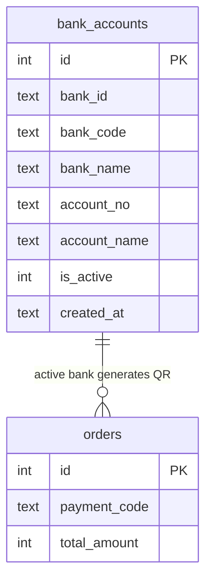
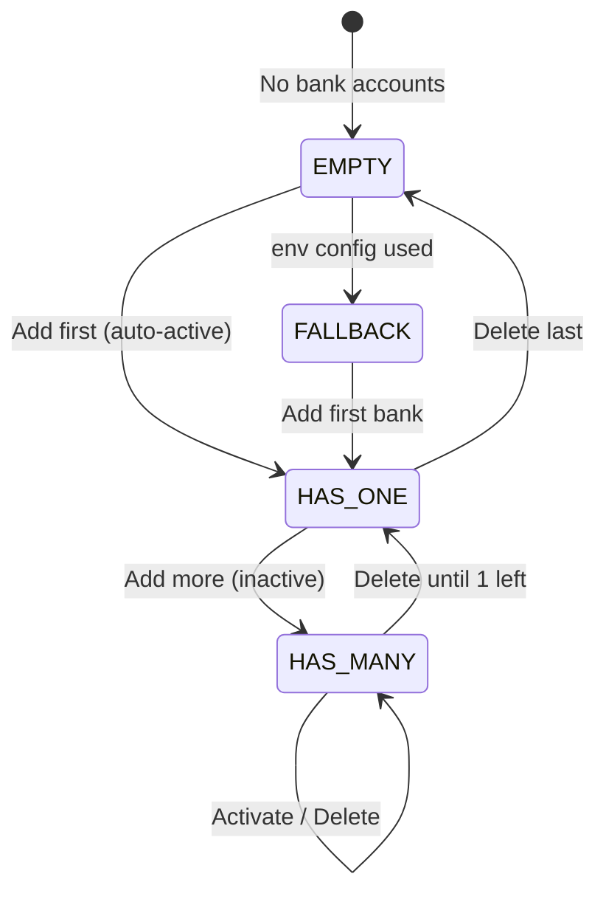

# Feature: Bank Management (F-08)

**BE Tech Spec:** [feature_bank_management_tech.md](../BE/feature_bank_management_tech.md)
**Priority:** P0
**Status:** ✅ Done

> **📍 UI:** Bank Accounts nằm trong [Unified Settings](feature_settings.md) → Tab 1 "🤖 Bot & Thanh toán VND" → Section 1.3

---

## 1. Mô tả

Admin quản lý các tài khoản ngân hàng để nhận thanh toán qua VietQR. Hỗ trợ nhiều TK, chỉ 1 primary tại mọi thời điểm. TK primary dùng để generate QR cho đơn hàng mới. Fallback về env config nếu không có TK nào.

> ⚠️ **SePay Coupling:** Bank phải trùng với bank đã setup webhook trên SePay. SePay free cho phép config nhiều bank, mỗi bank 1 webhook. Bank trên admin phải là 1 trong các bank đã được setup webhook trên SePay, nếu không → thanh toán không tự động xác nhận.

**Entry point:** Admin Panel → Cài đặt → Tab "Bot & Thanh toán VND" → Section "Tài khoản nhận thanh toán"

---

## 2. Use Cases + Edge Cases

### Use Cases

| # | Actor | Hành động | Kết quả |
|---|-------|-----------|---------|
| 1 | Admin | Thêm TK ngân hàng đầu tiên | TK tự động active, toast "Đã thêm và kích hoạt" |
| 2 | Admin | Thêm TK ngân hàng thứ 2+ | TK thêm dạng inactive |
| 3 | Admin | Kích hoạt TK khác | Deactivate ALL → activate selected, đơn mới dùng QR mới |
| 4 | Admin | Xóa TK inactive | Confirm dialog → xóa |
| 5 | Admin | Xóa TK active (còn TK khác) | Auto-promote TK còn lại đầu tiên |
| 6 | Admin | Xóa TK active (TK duy nhất) | Confirm cảnh báo → fallback env config |
| 7 | Admin | Muốn sửa thông tin TK | Xóa TK cũ → thêm TK mới (không có PUT endpoint) |
| 8 | Admin | Xem QR preview cho TK active | TK active hiện badge 🟢 + dùng cho VietQR |
| 9 | System | Không có TK + env vars rỗng | VietQR generation fail → toast error cho admin |
| 10 | System | Thay đổi active bank giữa lúc có đơn pending | Đơn pending giữ QR cũ, đơn mới dùng bank mới |

### Flow: Activate / Delete Bank Account

```
Admin mở Settings → Bank Accounts section
     ↓
┌── Thêm TK mới ──────────────────────────────────┐
│ Click "＋ Thêm tài khoản"                        │
│   ↓                                               │
│ Modal: bank_code, account_no, account_name        │
│   ↓                                               │
│ POST /bank-accounts → validate required fields    │
│   ↓                                               │
│ TK đầu tiên? → auto-activate (is_active = 1)     │
│ Không? → thêm dạng inactive                      │
└───────────────────────────────────────────────────┘

┌── Kích hoạt TK ──────────────────────────────────┐
│ Click [✓ Kích hoạt] trên TK inactive             │
│   ↓                                               │
│ POST /bank-accounts/:id/activate                  │
│   → deactivate ALL → activate selected            │
│   ↓                                               │
│ Đơn mới sử dụng QR từ TK mới                    │
│ Đơn pending giữ QR cũ                           │
└───────────────────────────────────────────────────┘

┌── Xóa TK ────────────────────────────────────────┐
│ Click [🗑 Xóa] → confirm dialog                  │
│   ↓                                               │
│ Xóa TK active + còn TK khác?                     │
│   → auto-promote TK tiếp theo                    │
│ Xóa TK cuối cùng?                                │
│   → fallback env config cho VietQR               │
└───────────────────────────────────────────────────┘
```

### Edge Cases

**Admin-side (đấy là feature chỉ admin dùng):**

| # | Category | Case | Xử lý |
|---|----------|------|-------|
| 1 | Data Integrity | TK đầu tiên được thêm | Auto-activate (is_active = 1) |
| 2 | Data Integrity | Xóa TK active, còn TK khác | Auto-promote TK còn lại đầu tiên |
| 3 | Data Integrity | Xóa TK active, không còn TK nào | Fallback env config cho VietQR |
| 4 | Data Integrity | Activate TK mới | Deactivate ALL trước, chỉ 1 active |
| 5 | Cross-Feature | Thay đổi active bank giữa lúc có đơn pending | Đơn pending giữ QR cũ, đơn mới dùng bank mới |
| 6 | Cross-Feature | Không có bank_accounts + env vars rỗng | VietQR generation fail → toast error cho admin |
| 7 | Concurrency | 2 admin activate cùng lúc | Last-write-wins (deactivate-all → activate) |
| 8 | UX | Xóa TK duy nhất còn lại | Confirm dialog cảnh báo "Sẽ dùng cấu hình mặc định" |
| 9 | Security | Muốn sửa STK | Xóa → thêm mới (không có PUT endpoint) |
| 10 | Validation | `bank_code` rỗng | Inline error: "Vui lòng nhập mã ngân hàng" |
| 11 | Validation | `account_no` rỗng | Inline error: "Vui lòng nhập số tài khoản" |
| 12 | Validation | `account_name` rỗng | Inline error: "Vui lòng nhập tên chủ tài khoản" |
| 13 | Validation | `account_no` chứa ký tự không phải số | Inline error: "Số tài khoản chỉ chấp nhận số" |

---

## 3. Screens & States

### Admin — Bank Accounts Section (Settings → Tab Bot & VND)

**Layout:** Card list trong trang Settings Tab 1, dưới SePay Webhook section

| Element | Mô tả |
|---------|-------|
| **Section header** | "🏦 Tài khoản ngân hàng" + nút "＋ Thêm tài khoản" (primary) |
| **Bank table** | Full-width, columns xem bên dưới |
| **Empty state** | Icon 🏦 + "Chưa có tài khoản ngân hàng" + nút "Thêm tài khoản đầu tiên" |

| State | Hiển thị |
|-------|---------|
| **Loading** | Skeleton table (3 rows) |
| **Data** | Table: Ngân hàng, Số TK, Chủ TK, Trạng thái, Actions |
| **Empty** | Empty state component với CTA |
| **Error** | Toast error "Không thể tải danh sách tài khoản" |

### Bank Accounts Table

| Column | Width | Data | Ví dụ |
|--------|-------|------|-------|
| Ngân hàng | 180px | `bank_name` **(bank_code)** | **Vietcombank** *(VCB)* |
| Số TK | 160px | `account_no` (monospace) | `1234567890` |
| Chủ TK | fill | `account_name` (uppercase) | NGUYEN VAN A |
| Trạng thái | 100px | Badge Active/Inactive | 🟢 Active |
| Actions | 160px | Buttons (conditional) | [Kích hoạt] [Xóa] |

**Action buttons:**

| Trạng thái TK | Actions hiển thị |
|----------------|-----------------|
| Active | [🗑 Xóa] (danger ghost) |
| Inactive | [✓ Kích hoạt] (primary ghost) + [🗑 Xóa] (danger ghost) |

### Add Bank Modal

**Layout:** Modal 480px, 5 fields

| Field | ID | Type | Required? | Default | Validation / Ghi chú |
|-------|-----|------|----------|---------|---------------------|
| Bank ID | `bBankId` | Text | Optional | `null` | Mã định danh nội bộ, VD: 970436 |
| Mã ngân hàng | `bBankCode` | Text | ✅ **Required** | — | VD: VCB, TCB. Dùng cho VietQR |
| Tên ngân hàng | `bBankName` | Text | Optional | `null` | Hiển thị cho admin. VD: Vietcombank |
| Số tài khoản | `bAccountNo` | Text | ✅ **Required** | — | Chỉ chấp nhận số. Dùng cho VietQR |
| Tên chủ TK | `bAccountName` | Text | ✅ **Required** | — | Uppercase. Hiển trên QR |

> [!TIP]
> Chỉ 3 fields bắt buộc: `bank_code`, `account_no`, `account_name`. Các fields khác là thông tin bổ sung.

**Footer:** [Hủy] (secondary) + [💾 Thêm tài khoản] (primary)

### Delete Confirm Dialog

- **Icon:** ⚠️ danger circle
- **Title:** "Xóa tài khoản này?"
- **Description:** "Hành động này không thể hoàn tác."
- **Extra warning** (nếu xóa TK active): "⚠️ TK đang active. TK còn lại sẽ được tự động kích hoạt."
- **Buttons:** [Hủy] + [Xóa] (danger)

---

## 4. Domain Model



---

## 5. API Endpoints

| Method | Path | Mô tả |
|--------|------|-------|
| GET | `/api/admin/bank-accounts` | List all (sorted: active first) |
| POST | `/api/admin/bank-accounts` | Add new (auto-activate if first) |
| POST | `/api/admin/bank-accounts/:id/activate` | Activate (deact all first) |
| DELETE | `/api/admin/bank-accounts/:id` | Delete (auto-promote if active) |

> ⚠️ **Không có PUT/UPDATE** — xóa + thêm lại nếu muốn sửa thông tin.

---

## 6. Error Codes

### Admin API errors (thêm tài khoản)

| Code | Error Code | Message | Trigger |
|------|-----------|---------|--------|
| 400 | `MISSING_FIELDS` | "Vui lòng nhập mã ngân hàng" | `bank_code` rỗng |
| 400 | `MISSING_FIELDS` | "Vui lòng nhập số tài khoản" | `account_no` rỗng |
| 400 | `MISSING_FIELDS` | "Vui lòng nhập tên chủ tài khoản" | `account_name` rỗng |
| 400 | `VALIDATION_ERROR` | "Số tài khoản chỉ chấp nhận số" | `account_no` chứa ký tự không phải số |
| 401 | — | "Unauthorized" | API key sai/thiếu |
| 500 | `INTERNAL_ERROR` | "Internal error" | Server/DB error |

### Admin form inline errors

| Field | Validation | Inline error message |
|-------|-----------|---------------------|
| Mã ngân hàng | Rỗng | "Vui lòng nhập mã ngân hàng" |
| Số tài khoản | Rỗng | "Vui lòng nhập số tài khoản" |
| Số tài khoản | Ký tự không phải số | "Số tài khoản chỉ chấp nhận số" |
| Tên chủ TK | Rỗng | "Vui lòng nhập tên chủ tài khoản" |

> [!TIP]
> Frontend validate trước khi gọi API. Disable nút Submit khi có inline error.

> ⚠️ Delete/Activate không trả 404 nếu ID không tồn tại — SQLite chạy silent, trả 200 OK.

---

## 7. Analytics Events

| Event | Trigger | Properties |
|-------|---------|-----------|
| `bank_add_success` | Thêm TK thành công | `{ bankCode, isAutoActivated }` |
| `bank_activate_success` | Kích hoạt TK | `{ bankId, previousActiveBankId }` |
| `bank_delete_success` | Xóa TK | `{ bankId, wasActive, autoPromoted }` |
| `bank_add_fail` | Validation error | `{ missingFields }` |

---

## 8. State Machine



---

## 9. Caching Strategy

| Data | Cache | TTL |
|------|-------|-----|
| Bank accounts list | No cache | Real-time query |
| Active bank config | Per-request `getBankConfig()` | — |
| VietQR URL | Generated per order | — |

> Caching không cần vì bank data ít thay đổi và query nhẹ.

---

## 10. Acceptance Criteria

- [x] Table hiển thị tất cả bank accounts (active first)
- [x] Add modal với 5 fields + validation
- [x] TK đầu tiên auto-activate
- [x] Nút "Kích hoạt" cho TK inactive
- [x] Deactivate all trước khi activate new
- [x] Delete with confirm dialog
- [x] Delete active → auto-promote next
- [x] Delete last → fallback env config
- [x] Empty state với CTA "Thêm tài khoản đầu tiên"
- [x] Toast feedback cho mọi action

---

## State Coverage Matrix

| Screen | Loading | Ready/Data | Error | Empty |
|--------|---------|-----------|-------|-------|
| Bank Section | ✅ Skeleton table | ✅ Table + actions | ✅ Toast | ✅ Icon + CTA |
| Add Modal | N/A | ✅ Form 5 fields | ✅ Inline errors | N/A |
| Delete Dialog | N/A | ✅ Confirm + warning | N/A (toast) | N/A |
