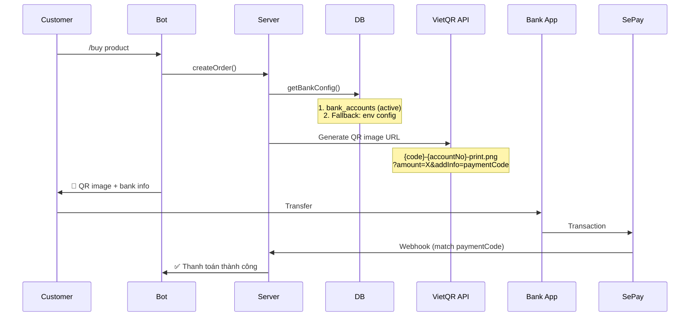
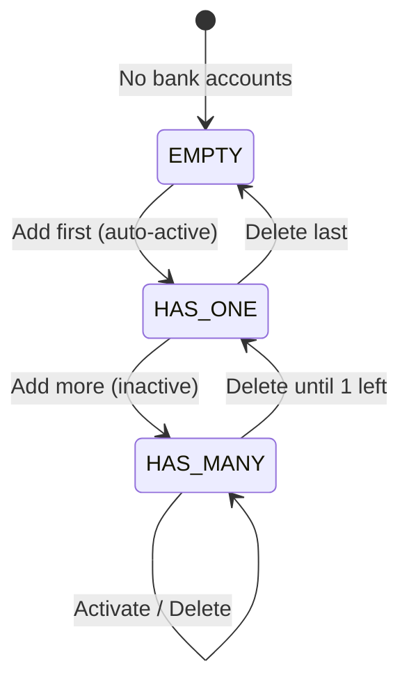

# Feature: Bank Management (F-08)

**BE Tech Spec:** [feature_bank_management_tech.md](../BE/feature_bank_management_tech.md)
**Priority:** P0
**Status:** ✅ Done

---

## 1. Mô tả

Admin quản lý các tài khoản ngân hàng để nhận thanh toán qua VietQR. Hỗ trợ nhiều TK, chỉ 1 active tại mọi thời điểm. TK active dùng để generate QR cho đơn hàng.

---

## 2. Use Cases

### UC-1: Thêm tài khoản ngân hàng

1. Admin tab "Cài đặt" → section "Tài khoản ngân hàng"
2. Click "Thêm tài khoản đầu tiên" (empty state) hoặc nút thêm
3. Modal: bank_id, bank_code, bank_name, account_no, account_name
4. Submit → TK được thêm
5. **Nếu là TK đầu tiên** → tự động active

### UC-2: Kích hoạt TK khác

1. Table hiện danh sách TK, TK active có badge "Active" xanh
2. TK inactive có nút "Kích hoạt"
3. Click → TK mới active, TK cũ deactive
4. Đơn hàng mới sẽ dùng QR của TK mới

### UC-3: Xóa TK

1. Click "Xóa" → confirm dialog ("Xóa tài khoản này?")
2. Xóa thành công → toast "Đã xóa"
3. **Nếu xóa TK active** → TK còn lại đầu tiên auto-promote thành active

### UC-4: Sửa thông tin TK

> ⚠️ **Không có endpoint sửa** — workflow hiện tại: xóa TK cũ → thêm TK mới.

### Edge Cases

| Case | Xử lý |
|------|-------|
| TK đầu tiên | Auto-activate |
| Xóa TK active | Auto-promote TK còn lại |
| Xóa TK active, không còn TK | Fallback env config cho VietQR |
| Muốn sửa STK | Xóa → thêm mới |

---

## 3. Screens & States

### Admin — Bank Accounts Section (tab Cài đặt)

| State | Hiển thị |
|-------|---------|
| **Loading** | Skeleton |
| **Data** | Table: Ngân hàng, Số TK, Chủ TK, Trạng thái, Actions |
| **Empty** | Icon 🏦 + "Chưa có tài khoản ngân hàng" + nút "Thêm tài khoản đầu tiên" |

### Bank Accounts Table (actual admin UI)

| Column | Data | Ví dụ |
|--------|------|-------|
| Ngân hàng | `bank_name` **(bank_code)** | **Vietcombank** *(VCB)* |
| Số TK | `account_no` (code style) | `1234567890` |
| Chủ TK | `account_name` | NGUYEN VAN A |
| Trạng thái | Active/Inactive badge | 🟢 Active |
| Actions | Kích hoạt (nếu inactive) + Xóa | [Kích hoạt] [Xóa] |

### Add Bank Modal

| Field | ID | Validation |
|-------|-----|-----------|
| Bank ID | `bBankId` | Optional (VietQR bank ID) |
| Mã ngân hàng | `bBankCode` | Required |
| Tên ngân hàng | `bBankName` | Required |
| Số tài khoản | `bAccountNo` | Required |
| Tên chủ TK | `bAccountName` | Required |

---

## 4. VietQR Flow

---

## 5. State Machine

---

## 6. Acceptance Criteria

- [x] Table hiển thị tất cả bank accounts
- [x] Sort: active đầu tiên, sau đó by created_at DESC
- [x] Add modal với 5 fields
- [x] TK đầu tiên auto-activate
- [x] Nút "Kích hoạt" cho TK inactive
- [x] Deactivate all trước khi activate new
- [x] Delete with confirm dialog
- [x] Delete active → auto-promote next
- [x] Empty state với CTA "Thêm tài khoản đầu tiên"
- [x] Toast feedback cho mọi action
- [x] getBankConfig() fallback to env vars
