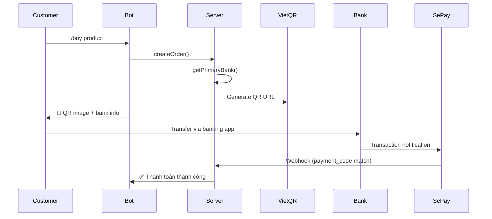

# Feature: Bank Management (F-08)

**BE Tech Spec:** [feature_bank_management_tech.md](../BE/feature_bank_management_tech.md)
**Priority:** P0
**Status:** ✅ Done

---

## 1. Mô tả

Admin quản lý tài khoản ngân hàng để nhận tiền thanh toán. Hỗ trợ nhiều bank accounts, set primary, VietQR auto-generate.

---

## 2. Use Cases

### UC-1: Thêm tài khoản ngân hàng

1. Admin tab "Cài đặt" → section "Tài khoản ngân hàng"
2. Nút "Thêm TK" → form: mã bank, tên bank, STK, tên chủ TK
3. Submit → thêm vào danh sách

### UC-2: Set primary bank

1. Click ⭐ trên bank account → set làm TK chính
2. TK cũ mất ⭐, TK mới nhận ⭐
3. Đơn hàng mới sẽ dùng QR của TK chính

### UC-3: Xóa tài khoản

1. Click 🗑 → confirm dialog
2. Nếu có pending orders → reject
3. Nếu clean → xóa

### Edge Cases

| Case | Xử lý |
|------|-------|
| Xóa TK chính | Phải set TK khác làm primary trước |
| Chỉ có 1 TK | Không cho xóa |
| STK sai format | Validate trước khi save |

---

## 3. Screens & States

### Admin — Bank Accounts Section (Settings tab)

| State | Hiển thị |
|-------|---------|
| **Data** | List cards: bank name + STK + ⭐ primary badge |
| **Empty** | "Chưa có TK ngân hàng. Thêm để nhận thanh toán." |

### Bank Account Card

```
🏦 Vietcombank                    ⭐ Chính
   STK: 1234567890
   Chủ TK: NGUYEN VAN A
   [Sửa] [Xóa]
```

### Add/Edit Form

| Field | Type | Validation |
|-------|------|-----------|
| Ngân hàng | select | Required (dropdown list) |
| Số TK | text | Required, numeric |
| Tên chủ TK | text | Required, uppercase |

---

## 4. VietQR Flow



---

## 5. Acceptance Criteria

- [x] CRUD bank accounts
- [x] Set primary bank (only one)
- [x] VietQR URL generated from primary bank
- [x] Prevent delete bank with pending orders
- [x] Legacy settings fallback
