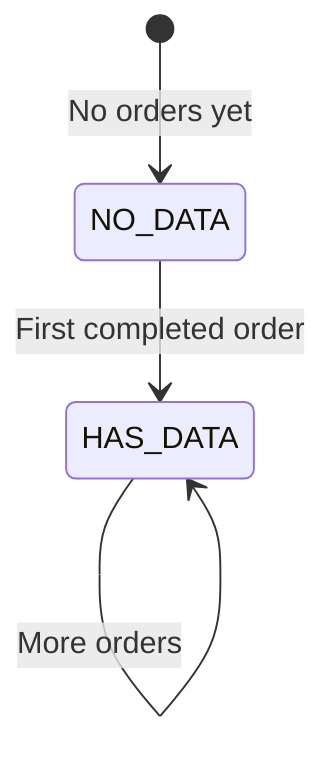

# Feature: Customer Management

**BE Tech Spec:** [feature_customer_management_tech.md](../BE/feature_customer_management_tech.md)
**Priority:** P1
**Status:** ✅ Done

---

## 1. Mô tả

Admin xem danh sách khách hàng, thống kê mua hàng, lịch sử đơn hàng của từng khách. Dữ liệu aggregate từ bảng `orders` — không có bảng customer riêng.

---

## 2. Use Cases

### UC-1: Xem danh sách khách hàng

1. Admin tab "Khách hàng" → thống kê tổng + danh sách
2. Table: Username, Tổng đơn, Đã mua, Tổng chi tiêu, Lần mua cuối
3. Sort: theo chi tiêu (mặc định), theo số đơn, theo lần mua gần nhất

### UC-2: Xem chi tiết khách hàng

1. Click khách → popup/modal chi tiết
2. Stats: tổng chi tiêu, số đơn completed/cancelled
3. Danh sách đơn hàng: product, amount, status, date

### Edge Cases

| Case | Xử lý |
|------|-------|
| Khách chưa hoàn tất đơn nào | Không hiển thị trong list |
| Username empty | Hiển thị Telegram ID |
| Khách mua 50+ đơn | Pagination trong order history |

---

## 3. Screens & States

### Admin — Customer Tab

| State | Hiển thị |
|-------|---------|
| **Loading** | Skeleton cards + table |
| **Data** | Stat cards (tổng KH, revenue, avg order, repeat rate) + table |
| **Empty** | "Chưa có khách hàng. Khi có đơn hàng thành công, khách sẽ hiện ở đây." |

### Stat Cards

| Card | Value | Subtitle |
|------|-------|---------|
| Tổng khách hàng | Count distinct | — |
| Doanh thu tích lũy | Sum completed | VNĐ |
| Giá trị đơn TB | Avg completed | VNĐ |
| Tỉ lệ mua lại | Repeat % | % |

### Customer Table

| Column | Source |
|--------|--------|
| 👤 Username | `customer_username` |
| 📦 Đơn hàng | `completed_orders / total_orders` |
| 💰 Chi tiêu | `total_spent` (format VNĐ) |
| 🕐 Lần mua cuối | `last_order_at` (relative time) |

---

## 4. State Machine

---

## 5. Responsive Breakpoints

| Breakpoint | Thay đổi |
|-----------|---------|
| ≥ 1024px | 4 stat cards in row, full table |
| 768px | 2 stat cards/row, truncate username |
| ≤ 375px | 1 stat card/row, simplified table |

---

## 6. Acceptance Criteria

- [x] Customer list aggregated from completed orders
- [x] Stat cards: total customers, revenue, avg order, repeat rate
- [x] Sort by spending / orders / recency
- [x] Customer detail with order history
- [x] Empty state khi chưa có khách
