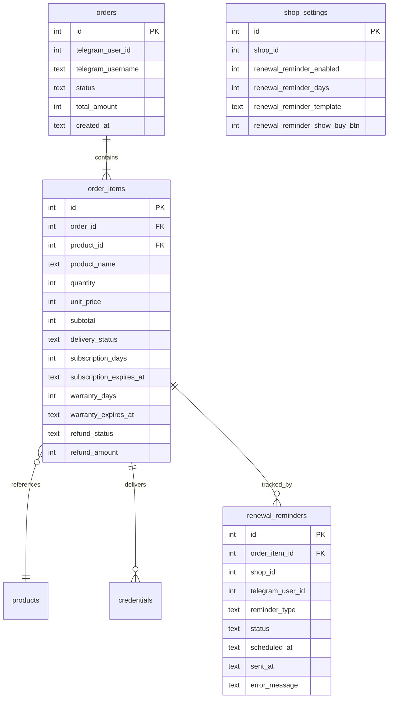
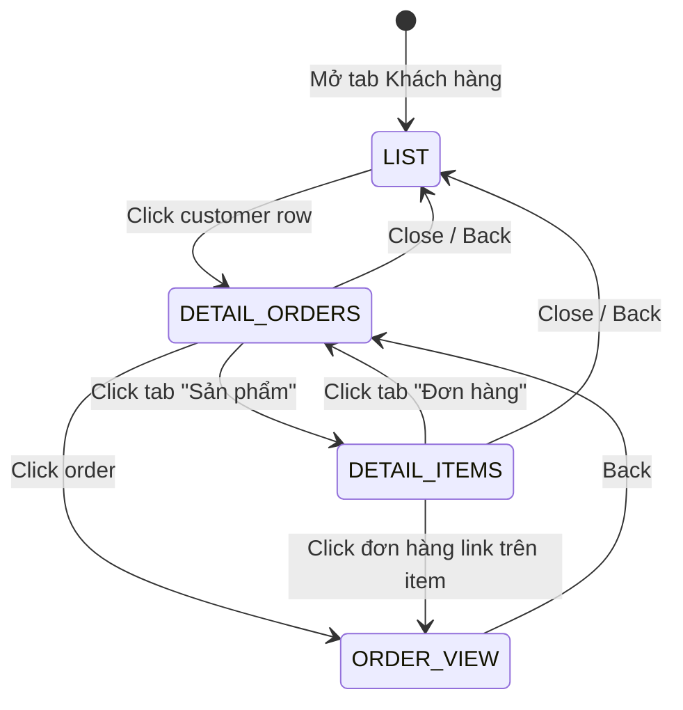
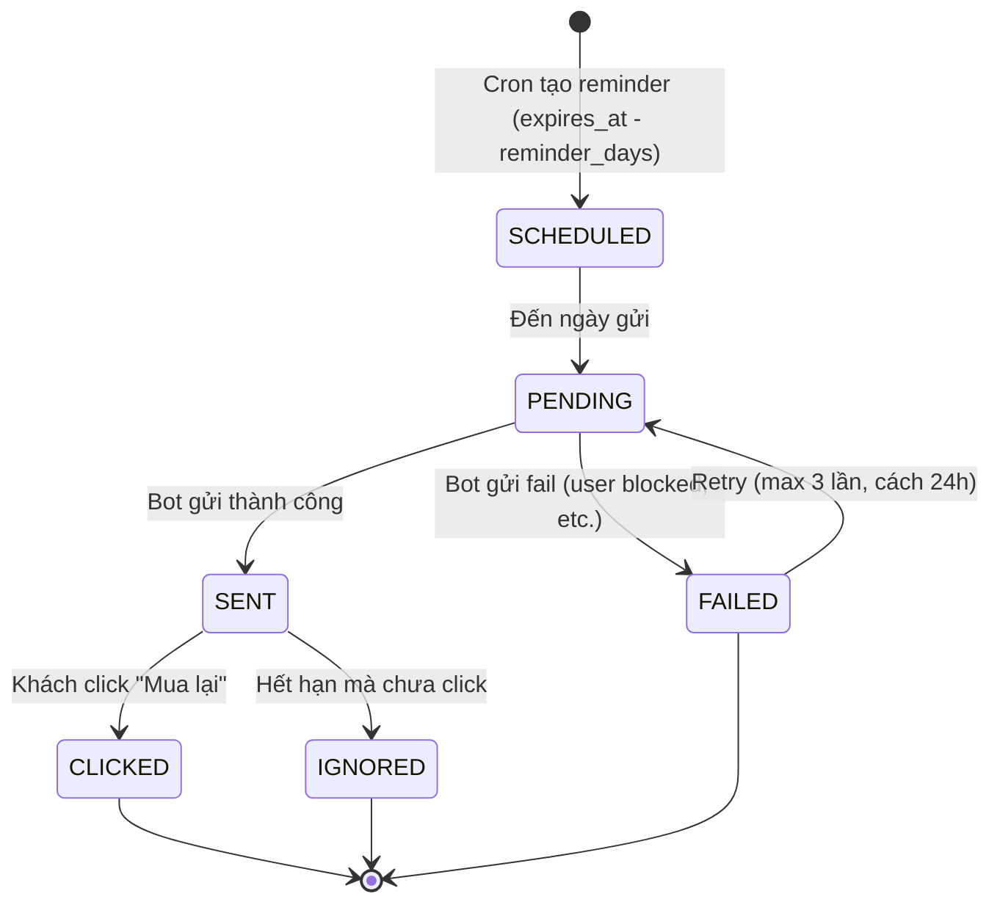

# Feature: Customer Management (F-07)

**BE Tech Spec:** [feature_customer_management_tech.md](../BE/feature_customer_management_tech.md)
**Priority:** P1
**Status:** 🔄 v2 — thêm Subscription Tracking + Renewal Reminders

---

## 1. Mô tả

Admin xem danh sách khách hàng, **theo dõi subscription/warranty per-item**, cấu hình **tự động nhắc gia hạn** qua Telegram bot. Không có bảng customer riêng — mỗi unique `telegram_user_id` = 1 customer.

**v2 mới:**

- Tab **"Sản phẩm"** trong customer detail: xem tất cả items đã mua, thời hạn sử dụng, bảo hành
- **Renewal Reminder config**: shop cấu hình nhắc user gia hạn khi subscription còn X ngày
- **Bot sync**: bot tự gửi tin nhắn nhắc gia hạn + link mua lại

**Entry point:** Admin Panel → Tab "Khách hàng"

---

## 2. Use Cases + Edge Cases

### Use Cases

| # | Actor | Hành động | Kết quả |
|---|-------|-----------|---------| 
| 1 | Admin | Xem danh sách khách hàng | Table sorted by total_spent DESC |
| 2 | Admin | Click khách → tab "Đơn hàng" | Panel hiện tất cả orders (mọi status) |
| 3 | Admin | Click khách → tab **"Sản phẩm"** | Danh sách items đã mua + subscription/warranty status |
| 4 | Admin | Lọc SP theo trạng thái (Active/Hết hạn/Bảo hành) | Filter items by subscription status |
| 5 | Admin | Xem SP sắp hết hạn của khách | Items sorted by `subscription_expires_at` ASC (sớm nhất trước) |
| 6 | Admin | Cấu hình **Renewal Reminder** | Settings → nhập số ngày trước khi hết hạn sẽ nhắc |
| 7 | Admin | Bật/tắt auto-renewal reminder | Toggle ON/OFF per shop |
| 8 | System | Cron job check subscription sắp hết | Gửi reminder qua bot khi `expires_at - now <= reminder_days` |
| 9 | Khách (Bot) | Nhận tin nhắn nhắc gia hạn | Bot gửi: "SP X sắp hết hạn, gia hạn ngay!" + [🛒 Mua lại] |
| 10 | Admin | Xem lịch sử reminder đã gửi cho khách | Tab "Sản phẩm" → badge "Đã nhắc" trên item |
| 11 | Admin | Xem khách chỉ có pending orders | Hiện trong list, total_spent = 0 |
| 12 | System | isNewUser check (cross-feature discount) | COUNT paid/delivered = 0 → new user |

### Edge Cases

| # | Category | Case | Xử lý |
|---|----------|------|-------|
| 1 | Data Integrity | Khách chỉ có pending orders | Hiện trong list (total_spent = 0) |
| 2 | Data Integrity | Username null | Hiện `telegram_user_id` thay thế |
| 3 | Data Integrity | Username thay đổi | Lấy giá trị mới nhất từ order gần nhất |
| 4 | Subscription | SP không có subscription (subscription_days=0) | Ẩn thời hạn, hiện "Vĩnh viễn" |
| 5 | Subscription | SP hết hạn nhưng chưa được nhắc | Cron job bù nhắc (nếu còn trong window) hoặc skip |
| 6 | Subscription | Reminder đã gửi → user không gia hạn | Không gửi lại (1 reminder/item/cycle) |
| 7 | Subscription | User block bot → gửi reminder fail | Log error, đánh dấu `reminder_status = failed` |
| 8 | Warranty | Bảo hành hết hạn nhưng SP vẫn active | Hiện badge "⚠️ Hết BH" cạnh badge "✅ Active" |
| 9 | Cross-Feature | Khách có đơn refunded → items bị hoàn | Items có `refund_status != none` → hiện strikethrough + "Đã hoàn" |
| 10 | Config | Admin set reminder_days = 0 | Disable tính năng (tương đương OFF) |
| 11 | Performance | > 5K customers | Pagination (default 50/page, max 100) |
| 12 | UX | Customer list rỗng (shop mới) | Empty state: "Chưa có khách hàng nào" + CTA |

---

## 3. Screens & States

### Admin — Customers Tab

**Layout:** Full-width table, no sidebar filters

| Element | Mô tả |
|---------|-------|
| **Tab header** | "👥 Khách hàng" + count badge "(N)" |
| **Customer table** | Full-width, sorted by spending, scrollable |
| **Badge mới** | 🔴 dot trên row khách có SP sắp hết hạn (trong reminder_days) |
| **Empty state** | Icon 👥 + "Chưa có khách hàng" + CTA |

| State | Hiển thị |
|-------|---------|
| **Loading** | Skeleton table (5 rows, shimmer) |
| **Data** | Table sorted by total_spent DESC |
| **Empty** | Empty state component |
| **Error** | Toast "Không thể tải danh sách khách hàng" |

### Customer Table Columns

| Column | Width | Source | Ví dụ |
|--------|-------|--------|-------|
| 👤 Username | 140px | `telegram_username` (fallback: ID) | @buyer_premium_1 |
| 📦 Tổng đơn | 80px | `total_orders` | 12 |
| ✅ Đã giao | 80px | `delivered_count` | 10 |
| 💰 Chi tiêu | 120px | `total_spent` (VNĐ, bold) | **2.640.000 đ** |
| 🛍 SP đã mua | 70px | `unique_products` | 3 |
| ⏳ **SP active** | 80px | `active_subscriptions` | 2 |
| ⚠️ **Sắp hết** | 80px | `expiring_soon_count` | 🔴 1 |
| 🕐 Mua cuối | 120px | `last_purchase` (relative time) | 2 ngày trước |

### Customer Detail — 2 Tabs

**Layout:** Slide-in panel (700px) — wider cho 2 tabs

#### Tab 1: 📋 Đơn hàng (giữ nguyên v1)

| Element | Mô tả |
|---------|-------|
| **Header** | "@{username}" + nút ✕ |
| **Summary bar** | 💰 Total spent · 📦 Total orders · 📅 Member since |
| **Orders list** | Table sorted by created_at DESC |

**Order columns:**

| Column | Source |
|--------|--------|
| Mã đơn | `order_code` (monospace, link) |
| Items | Item count hoặc tên SP (nếu 1 item) |
| Số tiền | `total_amount` (VNĐ) |
| Status | Status badge (color) |
| Thời gian | `created_at` (relative) |

#### Tab 2: 🛍 Sản phẩm (MỚI)

| Element | Mô tả |
|---------|-------|
| **Filter bar** | Chip filter: Tất cả · ✅ Active · ⚠️ Sắp hết · ❌ Hết hạn · 🔄 Đã hoàn |
| **Items list** | Cards/rows grouped by status |
| **Sort** | Default: expires soonest first |

**Per-item card:**

```text
┌──────────────────────────────────────────────────────┐
│ Claude Pro x1                               250,000đ │
│ Đơn #ORD123 · Mua: 18/03/2026                       │
│                                                       │
│ ⏳ Thời hạn: 30 ngày                                 │
│    ██████████████░░░░░ 25/30 ngày (hết: 18/04)       │
│                                                       │
│ 🛡️ Bảo hành: 30 ngày                                │
│    ████████████████░░░ 25/30 ngày (hết: 18/04)       │
│                                                       │
│ 🔔 Reminder: ✅ Đã gửi (15/04)                       │
│                                                       │
│ [🔑 Xem credential]  [🔄 Thay thế]  [💸 Hoàn tiền]  │
└──────────────────────────────────────────────────────┘
```

**Item status badges:**

| Badge | Điều kiện | Màu |
|-------|-----------|-----|
| ✅ Active | `subscription_expires_at > now` | Green |
| ⚠️ Sắp hết | `expires_at - now <= reminder_days` | Orange |
| ❌ Hết hạn | `subscription_expires_at < now` | Red |
| ♾️ Vĩnh viễn | `subscription_days = 0` | Gray |
| 🔄 Đã hoàn | `refund_status != none` | Strikethrough |

**Warranty badge (cạnh subscription):**

| Badge | Điều kiện |
|-------|-----------|
| 🛡️ Còn BH | `warranty_expires_at > now` |
| ⚠️ BH sắp hết | `warranty_expires_at - now <= 3 days` |
| ❌ Hết BH | `warranty_expires_at < now` |
| — | `warranty_days = 0` (không BH) |

| State | Hiển thị |
|-------|---------|
| **Loading** | Skeleton cards (3 cards, shimmer) |
| **Data** | Items list with progress bars |
| **Empty** | "Khách chưa có sản phẩm nào" |
| **Error** | Toast "Không thể tải thông tin sản phẩm" |

### Renewal Reminder Config

**Entry point:** Settings → Tab "Chung" → Section "Nhắc gia hạn"

| Element | Mô tả |
|---------|-------|
| **Toggle** | 🔔 Tự động nhắc gia hạn: ON/OFF |
| **Reminder days** | Input number: "Nhắc trước khi hết hạn __ ngày" (min=1, max=30, default=3) |
| **Reminder message** | Textarea: template tin nhắn (có biến `{product_name}`, `{days_left}`, `{expires_at}`) |
| **Default message** | "⏳ {product_name} sắp hết hạn ({days_left} ngày nữa). Gia hạn ngay để tiếp tục sử dụng!" |
| **Preview** | Real-time preview tin nhắn với data mẫu |
| **Bot actions** | Checkbox: ☑ Gửi nút [🛒 Mua lại] kèm tin nhắn (default ON) |
| **Schedule** | "Hệ thống kiểm tra mỗi ngày lúc 9:00 AM" (fixed, không config) |

---

## 4. Domain Model



> ⚠️ **Không có bảng customer riêng** — aggregated từ orders GROUP BY telegram_user_id.

**`renewal_reminders` fields:**

| Field | Type | Mô tả |
|-------|------|-------|
| `order_item_id` | FK | Item sắp hết hạn |
| `reminder_type` | text | `subscription_expiry` hoặc `warranty_expiry` |
| `status` | text | `pending` → `sent` → `clicked` hoặc `failed` |
| `scheduled_at` | datetime | Ngày dự kiến gửi (`expires_at - reminder_days`) |
| `sent_at` | datetime | Ngày thực tế gửi |
| `error_message` | text | Lỗi nếu gửi fail (user blocked bot, etc.) |

---

## 5. API Endpoints

| Method | Path | Mô tả |
|--------|------|-------|
| GET | `/api/admin/customers?page=1&limit=50` | Customer list (paginated, sorted by total_spent DESC) |
| GET | `/api/admin/customers/:id/orders` | All orders for customer (all statuses) |
| GET | `/api/admin/customers/:id/items` | **[NEW]** All order_items with subscription/warranty info |
| GET | `/api/admin/customers/:id/items?status=active` | **[NEW]** Filter by: active, expiring, expired, refunded |
| GET | `/api/admin/renewal-config` | **[NEW]** Get renewal reminder config |
| PUT | `/api/admin/renewal-config` | **[NEW]** Update renewal reminder config |
| GET | `/api/admin/reminders?status=sent` | **[NEW]** List reminders (sent/pending/failed) |

**Pagination params:**

| Param | Default | Range | Mô tả |
|-------|---------|-------|-------|
| `page` | 1 | ≥ 1 | Trang hiện tại |
| `limit` | 50 | 1-100 | Số khách/trang |

**Response format** (`GET /api/admin/customers/:id/items`):

```json
{
  "items": [
    {
      "order_item_id": 45,
      "order_code": "ORD123",
      "product_name": "Claude Pro",
      "product_type": "credential",
      "quantity": 1,
      "unit_price": 250000,
      "purchased_at": "2026-03-18T10:00:00Z",
      "subscription_days": 30,
      "subscription_expires_at": "2026-04-17T10:00:00Z",
      "subscription_remaining_days": 25,
      "warranty_days": 30,
      "warranty_expires_at": "2026-04-17T10:00:00Z",
      "warranty_remaining_days": 25,
      "refund_status": "none",
      "reminder_sent": true,
      "reminder_sent_at": "2026-04-14T09:00:00Z"
    }
  ],
  "summary": {
    "total_items": 5,
    "active_count": 3,
    "expiring_soon_count": 1,
    "expired_count": 1
  }
}
```

**Renewal config** (`PUT /api/admin/renewal-config`):

```json
{
  "enabled": true,
  "reminder_days": 3,
  "message_template": "⏳ {product_name} sắp hết hạn ({days_left} ngày nữa). Gia hạn ngay!",
  "show_buy_button": true
}
```

---

## 6. Error Codes

| Code | Error Code | Message | Trigger |
|------|-----------|---------|--------|
| 401 | — | "Unauthorized" | API key sai/thiếu |
| 400 | `INVALID_REMINDER_DAYS` | "Số ngày nhắc phải từ 1-30" | reminder_days ngoài range |
| 400 | `INVALID_TEMPLATE` | "Template phải chứa {product_name}" | Template thiếu biến bắt buộc |
| 404 | `CUSTOMER_NOT_FOUND` | "Khách hàng không tồn tại" | telegram_user_id không có orders |
| 500 | `INTERNAL_ERROR` | Server error | DB/runtime error |

> ⚠️ Không trả 404 nếu customer không tồn tại ở list endpoint — trả `[]` rỗng.

---

## 7. Analytics Events

| Event | Trigger | Properties |
|-------|---------|-----------| 
| `customer_list_view` | Mở tab Khách hàng | `{ totalCustomers }` |
| `customer_detail_view` | Click xem chi tiết khách | `{ telegramUserId, totalSpent, totalOrders }` |
| `customer_tab_switch` | Chuyển tab Đơn hàng ↔ Sản phẩm | `{ tab, telegramUserId }` |
| `customer_items_filter` | Lọc SP theo status | `{ filter, count }` |
| `customer_order_click` | Click đơn hàng trong detail | `{ orderId, orderStatus }` |
| `renewal_config_save` | Lưu config reminder | `{ enabled, reminderDays }` |
| `renewal_reminder_sent` | System gửi reminder thành công | `{ orderItemId, telegramUserId, productName }` |
| `renewal_reminder_failed` | System gửi reminder fail | `{ orderItemId, error }` |
| `renewal_reminder_clicked` | Khách click nút "Mua lại" | `{ orderItemId, telegramUserId, productName }` |

---

## 8. State Machine

### Customer Detail Navigation



### Renewal Reminder Flow



### Renewal Reminder Cron Logic

```text
Cron chạy hàng ngày 9:00 AM (shop timezone):

1. Query all order_items WHERE:
   - delivery_status = 'delivered'
   - refund_status = 'none'
   - subscription_days > 0
   - subscription_expires_at - NOW() <= reminder_days
   - subscription_expires_at > NOW() (chưa hết hạn)
   - NOT EXISTS reminder cho item này trong cycle này

2. Per item:
   - Render message template: replace {product_name}, {days_left}, {expires_at}
   - Bot.sendMessage(telegram_user_id, message, {
       reply_markup: show_buy_button ? buyButton : null
     })
   - INSERT renewal_reminders (status: 'sent' hoặc 'failed')

3. Bot "Mua lại" button:
   - Deep link: /products?product_id={id}&action=buy
   - Tự động mở product detail → user chọn SL → add to cart
```

---

## 9. Caching Strategy

| Data | Cache | TTL |
|------|-------|-----|
| Customer stats list | No cache | Real-time aggregation |
| Customer orders | No cache | Real-time query |
| Customer items (subscriptions) | No cache | Real-time (needs live remaining days) |
| Renewal config | Memory cache | 5 min (rarely changes) |
| isNewUser check | No cache | Real-time COUNT |

> Không cần cache queries vì single-shop scale. Renewal config cache OK vì hiếm khi thay đổi.

---

## 10. Acceptance Criteria

- [x] Customer list aggregated from orders (GROUP BY telegram_user_id)
- [x] Sort by total_spent DESC
- [x] total_spent chỉ tính paid + delivered orders
- [x] Username null fallback to telegram_user_id
- [x] Empty state cho tab mới (no customers)
- [ ] **Tab "Sản phẩm"** hiện tất cả order_items khách đã mua
- [ ] Per-item: progress bar subscription (days remaining / total days)
- [ ] Per-item: warranty badge (còn/hết BH)
- [ ] Filter items by status: Active / Sắp hết / Hết hạn / Đã hoàn
- [ ] Customer table column "SP active" + "Sắp hết" (expiring_soon_count)
- [ ] Renewal Reminder config: enabled, reminder_days, message_template, show_buy_button
- [ ] Cron job gửi reminder qua bot khi item sắp hết hạn
- [ ] Bot message: rendered template + [🛒 Mua lại] button (configurable)
- [ ] Reminder status tracking: pending → sent → clicked/ignored/failed
- [ ] Retry failed reminders (max 3, cách 24h)
- [ ] 1 reminder per item per cycle (không spam)

---

## Bot — Renewal Reminder Message

```text
⏳ Nhắc gia hạn

Chào @{username}! Sản phẩm {product_name} của bạn
sẽ hết hạn sau {days_left} ngày (ngày {expires_at}).

Gia hạn ngay để tiếp tục sử dụng!

[🛒 Mua lại {product_name}]
```

**Khi khách click "Mua lại":**
1. Bot mở product detail (nếu SP vẫn active + còn stock)
2. Nếu SP đã bị xóa/ẩn → "Sản phẩm này hiện không khả dụng. Liên hệ admin."
3. Nếu SP hết stock → "Sản phẩm đang tạm hết. Thử lại sau!"

---

## State Coverage Matrix

| Screen | Loading | Ready/Data | Error | Empty |
|--------|---------|-----------|-------|-------|
| Customer List | ✅ Skeleton table | ✅ Sorted table + badges | ✅ Toast | ✅ Icon + text |
| Customer Detail — Orders | ✅ Skeleton list | ✅ Orders table | ✅ Toast | ✅ "Chưa có đơn" |
| Customer Detail — Products | ✅ Skeleton cards | ✅ Items + progress bars | ✅ Toast | ✅ "Chưa có SP" |
| Renewal Config | ✅ Skeleton form | ✅ Config form | ✅ Toast | N/A (luôn có form) |
