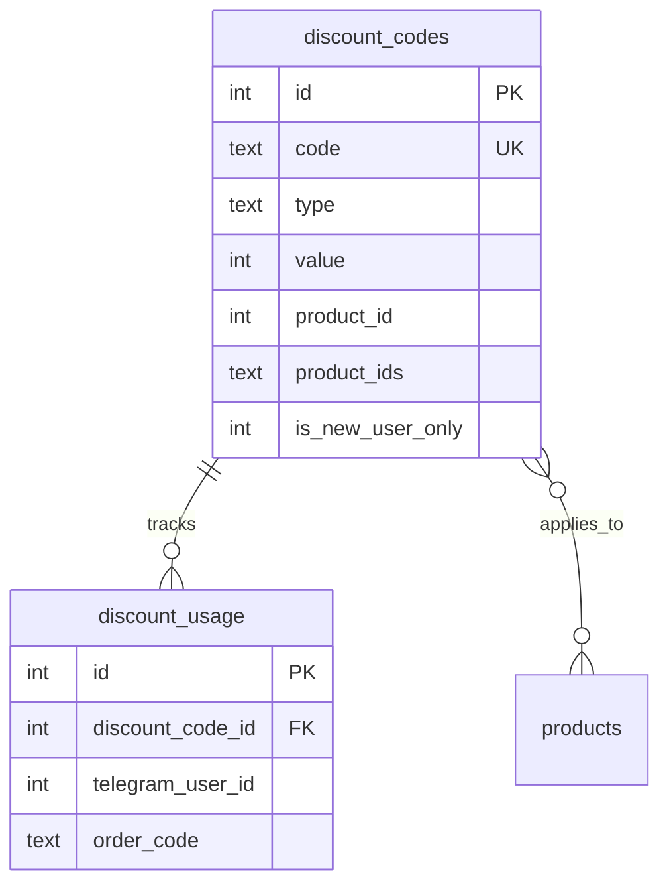
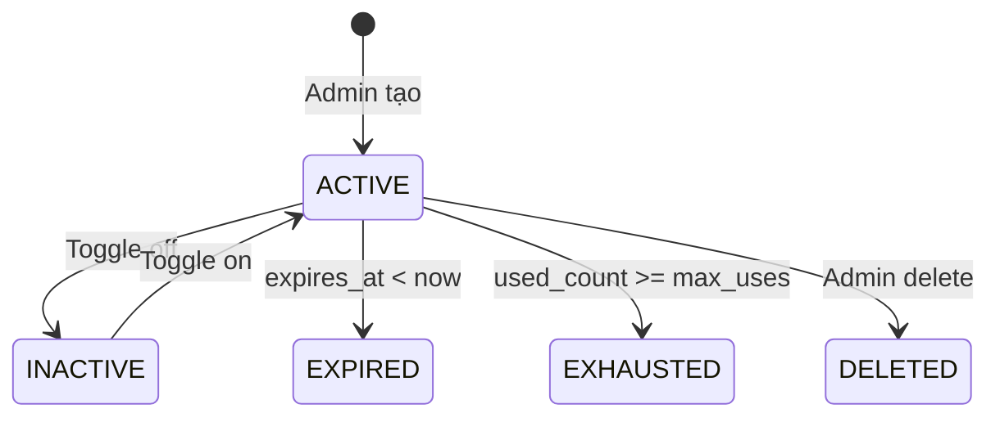

# Feature: Discount Codes (F-05)

**BE Tech Spec:** [feature_discount_tech.md](../BE/feature_discount_tech.md)
**Priority:** P1
**Status:** ✅ Done (v2.2)

---

## 1. Mô tả

Hệ thống mã giảm giá cho Telegram bot + admin panel. Hỗ trợ percent/fixed, multi-product, group restriction, new-user-only, ẩn mã, user cụ thể, giới hạn lượt, lịch trình.

---

## 2. Use Cases

### UC-5.1: User xem mã khả dụng (/discount)

1. User gõ `/discount`
2. Bot filter: skip mã ẩn, skip mã user khác, skip mã khách mới (nếu đã mua)
3. Check group membership nếu có `required_group_id`
4. Hiển thị mã theo nhóm: Tất cả SP → Theo SP → Multi-SP

### UC-5.2: User nhập mã khi checkout

1. Sau chọn SL → prompt "Bạn có mã giảm giá không?"
2. Nếu user mới + có mã `is_new_user_only` → "🎉 Bạn có mã dành cho khách mới!"
3. User nhập mã → validate → preview → confirm hoặc thử lại

### UC-5.3: Admin quản lý mã

1. Tab Mã giảm giá → bảng với badges (🔒 Group, 👤 User, 👁 Ẩn, 🆕 Mới)
2. Tạo/sửa: form modal với chip selector chọn SP
3. Toggle active/inactive
4. Recalculate usage count

### Edge Cases

| Case | Xử lý |
|------|-------|
| Bot không phải member group | `getChatMember` fail → ẩn mã |
| User nhập mã hết lượt | Inline error + nút "Bỏ qua" |
| Mã chỉ cho user khác | "Mã này chỉ dành cho một người dùng cụ thể" |
| Mã khách mới, user đã mua | "Mã này chỉ dành cho khách hàng mới" |
| Mã hết hạn giữa flow | Re-validate khi tạo đơn |

---

## 3. Screens & States

### Bot — /discount listing

| State | Hiển thị |
|-------|---------|
| **Data** | Mã theo nhóm + badges (🔒 🆕 👤) |
| **Empty** | "😔 Hiện tại chưa có mã giảm giá nào dành cho bạn" + CTA /products |

### Bot — Discount prompt (checkout)

| State | Hiển thị |
|-------|---------|
| **Ready** | "Bạn có mã giảm giá không?" + [Nhập mã] [Bỏ qua] |
| **New user hint** | Thêm "🎉 Bạn có mã giảm giá dành cho khách mới! Xem /discount" |
| **Valid** | Preview: mã, giảm bao nhiêu, tổng thanh toán + [Xác nhận] [Đổi mã] |
| **Invalid** | Error message + [Thử lại] [Bỏ qua] |

### Admin — Discount table

| State | Hiển thị |
|-------|---------|
| **Loading** | Skeleton table |
| **Data** | Table: Code, Type, Value, SP, Usage, Badges, Status, Actions |
| **Empty** | "Chưa có mã giảm giá nào" + CTA "Thêm mới" |

### Admin — Discount form modal

- Code input, Type selector (percent/fixed), Value
- Product multi-select (chip/pill tags)
- Min order, Max discount amount, Max uses, Max/user, Max qty
- Group ID, User ID inputs
- Checkboxes: ☐ Ẩn mã, ☐ 🆕 Chỉ khách mới
- Date range: starts_at, expires_at

---

## 4. Domain Model



---

## 5. Restriction Badges (Admin table)

| Badge | Field | Color |
|-------|-------|-------|
| 🔒 Group | `required_group_id` | Blue (#3b82f6) |
| 👤 {userId} | `allowed_user_id` | Purple (#8b5cf6) |
| 👁 Ẩn | `is_hidden` | Gray (#6b7280) |
| 🆕 Mới | `is_new_user_only` | Green (#10b981) |

---

## 6. Bot Display Format

```
🎟 MÃ GIẢM GIÁ HIỆN CÓ

🌐 Áp dụng tất cả sản phẩm:
  🏷 `WELCOME10` — giảm 10% (tối đa 20.000 đ)
    🆕 _Dành cho khách hàng mới_

📦 Claude Pro 1 tháng:
  🏷 `CLAUDE10` — giảm 10.000 đ

📦 Claude + ChatGPT Bundle:
  🏷 `BUNDLE20` — giảm 20% (cho 2 SP)
    🔒 _Chỉ cho thành viên group: TechDeals_

💡 Nhập mã khi thanh toán để được giảm giá!
🛒 Dùng mã ngay: /products
```

---

## 7. State Machine



---

## 8. Acceptance Criteria

- [x] `/discount` hiển thị mã theo nhóm + badges
- [x] Checkout prompt: new user hint khi có mã khách mới
- [x] Admin: form tạo/sửa với chip selector multi-product
- [x] Admin: badges 🔒 👤 👁 🆕 trong bảng
- [x] Inline error khi mã invalid + options thử lại/bỏ qua
- [x] Responsive: form hoạt động tốt trên mobile
