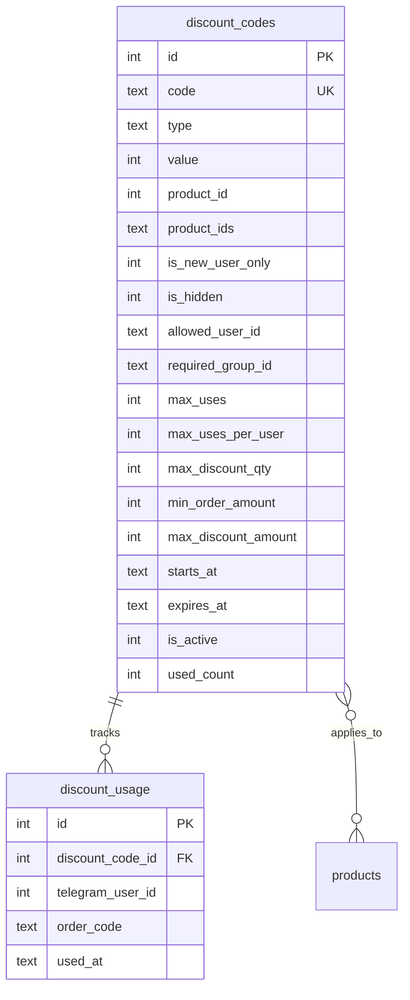
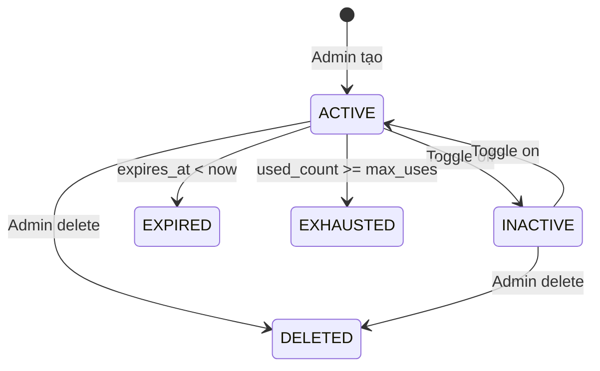

# Feature: Discount Codes (F-05)

**BE Tech Spec:** [feature_discount_tech.md](../BE/feature_discount_tech.md)
**Priority:** P1
**Status:** ✅ Done (v2.2)

---

## 1. Mô tả

Hệ thống mã giảm giá cho Telegram bot + admin panel. Hỗ trợ percent/fixed, multi-product, group restriction, new-user-only, ẩn mã, user cụ thể, giới hạn lượt, lịch trình. Với giỏ hàng multi-product, discount được tính dựa trên **eligible items** trong giỏ (per-item check `product_ids`), `min_order_amount` check trên **tổng giỏ**.

---

## 2. Use Cases + Edge Cases

### Use Cases

| # | Actor | Hành động | Kết quả |
|---|-------|-----------|---------|
| 1 | User (bot) | `/discount` → xem mã khả dụng | Grouped list: 🌐 Tất cả → 📦 Theo SP → Multi-SP |
| 2 | User (bot) | Nhập mã hợp lệ khi checkout | Preview giảm giá → confirm → apply |
| 3 | User (bot) | Nhập mã **không hợp lệ** (hết hạn/sai/hết lượt) | Error msg + [Thử lại] [Bỏ qua] |
| 4 | User (bot) | Bỏ qua mã giảm giá | Skip → tạo đơn không discount |
| 5 | User mới (bot) | Checkout khi có mã khách mới | Hint: "🎉 Bạn có mã dành cho khách mới!" |
| 6 | Admin | Tạo mã giảm giá mới | Form modal → validate → save |
| 7 | Admin | Sửa mã (partial update) | Pre-filled form → update fields |
| 8 | Admin | Toggle active/inactive | Switch trạng thái, mã ẩn/hiện trên bot |
| 9 | Admin | Xóa mã giảm giá | Cascade xóa usage records |
| 10 | Admin | Recalculate usage count | Purge invalid usage → refresh count |
| 11 | Admin | Tạo mã multi-product (chip selector) | Chọn nhiều SP → `product_ids` JSON array |
| 12 | Admin | Tạo mã chỉ cho 1 user cụ thể | Nhập Telegram user ID → `allowed_user_id` |

### Flow: Checkout Discount Apply

```
Checkout → chọn SL → nhập email (nếu cần)
     ↓
Bot: "Bạn có mã giảm giá không?" + [Nhập mã] [Bỏ qua]
     ↓
┌──── User chọn [Nhập mã] ──────────────────────┐
│ User gõ mã → validateDiscountCode()            │
│    ↓                                            │
│ ┌── Valid? ───────────────────────────────┐      │
│ │ ✅ Yes: Preview giảm giá               │      │
│ │   "Mã WELCOME10 → giảm 22.000đ"       │      │
│ │   Tổng: 220.000đ → 198.000đ           │      │
│ │   [Xác nhận] [Đổi mã]                  │      │
│ │                                         │      │
│ │ ❌ No: Error message (10 loại)          │      │
│ │   [Thử lại] [Bỏ qua]                  │      │
│ └─────────────────────────────────────────┘      │
└──────────────────────────────────────────────────┘
     ↓
Tạo đơn → QR payment (với discount applied)
```

### Edge Cases

**Bot-side (user áp dụng mã):**

| # | Category | Case | Xử lý |
|---|----------|------|-------|
| 1 | Security | Bot không phải member group | `getChatMember` fail → ẩn mã, không báo lỗi |
| 2 | Validation | User nhập mã hết lượt | Inline error: "Mã đã hết lượt sử dụng" + [Thử mã khác] [Bỏ qua] |
| 3 | Security | Mã chỉ cho user khác | "Mã này chỉ dành cho một người dùng cụ thể" |
| 4 | Security | Mã khách mới, user đã mua | "Mã này chỉ dành cho khách hàng mới" |
| 5 | Data Integrity | Mã hết hạn giữa checkout flow | Re-validate tại thời điểm tạo đơn |
| 6 | Concurrency | 2 user dùng mã cuối (max_uses) | SQLite single-writer → first wins |
| 7 | Data Integrity | `max_discount_qty` > quantity | `Math.min(max_discount_qty, quantity)` |
| 8 | Cross-Feature | SP bị xóa nhưng mã vẫn tồn tại | LEFT JOIN → product_name = NULL → hiện "Tất cả" |
| 9 | Data Integrity | User mới dùng mã → mua xong → mã ẩn | `isNewUser()` checks completed orders |
| 10 | Validation | Mã percent value > 100 | Frontend validation: giới hạn 1-100 |
| 11 | **Cart** | Giỏ 2 SP, mã chỉ áp dụng 1 SP | Tính discount chỉ trên eligible item, hiện breakdown per-item |
| 12 | **Cart** | Giỏ có SP nhưng không SP nào eligible | Reject: "Mã không áp dụng cho sản phẩm trong giỏ" |
| 13 | **Cart** | `min_order_amount` = 500k, giỏ = 550k, eligible = 250k | Pass — check trên **tổng giỏ** (Option A), discount trên eligible |
| 14 | **Cart** | `max_discount_qty=2`, giỏ có eligible item qty=5 | Discount chỉ cho 2 units của eligible items |
| 15 | **Cart** | User muốn dùng 2 mã cho 2 SP khác nhau | **1 mã/đơn** — Chỉ áp dụng 1 mã. User dùng [Đổi mã] để so sánh, chọn mã lợi nhất |
| 16 | **Cart** | Bot có nên auto-suggest mã tốt nhất? | **Không** — giảm doanh thu shop, phá chiến lược marketing. Chỉ hint khách mới (`is_new_user_only`). Phase 5 xem xét setting `auto_suggest_discount` |

**Admin-side (tạo/sửa mã):**

| # | Category | Case | Xử lý |
|---|----------|------|-------|
| 11 | Validation | `code` rỗng hoặc chỉ có khoảng trắng | Inline error: "Vui lòng nhập mã giảm giá" |
| 12 | Validation | `code` chứa khoảng trắng / ký tự đặc biệt | Inline error: "Mã chỉ chấp nhận chữ cái, số và gạch ngang" |
| 13 | Validation | `code` đã tồn tại (duplicate) | Inline error: "Mã giảm giá đã tồn tại" |
| 14 | Validation | `value` ≤ 0 hoặc rỗng | Inline error: "Giá trị giảm phải lớn hơn 0" |
| 15 | Validation | `type = percent` + `value > 100` | Inline error: "Giá trị phần trăm phải từ 1 đến 100" |
| 16 | Validation | `expires_at` < `starts_at` | Inline error: "Ngày kết thúc phải sau ngày bắt đầu" |
| 17 | Validation | `expires_at` < hiện tại | Warning toast: "⚠️ Mã này đã hết hạn ngay khi tạo" (vẫn cho tạo) |
| 18 | Validation | `max_uses` < 0 | Inline error: "Lượt dùng tối đa phải ≥ 0" |
| 19 | Validation | `max_uses_per_user` > `max_uses` (cả 2 > 0) | Warning toast: "⚠️ Lượt/người lớn hơn tổng lượt dùng" (vẫn cho tạo) |
| 20 | Validation | `product_ids` chứa ID sản phẩm không tồn tại | Inline error: "Sản phẩm không tồn tại" (highlight chip lỗi) |
| 21 | Validation | `min_order_amount` < 0 | Inline error: "Đơn tối thiểu phải ≥ 0" |
| 22 | Validation | `max_discount_amount` ≤ 0 (khi type = percent) | Inline error: "Giảm tối đa phải lớn hơn 0" |

---

## 3. Screens & States

### Bot — /discount listing

| State | Hiển thị |
|-------|---------|
| **Data** | Mã theo nhóm + badges (🔒 🆕 👤), formatted text |
| **Empty** | "😔 Hiện tại chưa có mã giảm giá nào dành cho bạn" + CTA /products |

**Bot Display Format:**

```
🎟 MÃ GIẢM GIÁ HIỆN CÓ

🌐 Áp dụng tất cả sản phẩm:
  🏷 `WELCOME10` — giảm 10% (tối đa 20.000 đ)
    🆕 _Dành cho khách hàng mới_

📦 Claude Pro 1 tháng:
  🏷 `CLAUDE10` — giảm 10.000 đ

📦 Claude + ChatGPT Bundle:
  🏷 `BUNDLE20` — giảm 20% (cho 2 SP)
    🔒 _Chỉ cho thành viên group: TechDeals_

💡 Nhập mã khi thanh toán để được giảm giá!
🛒 Dùng mã ngay: /products
```

### Bot — Discount prompt (checkout)

| State | Hiển thị |
|-------|---------|
| **Ready** | "Bạn có mã giảm giá không?" + [Nhập mã] [Bỏ qua] |
| **New user hint** | Thêm "🎉 Bạn có mã giảm giá dành cho khách mới! Xem /discount" |
| **Valid** | Preview per-item: eligible items có tag "✅ Giảm", non-eligible "(không áp dụng)" + tổng giảm + [Xác nhận] [Đổi mã] |
| **Invalid** | Error message + [Thử lại] [Bỏ qua] |
| **No eligible items** | "Mã không áp dụng cho sản phẩm trong giỏ" + [Thử lại] [Bỏ qua] |

**Bot Discount Preview (multi-cart):**

```text
🏷 Mã SAVE10 áp dụng:

✅ Claude Pro x1        250,000đ → 225,000đ (-10%)
—  Netflix Premium x2   300,000đ (không áp dụng)
─────────────────────────────────
💰 Giảm:     −25,000đ
💳 Tổng:     525,000đ

[Xác nhận] [Đổi mã] [Bỏ qua]
```

### Admin — Discount Tab

**Layout:** Full-width table

| State | Hiển thị |
|-------|---------|
| **Loading** | Skeleton table (3 rows, shimmer) |
| **Data** | Table: Code, Type, Value, SP, Usage, Badges, Status, Actions |
| **Empty** | Icon 🎟 + "Chưa có mã giảm giá nào" + CTA "＋ Tạo mã mới" |
| **Error** | Toast "Không thể tải danh sách mã giảm giá" |

**Admin Table Columns:**

| Column | Width | Data |
|--------|-------|------|
| Code | 140px | `code` (monospace, bold) |
| Loại | 80px | `type` badge: percent / fixed |
| Giá trị | 100px | `-10%` hoặc `-10.000 đ` |
| Áp dụng | fill | Product names (chips) hoặc "Tất cả" |
| Lượt dùng | 80px | `used_count / max_uses` (hoặc "∞") |
| Badges | 140px | 🔒 Group · 👤 User · 👁 Ẩn · 🆕 Mới |
| Status | 80px | Toggle switch Active/Inactive |
| Actions | 100px | [✏ Sửa] [🗑 Xóa] |

### Admin — Discount Form Modal

**Layout:** Modal 520px, scrollable body

| Field | Type | Required? | Default | Validation / Ghi chú |
|-------|------|-----------|---------|---------------------|
| Mã giảm giá | Text input | ✅ **Required** | — | Unique, không trùng |
| Loại | Select: Phần trăm / Cố định | ✅ **Required** | `percent` | `percent` hoặc `fixed` |
| Giá trị | Number | ✅ **Required** | — | 1-100 (percent) hoặc > 0 (fixed) |
| Sản phẩm | Chip multi-select | Optional | `null` → áp dụng **tất cả SP** | Gửi `product_ids` (JSON array) |
| Đơn tối thiểu | Number | Optional | `0` → không yêu cầu | ≥ 0 (đơn vị: VNĐ) |
| Giảm tối đa | Number | Optional | `null` → **không giới hạn** | Chỉ hiện khi type = `percent` |
| Lượt dùng tối đa | Number | Optional | `0` → **unlimited** | Tổng lượt trên tất cả user |
| Lượt / người | Number | Optional | `0` → **unlimited** | Giới hạn mỗi user |
| SL SP giảm tối đa | Number | Optional | `0` → **tất cả SP** trong đơn | `max_discount_qty` |
| Group ID | Text | Optional | `null` → không yêu cầu group | Telegram group ID (VD: `-1001234567890`) |
| User ID | Text | Optional | `null` → tất cả user | Telegram user ID — chỉ user này dùng được |
| ☐ Ẩn mã | Checkbox | Optional | `unchecked` (`0`) | Ẩn khỏi /discount listing |
| ☐ Chỉ khách mới | Checkbox | Optional | `unchecked` (`0`) | Chỉ user chưa có concluded order |
| Ngày bắt đầu | Date picker | Optional | `null` → **có hiệu lực ngay** | ISO 8601 format |
| Ngày kết thúc | Date picker | Optional | `null` → **không hết hạn** | ISO 8601 format |

> [!TIP]
> Khi tạo mã, chỉ cần gửi 3 trường bắt buộc (`code`, `type`, `value`). Các trường Optional nếu không gửi sẽ dùng giá trị default từ DB. Frontend nên hiển thị placeholder/hint cho giá trị default (VD: "0 = không giới hạn").

**Footer:** [Hủy] + [💾 Lưu] (create) / [💾 Cập nhật] (edit)

### Restriction Badges

| Badge | Field | Color |
|-------|-------|-------|
| 🔒 Group | `required_group_id` | Blue (#3b82f6) |
| 👤 {userId} | `allowed_user_id` | Purple (#8b5cf6) |
| 👁 Ẩn | `is_hidden` | Gray (#6b7280) |
| 🆕 Mới | `is_new_user_only` | Green (#10b981) |

---

## 4. Domain Model



---

## 5. API Endpoints

| Method | Path | Mô tả |
|--------|------|-------|
| GET | `/api/admin/discounts` | List all discount codes |
| POST | `/api/admin/discounts` | Create discount code |
| PUT | `/api/admin/discounts/:id` | Update discount (partial fields) |
| DELETE | `/api/admin/discounts/:id` | Delete discount code (cascade xóa usage) |
| GET | `/api/admin/discounts/:id/usage` | Xem chi tiết lượt dùng (user, order, amount) |
| POST | `/api/admin/discounts/:id/recalc` | Recalculate used_count (purge invalid usage) |

### Discount Calculation Logic

```
// max_discount_qty: limit units eligible for discount
discountQty = (max_discount_qty > 0) ? min(max_discount_qty, quantity) : quantity
discountableAmount = unitPrice × discountQty

// percent type
discountAmount = floor(discountableAmount × value / 100)
if (max_discount_amount) discountAmount = min(discountAmount, max_discount_amount)

// fixed type
discountAmount = min(value × discountQty, orderAmount)
```

---

## 6. Error Codes

### Admin API errors (tạo/sửa mã)

| Code | Error Code | Message | Trigger |
|------|-----------|---------|--------|
| 400 | `VALIDATION_ERROR` | "Vui lòng nhập mã giảm giá" | `code` rỗng / chỉ khoảng trắng |
| 400 | `VALIDATION_ERROR` | "Mã chỉ chấp nhận chữ cái, số và gạch ngang" | `code` chứa ký tự đặc biệt / khoảng trắng |
| 400 | `VALIDATION_ERROR` | "Giá trị giảm phải lớn hơn 0" | `value` ≤ 0 hoặc rỗng |
| 400 | `VALIDATION_ERROR` | "Loại giảm giá phải là percent hoặc fixed" | `type` ≠ `percent` / `fixed` |
| 400 | `VALIDATION_ERROR` | "Giá trị phần trăm phải từ 1 đến 100" | `type = percent` + `value > 100` |
| 400 | `VALIDATION_ERROR` | "Ngày kết thúc phải sau ngày bắt đầu" | `expires_at` < `starts_at` |
| 400 | `VALIDATION_ERROR` | "Lượt dùng tối đa phải ≥ 0" | `max_uses` < 0 |
| 400 | `VALIDATION_ERROR` | "Lượt dùng mỗi người phải ≥ 0" | `max_uses_per_user` < 0 |
| 400 | `VALIDATION_ERROR` | "SL SP giảm tối đa phải ≥ 0" | `max_discount_qty` < 0 |
| 400 | `VALIDATION_ERROR` | "Đơn tối thiểu phải ≥ 0" | `min_order_amount` < 0 |
| 400 | `VALIDATION_ERROR` | "Giảm tối đa phải lớn hơn 0" | `max_discount_amount` ≤ 0 (khi type = percent) |
| 400 | `VALIDATION_ERROR` | "Sản phẩm không tồn tại" | `product_ids` chứa ID không hợp lệ |
| 400 | `DUPLICATE_CODE` | "Mã giảm giá đã tồn tại" | Duplicate code (UNIQUE constraint) |
| 401 | — | "Unauthorized" | API key sai/thiếu |
| 500 | `INTERNAL_ERROR` | Server error | DB/runtime error |

**Admin warning toasts** (không block, vẫn cho tạo):

| Type | Message | Trigger |
|------|---------|---------|
| ⚠️ Warning | "Mã này đã hết hạn ngay khi tạo" | `expires_at` < thời điểm hiện tại |
| ⚠️ Warning | "Lượt/người lớn hơn tổng lượt dùng" | `max_uses_per_user` > `max_uses` (cả 2 > 0) |

### Admin form inline errors

| Field | Validation | Inline error message |
|-------|-----------|---------------------|
| Mã giảm giá | Rỗng | "Vui lòng nhập mã giảm giá" |
| Mã giảm giá | Ký tự không hợp lệ | "Mã chỉ chấp nhận chữ cái, số và gạch ngang" |
| Mã giảm giá | Trùng (API trả 400) | "Mã giảm giá đã tồn tại" |
| Giá trị | Rỗng hoặc ≤ 0 | "Giá trị giảm phải lớn hơn 0" |
| Giá trị | percent + > 100 | "Giá trị phần trăm phải từ 1 đến 100" |
| Giảm tối đa | ≤ 0 (khi percent) | "Giảm tối đa phải lớn hơn 0" |
| Lượt dùng tối đa | < 0 | "Lượt dùng tối đa phải ≥ 0" |
| Lượt / người | < 0 | "Lượt dùng mỗi người phải ≥ 0" |
| SL SP giảm tối đa | < 0 | "SL SP giảm tối đa phải ≥ 0" |
| Đơn tối thiểu | < 0 | "Đơn tối thiểu phải ≥ 0" |
| Ngày kết thúc | < Ngày bắt đầu | "Ngày kết thúc phải sau ngày bắt đầu" |
| Sản phẩm | ID không tồn tại | "Sản phẩm không tồn tại" (highlight chip lỗi) |

> [!TIP]
> Frontend validate trước khi gọi API. Nếu API trả `400`, map `error.code` → inline error tương ứng. Với `DUPLICATE_CODE`, highlight field "Mã giảm giá".

### Bot validation errors (`validateDiscountCode` returns)

| Reason | Trigger |
|--------|---------|
| "Mã giảm giá không tồn tại" | Code không tìm thấy |
| "Mã giảm giá đã bị vô hiệu hóa" | is_active = 0 |
| "Mã giảm giá chưa đến thời gian áp dụng" | now < starts_at |
| "Mã giảm giá đã hết hạn" | now > expires_at |
| "Mã giảm giá đã hết lượt sử dụng" | used_count ≥ max_uses |
| "Bạn đã sử dụng mã này đạt giới hạn" | per-user usage ≥ max_uses_per_user |
| "Mã này chỉ dành cho một người dùng cụ thể" | allowed_user_id mismatch |
| "Mã này chỉ dành cho khách hàng mới" | is_new_user_only + existing user |
| "Mã này chỉ áp dụng cho: {SP names}" | product mismatch |
| "Đơn hàng tối thiểu {X}đ để áp dụng mã này" | orderAmount < min_order_amount |

---

## 7. Analytics Events

| Event | Trigger | Properties |
|-------|---------|-----------|
| `discount_list_view` | User gõ /discount | `{ userId, availableCount, totalCount }` |
| `discount_prompt_show` | Checkout prompt hiện | `{ userId, hasNewUserCodes }` |
| `discount_apply_success` | Mã hợp lệ, áp dụng | `{ code, type, discountAmount, originalAmount }` |
| `discount_apply_fail` | Mã không hợp lệ | `{ code, reason }` |
| `discount_skip` | User chọn "Bỏ qua" | `{ userId }` |
| `discount_admin_create` | Admin tạo mã | `{ code, type, value, restrictions }` |
| `discount_admin_toggle` | Toggle active/inactive | `{ discountId, newStatus }` |
| `discount_admin_delete` | Admin xóa mã | `{ discountId, code }` |

---

## 8. State Machine



### 8.1 Timeout Specification

| Item | Giá trị | Behavior khi hết hạn |
|------|:-------:|---------------------|
| **Discount `expires_at`** | Admin-configurable (ngày/giờ) | Auto → `EXPIRED`, không apply được nữa |
| **`max_uses` limit** | Admin-configurable (0 = unlimited) | Auto → `EXHAUSTED` khi `used_count >= max_uses` |
| **`per_user` limit** | Admin-configurable (0 = unlimited) | Reject per-user limit, mã vẫn `ACTIVE` globally |

### 8.2 Scenarios by Status

#### `ACTIVE` (5 scenarios)

| # | Scenario | Actor | Trigger | Kết quả |
|---|----------|-------|---------|---------|
| DA1 | User apply mã hợp lệ | User (bot) | Checkout → nhập mã | Preview giảm giá → apply |
| DA2 | Admin toggle off | Admin | Discount table → switch | → `INACTIVE` |
| DA3 | Hết lượt sử dụng | System | `used_count >= max_uses` | → `EXHAUSTED` |
| DA4 | Hết hạn thời gian | System | `expires_at < now` | → `EXPIRED` |
| DA5 | Admin xóa | Admin | Delete → confirm | → `DELETED` (cascade usage records) |

#### `INACTIVE` (3 scenarios)

| # | Scenario | Actor | Trigger | Kết quả |
|---|----------|-------|---------|---------|
| DI1 | User thử apply mã inactive | User (bot) | Checkout → nhập mã | Error "Mã giảm giá không còn hoạt động" |
| DI2 | Admin toggle on | Admin | Discount table → switch | → `ACTIVE` (nếu chưa expired/exhausted) |
| DI3 | Admin xóa khi inactive | Admin | Delete → confirm | → `DELETED` |

#### `EXPIRED` (2 scenarios)

| # | Scenario | Actor | Trigger | Kết quả |
|---|----------|-------|---------|---------|
| DE1 | User thử apply mã expired | User (bot) | Checkout → nhập mã | Error "Mã giảm giá đã hết hạn" |
| DE2 | Admin sửa `expires_at` kéo dài | Admin | Edit → cập nhật ngày | → `ACTIVE` (nếu max_uses chưa hết) |

#### `EXHAUSTED` (2 scenarios)

| # | Scenario | Actor | Trigger | Kết quả |
|---|----------|-------|---------|---------|
| DX1 | User thử apply mã exhausted | User (bot) | Checkout → nhập mã | Error "Mã giảm giá đã hết lượt" |
| DX2 | Admin tăng `max_uses` | Admin | Edit → tăng giá trị | → `ACTIVE` (nếu chưa expired) |

#### `DELETED` — Terminal state (2 scenarios)

| # | Scenario | Actor | Trigger | Kết quả |
|---|----------|-------|---------|---------|
| DD1 | Mã deleted, user nhập code | User (bot) | Checkout → nhập mã | Error "Mã không tồn tại" |
| DD2 | Admin recalculate sau delete | Admin | Recalculate usage | Usage records đã cascade delete |

> **Tổng: 14 scenarios** — 5 ACTIVE + 3 INACTIVE + 2 EXPIRED + 2 EXHAUSTED + 2 DELETED

---

## 9. Caching Strategy

| Data | Cache | TTL |
|------|-------|-----|
| Discount codes list | No cache | Real-time query |
| Group membership check | No cache (real-time Telegram API) | — |
| isNewUser() | No cache | Real-time COUNT |
| Validation | Per-request | — |

> Không cần cache vì discount state thay đổi thường xuyên (used_count, active toggle).

---

## 10. Acceptance Criteria

- [x] `/discount` hiển thị mã theo nhóm + badges (🔒 👤 👁 🆕)
- [x] Checkout prompt: new user hint khi có mã khách mới
- [x] Admin: form tạo/sửa modal với chip selector multi-product
- [x] Admin: badges trong bảng, toggle active/inactive
- [x] 11 validation constraints fully enforced
- [x] Discount calculation: percent with cap, fixed per unit, max_discount_qty
- [x] Inline error khi mã invalid + options thử lại/bỏ qua
- [x] Recalculate usage count
- [x] Responsive: form hoạt động tốt trên mobile

---

## State Coverage Matrix

| Screen | Loading | Ready/Data | Error | Empty |
|--------|---------|-----------|-------|-------|
| Bot /discount | N/A | ✅ Grouped list + badges | N/A (toast) | ✅ "Chưa có mã" + CTA |
| Bot checkout prompt | N/A | ✅ Prompt + buttons | ✅ Error msg + retry | N/A |
| Admin Discount Table | ✅ Skeleton | ✅ Table + badges + toggle | ✅ Toast | ✅ Icon + CTA |
| Admin Form Modal | N/A | ✅ Full form | ✅ Inline errors | N/A |
