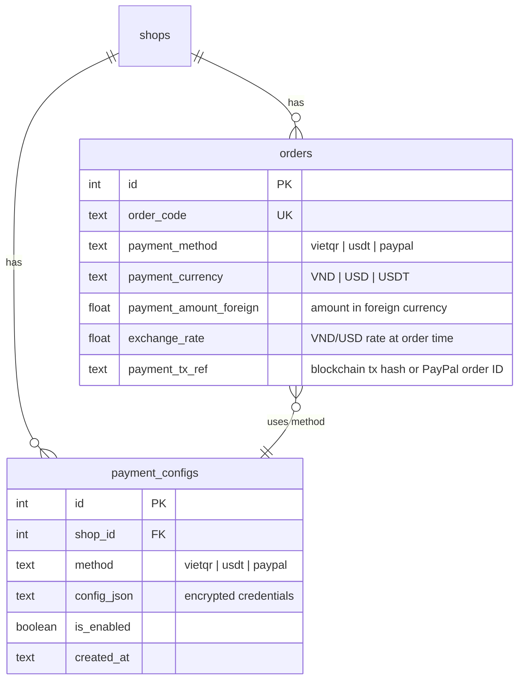
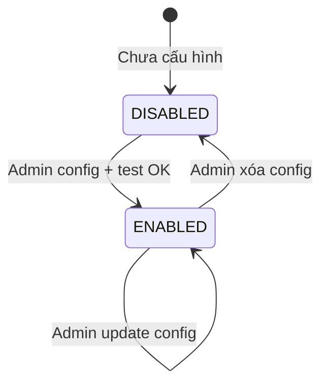
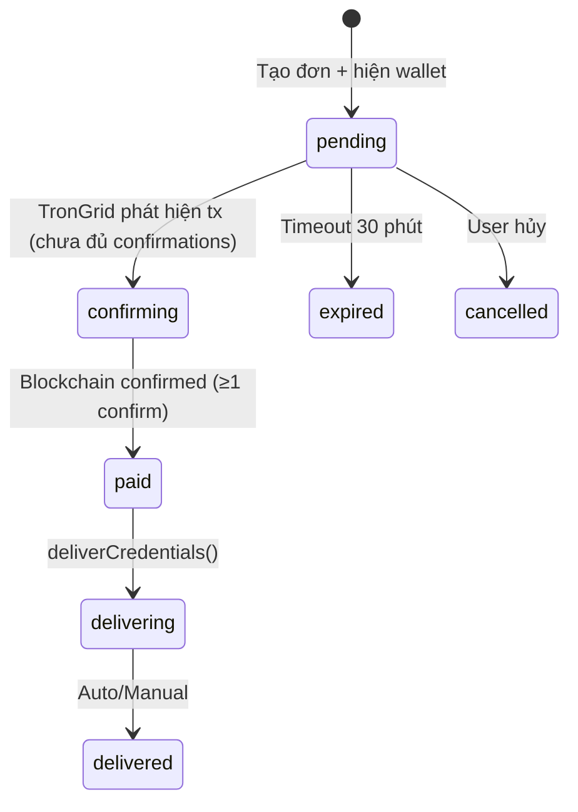
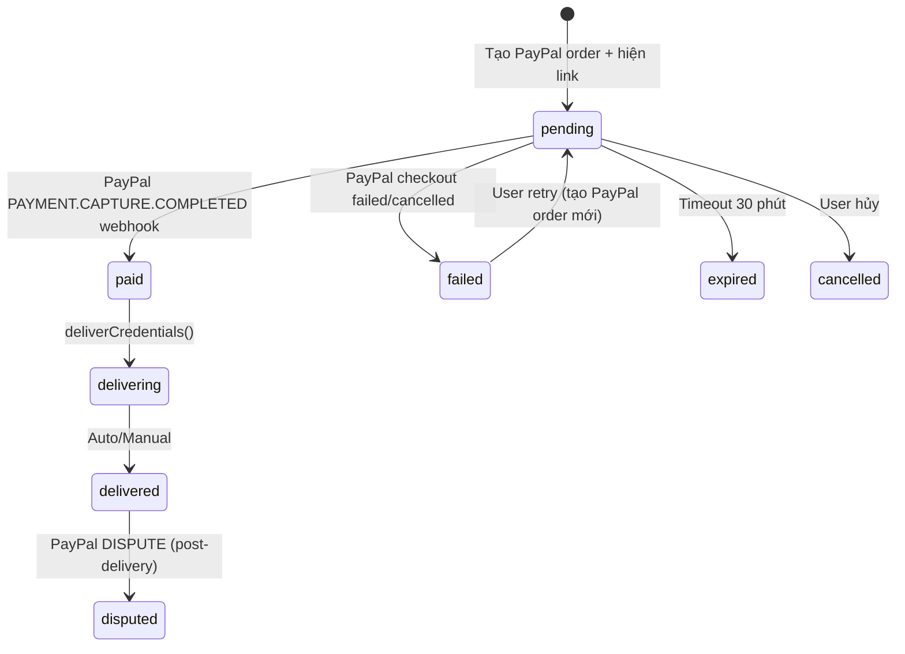

# Feature: International Payment — USDT & PayPal (F-10)

**BE Tech Spec:** [feature_international_payment_tech.md](../BE/feature_international_payment_tech.md)
**Priority:** P1
**Status:** 📝 Drafting

---

## 1. Mô tả

Mở rộng hệ thống thanh toán để hỗ trợ khách quốc tế qua **USDT (TRC20)** và **PayPal**, song song với VietQR/SePay hiện tại. Mỗi shop có thể cấu hình riêng các phương thức thanh toán tại Settings.

### Nguyên tắc cốt lõi

- **VietQR là mặc định** — luôn có sẵn nếu shop đã config bank
- USDT và PayPal là **phương thức bổ sung**, cấu hình tại Settings
- Mỗi phương thức hoạt động **độc lập** — shop có thể bật 1, 2, hoặc cả 3
- **Không ảnh hưởng Activation Level** — Level 0/1/2 giữ nguyên logic (bot + SePay)
- Giá sản phẩm lưu **VND**, hiển thị quy đổi USD realtime (via ExchangeRate API)
- USDT: verify qua **TronGrid API** (polling blockchain mỗi 30s)
- PayPal: verify qua **PayPal Checkout REST API + Webhook**

### Payment Method Availability

```
Shop config:
  ✅ Bank account   → VietQR available
  ✅ USDT wallet    → USDT available
  ✅ PayPal client  → PayPal available

Bot hiển thị: Chỉ những phương thức shop đã cấu hình
  - 1 method   → skip selection, vào thẳng payment screen
  - 2+ methods → hiện Payment Method Selection
```

---

## 2. Use Cases + Edge Cases

### Use Cases

| # | Actor | Hành động | Kết quả |
|---|-------|-----------|---------|
| 1 | Khách | Chọn SP → checkout → chọn VietQR | Flow hiện tại (QR + SePay) |
| 2 | Khách | Chọn SP → checkout → chọn USDT | Hiện USDT amount + wallet address + QR + countdown |
| 3 | Khách | Chọn SP → checkout → chọn PayPal | Redirect PayPal checkout page → callback xác nhận |
| 4 | Khách | Thanh toán USDT thành công | TronGrid poller match tx → confirm → deliver tự động |
| 5 | Khách | Thanh toán PayPal thành công | PayPal webhook → confirm → deliver tự động |
| 6 | Admin | Cấu hình USDT wallet tại Settings | Nhập TRC20 wallet address → validate format → lưu |
| 7 | Admin | Cấu hình PayPal tại Settings | Nhập Client ID + Secret → test connection → lưu |
| 8 | Admin | Tắt 1 payment method | Khách không thấy method đó nữa, đơn pending giữ nguyên |
| 9 | Admin | Xác nhận TT thủ công (Level 1) cho đơn USDT | Check blockchain explorer → nhập tx hash → confirm |
| 10 | Khách | Shop chỉ có 1 method → không hiện selection | Skip thẳng vào payment screen |
| 11 | Admin | Config phí giao dịch: shop hoặc khách chịu | Settings → Tab "Thanh toán QT" → Section "Phí giao dịch" |
| 12 | Khách | Checkout USDT/PayPal khi khách chịu phí | Hiển thị giá SP + phí riêng, tổng = SP + fee |

### Flow: Thanh toán USDT

```text
Khách chọn USDT
     ↓
Bot hiển thị:
  ┌─────────────────────────────────────┐
  │  💰 Thanh toán USDT (TRC20)         │
  │                                     │
  │  Sản phẩm:    2.58 USDT            │
  │  Phí mạng:  + 1.50 USDT (*)        │
  │  ─────────────────────              │
  │  Tổng gửi:    4.08 USDT            │
  │  (≈ 102,800 VND @ 25,194 VND/USDT) │
  │                                     │
  │  (*) Hiện khi fee_bearer=customer   │
  │  Nếu fee_bearer=shop → chỉ hiện    │
  │  "Số tiền: 2.58 USDT"              │
  │                                     │
  │  Mạng: TRC20 (Tron)                │
  │  Địa chỉ ví:                       │
  │  TXyz...abc123 [Copy]              │
  │                                     │
  │  [QR code ví TRC20]                │
  │                                     │
  │  Nội dung memo: ORD1710567890123   │
  │  ⏱ Hết hạn sau: 29:58             │
  │                                     │
  │  ⚠️ Chỉ gửi USDT qua mạng TRC20!  │
  │  Gửi sai mạng = MẤT TIỀN!         │
  └─────────────────────────────────────┘

Khách gửi USDT → Tron blockchain confirm
     ↓
TronGrid poller (30s): match wallet + amount ≥ expected
     ↓
Bot → Khách: "✅ Đã nhận 2.58 USDT — Đang gửi sản phẩm..."
     ↓
Auto-deliver credentials
```

### Flow: Thanh toán PayPal

```
Khách chọn PayPal
     ↓
Bot tạo PayPal order (REST API) → nhận approval_url
     ↓
Bot hiển thị:
  ┌─────────────────────────────────────┐
  │  💳 Thanh toán PayPal               │
  │                                     │
  │  Số tiền: $2.58 USD                │
  │  (≈ 65,000 VND)                    │
  │                                     │
  │  [🔗 Thanh toán qua PayPal]        │
  │  (opens paypal.com checkout)        │
  │                                     │
  │  ⏱ Hết hạn sau: 29:58             │
  │                                     │
  │  Sau khi thanh toán xong, quay     │
  │  lại đây để nhận sản phẩm.        │
  └─────────────────────────────────────┘

Khách click link → thanh toán trên PayPal
     ↓
PayPal webhook: PAYMENT.CAPTURE.COMPLETED
     ↓
Bot → Khách: "✅ Đã nhận thanh toán PayPal — Đang gửi sản phẩm..."
     ↓
Auto-deliver credentials
```

### Edge Cases

#### User-side

| # | Category | Case | Xử lý |
|---|----------|------|-------|
| 1 | Payment | USDT underpaid (gas fee trừ vào amount) | Notify khách "Số USDT chưa đủ, vui lòng gửi thêm X USDT". Đơn giữ pending |
| 2 | Payment | USDT gửi sai mạng (ERC20 thay vì TRC20) | Không nhận được → đơn expire. Warning rõ ràng trên payment screen |
| 3 | Payment | USDT network congestion (confirm chậm > 5 phút) | Poller tiếp tục check. Order expiry cho USDT = **30 phút** (dài hơn VietQR) |
| 4 | Payment | PayPal chargeback/dispute sau khi đã deliver | Log dispute webhook → alert admin. Credentials đã gửi không thể thu hồi |
| 5 | Payment | PayPal currency conversion loss | Hiển thị USD amount rõ ràng, khách chịu phí conversion của PayPal |
| 6 | Payment | Khách có PayPal nhưng không có balance/card | PayPal tự handle → redirect lại bot với error → "Thanh toán thất bại" |
| 7 | Payment | USDT gửi 2 lần (duplicate) | Lần 2 tx match đơn đã paid → ignore. Admin alert cho khoản dư |

#### Admin-side

| # | Category | Case | Xử lý |
|---|----------|------|-------|
| 8 | Data Integrity | USDT wallet address format sai | Validate regex TRC20 `^T[1-9A-HJ-NP-Za-km-z]{33}$` → inline error |
| 9 | Data Integrity | PayPal Client ID/Secret sai | Test connection (get access token) → fail → inline error, KHÔNG lưu |
| 10 | Cross-Feature | Tắt USDT khi có đơn USDT pending | Đơn pending giữ nguyên flow. Đơn mới không có option USDT |
| 11 | Security | PayPal webhook spoofing | Verify webhook signature (PayPal-Transmission-Sig header) |
| 12 | Concurrency | Tỉ giá thay đổi giữa lúc khách thanh toán | Tỉ giá lock tại thời điểm tạo đơn. Khách trả theo amount đã hiển thị |
| 13 | Data Integrity | TronGrid API down | Poller log warning, retry next interval. Đơn giữ pending cho đến khi API recovery |
| 14 | Cross-Feature | Admin xác nhận TT thủ công cho đơn USDT (Level 1) | Nhập tx hash thay vì amount VND. Validate tx hash on blockchain |

---

## 3. Screens & States

### 3.1 Bot — Payment Method Selection

**Điều kiện hiển thị:** Shop có ≥2 payment methods configured

```
Chọn phương thức thanh toán:
  [🏦 Chuyển khoản (VietQR)]    -- nếu shop có bank
  [💰 USDT (TRC20)]             -- nếu shop có USDT wallet
  [💳 PayPal]                   -- nếu shop có PayPal config
  ─────────────────
  [❌ Hủy đơn]  [🏠 Menu chính]
```

| State | Hiển thị |
|-------|----------|
| **Ready** | Inline keyboard với các method khả dụng |
| **Loading** | N/A (instant render) |
| **Error** | N/A (fallback: nếu không có method nào → "Shop chưa cấu hình thanh toán") |
| **Empty** | N/A |

### 3.2 Bot — USDT Payment Screen

| State | Hiển thị |
|-------|----------|
| **Ready** | USDT amount + wallet QR + address (copyable) + TRC20 warning + countdown 30 phút |
| **Confirming** | "⏳ Đang chờ xác nhận trên blockchain..." (sau khi phát hiện tx, chờ confirm) |
| **Underpaid** | "⚠️ Số USDT chưa đủ. Cần thêm X USDT" |
| **Expired** | "Đơn đã hết hạn" + [🛍 Mua hàng] |
| **Paid** | "✅ Đã nhận X USDT — Đang gửi sản phẩm..." |

### 3.3 Bot — PayPal Payment Screen

| State | Hiển thị |
|-------|----------|
| **Ready** | USD amount + [🔗 Thanh toán qua PayPal] button + countdown 30 phút |
| **Processing** | "⏳ Đang xử lý thanh toán PayPal..." (sau khi khách quay lại) |
| **Failed** | "❌ Thanh toán PayPal thất bại" + [🔄 Thử lại] + [❌ Hủy] |
| **Expired** | "Đơn đã hết hạn" + [🛍 Mua hàng] |
| **Paid** | "✅ Đã nhận thanh toán PayPal — Đang gửi sản phẩm..." |

### 3.4 Admin Settings — USDT Configuration

**Layout:** Section trong [Unified Settings](feature_settings.md) → Tab 2 "💳 Thanh toán quốc tế"

| State | Hiển thị |
|-------|----------|
| **Empty** | "Chưa cấu hình ví USDT" + nút [＋ Thêm ví USDT] |
| **Configured** | Wallet address (masked: `TXyz...c123`) + badge 🟢 Active + [Sửa] [Xóa] |
| **Loading** | Skeleton row |
| **Error** | Toast "Không thể tải cấu hình USDT" |

#### Field Specification — USDT Config

| Field | Type | Required? | Default | Validation / Ghi chú |
|-------|------|-----------|---------|----------------------|
| Wallet Address | text (monospace) | ✅ Required | — | TRC20 format `^T[1-9A-HJ-NP-Za-km-z]{33}$`. Copy-paste friendly |
| Label | text | Optional | "USDT (TRC20)" | Tên hiển thị cho khách |

### 3.5 Admin Settings — PayPal Configuration

**Layout:** Section trong trang Settings, dưới USDT

| State | Hiển thị |
|-------|----------|
| **Empty** | "Chưa cấu hình PayPal" + nút [＋ Kết nối PayPal] |
| **Configured** | PayPal email + badge 🟢 Connected + [Sửa] [Ngắt kết nối] |
| **Testing** | Spinner "Đang kiểm tra kết nối..." |
| **Error** | Inline error "Client ID/Secret không hợp lệ" |

#### Field Specification — PayPal Config

| Field | Type | Required? | Default | Validation / Ghi chú |
|-------|------|-----------|---------|----------------------|
| Client ID | text | ✅ Required | — | PayPal Business REST app Client ID |
| Client Secret | text (password-style) | ✅ Required | — | Test connection bắt buộc trước khi lưu |
| Mode | select | ✅ Required | `sandbox` | `sandbox` / `live`. Sandbox cho testing |
| PayPal Email | read-only | Auto-filled | — | Fill từ PayPal API sau khi test thành công |

---

## 4. Domain Model



---

## 5. API Endpoints

| Method | Path | Mô tả |
|--------|------|-------|
| GET | `/api/admin/payment-configs` | List all configured methods |
| POST | `/api/admin/payment-configs/usdt` | Configure USDT wallet |
| PUT | `/api/admin/payment-configs/usdt` | Update USDT wallet |
| DELETE | `/api/admin/payment-configs/usdt` | Remove USDT config |
| POST | `/api/admin/payment-configs/paypal` | Configure PayPal (test connection) |
| PUT | `/api/admin/payment-configs/paypal` | Update PayPal config |
| DELETE | `/api/admin/payment-configs/paypal` | Remove PayPal config |
| POST | `/webhook/paypal/{shopId}/{secret}` | PayPal webhook receiver |

> Bot commands: payment method selection handled by bot handlers, not REST API.

---

## 6. Error Codes

### Admin API Errors

| Code | Error Code | Message | Trigger |
|------|-----------|---------|--------|
| 400 | `INVALID_USDT_ADDRESS` | Địa chỉ ví USDT không hợp lệ. Chỉ hỗ trợ TRC20 | Regex fail |
| 400 | `PAYPAL_CONNECTION_FAILED` | Không thể kết nối PayPal. Kiểm tra Client ID/Secret | Auth fail |
| 400 | `PAYPAL_INVALID_MODE` | Mode phải là 'sandbox' hoặc 'live' | Invalid mode |
| 400 | `MISSING_PAYPAL_FIELDS` | Vui lòng nhập Client ID và Client Secret | Fields rỗng |
| 400 | `EXCHANGE_RATE_UNAVAILABLE` | Không thể lấy tỉ giá. Thử lại sau | Rate API down |
| 401 | — | Unauthorized | API key sai/thiếu |

### Admin Warning Toasts

| Type | Message | Trigger |
|------|---------|--------|
| ⚠️ Warning | PayPal có rủi ro chargeback cho digital goods. Cân nhắc sử dụng USDT | Lần đầu config PayPal |
| ⚠️ Warning | Có N đơn USDT/PayPal đang chờ. Không xóa cấu hình khi còn đơn pending | Xóa config khi có pending |
| ℹ️ Info | Tỉ giá được lock tại thời điểm tạo đơn | Hiển thị lần đầu trên USDT/PayPal payment |

### Admin Form Inline Errors

| Field | Validation | Inline error message |
|-------|-----------|---------------------|
| USDT Wallet | Rỗng | "Vui lòng nhập địa chỉ ví TRC20" |
| USDT Wallet | Sai format | "Địa chỉ ví TRC20 không hợp lệ (bắt đầu bằng T, 34 ký tự)" |
| PayPal Client ID | Rỗng | "Vui lòng nhập PayPal Client ID" |
| PayPal Client Secret | Rỗng | "Vui lòng nhập PayPal Client Secret" |
| PayPal Client Secret | Test fail | "Client ID/Secret không hợp lệ hoặc PayPal không phản hồi" |

---

## 7. Analytics Events

| Event | Trigger | Properties |
|-------|---------|-----------|
| `payment_method_selected` | Khách chọn method | `{ method, orderCode }` |
| `payment_usdt_created` | Tạo đơn USDT | `{ orderCode, amountUsdt, exchangeRate }` |
| `payment_usdt_confirmed` | USDT tx confirmed | `{ orderCode, txHash, confirmTime }` |
| `payment_usdt_underpaid` | USDT thiếu | `{ orderCode, expected, received }` |
| `payment_paypal_created` | Tạo PayPal order | `{ orderCode, amountUsd }` |
| `payment_paypal_completed` | PayPal webhook success | `{ orderCode, paypalOrderId }` |
| `payment_paypal_failed` | PayPal payment failed | `{ orderCode, reason }` |
| `payment_paypal_dispute` | PayPal dispute received | `{ orderCode, disputeId, amount }` |
| `payment_config_usdt_saved` | Admin config USDT | `{ shopId }` |
| `payment_config_paypal_saved` | Admin config PayPal | `{ shopId, mode }` |
| `payment_config_removed` | Admin xóa config | `{ shopId, method }` |
| `payment_exchange_rate_locked` | Tỉ giá lock khi tạo đơn | `{ rate, source }` |

---

## 8. State Machine

### Payment Method Lifecycle (per shop)



### Order Payment States (USDT)



### Order Payment States (PayPal)



### 8.1 Timeout Specification

| Payment Method | Level 1 (Manual) | Level 2 (Auto) | Lý do |
|----------------|:-----------------:|:--------------:|-------|
| **USDT (TRC20)** | 60 phút | 30 phút | Blockchain confirm chậm (1-3 min/tx), khách cần thời gian setup ví |
| **PayPal** | 30 phút | 15 phút | Redirect flow, có thể cần login/add card PayPal |

> **Behavior khi timeout:** auto-expire → notify khách "Đơn đã hết hạn" + [🛍 Mua hàng]. Đơn chuyển `expired` (terminal). Admin có thể confirm thủ công nếu phát hiện CK muộn.

### 8.2 Scenarios by Status — USDT

#### `pending` — Chờ thanh toán USDT (5 scenarios)

| # | Scenario | Actor | Trigger | Kết quả |
|---|----------|-------|---------|---------|
| UP1 | Tạo đơn USDT | Khách (Bot) | Chọn USDT → tạo order | Hiện wallet + QR + amount USDT + countdown |
| UP2 | Chờ blockchain | System | Poller (30s) chưa detect tx | Giữ `pending`, countdown tiếp |
| UP3 | USDT underpaid | Khách | Gửi USDT < expected amount | Giữ `pending`, notify "Cần thêm X USDT" |
| UP4 | Admin confirm thủ công (L1) | Admin | Dashboard → confirm + nhập tx hash | → `paid` |
| UP5 | USDT gửi sai mạng (ERC20) | Khách | Gửi qua mạng khác | Không nhận được → giữ `pending` → expire |

#### `confirming` — Chờ blockchain confirm (3 scenarios)

| # | Scenario | Actor | Trigger | Kết quả |
|---|----------|-------|---------|---------|
| UC1 | TronGrid phát hiện tx | System | Poller detect tx, chưa đủ confirmations | → `confirming`, notify "Đang chờ xác nhận blockchain" |
| UC2 | Blockchain confirmed | System | ≥1 confirmation + amount ≥ expected | → `paid` → `deliverCredentials()` |
| UC3 | Network congestion (confirm chậm) | System | Tx detected nhưng confirm > 5 phút | Giữ `confirming`, poller tiếp tục check |

#### `paid` — Đã thanh toán USDT (3 scenarios)

| # | Scenario | Actor | Trigger | Kết quả |
|---|----------|-------|---------|---------|
| UPA1 | TronGrid poller confirm | System | Poller match tx + amount OK | → `paid` → auto `deliverCredentials()` |
| UPA2 | Admin confirm thủ công | Admin | Nhập tx hash + verify on-chain | → `paid` |
| UPA3 | USDT overpaid | Khách | Gửi USDT > expected | → `paid` bình thường, admin hoàn dư |

#### `delivering` + `delivered` — Giao hàng (same as VND flow)

> Xem [feature_order_flow.md](feature_order_flow.md) Section 4.2 — scenarios D1-D5 (delivering) và DV1-DV6 (delivered).

#### `expired` — Hết hạn USDT (3 scenarios)

| # | Scenario | Actor | Trigger | Kết quả |
|---|----------|-------|---------|---------|
| UE1 | Auto-expire | System | Pending > 30-60 phút (tùy level) | → `expired`, notify khách |
| UE2 | USDT gửi sau expire | Khách | Tx đến sau khi đơn expired | Tiền vào ví nhưng không match, admin check thủ công |
| UE3 | Admin reopen expired | Admin | Phát hiện on-chain tx → confirm thủ công | → `paid` (reopen) |

#### `cancelled` — Đã hủy (2 scenarios)

| # | Scenario | Actor | Trigger | Kết quả |
|---|----------|-------|---------|---------|
| UCN1 | Khách hủy | Khách (Bot) | Nhấn [❌ Hủy đơn] | → `cancelled` |
| UCN2 | Admin hủy | Admin | Dashboard → Hủy đơn | → `cancelled` + notify khách |

> **Tổng USDT: 16 scenarios** (5 pending + 3 confirming + 3 paid + 3 expired + 2 cancelled + ref D/DV from order_flow)

### 8.3 Scenarios by Status — PayPal

#### `pending` — Chờ thanh toán PayPal (4 scenarios)

| # | Scenario | Actor | Trigger | Kết quả |
|---|----------|-------|---------|---------|
| PP1 | Tạo đơn PayPal | Khách (Bot) | Chọn PayPal → tạo PayPal order → hiện link | Hiện USD amount + [🔗 Thanh toán qua PayPal] + countdown |
| PP2 | Chờ khách redirect | System | Khách chưa click link | Giữ `pending`, countdown |
| PP3 | Admin confirm thủ công (L1) | Admin | Dashboard → confirm + nhập PayPal order ID | → `paid` |
| PP4 | Khách click link nhưng chưa pay | Khách | Mở PayPal nhưng thoát giữa chừng | Giữ `pending` |

#### `paid` — Đã thanh toán PayPal (2 scenarios)

| # | Scenario | Actor | Trigger | Kết quả |
|---|----------|-------|---------|---------|
| PPA1 | PayPal webhook confirm | System | PAYMENT.CAPTURE.COMPLETED webhook | → `paid` → auto `deliverCredentials()` |
| PPA2 | Admin confirm thủ công | Admin | Nhập PayPal order ID | → `paid` |

#### `failed` — Thanh toán thất bại (3 scenarios)

| # | Scenario | Actor | Trigger | Kết quả |
|---|----------|-------|---------|---------|
| PF1 | PayPal checkout cancelled | Khách | Hủy checkout trên PayPal | → `failed`, hiện [🔄 Thử lại] |
| PF2 | PayPal payment declined | System | Card declined / insufficient funds | → `failed`, hiện [🔄 Thử lại] |
| PF3 | Khách retry | Khách | Nhấn [🔄 Thử lại] | Tạo PayPal order mới → `pending` |

#### `delivering` + `delivered` — Giao hàng (same as VND flow)

> Xem [feature_order_flow.md](feature_order_flow.md) Section 4.2 — scenarios D1-D5 và DV1-DV6.

#### `expired` — Hết hạn PayPal (3 scenarios)

| # | Scenario | Actor | Trigger | Kết quả |
|---|----------|-------|---------|---------|
| PE1 | Auto-expire | System | Pending > 15-30 phút (tùy level) | → `expired`, notify khách |
| PE2 | Khách hoàn tất PayPal sau expire | Khách | Pay trên PayPal sau khi đơn expired | Webhook nhận nhưng đơn đã expired → admin check |
| PE3 | Admin reopen expired | Admin | Phát hiện PayPal payment → confirm thủ công | → `paid` (reopen) |

#### `cancelled` — Đã hủy (2 scenarios)

| # | Scenario | Actor | Trigger | Kết quả |
|---|----------|-------|---------|---------|
| PCN1 | Khách hủy | Khách (Bot) | Nhấn [❌ Hủy đơn] | → `cancelled` |
| PCN2 | Admin hủy | Admin | Dashboard → Hủy đơn | → `cancelled` + notify khách |

#### `disputed` — PayPal Dispute (3 scenarios)

| # | Scenario | Actor | Trigger | Kết quả |
|---|----------|-------|---------|---------|
| PD1 | Chargeback request | Khách | Dispute qua PayPal post-delivery | Alert admin, log event. Credentials đã gửi |
| PD2 | Admin respond dispute | Admin | PayPal Resolution Center → respond | Admin cung cấp delivery proof |
| PD3 | Dispute resolved | System | PayPal resolve favor seller/buyer | Update order note, log resolution |

> **Tổng PayPal: 17 scenarios** (4 pending + 2 paid + 3 failed + 3 expired + 2 cancelled + 3 disputed + ref D/DV from order_flow)

---

## 9. Caching Strategy

| Data | Cache | TTL |
|------|-------|-----|
| Exchange rate VND/USD | ✅ Cache | 5 phút (dùng ExchangeRate-API hoặc Open Exchange Rates) |
| USDT pending transactions | No cache (polling TronGrid mỗi 30s) | — |
| PayPal order status | No cache (webhook-driven) | — |
| Payment configs | No cache (DB query, ít thay đổi) | — |
| TronGrid rate limit | Track request count | Reset mỗi ngày |

> **Exchange Rate Provider**: ExchangeRate-API free tier (1500 req/tháng) hoặc Open Exchange Rates ($12/tháng unlimited). Fallback: hardcode rate nếu API down.

---

## 10. Acceptance Criteria

- [ ] Bot hiển thị **Payment Method Selection** khi shop có ≥2 methods
- [ ] Bot bỏ qua selection khi shop chỉ có 1 method
- [ ] **USDT payment screen**: wallet address + QR + amount USDT + TRC20 warning + countdown 30p
- [ ] **PayPal payment screen**: USD amount + checkout link + countdown 30p
- [ ] USDT: TronGrid poller match transaction → auto-confirm → auto-deliver
- [ ] USDT underpaid: notify khách, giữ pending
- [ ] PayPal: webhook PAYMENT.CAPTURE.COMPLETED → auto-confirm → auto-deliver
- [ ] PayPal: webhook verify signature (chống spoofing)
- [ ] PayPal failed/cancelled: hiện nút [🔄 Thử lại]
- [ ] PayPal dispute: alert admin, log event
- [ ] Tỉ giá **lock tại thời điểm tạo đơn**, không thay đổi trong lifetime đơn
- [ ] Admin Settings: USDT config section (add/edit/delete wallet)
- [ ] Admin Settings: PayPal config section (add/edit/delete, test connection)
- [ ] Admin Level 1: xác nhận TT thủ công cho đơn USDT (nhập tx hash)
- [ ] Admin Level 1: xác nhận TT thủ công cho đơn PayPal (nhập PayPal order ID)
- [ ] Tắt payment method → ẩn khỏi bot, đơn pending giữ nguyên
- [ ] Order history hiển thị đúng payment method + currency

---

## State Coverage Matrix

| Screen | Loading | Ready/Data | Error | Empty |
|--------|---------|-----------|-------|-------|
| Bot Payment Selection | N/A | ✅ Method buttons | ✅ "Shop chưa cấu hình TT" | N/A |
| Bot USDT Payment | N/A | ✅ Wallet + QR + amount | ✅ Underpaid / Expired | N/A |
| Bot USDT Confirming | N/A | ✅ "Chờ confirm blockchain" | N/A | N/A |
| Bot PayPal Payment | N/A | ✅ USD amount + link | ✅ Failed + Retry / Expired | N/A |
| Admin USDT Config | ✅ Skeleton | ✅ Wallet address + badge | ✅ Inline errors | ✅ "Chưa cấu hình" + CTA |
| Admin PayPal Config | ✅ Skeleton | ✅ Email + badge Connected | ✅ Inline errors / Test fail | ✅ "Chưa cấu hình" + CTA |
