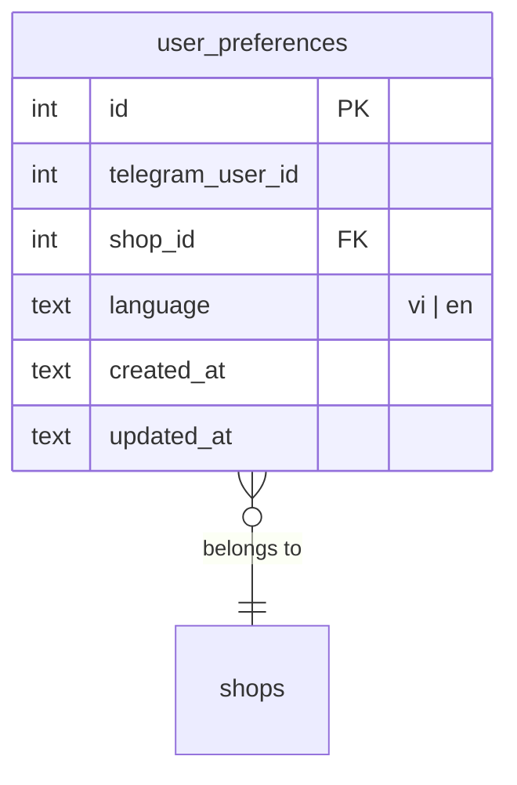
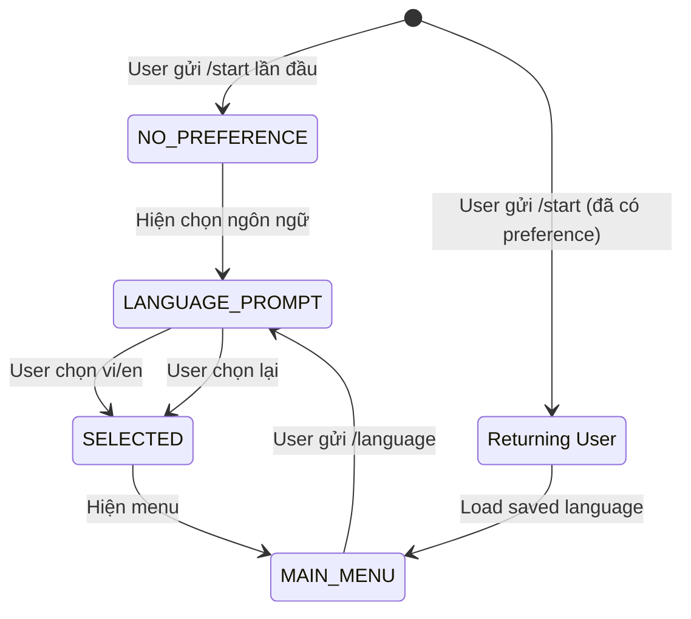

# Feature: Language Selection (F-11)

**BE Tech Spec:** [feature_language_selection_tech.md](../BE/feature_language_selection_tech.md)
**Priority:** P1
**Status:** 📝 Drafting

---

## 1. Mô tả

Khi user chat với bot **lần đầu tiên** (gửi `/start`), bot hỏi user muốn sử dụng **tiếng Việt** hay **English**. Lựa chọn được lưu per user và áp dụng cho toàn bộ messages, buttons, notifications từ bot.

### Nguyên tắc cốt lõi

- Language prompt **chỉ hiện 1 lần** — lần đầu user interact với bot
- User có thể **đổi ngôn ngữ** bất kỳ lúc nào qua `/language` hoặc button trong menu
- Mặc định **tiếng Việt** nếu user không chọn (fallback)
- Ngôn ngữ lưu **per user per bot** (cùng 1 user ở 2 shop khác nhau có thể chọn ngôn ngữ khác)
- Bot messages, buttons, error messages, notifications **đều đa ngôn ngữ**
- Admin dashboard **không ảnh hưởng** — dashboard luôn tiếng Việt

### Translation Strategy: Hybrid Approach

Bot content chia 3 tầng, mỗi tầng xử lý khác nhau:

| Tầng | Loại content | Cơ chế | Ví dụ |
|------|-------------|--------|-------|
| **🔧 Tầng 1: UI Text** | Buttons, prompts, labels, errors — text cố định, biết trước | **Static locale files** (`vi.js` + `en.js`) | "Chọn số lượng:" → "Select quantity:" |
| **📦 Tầng 2: Admin Content** | Product names, descriptions, discount codes, credentials | **Giữ nguyên gốc** (không dịch) | "Tài khoản Netflix Premium 4K" giữ nguyên cả VI lẫn EN |
| **📝 Tầng 3: Dynamic Messages** | Messages chứa data (giá, mã đơn, tên SP...) | **Template locale + data interpolation** | `t('order_info', lang, { code, product, amount })` |

> **Tại sao không auto-translate (Google Translate API)?**
> - Thêm latency (+200-500ms/message), chi phí ($20/1M ký tự), dependency vào external API
> - Chất lượng dịch ~90%, dịch sai ngữ cảnh bán hàng
> - Chỉ ~70 strings cần dịch thủ công, effort 1 lần

---

## 2. Use Cases + Edge Cases

### Use Cases

| # | Actor | Hành động | Kết quả |
|---|-------|-----------|---------|
| 1 | User mới | Gửi `/start` lần đầu | Bot hiện welcome + language selection buttons |
| 2 | User mới | Chọn "🇻🇳 Tiếng Việt" | Lưu `vi`, hiện main menu tiếng Việt |
| 3 | User mới | Chọn "🇬🇧 English" | Lưu `en`, hiện main menu tiếng Anh |
| 4 | User cũ | Gửi `/start` lại (đã chọn ngôn ngữ) | Hiện main menu theo ngôn ngữ đã lưu, KHÔNG hỏi lại |
| 5 | User cũ | Gửi `/language` | Hiện lại language selection, cho phép đổi |
| 6 | User cũ | Đổi ngôn ngữ từ VI → EN | Cập nhật DB, reply confirm bằng ngôn ngữ mới |
| 7 | User cũ | Nhấn "🌐 Ngôn ngữ / Language" trong menu | Hiện language selection |
| 8 | User | Đang giữa purchase flow → đổi ngôn ngữ | Ngôn ngữ áp dụng ngay cho messages tiếp theo |
| 9 | Admin | Xem order từ user EN | Order data giữ nguyên (VND, product names gốc) |
| 10 | System | User interact nhưng DB chưa có record | Fallback `vi`, tạo record mới |

### Flow: First-Time Interaction

```
User gửi /start (lần đầu)
     ↓
Bot kiểm tra DB: user_preferences WHERE telegram_user_id = ?
     ↓ (không tìm thấy)
Bot hiển thị:
  ┌─────────────────────────────────────┐
  │  👋 Xin chào! / Hello!             │
  │                                     │
  │  Vui lòng chọn ngôn ngữ:           │
  │  Please select your language:       │
  │                                     │
  │  [🇻🇳 Tiếng Việt]  [🇬🇧 English]   │
  └─────────────────────────────────────┘
     ↓ (user chọn)
Bot lưu preference → hiện main menu
```

### Flow: Returning User

```
User gửi /start (đã có preference)
     ↓
Bot kiểm tra DB: language = 'vi' hoặc 'en'
     ↓
Hiện main menu bằng ngôn ngữ đã lưu (KHÔNG hỏi lại)
```

### Edge Cases

#### User-side

| # | Category | Case | Xử lý |
|---|----------|------|-------|
| 1 | UX | User không chọn ngôn ngữ, gửi text/command khác | Bot nhắc lại language selection. Block các flow khác cho đến khi chọn |
| 2 | UX | User gửi `/start` rồi thoát, quay lại sau | Language prompt vẫn hiện (chưa lưu preference) |
| 3 | Data Integrity | User interact ở 2 bots khác nhau (2 shops) | Mỗi shop lưu preference riêng (per user per shop) |
| 4 | Concurrency | User click language button 2 lần nhanh | Idempotent: save cùng value, reply 1 lần |
| 5 | UX | User đổi ngôn ngữ giữa purchase flow | Ngôn ngữ áp dụng ngay từ message tiếp theo. Đơn pending giữ nguyên data |

#### Admin-side

| # | Category | Case | Xử lý |
|---|----------|------|-------|
| 6 | Data Integrity | Product names chỉ có 1 ngôn ngữ | Hiển thị product name gốc (không dịch). Chỉ UI text dịch |
| 7 | Cross-Feature | Discount code messages | Dịch template messages, giữ code/numbers gốc |
| 8 | Cross-Feature | Email delivery messages | Dịch notification text, giữ credentials gốc |
| 9 | Cross-Feature | Admin bot notifications (payment received) | Admin notifications luôn tiếng Việt (không ảnh hưởng) |
| 10 | Data Integrity | Thêm ngôn ngữ mới sau này (ví dụ: Chinese) | i18n structure hỗ trợ mở rộng, thêm locale file |

---

## 3. Screens & States

### 3.1 Bot — Language Selection (First-Time)

| State | Hiển thị |
|-------|----------|
| **Ready** | Bilingual welcome message + 2 language buttons |
| **Loading** | N/A (instant) |
| **Error** | N/A (fallback vi nếu DB lỗi) |
| **Empty** | N/A |

### 3.2 Bot — Language Switch (via /language hoặc menu)

| State | Hiển thị |
|-------|----------|
| **Ready** | "Chọn ngôn ngữ / Select language:" + 2 buttons + checkmark ✅ trên lang hiện tại |
| **Confirmed** | "✅ Đã chuyển sang Tiếng Việt" HOẶC "✅ Switched to English" |

### 3.3 Bot — Main Menu (Bilingual)

**Tiếng Việt:**
```
🛍 Menu Sản Phẩm
📋 Đơn Hàng Của Tôi
🌐 Ngôn ngữ
```

**English:**
```
🛍 Products
📋 My Orders
🌐 Language
```

### 3.4 Translation Strategy Detail

#### Tầng 1: Static UI Text — Full Locale Catalog

**Menu & Navigation (~8 strings)**

| Key | 🇻🇳 Tiếng Việt | 🇬🇧 English |
|-----|----------------|------------|
| `welcome` | Chào mừng bạn đến với {shopName}! | Welcome to {shopName}! |
| `select_language` | Vui lòng chọn ngôn ngữ: / Please select your language: | *(same — bilingual)* |
| `language_set_vi` | ✅ Đã chuyển sang Tiếng Việt | *(not used for EN)* |
| `language_set_en` | *(not used for VI)* | ✅ Switched to English |
| `menu_products` | 🛍 Menu Sản Phẩm | 🛍 Products |
| `menu_orders` | 📋 Đơn Hàng Của Tôi | 📋 My Orders |
| `menu_language` | 🌐 Ngôn ngữ | 🌐 Language |
| `main_menu` | 🏠 Menu chính | 🏠 Main Menu |

**Product Browsing (~6 strings)**

| Key | 🇻🇳 | 🇬🇧 |
|-----|------|------|
| `select_category` | 📂 Chọn danh mục: | 📂 Select category: |
| `select_product` | 🛍 Chọn sản phẩm: | 🛍 Select a product: |
| `product_detail` | 📋 Chi tiết sản phẩm | 📋 Product Details |
| `product_price` | 💰 Giá: {price} | 💰 Price: {price} |
| `product_stock` | 📦 Còn: {count} | 📦 In stock: {count} |
| `btn_buy_now` | 🛒 Mua ngay | 🛒 Buy Now |

**Purchase Flow (~12 strings)**

| Key | 🇻🇳 | 🇬🇧 |
|-----|------|------|
| `select_quantity` | Chọn số lượng: | Select quantity: |
| `enter_custom_qty` | Nhập số lượng muốn mua: | Enter the quantity you want: |
| `enter_email` | 📧 Nhập email nhận sản phẩm: | 📧 Enter your email: |
| `enter_discount` | 🏷 Nhập mã giảm giá (hoặc bỏ qua): | 🏷 Enter discount code (or skip): |
| `btn_skip` | Bỏ qua ▶ | Skip ▶ |
| `discount_applied` | ✅ Giảm {amount} — Tổng: {total} | ✅ Discount {amount} — Total: {total} |
| `payment_select` | 💳 Chọn phương thức thanh toán: | 💳 Select payment method: |
| `btn_vietqr` | 🏦 Chuyển khoản (VietQR) | 🏦 Bank Transfer (VietQR) |
| `btn_usdt` | 💰 USDT (TRC20) | 💰 USDT (TRC20) |
| `btn_paypal` | 💳 PayPal | 💳 PayPal |
| `cancel_order` | ❌ Hủy đơn | ❌ Cancel Order |
| `confirm_cancel` | Bạn có chắc muốn hủy đơn? | Are you sure you want to cancel? |

**Payment Stage (~15 strings)**

| Key | 🇻🇳 | 🇬🇧 |
|-----|------|------|
| `payment_qr_title` | 💳 Thanh toán chuyển khoản | 💳 Bank Transfer Payment |
| `payment_qr_bank` | 🏦 Ngân hàng: {bank} | 🏦 Bank: {bank} |
| `payment_qr_account` | 💳 STK: {account} | 💳 Account: {account} |
| `payment_qr_owner` | 👤 Chủ TK: {name} | 👤 Account holder: {name} |
| `payment_qr_amount` | 💰 Số tiền: {amount} | 💰 Amount: {amount} |
| `payment_qr_content` | 📝 Nội dung CK: {code} | 📝 Transfer note: {code} |
| `payment_qr_warning` | ⚠️ Vui lòng chuyển đúng nội dung! | ⚠️ Please use the exact transfer note! |
| `payment_qr_expire` | ⏱ Hết hạn sau: {time} | ⏱ Expires in: {time} |
| `payment_usdt_title` | 💰 Thanh toán USDT (TRC20) | 💰 USDT Payment (TRC20) |
| `payment_usdt_amount` | Số tiền: {amount} USDT | Amount: {amount} USDT |
| `payment_usdt_network_warn` | ⚠️ Chỉ gửi USDT qua mạng TRC20! Gửi sai mạng = MẤT TIỀN! | ⚠️ Send USDT via TRC20 network ONLY! Wrong network = LOST FUNDS! |
| `payment_paypal_title` | 💳 Thanh toán PayPal | 💳 PayPal Payment |
| `payment_paypal_btn` | 🔗 Thanh toán qua PayPal | 🔗 Pay with PayPal |
| `payment_paypal_note` | Sau khi thanh toán xong, quay lại đây để nhận sản phẩm. | After payment, return here to receive your product. |
| `payment_confirming` | ⏳ Đang chờ xác nhận trên blockchain... | ⏳ Waiting for blockchain confirmation... |

**Order Status & Delivery (~12 strings)**

| Key | 🇻🇳 | 🇬🇧 |
|-----|------|------|
| `order_created` | ✅ Đơn hàng đã tạo! | ✅ Order created! |
| `payment_received` | ✅ Đã nhận thanh toán! Đang gửi sản phẩm... | ✅ Payment received! Delivering your product... |
| `order_delivered` | 📦 Đã giao sản phẩm! | 📦 Product delivered! |
| `order_expired` | ⏰ Đơn hàng đã hết hạn thanh toán | ⏰ Order payment has expired |
| `order_cancelled` | ❌ Đơn hàng đã bị hủy | ❌ Order has been cancelled |
| `delivery_invite` | ⏳ Admin đang xử lý, sẽ thông báo khi hoàn tất | ⏳ Admin is processing, you'll be notified when done |
| `delivery_preorder` | ⏳ Sẽ giao trong {hours} giờ | ⏳ Will be delivered in {hours} hours |
| `delivery_stock_out` | ⚠️ Tạm hết stock, admin sẽ liên hệ sớm | ⚠️ Temporarily out of stock, admin will contact you soon |
| `btn_buy_more` | 🛍 Mua thêm | 🛍 Buy More |
| `order_history_empty` | Chưa có đơn hàng nào | No orders yet |
| `btn_view_products` | 🛍 Xem sản phẩm | 🛍 View Products |
| `order_detail_title` | 📋 Chi tiết đơn #{code} | 📋 Order #{code} Details |

**Error Messages (~8 strings)**

| Key | 🇻🇳 | 🇬🇧 |
|-----|------|------|
| `out_of_stock` | ❌ Sản phẩm đã hết hàng | ❌ Product is out of stock |
| `max_purchase` | Bạn đã mua tối đa {n} sản phẩm này | You've reached the max limit of {n} for this product |
| `max_purchase_remaining` | Chỉ có thể mua thêm {n} | You can only buy {n} more |
| `invalid_discount` | ❌ Mã giảm giá không hợp lệ | ❌ Invalid discount code |
| `underpaid` | ⚠️ Số tiền chưa đủ. Vui lòng CK thêm {amount} | ⚠️ Insufficient amount. Please transfer {amount} more |
| `invalid_quantity` | ❌ Số lượng không hợp lệ | ❌ Invalid quantity |
| `invalid_email` | ❌ Email không hợp lệ | ❌ Invalid email address |
| `shop_not_configured` | ⚠️ Shop chưa sẵn sàng bán hàng | ⚠️ Shop is not ready for sales |

> **Tổng: ~61 strings** — dịch 1 lần, maintain khi thêm feature mới

#### Tầng 2: Admin Content — Giữ nguyên gốc

Các nội dung admin tạo **KHÔNG dịch**, hiển thị y nguyên cho cả VI và EN:

- Product names: `"Tài khoản Netflix Premium 4K"`
- Product descriptions
- Category names
- Discount code labels
- Credential data (username, password, links)
- Bank account info (tên chủ TK, tên ngân hàng)

> **Tương lai (optional)**: Admin có thể thêm field `name_en` cho product nếu muốn hỗ trợ khách EN tốt hơn.

#### Tầng 3: Dynamic Messages — Template + Interpolation

Message chứa data biến động → dùng **template locale** với `{param}` placeholder:

```
// Template trong locale file:
order_info: '📋 Đơn #{code}\n🛍 SP: {product}\n💰 Tổng: {amount}\n⏱ Hạn: {expiry}'

// Runtime call:
t('order_info', lang, {
  code: 'ORD1710567890',
  product: 'Netflix Premium 4K',    // ← giữ nguyên (Tầng 2)
  amount: '65,000đ',                // ← data, không dịch
  expiry: '29:58'
})

// Output VI:
📋 Đơn #ORD1710567890
🛍 SP: Netflix Premium 4K
💰 Tổng: 65,000đ
⏱ Hạn: 29:58

// Output EN:
📋 Order #ORD1710567890
🛍 Product: Netflix Premium 4K
💰 Total: 65,000đ
⏱ Expires: 29:58
```

---

## 4. Domain Model



---

## 5. API Endpoints

> Tính năng này chạy hoàn toàn trong bot handlers, **không có REST API**. Data access qua database.js functions.

| Function | Mô tả |
|----------|-------|
| `getUserLanguage(userId, shopId)` | Lấy ngôn ngữ user (trả 'vi' nếu chưa có) |
| `setUserLanguage(userId, shopId, lang)` | Lưu/update ngôn ngữ |
| `t(key, lang, params?)` | Translation function: lấy string theo key + lang |

---

## 6. Error Codes

### Bot Messages

| Trigger | 🇻🇳 | 🇬🇧 |
|---------|------|------|
| Product hết hàng | Sản phẩm đã hết hàng | Product is out of stock |
| Đơn hết hạn | Đơn hàng đã hết hạn thanh toán | Order payment has expired |
| Đã mua tối đa | Bạn đã mua tối đa {N} sản phẩm này | You've reached the max purchase limit of {N} |
| Mã giảm giá sai | Mã giảm giá không hợp lệ | Invalid discount code |
| CK thiếu tiền | Số tiền chưa đủ. Vui lòng CK thêm | Insufficient amount. Please transfer the remaining |

> Tất cả bot error messages cần có bản dịch EN trong locale file.

---

## 7. Analytics Events

| Event | Trigger | Properties |
|-------|---------|-----------|
| `language_prompt_shown` | Hiện language selection (first time) | `{ userId, shopId }` |
| `language_selected` | User chọn ngôn ngữ lần đầu | `{ userId, language, isFirstTime: true }` |
| `language_changed` | User đổi ngôn ngữ | `{ userId, from, to }` |
| `language_fallback` | DB lỗi, dùng default | `{ userId, fallbackLang: 'vi' }` |

---

## 8. State Machine



---

## 9. Caching Strategy

| Data | Cache | TTL |
|------|-------|-----|
| User language preference | In-memory Map per bot instance | Session lifetime |
| Translation strings | Loaded once at startup | App lifetime |

> Cache invalidate khi user đổi ngôn ngữ. Translation files load từ JSON/JS objects.

---

## 10. Acceptance Criteria

- [ ] User lần đầu gửi `/start` → hiện **bilingual welcome** + language buttons
- [ ] Chọn ngôn ngữ → lưu DB → hiện main menu theo ngôn ngữ đã chọn
- [ ] User cũ gửi `/start` → **không hỏi lại**, vào thẳng main menu
- [ ] `/language` command → hiện lại language selection (cho phép đổi)
- [ ] "🌐 Ngôn ngữ / Language" button trong main menu
- [ ] Toàn bộ bot messages, buttons, notifications **đều dịch** theo ngôn ngữ user
- [ ] Product names, discount codes, credentials **giữ nguyên** (không dịch content)
- [ ] Admin notifications **luôn tiếng Việt**
- [ ] Fallback `vi` khi chưa chọn hoặc DB lỗi
- [ ] i18n structure hỗ trợ thêm ngôn ngữ mới

---

## State Coverage Matrix

| Screen | Loading | Ready/Data | Error | Empty |
|--------|---------|-----------|-------|-------|
| Language Selection (first-time) | N/A | ✅ Bilingual welcome + buttons | N/A (fallback vi) | N/A |
| Language Switch (/language) | N/A | ✅ Buttons + ✅ current lang | N/A (fallback vi) | N/A |
| Main Menu (vi) | N/A | ✅ Vietnamese menu | N/A | N/A |
| Main Menu (en) | N/A | ✅ English menu | N/A | N/A |
