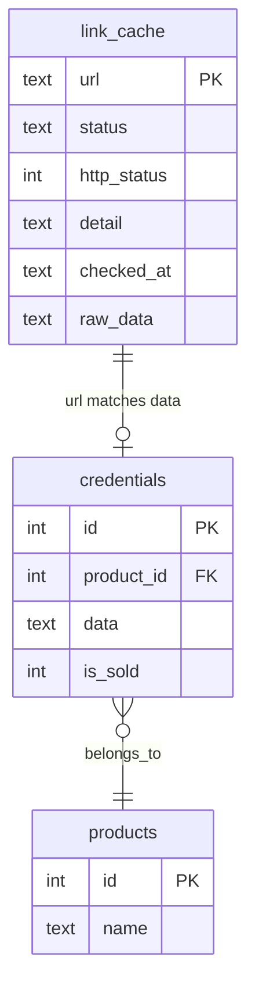
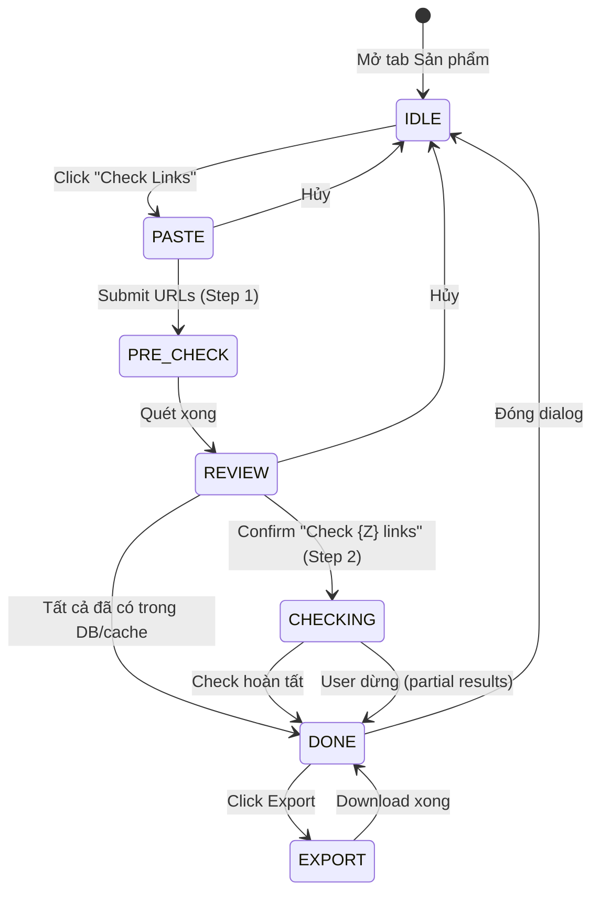

# Feature: Credential Link Checker (F-10)

**BE Tech Spec:** [feature_link_checker_tech.md](../BE/feature_link_checker_tech.md)
**Priority:** P1
**Status:** ✅ Done (v2.2)

---

## 1. Mô tả

Kiểm tra trạng thái link credential hàng loạt (batch ≤100) qua admin panel. Sử dụng 2-step flow tiết kiệm chi phí: **Step 1** quét DB + cache miễn phí (instant) → **Step 2** xác nhận → check ScraperAPI (tốn credits). Kết quả cache trong SQLite persistent, hỗ trợ export CSV.

**Entry point:** Admin Panel → Tab "Sản phẩm" → Chọn SP → Nút "Check Links"

---

## 2. Use Cases + Edge Cases

### Use Cases

| # | Actor | Hành động | Kết quả |
|---|-------|-----------|---------|
| 1 | Admin | Click "🔍 Check Links" trên sản phẩm | Dialog mở, paste links textarea |
| 2 | Admin | Paste links + Click "Quét" | Step 1: DB/cache scan → kết quả sơ bộ |
| 3 | Admin | Click "Check {Z} links" sau sơ bộ | Step 2: ScraperAPI check → kết quả cuối |
| 4 | Admin | Credential URL/login hợp lệ | ✅ badge + last_checked update |
| 5 | Admin | Credential URL return 404/invalid | ❌ badge + error message |
| 6 | Admin | Kiểm tra khi ScraperAPI rate limit | 429 → retry with backoff, toast warning |
| 7 | Admin | Export CSV sau khi check xong | Download CSV batch hiện tại hoặc lịch sử |
| 8 | System | Cached result < 24h, check lại | Return cached result, skip API call |
| 9 | Co-Admin | Mở tab Sản phẩm, **không có** `link_checker_use` permission | Nút "Check Links" **ẩn hoàn toàn** (không render) |
| 10 | Co-Admin | Mở tab Sản phẩm, **có** `link_checker_use` permission | Nút "Check Links" hiện bình thường, flow giống Owner |
| 11 | Admin | Click "Check Links" nhưng **shop bị tắt** Link Checker bởi platform | Dialog hiện banner 🔒 "Link Checker đã bị tắt bởi quản trị viên" + chỉ nút Đóng, textarea disabled |
| 12 | Admin | Click "Check Links" nhưng **global** Link Checker bị tắt | Giống UC-11, banner "Link Checker hiện không khả dụng" |
| 13 | Admin | Check links khi **quota hết** (checker_daily_quota đã dùng hết) | Step 2 bị block: toast warning "Đã hết quota kiểm tra hôm nay ({quota}/{quota})" + chỉ hiện pre-check results |
| 14 | Super Admin | Feature Config → tắt Link Checker cho 1 shop | Shop đó: nút "Check Links" gọi API → 403, dialog hiện banner disabled |

### Edge Cases

| # | Category | Case | Xử lý |
|---|----------|------|-------|
| 1 | Validation | Paste 0 links (textarea rỗng) | Disable nút "Quét", inline hint "Paste ít nhất 1 link" |
| 2 | Validation | Paste > 100 links | Inline error: "Tối đa 100 links mỗi lần", trim excess |
| 3 | Validation | Link format invalid (không phải URL) | Filter bỏ qua silently, counter hiện "Đã bỏ qua {N} link không hợp lệ" |
| 4 | Data Integrity | Tất cả link đã có trong DB/cache | Ẩn nút "Check", hiện "✅ Tất cả link đã có trong kho" + chỉ nút Đóng |
| 5 | Data Integrity | ScraperAPI tất cả tiers fail cho 1 link | Trả về kết quả phân tích cuối cùng (URL analysis), badge "❓ Unknown" |
| 6 | Security | ScraperAPI key không có | Fallback: chỉ HTTP fetch (không render JS), toast warning "Check chế độ giới hạn" |
| 7 | Concurrency | Admin check 2 batch cùng lúc | Disable nút "Check Links" khi đang có batch running, toast "Đang xử lý batch khác" |
| 8 | Cross-Feature | Link đã giao cho khách (isSold=1) | Hiện badge "🛒 Đã bán" bên cạnh "📦 Trong kho" |
| 9 | Data Integrity | ScraperAPI rate limit | Retry với exponential backoff (3 lần), cuối cùng mark "unknown" |
| 10 | UX | User đóng dialog giữa lúc checking | Confirm dialog "Đang kiểm tra, bạn có muốn dừng?" — Cancel stops, Continue keeps going |
| 11 | Security | Platform global disable → shop gọi check-links API | 403 `CHECKER_GLOBALLY_DISABLED` — FE hiện banner locked |
| 12 | Security | Shop feature flag disabled → gọi check-links API | 403 `CHECKER_DISABLED_FOR_SHOP` — FE hiện banner locked |
| 13 | Security | Co-Admin không có `link_checker_use` permission | FE ẩn nút; nếu gọi API trực tiếp → 403 `PERMISSION_DENIED` |
| 14 | Cross-Feature | Super Admin bật/tắt Link Checker cho shop đang online | Next API call của shop → check lại flag. Nếu tắt: 403 ngay |
| 15 | Data Integrity | Quota hết giữa batch (đang check url thứ 15/20, quota = 0) | Dừng batch, trả partial results (15 done + 5 skipped as "quota_exceeded") |
| 16 | Cross-Feature | CTV (Telegram) cố truy cập link checker | CTV không có quyền, nút ẩn. API: 403 `PERMISSION_DENIED` |

---

## 3. Screens & States

### Screen 1: Paste Links Dialog

**Layout:** Modal overlay (480px width)

| Element | Mô tả |
|---------|-------|
| **Header** | "🔍 Kiểm tra link - {product_name}" + nút ✕ |
| **Textarea** | 400px × 200px, placeholder "Paste links vào đây (mỗi dòng 1 link, tối đa 100)..." |
| **Counter** | Góc dưới phải textarea: "{N}/100 links" (xám) |
| **Error hint** | Dưới textarea, đỏ, hiện khi > 100 links |
| **Footer** | [Hủy] (secondary) + [🔍 Quét] (primary, disabled khi 0 links) |

| State | Hiển thị |
|-------|---------|
| **Ready** | Textarea rỗng, nút Quét disabled |
| **Has Input** | Counter hiện số links, nút Quét enabled |
| **Validating** | Counter đổi thành "Đang đếm..." (instant nên gần như không thấy) |
| **Error** | Counter đỏ "> 100 links" hoặc "0 link hợp lệ" |

### Screen 2: Pre-check Results (Step 1)

**Layout:** Modal mở rộng (600px width)

| Element | Mô tả |
|---------|-------|
| **Header** | "Kết quả quét sơ bộ" + nút ✕ |
| **Summary cards** | 3 cards ngang: 📦 {X} trong kho · 🕐 {Y} cached · ⬜ {Z} cần check |
| **Results table** | Bảng scroll (max-height 400px) |
| **Footer** | [Hủy] + [📥 Export] + [🔍 Check {Z} links] (primary) |

**Results table columns:**

| Column | Width | Data |
|--------|-------|------|
| # | 40px | Index (1, 2, 3...) |
| Link | fill | URL (truncated, monospace) |
| Nguồn | 100px | Badge: 📦 Trong kho / 🕐 Cache / ⬜ Mới |
| Status | 100px | Badge (nếu cached/DB) hoặc "—" (nếu mới) |
| Chi tiết | 140px | Product name (DB) / checked_at (cache) / "Chờ check" (new) |

| State | Hiển thị |
|-------|---------|
| **Loading** | Skeleton table + "Đang quét kho..." spinner |
| **Results** | Bảng đầy đủ + summary cards |
| **All in DB** | Summary: "✅ Tất cả {X} link đã có trong kho" + ẩn nút Check, chỉ [Đóng] + [Export] |
| **Empty new** | Giống All in DB nhưng hiện cached results |

### Screen 3: Checking Progress (Step 2)

**Layout:** Giữ nguyên modal, disable close

| Element | Mô tả |
|---------|-------|
| **Header** | "🔍 Đang kiểm tra..." (không có nút ✕) |
| **Progress bar** | Full-width, animated, fill theo % hoàn tất |
| **Progress text** | "Đang kiểm tra {current}/{total}..." |
| **Current URL** | Monospace, truncated, opacity 0.6 |
| **Cancel button** | [Dừng kiểm tra] (ghost/danger) — hiện confirm |

| State | Hiển thị |
|-------|---------|
| **Checking** | Progress bar animated + counter + current URL |
| **Cancel confirm** | Overlay: "Dừng kiểm tra? Kết quả đã check sẽ được giữ lại" + [Tiếp tục] [Dừng] |

### Screen 4: Final Results

**Layout:** Modal mở rộng (700px width)

| Element | Mô tả |
|---------|-------|
| **Header** | "✅ Kết quả kiểm tra — {product_name}" + nút ✕ |
| **Summary row** | 🟢 {A} Live · ❌ {B} Redeemed · ⏰ {C} Expired · 💀 {D} Dead · ❓ {E} Unknown |
| **Filter chips** | [Tất cả] [Live] [Redeemed] [Dead] [Unknown] — click filter bảng |
| **Results table** | Full results sorted: live first, then redeemed → expired → dead → unknown |
| **Footer** | [Đóng] + [📥 Export Excel] (primary) |

**Results table columns:**

| Column | Width | Data |
|--------|-------|------|
| # | 40px | Index |
| Link | fill | Full URL (monospace, copyable on click) |
| Status | 100px | Badge color-coded (xem bảng badges) |
| HTTP | 60px | Status code (200, 404, etc) |
| Chi tiết | 180px | Analysis detail text |
| Nguồn | 80px | scraper / cache / db |

### Status Badges

| Status | Badge | Background | Text Color |
|--------|-------|-----------|------------|
| live | ✅ Live | success-bg (#22c55e1A) | success (#22c55e) |
| redeemed | ❌ Redeemed | danger-bg (#ef44441A) | danger (#ef4444) |
| expired | ⏰ Expired | warning-bg (#f59e0b1A) | warning (#f59e0b) |
| dead | 💀 Dead | muted-bg (#64748b1A) | text-muted (#64748b) |
| unknown | ❓ Unknown | warning-bg (#f59e0b1A) | warning (#f59e0b) |
| DB duplicate | 📦 Trong kho | info-bg (#3b82f61A) | info (#3b82f6) |
| DB sold | 🛒 Đã bán | danger-bg (#ef44441A) | danger (#ef4444) |
| Cached | 🕐 Cache | primary-subtle (#6366f11A) | primary (#8b5cf6) |

---

## 4. Domain Model



---

## 5. API Endpoints

### POST `/api/admin/credentials/check-links`

**Headers:** `x-api-key: {ADMIN_API_KEY}`

**Request:**

```json
{
  "urls": ["https://claude.ai/redeem/abc123", "..."],
  "productId": 1
}
```

**Response 200:**

```json
{
  "results": [
    {
      "url": "https://claude.ai/redeem/abc123",
      "status": "live",
      "httpStatus": 200,
      "detail": "Valid redemption page",
      "source": "scraper"
    }
  ],
  "dbDuplicates": [
    {
      "url": "https://claude.ai/redeem/xyz",
      "productName": "Claude Pro",
      "isSold": 0,
      "credentialId": 123,
      "orderId": null
    }
  ],
  "cached": [
    {
      "url": "https://chatgpt.com/redeem/old",
      "status": "redeemed",
      "checkedAt": "2026-03-15T10:00:00Z"
    }
  ]
}
```

### GET `/api/admin/credentials/link-cache`

**Headers:** `x-api-key: {ADMIN_API_KEY}`
**Response:** CSV file download (toàn bộ cache entries)

---

## 6. Error Codes

| Code | Message | Trigger |
|------|---------|---------|
| 400 | "URLs array is required" | Body thiếu urls |
| 400 | "Maximum 100 URLs per batch" | urls.length > 100 |
| 400 | "No valid URLs provided" | Sau filter, 0 URL hợp lệ |
| 401 | "Unauthorized" | API key sai/thiếu |
| 403 | `CHECKER_GLOBALLY_DISABLED` — "Link Checker hiện không khả dụng" | Global toggle OFF |
| 403 | `CHECKER_DISABLED_FOR_SHOP` — "Link Checker đã bị tắt cho shop này" | Shop feature flag OFF |
| 403 | `PERMISSION_DENIED` — "Bạn không có quyền sử dụng tính năng này" | Co-Admin thiếu `link_checker_use` / CTV |
| 429 | `CHECKER_QUOTA_EXCEEDED` — "Đã hết quota kiểm tra hôm nay" | `daily_used >= checker_daily_quota` |
| 500 | "Check failed" | Server internal error |

---

## 7. Analytics Events

| Event | Trigger | Properties |
|-------|---------|-----------|
| `link_checker_open_dialog` | Mở dialog check links | `{ productId, productName }` |
| `link_checker_paste_links` | Paste links vào textarea | `{ totalLinks, validLinks, invalidLinks }` |
| `link_checker_precheck_done` | Step 1 hoàn tất | `{ dbDuplicates, cached, newLinks }` |
| `link_checker_check_start` | Step 2 bắt đầu | `{ linksToCheck }` |
| `link_checker_check_done` | Step 2 hoàn tất | `{ live, redeemed, expired, dead, unknown, duration_ms }` |
| `link_checker_check_cancel` | User hủy giữa step 2 | `{ checked, remaining }` |
| `link_checker_export_batch` | Export CSV batch hiện tại | `{ totalResults }` |
| `link_checker_export_history` | Export toàn bộ cache | `{ totalCacheEntries }` |

---

## 8. State Machine



---

## 9. Caching Strategy

| Data | Cache Location | TTL | Invalidation |
|------|---------------|-----|-------------|
| Redeemed links | SQLite `link_cache` | ∞ (never re-check) | Manual only |
| Dead/Expired links | SQLite `link_cache` | 24 giờ | Auto-expire |
| Live links | SQLite `link_cache` | 15 phút | Auto-expire |
| Unknown links | SQLite `link_cache` | 5 phút | Auto-expire |
| DB duplicates | Real-time query | — | No cache |
| Pre-check results | In-memory (dialog) | Session | Dialog close |

**Lý do chọn TTL:**
- **Redeemed:** Link đã dùng sẽ không bao giờ live lại → cache vĩnh viễn
- **Live:** Có thể bị redeem bất cứ lúc nào → check lại sau 15 phút
- **Dead/Expired:** Ít thay đổi → check lại sau 24 giờ
- **Unknown:** Có thể do lỗi tạm → retry sớm (5 phút)

---

## 10. Acceptance Criteria

- [x] 2-step flow: pre-check (free) → confirm → ScraperAPI
- [x] DB duplicate detection: hiện product name, sold status
- [x] Cache: hiện status cũ + thời gian, respect TTL
- [x] Smart UI: ẩn nút "Check" khi 0 new links, hiện "Tất cả đã có" message
- [x] Progress indicator per-link (real-time counter + progress bar)
- [x] Export CSV: batch hiện tại + toàn bộ lịch sử
- [x] Batch limit ≤ 100 URLs với inline validation
- [x] Cancel mid-check: giữ partial results
- [x] Filter chips trên results table
- [x] Copyable URLs trên kết quả

---

## State Coverage Matrix

| Screen | Loading | Ready/Data | Error | Empty |
|--------|---------|-----------|-------|-------|
| Paste Dialog | N/A | ✅ Textarea + counter | ✅ Inline (>100, 0 valid) | N/A (always has textarea) |
| Pre-check Results | ✅ Skeleton + spinner | ✅ Summary + table | N/A (toast) | ✅ "Tất cả đã có trong kho" |
| Checking Progress | N/A | ✅ Progress bar + counter | N/A (toast) | N/A |
| Final Results | N/A | ✅ Summary + filtered table | N/A (toast) | N/A (always has results) |
