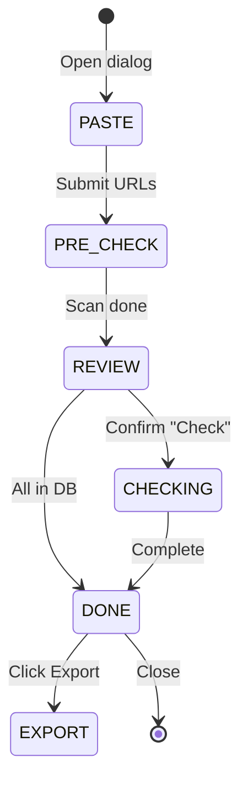

# Feature: Credential Link Checker (F-10)

**BE Tech Spec:** [feature_link_checker_tech.md](../BE/feature_link_checker_tech.md)
**Priority:** P1
**Status:** ✅ Done (v2.2)

---

## 1. Mô tả

Kiểm tra trạng thái link credential hàng loạt (batch ≤100) qua admin panel. 2-step flow: quét DB + cache miễn phí → xác nhận → check ScraperAPI. Kết quả cache trong SQLite persistent.

---

## 2. Use Cases

### UC-10.1: Check link batch

1. Admin vào tab Sản phẩm → chọn SP → "Check Links"
2. Paste links (1 per line, max 100)
3. **Step 1:** Quét DB (duplicates) + cache (kết quả cũ) — instant, free
4. Dialog hiện kết quả sơ bộ: X trong kho, Y cached, Z cần check
5. **Step 2:** Confirm → ScraperAPI check Z links mới
6. Hiển thị bảng kết quả: status + badges

### UC-10.2: Export CSV

1. Nút "Export Excel" sau khi check → download CSV batch hiện tại
2. Menu → "Tải lịch sử" → download toàn bộ cache history

### Edge Cases

| Case | Xử lý |
|------|-------|
| 0 link mới (tất cả DB/cache) | Ẩn nút "Check", hiện "Tất cả đã có trong kho" |
| ScraperAPI tất cả tiers fail | Hiện kết quả analyze cuối cùng |
| Link format invalid | Filter bỏ qua, không báo lỗi |

---

## 3. Screens & States

### Admin — Pre-check dialog

| State | Hiển thị |
|-------|---------|
| **Loading** | Progress: "Đang quét kho..." |
| **Results** | Bảng: 🟢 DB dups (xanh), 🟡 Cached (vàng), ⬜ New (trắng) |
| **All in DB** | "Tất cả link đã có trong kho" + chỉ nút Đóng |

### Admin — Check results

| State | Hiển thị |
|-------|---------|
| **Checking** | Progress per-link: "Checking 3/10..." |
| **Done** | Bảng kết quả + badges + nút Export |

### Status badges

| Status | Badge | Color |
|--------|-------|-------|
| live | ✅ Live | Green |
| redeemed | ❌ Redeemed | Red |
| expired | ⏰ Expired | Orange |
| dead | 💀 Dead | Gray |
| unknown | ❓ Unknown | Yellow |
| DB duplicate | 📦 Trong kho | Blue |
| Cached | 🕐 Cache | Purple |

---

## 4. State Machine

---

## 5. Acceptance Criteria

- [x] 2-step flow: pre-check (free) → confirm → ScraperAPI
- [x] DB duplicate: hiện SP name, sold status
- [x] Cache: hiện status cũ + thời gian
- [x] Smart UI: ẩn "Bỏ qua" khi 0 new, "Tất cả đã có" message
- [x] Export CSV batch + toàn bộ lịch sử
- [x] Progress indicator per-link
