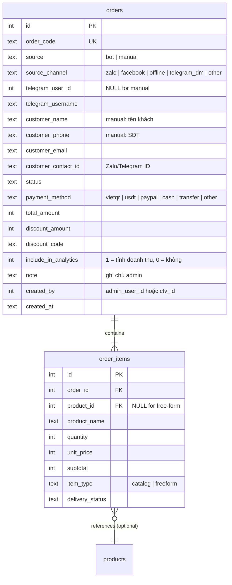
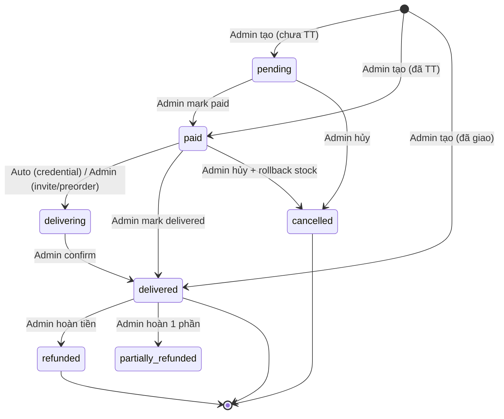

# Feature: Manual Order Entry (F-17)

**BE Tech Spec:** [feature_manual_order_tech.md](../BE/feature_manual_order_tech.md)
**Priority:** P2
**Status:** 📋 Planned

---

## 1. Mô tả

Cho phép Admin nhập đơn hàng từ các kênh ngoài hệ thống (Zalo, Facebook, offline, Telegram DM...) vào hệ thống để quản lý tập trung. Hỗ trợ 2 mode: chọn SP từ catalog (có trừ stock) hoặc nhập tự do (chỉ ghi nhận). Admin set trạng thái đơn trực tiếp khi tạo, chọn có/không tính vào doanh thu analytics.

**Entry point:** Admin Panel → Tab "Đơn hàng" → [＋ Tạo đơn thủ công]

---

## 2. Use Cases + Edge Cases

### Use Cases

| # | Actor | Hành động | Kết quả |
|---|-------|-----------|---------|
| 1 | Admin | Tạo đơn manual với SP từ catalog | Đơn tạo, stock trừ, credential gán (nếu credential type) |
| 2 | Admin | Tạo đơn manual nhập tự do (SP không trong catalog) | Đơn tạo, chỉ ghi nhận, không ảnh hưởng kho |
| 3 | Admin | Tạo đơn manual mixed (catalog + free-form items) | Đơn tạo, chỉ catalog items trừ stock |
| 4 | Admin | Tạo đơn với status = delivered ngay | Đơn tạo → delivered, credential auto-deliver (nếu catalog + credential type) |
| 5 | Admin | Tạo đơn chưa thanh toán (unpaid) | Đơn tạo status = pending, không giao hàng |
| 6 | Admin | Tạo đơn đã thanh toán (paid) | Đơn tạo status = paid hoặc delivered tùy chọn |
| 7 | Admin | Chọn không tính vào analytics | Đơn tạo với `include_in_analytics = false` |
| 8 | Admin | Chọn kênh bán = Zalo | Đơn ghi nhận `source_channel = 'zalo'` |
| 9 | Admin | Xem danh sách đơn → filter theo source | Đơn manual có badge riêng, filter được |
| 10 | Admin | Sửa đơn manual (thêm ghi chú, đổi status) | Update thành công |
| 11 | Admin | Xóa đơn manual | Soft delete, stock hoàn lại (nếu catalog items) |
| 12 | CTV | Tạo đơn manual (nếu có quyền) | Đơn ghi nhận `created_by = ctv_id` |

### Flow: Tạo Đơn Thủ Công

```
Admin click [＋ Tạo đơn thủ công]
     ↓
Modal mở → chọn kênh bán (Zalo / Facebook / Offline / Telegram DM / Khác)
     ↓
Thêm items: [Chọn từ catalog] hoặc [Nhập tự do]
  ├─ Catalog: Select SP → chọn SL → auto-fill giá
  └─ Free-form: Nhập tên SP + giá + SL
     ↓
Nhập thông tin khách (tùy chọn): tên, SĐT, email, Telegram/Zalo ID
     ↓
Chọn trạng thái: ◉ Chưa TT (pending) / ○ Đã TT (paid) / ○ Đã giao (delivered)
     ↓
Chọn PTTT: VietQR / USDT / PayPal / Tiền mặt / Chuyển khoản / Khác
     ↓
☐ Tính vào doanh thu (default: ON)
     ↓
Ghi chú (optional)
     ↓
[Tạo đơn] → Confirm dialog → Success toast
```

### Edge Cases

**Admin-side (tạo đơn manual):**

| # | Category | Case | Xử lý |
|---|----------|------|-------|
| 1 | Validation | Tạo đơn không có item nào | 400: "Vui lòng thêm ít nhất 1 sản phẩm" |
| 2 | Validation | Catalog item hết stock | Warning: "SP đã hết hàng" — vẫn cho tạo nếu type != credential |
| 3 | Validation | Catalog credential item hết stock | Block: "Không đủ credential trong kho" |
| 4 | Validation | Free-form item giá ≤ 0 | Inline error: "Giá phải lớn hơn 0" |
| 5 | Validation | Free-form item tên rỗng | Inline error: "Vui lòng nhập tên sản phẩm" |
| 6 | Concurrency | Admin tạo đơn, user khác mua last stock cùng lúc | SQLite single-writer, FIFO — ai tới trước lấy stock |
| 7 | Data Integrity | Xóa đơn manual có catalog items | Stock hoàn lại, credential un-assign |
| 8 | Data Integrity | Xóa đơn manual có free-form items | Soft delete, không ảnh hưởng kho |
| 9 | Cross-Feature | Đơn manual tính vào CTV commission | Chỉ nếu đơn gắn `ctv_id` + `include_in_analytics = true` |
| 10 | Cross-Feature | Đơn manual có discount code | Cho phép nhập mã — validate như đơn thường |
| 11 | Security | CTV tạo đơn manual fake | Audit trail: `created_by`, `created_at`, `source = 'manual'` |
| 12 | UX | Admin chọn status = delivered cho credential item | Auto-assign credential ngay, mark is_sold |

---

## 3. Screens & States

### Admin — Create Manual Order Modal

**Layout:** Modal 640px, scrollable, multi-step inline

| Element | Mô tả |
|---------|-------|
| **Header** | "📝 Tạo đơn thủ công" + [✕ Close] |
| **Kênh bán** | Select: Zalo / Facebook / Offline / Telegram DM / Khác |
| **Items section** | Dynamic list + [＋ Thêm từ catalog] [＋ Nhập tự do] |
| **Customer info** | Collapsible: Tên, SĐT, Email, Telegram/Zalo ID (all optional) |
| **Trạng thái** | Radio: ◉ Chưa thanh toán / ○ Đã thanh toán / ○ Đã giao |
| **PTTT** | Select: VietQR / USDT / PayPal / Tiền mặt / Chuyển khoản / Khác |
| **Tổng tiền** | Auto-calculated + manual override option |
| **☐ Tính vào doanh thu** | Checkbox (default: ON) |
| **Ghi chú** | Textarea (optional) |
| **Footer** | [Hủy] [Tạo đơn] (primary, disabled khi chưa có items) |

| State | Hiển thị |
|-------|---------|
| **Loading** | Skeleton form |
| **Ready** | Form đầy đủ, products loaded |
| **Error** | Toast "Không thể tải danh sách sản phẩm" |

### Catalog Item Selector

| Element | Mô tả |
|---------|-------|
| **Search** | "🔍 Tìm sản phẩm..." — filter by name |
| **Product list** | Dropdown: tên + giá + stock badge |
| **Selected** | Tên SP (bold) + giá (auto) + SL input [⬆️][⬇️] + [❌ Xóa] |

### Free-form Item Row

| Field | Type | Required? | Validation |
|-------|------|----------|------------|
| Tên SP | Text | ✅ | Không rỗng |
| Giá | Number | ✅ | > 0 |
| Số lượng | Number | ✅ | ≥ 1 |

### Admin — Orders Table (Updated)

**Thay đổi cho manual orders:**

| Element | Mô tả |
|---------|-------|
| **Source badge** | 🤖 Bot / 📝 Manual (kèm icon kênh) |
| **Channel icon** | 💬 Zalo / 📘 Facebook / 🏪 Offline / ✈️ Telegram / 📋 Khác |
| **Filter** | Dropdown: Tất cả / Bot / Manual |
| **Analytics badge** | 📊 (hiện nếu `include_in_analytics = true`) |

### Customer Info Fields (in modal)

| Field | Type | Required? | Default | Validation / Ghi chú |
|-------|------|----------|---------|---------------------|
| Tên khách | Text | Optional | `null` | Tên hiển thị |
| SĐT | Text | Optional | `null` | Số điện thoại |
| Email | Text (email) | Optional | `null` | Format email hợp lệ |
| Telegram/Zalo ID | Text | Optional | `null` | Username hoặc ID |

---

## 4. Domain Model



**Thay đổi so với schema hiện tại:**

| Field | Trước | Sau |
|-------|-------|-----|
| `orders.source` | N/A | ✅ Mới — `'bot'` (default) hoặc `'manual'` |
| `orders.source_channel` | N/A | ✅ Mới — kênh bán (manual only) |
| `orders.telegram_user_id` | `NOT NULL` | Nullable (manual orders might not have) |
| `orders.customer_name` | N/A | ✅ Mới |
| `orders.customer_phone` | N/A | ✅ Mới |
| `orders.customer_contact_id` | N/A | ✅ Mới |
| `orders.include_in_analytics` | N/A | ✅ Mới — default `1` |
| `orders.created_by` | N/A | ✅ Mới — admin/CTV who created |
| `orders.payment_method` | `vietqr\|usdt\|paypal` | + `cash`, `transfer`, `other` |
| `order_items.item_type` | N/A | ✅ Mới — `'catalog'` hoặc `'freeform'` |

---

## 5. API Endpoints

| Method | Path | Mô tả |
|--------|------|-------|
| POST | `/api/admin/orders/manual` | Tạo đơn manual |
| PUT | `/api/admin/orders/:id/manual` | Sửa đơn manual (status, note, customer) |
| DELETE | `/api/admin/orders/:id/manual` | Xóa đơn manual (soft delete) |
| GET | `/api/admin/orders?source=manual` | Filter đơn theo source |

---

## 6. Error Codes

### Admin API Errors

| Code | Error Code | Message | Trigger |
|------|-----------|---------|---------|
| 400 | `EMPTY_ITEMS` | "Vui lòng thêm ít nhất 1 sản phẩm" | Items array rỗng |
| 400 | `INVALID_FREEFORM_NAME` | "Vui lòng nhập tên sản phẩm" | Free-form item name rỗng |
| 400 | `INVALID_FREEFORM_PRICE` | "Giá phải lớn hơn 0" | Free-form price ≤ 0 |
| 400 | `INVALID_QUANTITY` | "Số lượng phải ≥ 1" | quantity < 1 |
| 400 | `CREDENTIAL_OUT_OF_STOCK` | "Không đủ {product_name} trong kho ({available}/{requested})" | Catalog credential hết stock |
| 400 | `INVALID_SOURCE_CHANNEL` | "Kênh bán không hợp lệ" | source_channel không trong enum |
| 400 | `INVALID_STATUS` | "Trạng thái không hợp lệ" | status không trong [pending, paid, delivered] |
| 404 | `PRODUCT_NOT_FOUND` | "Sản phẩm không tồn tại" | product_id invalid |
| 403 | `NOT_MANUAL_ORDER` | "Chỉ sửa/xóa được đơn thủ công" | Sửa/xóa đơn bot |
| 403 | `PERMISSION_DENIED` | "Không có quyền tạo đơn" | CTV không có quyền |

### Warning Toasts

| Type | Message | Trigger |
|------|---------|---------|
| ⚠️ Warning | "SP {name} đã hết hàng (invite/preorder)" | Catalog non-credential hết stock — vẫn cho tạo |
| ℹ️ Info | "Đơn không tính vào doanh thu" | `include_in_analytics = false` |

### Form Inline Errors

| Field | Validation | Inline error message |
|-------|-----------|---------------------|
| Kênh bán | Chưa chọn | "Vui lòng chọn kênh bán" |
| Items | Rỗng | "Thêm ít nhất 1 sản phẩm" |
| Tên SP (free-form) | Rỗng | "Nhập tên sản phẩm" |
| Giá (free-form) | ≤ 0 | "Giá phải lớn hơn 0" |
| SL | < 1 | "Số lượng phải ≥ 1" |
| Email khách | Format sai | "Email không hợp lệ" |

---

## 7. Analytics Events

| Event | Trigger | Data |
|-------|---------|------|
| `manual_order_created` | Tạo đơn thành công | `{ order_code, source_channel, item_count, total_amount, status, include_in_analytics }` |
| `manual_order_updated` | Sửa đơn manual | `{ order_code, changed_fields }` |
| `manual_order_deleted` | Xóa đơn manual | `{ order_code, had_catalog_items }` |
| `manual_order_filter_used` | Admin filter đơn theo source | `{ filter_value }` |

---

## 8. State Machine

Đơn manual dùng **subset** của state machine đơn bot:



**Khác biệt vs đơn bot:**
- Không có `expired` (không có countdown timer)
- Có thể skip trạng thái (tạo → delivered trực tiếp)
- Không auto-expire

---

## 9. Caching Strategy

- Product list cho selector: cache 5 phút (invalidate khi CRUD product)
- Manual orders không cần real-time update — standard pagination

---

## 10. Acceptance Criteria

| # | Tiêu chí | Kết quả mong đợi |
|---|---------|------------------|
| 1 | Admin tạo đơn manual catalog + status = delivered | Đơn tạo, credential auto-deliver, stock trừ |
| 2 | Admin tạo đơn manual free-form | Đơn tạo, không ảnh hưởng kho |
| 3 | Admin tạo đơn mixed (catalog + free-form) | Chỉ catalog items trừ stock |
| 4 | Admin tạo đơn `include_in_analytics = false` | Đơn không xuất hiện trong dashboard analytics |
| 5 | Filter đơn theo source = manual | Chỉ hiện đơn manual |
| 6 | Admin xóa đơn manual có catalog items | Stock hoàn lại |
| 7 | Source badge hiện đúng trên orders table | 🤖 Bot / 📝 Manual + icon kênh |
| 8 | CTV tạo đơn manual (có quyền) | `created_by` ghi nhận CTV |
| 9 | Credential hết stock → block tạo | 400 error message rõ ràng |
| 10 | Đơn manual status = paid + credential type | Auto-deliver credential |
