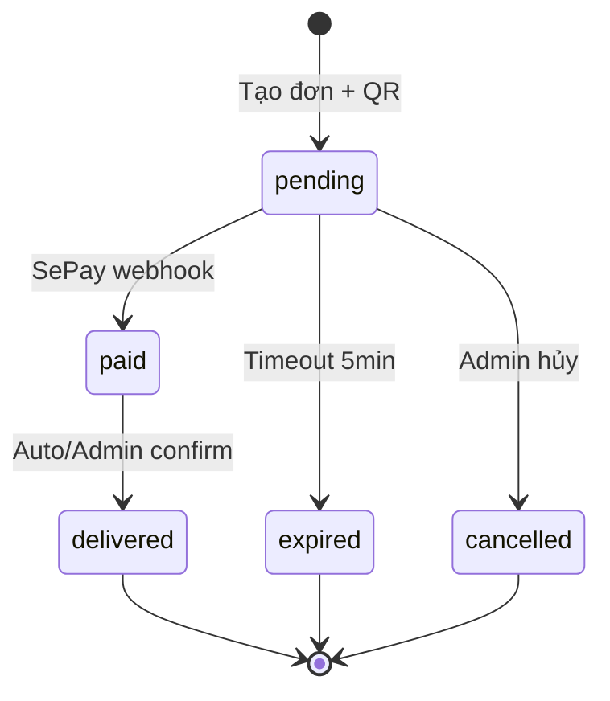

# Feature: Order Flow (F-02)

**BE Tech Spec:** [feature_order_flow_tech.md](../BE/feature_order_flow_tech.md)
**Priority:** P0
**Status:** ✅ Done (v1.0)

---

## 1. Mô tả

Luồng mua hàng trên Telegram bot: browse SP → chọn SL → email → mã giảm giá → QR payment → auto-deliver. Admin quản lý đơn qua dashboard.

---

## 2. Use Cases

### UC-2.1: Mua hàng (happy path)

1. `/products` → chọn category → chọn SP → xem chi tiết
2. "Mua ngay" → chọn SL (1, 2, 5, 10, custom)
3. Nhập email (nếu SP yêu cầu)
4. Mã giảm giá → nhập hoặc bỏ qua
5. Tạo đơn → hiển thị QR + countdown
6. Chuyển khoản → SePay webhook → giao hàng tự động

### UC-2.2: Đơn hết hạn

- Pending > 5 phút → auto-cancel + thông báo + restore stock

### UC-2.3: Admin xử lý thủ công

- Invite/preorder: admin nhấn confirm → delivered

### Edge Cases

| Case | Xử lý |
|------|-------|
| Hết stock khi tạo đơn | "Sản phẩm đã hết hàng" |
| Bot restart giữa flow | State mất → user bắt đầu lại |
| Thanh toán thiếu tiền | Không process (amount check) |

---

## 3. Screens & States

### Bot — Callback Flow

```
/products → [Category] → [Product] → [Mua ngay]
  → [Chọn SL] → [Email input] → [Mã giảm giá]
    → [Tạo QR] → [SePay webhook] → Credential delivered
```

### Bot — QR Payment

| State | Hiển thị |
|-------|---------|
| **Ready** | QR image + order code + amount + countdown |
| **Expired** | "Đơn hàng đã hết hạn thanh toán" |
| **Paid** | "Thanh toán thành công! Đang gửi sản phẩm..." |
| **Delivered** | Credential message (formatted by product fields) |

### Admin — Orders table

| State | Hiển thị |
|-------|---------|
| **Loading** | Skeleton table |
| **Data** | Table: Code, Customer, Product, Amount, Status, Actions |
| **Empty** | "Chưa có đơn hàng nào" |

### Admin — Order Actions

| Status | Product Type | Buttons |
|--------|-------------|---------|
| pending | any | ✅ Xác nhận, ❌ Hủy |
| paid | credential | (auto-delivered) |
| paid | invite | 📧 Đã invite |
| paid | preorder | 📦 Đã giao |
| delivered | any | 🔑 Xem, 🔄 Gửi lại, ⏰ Set hạn |

---

## 4. State Machine



---

## 5. Acceptance Criteria

- [x] Full purchase flow: browse → pay → receive
- [x] 3 product types: credential (auto), invite (manual), preorder (manual)
- [x] VietQR code + countdown timer
- [x] Auto-expire + stock restore
- [x] Admin: confirm, cancel, resend, set expiry
- [x] Discount integration in flow
