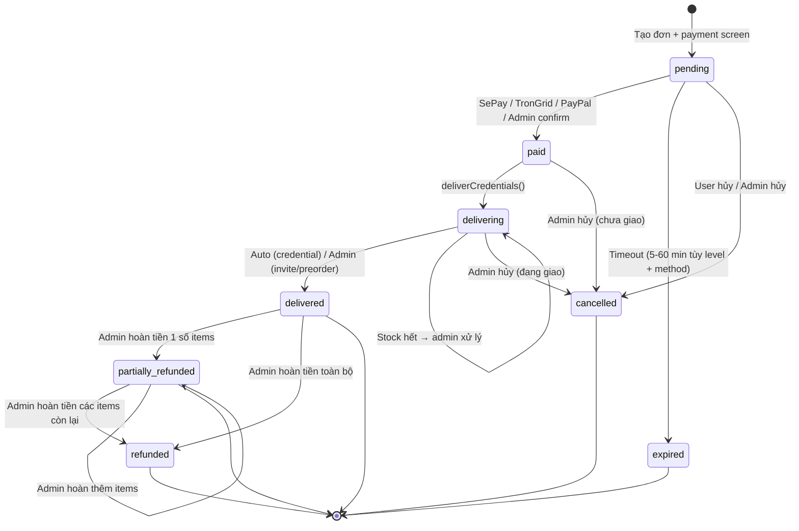
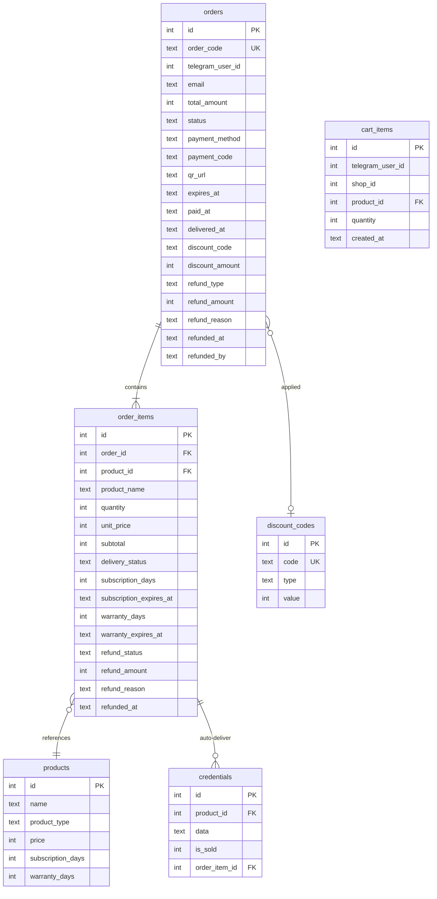

# Feature: Order Flow (F-02)

**BE Tech Spec:** [feature_order_flow_tech.md](../BE/feature_order_flow_tech.md)
**Priority:** P0
**Status:** ✅ Done (v1.1 — added SePay polling backup)

---

## 1. Mô tả

Luồng mua hàng trên Telegram bot: browse SP → **thêm vào giỏ hàng** → checkout → email → mã giảm giá → **chọn phương thức thanh toán** → payment → auto-deliver. Hỗ trợ **3 phương thức**: VietQR (SePay), USDT (TRC20), PayPal. Mỗi đơn có thể chứa **nhiều sản phẩm** (`order_items`), mỗi item có `subscription_days` và `warranty_days` riêng. Admin quản lý đơn qua dashboard + bot buttons. Hỗ trợ **đơn thủ công** từ kênh ngoài — xem [feature_manual_order.md](feature_manual_order.md).

> **Xem thêm:** [feature_international_payment.md](feature_international_payment.md) — chi tiết USDT & PayPal.

---

## 2. Use Cases

### UC-2.1: Mua hàng (happy path)

1. `/products` → chọn category → chọn SP → xem chi tiết
2. "🛒 Mua" → chọn SL (1, 2, 5, 10, custom) → **Mua ngay** hoặc **Thêm vào giỏ**
3. **Mua ngay** → email (nếu cần) → mã giảm giá → chọn PTTT → thanh toán
4. **Thêm vào giỏ** → tiếp tục mua hoặc **🛒 Xem giỏ hàng** → **Thanh toán**
5. Giỏ hàng: xem danh sách items + sửa/xóa + tổng tiền → **Thanh toán**
6. Nhập email (nếu có SP yêu cầu)
7. Mã giảm giá → nhập hoặc bỏ qua
8. **Chọn phương thức thanh toán** (VietQR / USDT / PayPal) — bỏ qua nếu shop chỉ có 1 method
9. Tạo đơn (1 order + N order_items) → hiển thị payment screen
10. Thanh toán 1 lần cho toàn bộ giỏ → auto-deliver từng item

### UC-2.2: Đơn hết hạn

- Pending > ORDER_EXPIRY_MINUTES (mặc định 5 phút) → auto-expire + thông báo user

### UC-2.3: Admin xử lý invite/preorder

- Invite: admin nhấn [✅ Đã invite] → delivered → notify user (tuỳ theo customer_fields)
- Preorder: admin nhấn [✅ Đã giao] sau khi hoàn tất → delivered → notify user

### UC-2.4: Xem lịch sử đơn hàng

- `/orders` → danh sách đơn (5/trang, phân trang) → click xem chi tiết

### UC-2.5: Webhook missed — Poller recovery

1. Khách CK thành công nhưng webhook fail (server restart, cold start, network)
2. Đơn vẫn `pending`, khách lo lắng
3. **Poller** chạy mỗi 2 phút → gọi SePay API lấy giao dịch hôm nay
4. Match `order_code` trong nội dung CK + verify `amount >= total`
5. Double-check đơn vẫn `pending` (tránh race condition với webhook)
6. Auto-confirm → deliver → notify khách + admin (ghi rõ "via POLLER")

**Admin action:** Không cần. Tự động. Admin chỉ nhận thông báo "xác nhận qua POLLER (webhook missed)".

### UC-2.6: Khách CK sai nội dung (unmatched transfer)

> **Bối cảnh:** QR auto-fill sẵn nội dung nhưng khách xóa/sửa → tiền vào tài khoản SePay nhưng không match được đơn nào.

**Flow:**

1. Khách quét QR → sửa/xóa nội dung CK → CK thành công
2. Tiền vào SePay → webhook bắn nhưng `content` không chứa `ORD...`
3. Webhook handler: không tìm thấy order_code → log `"No order code found"` → ignore
4. Poller: cũng không match vì `content` không chứa order_code
5. Đơn giữ `pending` → **hết hạn (5 phút) → auto-expire**
6. Khách mất tiền, không nhận được sản phẩm

**Bot → Khách:** "Đơn hàng đã hết hạn thanh toán" + [🛍 Mua hàng]
**Bot → Admin (stale alert):** "⚠️ Đơn #ORDxxx pending 10 phút, kiểm tra SePay"

**Admin action:**

1. Vào SePay dashboard → kiểm tra giao dịch "incoming" không rõ đơn
2. Đối chiếu số tiền + thời gian + username Telegram
3. Dashboard → tab Đơn hàng → tìm đơn expired tương ứng
4. Xác nhận thủ công (POST `/api/admin/orders/:code/confirm`) hoặc hoàn tiền

**Tỉ lệ xảy ra:** Thấp (~2-3%) — QR auto-fill sẵn, ít ai sửa nội dung.

### UC-2.7: Khách CK 2 lần (duplicate payment)

> **Bối cảnh:** Khách CK lần 1 → tưởng chưa thành công → CK lần 2.

**Flow:**

1. CK lần 1 → webhook/poller match → confirm đơn → deliver
2. CK lần 2 → webhook nhận → `getPendingOrderByCode()` trả null (đã paid) → ignore
3. Tiền lần 2 vào tài khoản nhưng không được xử lý

**Bot → Khách:** Chỉ nhận thông báo từ lần 1 (bình thường).
**Bot → Admin:** Không có alert gì cho lần 2 (gap hiện tại).

**Admin action:**

1. Kiểm tra SePay dashboard → thấy 2 giao dịch cùng nội dung
2. Hoàn khoản dư cho khách qua ngân hàng thủ công
3. Liên hệ khách qua Telegram (@username từ đơn hàng)

**Tỉ lệ xảy ra:** Rất thấp (~1%) — webhook/poller phản hồi nhanh, khách thấy "Đã xác nhận" trước khi kịp CK lần 2.

### UC-2.8: Khách CK sau khi đơn hết hạn (late payment)

> **Bối cảnh:** Đơn expire sau 5 phút, nhưng khách CK muộn (do chờ OTP, chuyển tiền chậm...).

**Flow:**

1. Đơn hết hạn → status chuyển `expired` → notify khách
2. Khách CK thành công (muộn) → tiền vào SePay
3. Webhook: `getPendingOrderByCode()` trả null (đơn expired, không phải pending) → ignore
4. Poller: chỉ query `status='pending'` → không match expired → ignore
5. Tiền vào tài khoản nhưng không xử lý

**Bot → Khách:** "Đơn hàng đã hết hạn" (từ bước 1, trước khi CK)
**Bot → Admin:** "⚠️ Đơn #ORDxxx pending 10 phút" (stale alert, nếu đơn pending lâu trước expire)

**Admin action:**

1. Kiểm tra SePay: có giao dịch match với order_code của đơn expired
2. Dashboard → tìm đơn expired → dùng **Xác nhận thủ công** (cần API/logic riêng để reopen expired order)
3. Hoặc: tạo đơn mới cho khách + giao hàng thủ công
4. Hoặc: hoàn tiền cho khách

**Tỉ lệ xảy ra:** Thấp (~3-5%) — phụ thuộc `ORDER_EXPIRY_MINUTES`. Nếu set 5 phút → tỉ lệ cao hơn. Nếu set 15 phút → gần như không xảy ra.

### UC-2.9: Khách CK đúng nhưng thiếu/dư tiền

> **Bối cảnh:** QR auto-fill sẵn số tiền, nhưng khách sửa hoặc phí CK ảnh hưởng.

**Underpaid (CK thiếu):**

1. Webhook nhận: `transferAmount < order.total_amount`
2. Bot → Khách: "⚠️ Số tiền chưa đủ. CK thêm {thiếu} đ hoặc liên hệ admin"
3. Đơn giữ `pending` — chờ CK bổ sung hoặc admin xử lý
4. Nếu không CK thêm → đơn expire

**Admin action (underpaid):**

1. Kiểm tra SePay: xác nhận khách đã CK bao nhiêu
2. Quyết định: yêu cầu CK thêm HOẶC xác nhận đơn (chấp nhận thiệt)
3. Dashboard → Xác nhận thủ công nếu chấp nhận

**Overpaid (CK dư):**

1. Webhook nhận: `transferAmount > order.total_amount` → `>=` check pass
2. Đơn được confirm bình thường, giao hàng OK
3. Phần tiền dư không tự hoàn

**Admin action (overpaid):**

1. Nhận notify thanh toán → thấy số tiền CK > giá đơn
2. Hoàn phần dư cho khách qua ngân hàng thủ công

**Tỉ lệ xảy ra:** Cực thấp (<1%) — QR encode sẵn amount, hầu hết bank không cho sửa.

### Edge Cases Summary Table

| # | Category | Case | Tỉ lệ | Xử lý hiện tại | Admin Action |
| - | -------- | ---- | ------ | --------------- | ------------ |
| 1 | Stock | Hết stock khi tạo đơn | Trung bình | Reject "Sản phẩm đã hết hàng" | Thêm stock vào dashboard |
| 2 | Stock | Hết stock sau thanh toán | Thấp | status='delivering', notify admin | Bổ sung stock → giao thủ công |
| 3 | Stability | Bot restart giữa flow | Thấp | State mất → user bắt đầu lại | Không cần |
| 4 | Payment | CK sai nội dung | Thấp (2-3%) | Không match → đơn expire | Kiểm tra SePay → confirm/hoàn tiền thủ công |
| 5 | Payment | CK 2 lần | Rất thấp (1%) | Lần 2 bị ignore | Hoàn khoản dư thủ công |
| 6 | Payment | CK sau expire | Thấp (3-5%) | Không match expired → ignore | Confirm thủ công hoặc hoàn tiền |
| 7 | Payment | CK thiếu tiền | Cực thấp (<1%) | Notify khách, giữ pending | Yêu cầu CK thêm hoặc chấp nhận |
| 8 | Payment | CK dư tiền | Cực thấp (<1%) | Confirm bình thường | Hoàn phần dư thủ công |
| 9 | Payment | Webhook fail | Thấp | Poller backup auto-reconcile | Không cần (tự động) |
| 10 | Payment | Server down khi webhook | Thấp | Poller pick up khi recovery | Không cần (tự động) |
| 11 | Limit | max_per_user exceeded | Trung bình | Reject "đã mua tối đa" | Không cần |
| 12 | UX | QR image gửi fail | Thấp | Fallback text + QR link | Không cần |
| 13 | Delivery | Giao credential fail | Thấp | Alert admin, status='delivering' | Resend thủ công từ dashboard |
| 14 | Payment | Giao dịch lạ không rõ đơn | Thấp | Hiện tại: bỏ qua (gap) | Cần: alert admin "có tiền vào không match đơn" |

---

## 3. Screens & States

### Bot — Purchase Flow

```text
/products → [Category] → [Product Detail] → [🛒 Mua]
  → [Chọn SL (1/2/5/10/custom)]
     → [🛒 Mua ngay] ────→ [Email input] → [Mã giảm giá]
     │                        → [Payment Method*] → [QR/USDT/PayPal] → [Deliver]
     │
     → [🛒 Thêm vào giỏ] → [Giỏ hàng (N items)]
        → [Tiếp tục mua] ←──────────────────┐
        → [Sửa SL / Xóa]                     │
        → [Thanh toán]                        │
           → [Email] → [Giảm giá]             │
             → [Payment Method*] → [Deliver]  │
                                               │
/products → thêm SP khác ──────────────────┘

* Bỏ qua nếu shop chỉ có 1 payment method
```

### Bot — Cart Screen

| State | Hiển thị |
| ----- | ------- |
| **Empty** | "Giỏ hàng trống" + [🛒 Xem sản phẩm] |
| **Has items** | Item list + tổng tiền + [Thanh toán] |

```text
🛒 Giỏ hàng (2 sản phẩm)

1. Claude Pro x1          250,000đ  [⬆️][⬇️][❌]
2. Netflix Premium x2     300,000đ  [⬆️][⬇️][❌]
   ⏱ Giao trong 24h
───────────────────────────────────
 Tổng:                    550,000đ

[🛒 Tiếp tục mua]  [💳 Thanh toán]
```

> **SLA trên cart:** Nếu item là invite/preorder và `delivery_hours > 0`, hiện "⏱ Giao trong {N}h" dưới tên SP. Credential không hiện (auto-deliver).

> **Cart lưu ở đâu?** `cart_items` table (user_id + product_id + qty). Xóa sau khi tạo đơn thành công.

### Bot — QR Payment Screen

| State | Hiển thị |
| ----- | ------- |
| **Ready** | QR image + bank info + order code + amount + countdown |
| **QR Fail** | Text message + bank info + QR link (fallback) |
| **Underpaid** | "Số tiền chưa đủ. Vui lòng CK thêm hoặc liên hệ admin" |
| **Expired** | "Đơn hàng đã hết hạn thanh toán" + [🛍 Mua hàng] |
| **Paid** | "Thanh toán thành công! Đang gửi sản phẩm..." |

### Bot — Delivery Messages

Khi đơn paid → hệ thống deliver **từng item** trong order:

| Product Type | Auto? | Hiển thị |
| ------------ | ----- | ------- |
| **credential** | ✅ Yes | Thông tin tài khoản (parsed by credential_fields) |
| **invite** | ❌ Admin | "Admin đang xử lý {product_name}. ⏱ Giao trong tối đa {delivery_hours}h" |
| **preorder** | ❌ Admin | "Đang chuẩn bị {product_name}. ⏱ Giao trong tối đa {delivery_hours}h" |
| **out of stock** | ❌ Admin | "Tạm hết stock {product_name}" |
| **mixed** | Partial | Credential items auto-deliver, invite/preorder chờ admin + hiện SLA |

> **Quy tắc "⏱ Giao trong...":** Chỉ hiện khi `delivery_hours > 0` và product_type là `invite` hoặc `preorder`. `delivery_hours = 0` → không hiện SLA.

**Mixed delivery (nhiều loại SP trong 1 đơn):**

```text
✅ Đơn #ORD123 — 2/3 items đã giao:
✅ Claude Pro: user@email.com / pass123
✅ Netflix Premium x2: (2 tài khoản)
⏳ Discord Nitro: Admin đang xử lý invite...
```

### Bot — Order History

| State | Hiển thị |
| ----- | ------- |
| **Empty** | "Chưa có đơn hàng nào" + [🛍 Xem sản phẩm] |
| **List** | Paginated list (5/page): emoji + code + product + qty + status |
| **Detail** | Full info (xem bảng dưới) |

#### Bot — Order Detail Fields

| Field | Hiển thị | Ghi chú |
|-------|---------|--------|
| Mã đơn | `#ORDxxx` | Luôn hiện |
| Trạng thái | Emoji + status text | Màu theo status |
| **Items** | Danh sách sản phẩm (xem bên dưới) | Loop qua `order_items` |
| Giảm giá | Mã + số tiền giảm | Ẩn nếu không có |
| **Tổng tiền** | Tổng sau giảm giá | VD: "550,000đ" |
| PT thanh toán | VietQR / USDT / PayPal | Icon + label |
| Email | email đã nhập | Ẩn nếu không yêu cầu |
| Timeline | Tạo → paid → delivered | Timestamps |

**Per-item info:**

```text
📦 Đơn #ORD123 — ✅ Đã giao

1. Claude Pro x1              250,000đ
   ⏳ Thời hạn: 30 ngày (hết: 18/04)
   🛡️ Bảo hành: 30 ngày (hết: 18/04)
   🔑 user@email.com / pass123

2. Netflix Premium x2         300,000đ
   ⏳ Thời hạn: 30 ngày (hết: 18/04)
   🛡️ Bảo hành: 7 ngày (hết: 25/03)
   🔑 acc1@netflix.com / pass1
   🔑 acc2@netflix.com / pass2

Giảm giá: COMBO50 −50,000đ
Tổng: 500,000đ
[🛒 Mua thêm]
```

### Admin — Order Actions (Bot buttons)

| Status | Product Type | Buttons |
| ------ | ------------ | ------- |
| paid/delivering | invite | [✅ Đã invite] |
| paid/delivering | preorder | [✅ Đã giao] |
| (delivery fail) | any | Admin gets alert message |

### Admin Panel — Orders Table

| State | Hiển thị |
| ----- | ------- |
| **Loading** | Skeleton table |
| **Data** | Table: Code, Source, Customer, Items (count), Amount, Status, Actions |
| **Empty** | "Chưa có đơn hàng nào" |

> **Source column:** 🤖 Bot / 📝 Manual (+ icon kênh: 💬 Zalo / 📘 Facebook / 🏪 Offline / ✈️ Telegram DM / 📋 Khác). Filter dropdown: Tất cả / Bot / Manual.

> **Items column:** Hiện số lượng SP. VD: "2 sản phẩm" hoặc "Claude Pro x1" (nếu chỉ 1 item).

### Admin Panel — Order Actions

| Status | Product Type | Buttons |
| ------ | ------------ | ------- |
| pending | any | ✅ Xác nhận, ❌ Hủy |
| paid | credential (all auto) | (auto-delivered) |
| paid | mixed/invite/preorder | Per-item: 📧 Đã invite / 📦 Đã giao, ❌ Hủy + hoàn tiền |
| delivering | any | Per-item confirm, ❌ Hủy + hoàn tiền |
| delivered | any | 🔑 Xem, 🔄 Gửi lại, 🔄 Thay thế, ⏰ Set hạn, 💸 Hoàn tiền |
| refunded | any | 🔑 Xem (read-only) |

#### Admin Panel — Order Detail View

| Section | Fields | Ghi chú |
|---------|--------|--------|
| **Thông tin đơn** | Mã đơn, khách hàng (@username), email, ngày tạo | Luôn hiện |
| **Items** | Danh sách order_items (xem bên dưới) | Loop per-item |
| **Thanh toán** | Tổng tiền, giảm giá, phương thức (VND/USDT/PayPal) | Luôn hiện |
| **Hoàn tiền** | Loại (full/partial), số tiền, lý do, admin, ngày | Chỉ khi refunded |
| **Timeline** | Tạo → paid → delivering → delivered → refunded | Timestamps |

**Per-item detail trong Admin:**

| Field | Hiển thị | Ghi chú |
|-------|---------|--------|
| Sản phẩm | Tên + loại + số lượng + đơn giá | VD: "Claude Pro (credential) x1 — 250,000đ" |
| Delivery status | Badge: ✅ delivered / ⏳ pending / ❌ failed | Per-item status |
| **⏳ Thời hạn** | "30 ngày (hết: 18/04)" + countdown | Hiện nếu `subscription_days > 0` |
| **🛡️ Bảo hành** | "30 ngày (hết: 18/04)" + badge còn/hết hạn | Hiện nếu `warranty_days > 0` |
| Credential | Masked data + click to reveal | Chỉ khi credential delivered |
| Actions | 🔄 Thay thế / 📧 Resend / ⏰ Set hạn | Per-item actions |

---

## 4. State Machine



### 4.0 Status Definition — `cancelled` vs `partially_refunded` vs `refunded`

| | `cancelled` | `partially_refunded` | `refunded` |
|---|---|---|---|
| **Khi nào** | Hủy **trước** giao hàng | Hoàn **1 số items** sau giao | Hoàn **tất cả** sau giao |
| **Từ status** | `pending`, `paid`, `delivering` | `delivered` | `delivered`, `partially_refunded` |
| **Items active?** | N/A | ✅ Còn items active | ❌ Tất cả refunded |
| **Hoàn tiền?** | Tùy (pending=chưa CK) | ✅ Per-item amount | ✅ Toàn bộ |
| **Notify** | "Đơn đã bị hủy" | "Item X hoàn {amt}" | "Đơn hoàn toàn bộ" |
| **Actor** | Khách/Admin | Chỉ Admin | Chỉ Admin |

**Flow tóm tắt:**

```text
pending ──❌──→ cancelled     (chưa CK → không cần hoàn)
paid ────❌──→ cancelled      (đã CK, chưa giao → hoàn + rollback)
delivering ─❌→ cancelled     (đang giao → hoàn + rollback)
delivered ──💸→ partially_refunded  (hoàn 1 số items)
delivered ──💸→ refunded            (hoàn ALL items)
partially_refunded ─💸→ refunded   (hoàn nốt còn lại)
```

### 4.1 Expiry Timeout theo Payment Method

| Payment Method | Level 1 (Manual) | Level 2 (Auto) | Lý do |
|----------------|:-----------------:|:--------------:|-------|
| **VietQR (VND)** | 15 phút | 5 phút | Bank transfer nhanh, QR auto-fill |
| **USDT (TRC20)** | 60 phút | 30 phút | Blockchain confirm chậm (1-3 min/tx) |
| **PayPal** | 30 phút | 15 phút | Redirect flow, có thể cần login PayPal |

### 4.2 Scenarios by Status

#### `pending` — Chờ thanh toán (6 scenarios)

| # | Scenario | Actor | Trigger | Kết quả |
|---|----------|-------|---------|---------|
| P1 | Tạo đơn mới | Khách (Bot) | Chọn SP → SL → email → giảm giá → payment | Đơn `pending`, hiển thị payment screen |
| P2 | Chờ thanh toán | System | Countdown timer chạy | Giữ `pending` cho đến CK hoặc hết hạn |
| P3 | CK thiếu tiền (underpaid) | Khách | `transferAmount < total_amount` | Giữ `pending`, notify "CK thêm X đ" |
| P4 | CK sai nội dung | Khách | Sửa/xóa nội dung QR khi CK | Không match → giữ `pending` → expire |
| P5 | Admin confirm thủ công (L1) | Admin | Dashboard → ✅ Xác nhận | → `paid` |
| P6 | Stale alert (pending quá lâu) | System | Pending > 10 phút | Alert admin "⚠️ Đơn #ORDxxx pending 10 phút" |

#### `paid` — Đã thanh toán (7 scenarios)

| # | Scenario | Actor | Trigger | Kết quả |
|---|----------|-------|---------|---------|
| PA1 | SePay webhook confirm (VND) | System | Webhook CK ≥ total + match order_code | → `paid` → `deliverCredentials()` |
| PA2 | SePay poller confirm (VND) | System | Poller (2 phút) match CK mà webhook miss | → `paid` (ghi "via POLLER") |
| PA3 | TronGrid poller confirm (USDT) | System | Poller (30s) detect USDT ≥ amount | → `paid` |
| PA4 | PayPal webhook confirm | System | PayPal IPN confirm payment | → `paid` |
| PA5 | Admin confirm thủ công | Admin | Dashboard → ✅ Xác nhận | → `paid` |
| PA6 | CK dư tiền (overpaid) | Khách | `transferAmount > total_amount` | → `paid` bình thường, admin hoàn dư sau |
| PA7 | Confirm đơn expired (late CK) | Admin | Phát hiện CK muộn → confirm thủ công | → `paid` (reopen expired) |

#### `delivering` — Đang giao (5 scenarios)

| # | Scenario | Actor | Trigger | Kết quả |
|---|----------|-------|---------|---------|
| D1 | Auto-deliver credential | System | SP type `credential` → lấy từ DB → gửi bot | → `delivered` tự động |
| D2 | Chờ admin invite | Admin | SP type `invite` → chờ [✅ Đã invite] | Giữ `delivering` |
| D3 | Chờ admin giao preorder | Admin | SP type `preorder` → chờ [✅ Đã giao] | Giữ `delivering` |
| D4 | Hết stock sau thanh toán | System | Credential stock = 0 khi deliver | Giữ `delivering`, alert admin bổ sung stock |
| D5 | Delivery fail (bot error) | System | Gửi credential fail (API lỗi) | Giữ `delivering`, alert admin resend |

#### `delivered` — Đã giao (6 scenarios)

| # | Scenario | Actor | Trigger | Kết quả |
|---|----------|-------|---------|---------|
| DV1 | Auto-deliver thành công | System | Credential gửi OK | `delivered` + notify khách |
| DV2 | Admin mark invite done | Admin | Nhấn [✅ Đã invite] | `delivered` + notify "đã invite/setup" |
| DV3 | Admin mark preorder done | Admin | Nhấn [✅ Đã giao] | `delivered` + notify "đã giao, check email" |
| DV4 | Admin resend credentials | Admin | Dashboard → 🔄 Gửi lại | Gửi lại credential (giữ `delivered`) |
| DV5 | Admin set subscription expiry | Admin | Dashboard → ⏰ Set hạn | Cập nhật `subscription_expires_at` |
| DV6 | Admin xem credentials | Admin | Dashboard → 🔑 Xem | Hiển thị credential đã giao |

#### `expired` — Hết hạn (6 scenarios)

| # | Scenario | Actor | Trigger | Kết quả |
|---|----------|-------|---------|---------|
| E1 | Auto-expire VND | System | Pending > 5-15 phút (tùy level) | → `expired`, notify khách |
| E2 | Auto-expire USDT | System | Pending > 30-60 phút (tùy level) | → `expired`, notify khách |
| E3 | Auto-expire PayPal | System | Pending > 15-30 phút (tùy level) | → `expired`, notify khách |
| E4 | CK muộn (sau expire) | Khách | CK sau khi đơn expired | Tiền vào nhưng không xử lý |
| E5 | Admin phát hiện late CK | Admin | SePay có GD match đơn expired | Admin confirm thủ công → reopen |
| E6 | Admin hoàn tiền | Admin | Quyết định hoàn thay vì reopen | Hoàn tiền thủ công qua ngân hàng |

#### `cancelled` — Đã hủy (7 scenarios)

| # | Scenario | Actor | Trigger | Kết quả |
|---|----------|-------|---------|---------|
| C1 | Khách tự hủy (pending) | Khách (Bot) | Nhấn nút Hủy trên payment screen | → `cancelled`, không cần hoàn tiền |
| C2 | Admin hủy đơn pending | Admin | Dashboard → ❌ Hủy | → `cancelled` + notify khách |
| C3 | Admin hủy đơn pending lâu | Admin | Đơn pending quá lâu | → `cancelled` |
| C4 | Admin hủy đơn paid (chưa giao) | Admin | Dashboard → ❌ Hủy + hoàn tiền | → `cancelled` + rollback credential |
| C5 | Admin hủy đơn delivering (đang giao) | Admin | Dashboard → ❌ Hủy + hoàn tiền | → `cancelled` + rollback credential nếu chưa gửi |
| C6 | Admin hủy đơn paid — credential đã gửi 1 phần | Admin | Delivering stuck (stock-out 1 phần) | → `cancelled` + rollback chưa gửi, credential đã gửi giữ nguyên |
| C7 | Admin hủy nhưng đơn đã delivered | Admin | Click hủy trên đơn delivered | Reject — phải dùng "Hoàn tiền" thay vì "Hủy" |

#### `refunded` / `partially_refunded` — Hoàn tiền (13 scenarios)

| # | Scenario | Actor | Trigger | Kết quả |
|---|----------|-------|---------|---------|
| R1 | Admin hoàn tiền **toàn bộ đơn** (tất cả items) | Admin | Dashboard → 💸 Hoàn tiền → Chọn ALL items | `refunded` + `refund_amount = total_amount` + notify khách |
| R2 | Admin hoàn tiền **1 số items** | Admin | Dashboard → 💸 Hoàn tiền → Chọn items cụ thể | `partially_refunded` + tổng refund_amount của các items được chọn |
| R3 | Admin hoàn **partial amount** cho 1 item (pro-rated) | Admin | Chọn item → "Hoàn 1 phần" → nhập số tiền | `partially_refunded` + `item.refund_amount = X` |
| R4 | **Bảo hành:** Credential mất quyền trước hạn | Admin | Khách báo → admin verify → refund item | `partially_refunded` + refund pro-rated item đó |
| R5 | **Thay thế credential** thay vì refund | Admin | Dashboard → 🔄 Thay thế (per-item) | Giữ `delivered` + gán credential mới cho item đó |
| R6 | Hoàn tiền + thu hồi credential (per-item) | Admin | Chọn item → ☑ "Thu hồi" | Item refunded + credential `is_sold=0` |
| R7 | Hoàn tiền không thu hồi (goodwill) | Admin | Bỏ chọn "Thu hồi" | Item refunded + credential giữ nguyên |
| R8 | Hoàn tiền item invite/preorder | Admin | Item invite/preorder → refund | Item refunded + admin tự xử lý thu hồi |
| R9 | Hoàn nốt các items còn lại | Admin | Đơn `partially_refunded` → refund items còn active | `refunded` (tất cả items đã refund) |
| R10 | Refund amount = 0 cho item free | Admin | Item discount 100% → chỉ thu hồi | Item refunded + `refund_amount = 0` |
| R11 | Double refund cùng item | Admin | Click refund lần 2 trên item đã refunded | Reject — "Item này đã được hoàn tiền" |
| R12 | Refund toàn đơn khi đã `partially_refunded` | Admin | Đơn có items còn active → refund ALL còn lại | `refunded` |
| R13 | Double refund toàn đơn (all items đã refunded) | Admin | Click refund khi tất cả items đã refunded | Reject — "Đơn đã được hoàn tiền toàn bộ" |

> **Tổng: 46 scenarios** — 6 pending + 7 paid + 5 delivering + 6 delivered + 6 expired + 7 cancelled + 13 refunded.

### Order Status Logic (per-item refund)

```text
Admin refund items:
  → ALL items refunded?  → order.status = "refunded"
  → SOME items refunded? → order.status = "partially_refunded"
  → NO items refunded?   → order.status = "delivered" (không đổi)

orders.refund_amount = SUM(order_items.refund_amount) của các items đã refund
```

### Warranty Claim Flow

**Use case:** Khách mua acc Claude Pro 1 tháng (`subscription_days=30`, `warranty_days=30`), sau 5 ngày acc mất Pro.

**Điều kiện bảo hành:** `warranty_days > 0` VÀ `now < warranty_expires_at`

```text
Khách liên hệ admin (Telegram / chat)
  → Admin mở Order Detail → kiểm tra:
      • 🛡️ Bảo hành: "30 ngày (còn 25 ngày)"  ← CÒN hạn
      • ⏳ Thời hạn: "30 ngày (còn 25 ngày)"
  → Admin verify: credential còn hoạt động không
    → Case A: THAY THẾ credential mới (nếu còn stock)
        → Dashboard → 🔄 Thay thế credential
        → Giữ delivered, gán credential mới, reset subscription_expires_at
        → Notify khách: "Đã thay credential mới, thời hạn: 25 ngày còn lại"
    → Case B: HOÀN TIỀN (không còn stock hoặc khách yêu cầu)
        → Dashboard → 💸 Hoàn tiền → Chọn Full hoặc Partial
        → Dialog auto-suggest: "(25 ngày / 30 ngày) × 250,000đ = 208,333đ"
        → Admin nhập số tiền hoàn cụ thể (có thể khác suggest)
        → `refunded` + notify khách số tiền được hoàn
```

> **Lưu ý:** Việc tính pro-rated admin làm thủ công (hệ thống không tự tính). Hệ thống chỉ ghi nhận `refund_amount` admin nhập.

### Refund Confirm Dialog

**Layout:** Modal 540px (wider for per-item selection)

| Element | Mô tả |
|---------|-------|
| **Header** | "💸 Hoàn tiền đơn #ORDxxx" |
| **Refund scope** | Radio: ◉ Hoàn toàn bộ đơn / ○ Hoàn theo từng sản phẩm |
| **Hoàn toàn bộ** | Hiện tổng tiền: "{total_amount}đ" + checkbox per-item thu hồi |
| **Hoàn theo item** | ✖ Danh sách items (xem bên dưới) |
| **Lý do** | Textarea (optional): "Lý do hoàn tiền" |
| **Tổng hoàn** | Auto-calculated: "💰 Tổng hoàn: {sum}đ" |
| **Warning** | ⚠️ "Hoàn tiền thực hiện ngoài hệ thống. Thao tác không thể hoàn tác." |
| **Footer** | [Hủy bỏ] + [💸 Xác nhận hoàn {total}đ] (danger button) |

**Per-item refund UI (khi chọn "Hoàn theo từng SP"):**

```text
┌───────────────────────────────────────────────┐
│ ☑ Claude Pro x1                    250,000đ │
│   Refund:  ◉ Toàn phần (250,000đ)              │
│            ○ 1 phần: [____208,333đ____]        │
│   Hint: (25/30 ngày) × 250,000 = 208,333đ    │
│   ☑ Thu hồi credential                        │
├───────────────────────────────────────────────┤
│ ☐ Netflix Premium x2              300,000đ │
│   (không hoàn)                                │
└───────────────────────────────────────────────┘

💰 Tổng hoàn: 208,333đ (1/2 items)
⚠️ Hoàn tiền thực hiện ngoài hệ thống.

[Hủy bỏ]  [💸 Xác nhận hoàn 208,333đ]
```

**Item states trong refund dialog:**

| Item state | Hiển thị |
|------------|----------|
| **Active** (chưa refund) | Checkbox enabled + refund options |
| **Already refunded** | Disabled + badge "Đã hoàn {amount}" + strikethrough |
| **Credential type** | Show ☑ Thu hồi checkbox |
| **Invite/preorder type** | Ẩn thu hồi checkbox, hiện note "Admin tự xử lý" |

### Cancel Paid/Delivering Confirm Dialog

**Layout:** Modal 480px

| Element | Mô tả |
|---------|-------|
| **Header** | "❌ Hủy đơn #ORDxxx" |
| **Warning** | ⚠️ "Khách đã thanh toán {amount}. Bạn sẽ cần hoàn tiền thủ công." |
| **Credential info** | "Credential sẽ được trả về kho" (nếu có) |
| **Lý do** | Textarea (optional) |
| **Footer** | [Quay lại] + [❌ Xác nhận hủy] (danger button) |

---

## 5. Payment Verification Architecture

```
  Khách thanh toán ──────────────────────────────────────────┐
                                                             │
         ┌──────────────────┬──────────────────┬─────────────┤
         │                  │                  │             │
  ┌──────▼──────┐    ┌──────▼──────┐    ┌──────▼──────┐     │
  │  Ngân hàng  │    │ Tron Network│    │   PayPal    │     │
  └──────┬──────┘    └──────┬──────┘    └──────┬──────┘     │
         │                  │                  │             │
  ┌──────▼──────┐    ┌──────▼──────┐    ┌──────▼──────┐     │
  │    SePay    │    │  TronGrid   │    │ PayPal API  │     │
  │ WH + Poller │    │   Poller    │    │  Webhook    │     │
  │ (2 min)     │    │   (30s)     │    │ (realtime)  │     │
  └──────┬──────┘    └──────┬──────┘    └──────┬──────┘     │
         │                  │                  │             │
         └──────────────────┼──────────────────┘             │
                            │                               │
                     ┌──────▼──────┐                 ┌──────▼──────┐
                     │ Confirm +   │                 │ Admin Manual│
                     │ Deliver     │                 │ (Level 1)   │
                     └─────────────┘                 └─────────────┘
```

> **Xem chi tiết:** [feature_international_payment.md](feature_international_payment.md)

---

## 6. Domain Model



**Key changes vs v1:**

| Field | V1 (single-product) | V2 (multi-product) |
|-------|--------------------|-----------------------|
| `orders.product_name` | ✅ Trên order | ❌ Chuyển sang `order_items` |
| `orders.quantity` | ✅ Trên order | ❌ Chuyển sang `order_items` |
| `subscription_days` | ✅ Trên order | ❌ Chuyển sang `order_items` (per-item) |
| `warranty_days` | ✅ Trên order | ❌ Chuyển sang `order_items` (per-item) |
| `credentials.order_id` | ✅ FK to orders | ❌ Đổi thành `order_item_id` |
| `order_items.delivery_status` | N/A | ✅ Mới — per-item: pending/delivered/failed |
| `cart_items` | N/A | ✅ Table mới cho giỏ hàng |
```

---

## 7. API Endpoints

| Method | Path | Mô tả |
|--------|------|-------|
| POST | `{WEBHOOK_PATH}` | SePay payment webhook (always returns 200) |
| GET | `/api/admin/orders` | List orders (recent 100) |
| POST | `/api/admin/orders/:code/confirm` | Confirm payment + auto-deliver |
| POST | `/api/admin/orders/:code/cancel` | Cancel order (pending/paid/delivering → cancelled) |
| POST | `/api/admin/orders/:code/refund` | **[NEW]** Refund per-item (delivered → partially_refunded/refunded) |
| POST | `/api/admin/orders/:code/replace-credential` | **[NEW]** Replace credential (warranty, giữ delivered) |
| POST | `/api/admin/orders/:code/mark-delivered` | Manual fulfill |
| POST | `/api/admin/orders/:code/set-expiry` | Set subscription expiry |
| POST | `/api/admin/orders/:code/resend-credentials` | Resend to customer |

**[NEW] POST `/api/admin/orders/:code/refund`**

```json
// Request
{
  "refund_type": "partial",                    // "full" | "partial"
  "refund_amount": 208333,                     // Bắt buộc nếu partial (VND). Max = total_amount
  "reason": "Acc mất Pro sau 5 ngày, hoàn 25/30 ngày",  // optional
  "revoke_credentials": true                   // default: true cho credential
}

// Response 200
{
  "order_code": "ORD123",
  "status": "refunded",
  "refund_type": "partial",
  "refund_amount": 208333,
  "original_amount": 250000,
  "refunded_at": "2026-03-18T10:42:00Z",
  "refunded_by": "admin_user_id",
  "credentials_revoked": true,
  "revoked_count": 1
}
```

**[NEW] POST `/api/admin/orders/:code/replace-credential`**

```json
// Request — Thay thế credential (bảo hành, không refund)
{
  "reason": "Acc mất Pro, thay acc mới"        // optional
}

// Response 200
{
  "order_code": "ORD123",
  "status": "delivered",                        // giữ delivered
  "old_credential_id": 45,
  "new_credential_id": 78,
  "new_credential_data": "user:newpass"
}
```

**[UPDATED] POST `/api/admin/orders/:code/cancel`** — Mở rộng cho `paid`/`delivering`:

```json
// Request
{
  "reason": "Admin hủy do khách yêu cầu"      // optional
}

// Response 200
{
  "order_code": "ORD123",
  "previous_status": "paid",
  "status": "cancelled",
  "credentials_rolled_back": 3,
  "refund_required": true                     // true nếu previous_status = paid/delivering
}
```

> **Bot commands:** `/products`, `/orders` — handled by bot handlers, not REST API.

---

## 8. Error Codes

| Code | Message | Trigger |
|------|---------|---------|
| — | "Sản phẩm đã hết hàng" | Stock = 0 khi tạo đơn |
| — | "Đã mua tối đa {N} SP" | max_per_user exceeded |
| — | "Chỉ có thể mua thêm {M}" | quantity > remaining quota |
| — | "Mã giảm giá không hợp lệ" | Discount validation fail |
| — | "Số tiền chưa đủ" | Underpayment detected |
| — | "Đơn hàng đã hết hạn thanh toán" | Order expired |
| 400 | `CANNOT_CANCEL_DELIVERED` — "Đơn đã giao, vui lòng dùng Hoàn tiền" | Cancel đơn delivered |
| 400 | `CANNOT_REFUND_NOT_DELIVERED` — "Chỉ hoàn tiền đơn đã giao" | Refund đơn chưa delivered |
| 400 | `ALREADY_REFUNDED` — "Đơn đã được hoàn tiền" | Refund lần 2 |
| 400 | `ALREADY_CANCELLED` — "Đơn đã bị hủy" | Cancel lần 2 |

> Bot errors hiện dưới dạng inline text messages, không phải HTTP codes.

---

## 9. Analytics Events

| Event | Trigger | Properties |
|-------|---------|-----------|
| `order_create` | Tạo đơn + QR | `{ orderCode, productId, quantity, amount, hasDiscount }` |
| `order_pay_webhook` | SePay webhook xác nhận | `{ orderCode, amount, source: 'webhook' }` |
| `order_pay_poller` | Poller xác nhận | `{ orderCode, amount, source: 'poller' }` |
| `order_deliver_auto` | Auto-deliver credential | `{ orderCode, credentialCount }` |
| `order_deliver_manual` | Admin fulfill invite/preorder | `{ orderCode, productType }` |
| `order_expire` | Auto-expire | `{ orderCode, pendingDuration }` |
| `order_cancel_user` | User hủy | `{ orderCode }` |
| `order_cancel_admin` | Admin hủy (pending/paid/delivering) | `{ orderCode, previousStatus, refundRequired }` |
| `order_refund` | Admin hoàn tiền (delivered) | `{ orderCode, amount, reason, credentialsRevoked, revokedCount }` |
| `order_credential_revoke` | Credential bị thu hồi (khi refund) | `{ orderCode, revokedCount }` |
| `order_underpay` | Thanh toán thiếu | `{ orderCode, paid, expected }` |
| `order_stock_out` | Hết stock sau payment | `{ orderCode, productId }` |
| `order_qr_fallback` | QR image fail → text | `{ orderCode }` |

---

## 10. Caching Strategy

| Data | Cache | TTL |
|------|-------|-----|
| Pending orders | No cache (real-time) | — |
| Product stock | No cache (real-time COUNT) | — |
| VietQR URL | Generated per order | — |
| SePay transactions | Polled every 2 min | — |
| Order history (bot) | No cache | — |

> Không cache vì order state thay đổi liên tục (webhook, poller, expiry timer).

---

## 11. Acceptance Criteria

- [x] Full purchase flow: browse → pay → receive
- [x] 3 product types: credential (auto), invite (manual), preorder (manual)
- [x] VietQR code + bank info + countdown timer
- [x] Auto-expire + notify user
- [x] Dual payment verification: webhook + poller
- [x] Underpayment notification (keep pending)
- [x] max_per_user limit enforcement
- [x] Stock-out after payment: notify user + admin
- [x] QR image fallback to text
- [x] Order history: paginated list + detail view
- [x] Admin: confirm, cancel, resend, set expiry
- [x] Discount integration in flow
- [x] Subscription auto-set on delivery

---

## State Coverage Matrix

| Screen | Loading | Ready/Data | Error | Empty |
|--------|---------|-----------|-------|-------|
| Bot /products | N/A | ✅ Category list | N/A | ✅ "Chưa có SP" |
| Bot Product Detail | N/A | ✅ Info + Mua ngay | N/A | N/A |
| Bot QR Payment | N/A | ✅ QR + countdown | ✅ Underpaid / Expired | N/A |
| Bot Delivery | N/A | ✅ Credentials / Status | ✅ Stock-out msg | N/A |
| Bot /orders | N/A | ✅ Paginated list | N/A | ✅ "Chưa có đơn" |
| Bot Order Detail | N/A | ✅ Full info + timeline | N/A | N/A |
| Admin Orders Table | ✅ Skeleton | ✅ Table + actions | ✅ Toast | ✅ "Chưa có đơn" |
