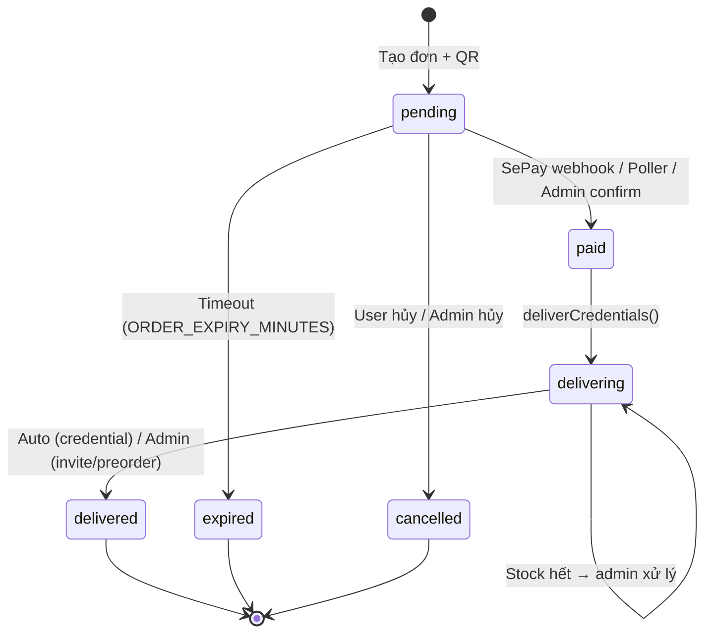

# Feature: Order Flow (F-02)

**BE Tech Spec:** [feature_order_flow_tech.md](../BE/feature_order_flow_tech.md)
**Priority:** P0
**Status:** ✅ Done (v1.1 — added SePay polling backup)

---

## 1. Mô tả

Luồng mua hàng trên Telegram bot: browse SP → chọn SL → email → mã giảm giá → QR payment → auto-deliver. Thanh toán xác minh qua **2 kênh**: SePay webhook (real-time) + SePay API polling (backup mỗi 2 phút). Admin quản lý đơn qua dashboard + bot buttons.

---

## 2. Use Cases

### UC-2.1: Mua hàng (happy path)

1. `/products` → chọn category → chọn SP → xem chi tiết
2. "Mua ngay" → chọn SL (1, 2, 5, 10, custom)
3. Nhập email (nếu SP yêu cầu)
4. Mã giảm giá → nhập hoặc bỏ qua
5. Tạo đơn → hiển thị QR + bank info + countdown
6. Chuyển khoản → SePay webhook / poller → giao hàng tự động

### UC-2.2: Đơn hết hạn

- Pending > ORDER_EXPIRY_MINUTES (mặc định 5 phút) → auto-expire + thông báo user

### UC-2.3: Admin xử lý invite/preorder

- Invite: admin nhấn [✅ Đã invite] → delivered → notify user (tuỳ theo customer_fields)
- Preorder: admin nhấn [✅ Đã giao] sau khi hoàn tất → delivered → notify user

### UC-2.4: Xem lịch sử đơn hàng

- `/orders` → danh sách đơn (5/trang, phân trang) → click xem chi tiết

### UC-2.5: Webhook missed — Poller recovery

- Khách CK thành công nhưng webhook fail → Poller mỗi 2 phút check SePay API → auto-confirm

### Edge Cases

| # | Category | Case | Xử lý |
| - | -------- | ---- | ----- |
| 1 | Stock | Hết stock khi tạo đơn | "Sản phẩm đã hết hàng" |
| 2 | Stock | Hết stock sau thanh toán | "Tạm hết stock, admin liên hệ sớm" |
| 3 | Stability | Bot restart giữa flow | State mất → user bắt đầu lại |
| 4 | Payment | Thanh toán thiếu tiền | Notify "CK thêm hoặc liên hệ admin", đơn giữ pending |
| 5 | Payment | Webhook fail | Poller backup tự động reconcile |
| 6 | Payment | Server down khi webhook đến | Poller pick up khi server recovery |
| 7 | Limit | max_per_user exceeded | "Đã mua tối đa N SP" / "Chỉ có thể mua thêm M" |
| 8 | UX | QR image gửi fail | Fallback gửi text + link QR |
| 9 | Delivery | Giao credential fail | Status='delivering', admin được alert |
| 10 | Time | CK sau khi đơn expire | Poller KHÔNG match expired orders; admin confirm thủ công |

---

## 3. Screens & States

### Bot — Purchase Flow

```
/products → [Category] → [Product Detail] → [Mua ngay]
  → [Chọn SL] → [Email input] → [Mã giảm giá]
    → [QR Payment] → [SePay webhook/poller] → [Delivery]
```

### Bot — QR Payment Screen

| State | Hiển thị |
| ----- | ------- |
| **Ready** | QR image + bank info + order code + amount + countdown |
| **QR Fail** | Text message + bank info + QR link (fallback) |
| **Underpaid** | "Số tiền chưa đủ. Vui lòng CK thêm hoặc liên hệ admin" |
| **Expired** | "Đơn hàng đã hết hạn thanh toán" + [🛍 Mua hàng] |
| **Paid** | "Thanh toán thành công! Đang gửi sản phẩm..." |

### Bot — Delivery Messages

| Product Type | Auto? | Hiển thị |
| ------------ | ----- | ------- |
| **credential** | ✅ Yes | Thông tin tài khoản (parsed by credential_fields) + [🛍 Mua thêm] |
| **invite** | ❌ Admin | "Admin đang xử lý, sẽ thông báo khi hoàn tất" → after confirm: "đã invite/đã setup" |
| **preorder** | ❌ Admin | "Giao trong X giờ" → after confirm: "đã giao, kiểm tra email" |
| **out of stock** | ❌ Admin | "Tạm hết stock, admin liên hệ sớm" |

### Bot — Order History

| State | Hiển thị |
| ----- | ------- |
| **Empty** | "Chưa có đơn hàng nào" + [🛍 Xem sản phẩm] |
| **List** | Paginated list (5/page): emoji + code + product + qty + status |
| **Detail** | Full info: code, status, product, price, discount, email, timeline, subscription |

### Admin — Order Actions (Bot buttons)

| Status | Product Type | Buttons |
| ------ | ------------ | ------- |
| paid/delivering | invite | [✅ Đã invite] |
| paid/delivering | preorder | [✅ Đã giao] |
| (delivery fail) | any | Admin gets alert message |

### Admin Panel — Orders Table

| State | Hiển thị |
| ----- | ------- |
| **Loading** | Skeleton table |
| **Data** | Table: Code, Customer, Product, Amount, Status, Actions |
| **Empty** | "Chưa có đơn hàng nào" |

### Admin Panel — Order Actions

| Status | Product Type | Buttons |
| ------ | ------------ | ------- |
| pending | any | ✅ Xác nhận, ❌ Hủy |
| paid | credential | (auto-delivered) |
| paid | invite | 📧 Đã invite |
| paid | preorder | 📦 Đã giao |
| delivered | any | 🔑 Xem, 🔄 Gửi lại, ⏰ Set hạn |

---

## 4. State Machine



---

## 5. Payment Verification Architecture

```
                    ┌─────────────┐
  Khách CK ──────► │  Ngân hàng  │
                    └──────┬──────┘
                           │
                    ┌──────▼──────┐
                    │    SePay    │
                    └──────┬──────┘
                           │
              ┌────────────┼────────────┐
              │                         │
     ┌────────▼────────┐    ┌──────────▼──────────┐
     │ Layer 1: Webhook │    │ Layer 2: API Polling │
     │ (real-time)      │    │ (every 2 min)        │
     │ POST /webhook/*  │    │ GET /api/v1/txn      │
     └────────┬────────┘    └──────────┬──────────┘
              │                         │
              └────────────┬────────────┘
                           │
                    ┌──────▼──────┐
                    │ Confirm +   │
                    │ Deliver     │
                    └─────────────┘
```

---

## 6. Acceptance Criteria

- [x] Full purchase flow: browse → pay → receive
- [x] 3 product types: credential (auto), invite (manual), preorder (manual)
- [x] VietQR code + bank info + countdown timer
- [x] Auto-expire + notify user
- [x] Dual payment verification: webhook + poller
- [x] Underpayment notification (keep pending)
- [x] max_per_user limit enforcement
- [x] Stock-out after payment: notify user + admin
- [x] QR image fallback to text
- [x] Order history: paginated list + detail view
- [x] Admin: confirm, cancel, resend, set expiry
- [x] Discount integration in flow
- [x] Subscription auto-set on delivery
