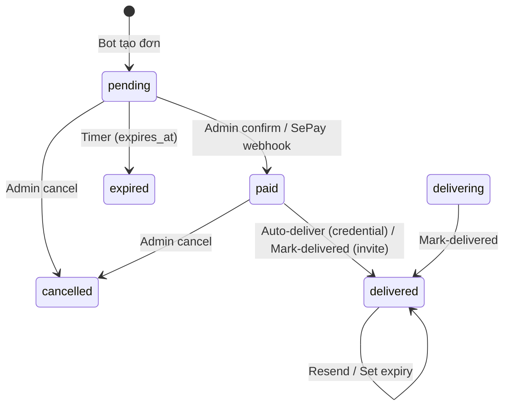

# Feature: Order Management (Admin Panel)

**BE Tech Spec:** [feature_order_management_tech.md](../BE/feature_order_management_tech.md)
**Priority:** P0
**Status:** ✅ Done

---

## 1. Mô tả

Admin xem đơn hàng, confirm thanh toán, cancel, manual fulfill cho invite/preorder, xem/gửi lại credentials, set subscription expiry.

---

## 2. Use Cases

### UC-1: Xem danh sách đơn hàng

1. Admin tab "Đơn hàng" → stat cards + table (recent 100)
2. Table: Mã đơn, Khách, SP, Số tiền, Trạng thái, product_type, Thời gian

### UC-2: Confirm thanh toán

1. Admin click "Xác nhận TT" trên đơn pending
2. Status → paid + auto-deliver (credential type)
3. Bot send credentials to customer
4. Nếu invite/preorder → status = paid, chờ admin mark-delivered

### UC-3: Mark delivered (invite/preorder)

1. Đơn paid, type invite/preorder → nút "Đã giao"
2. Click → status = delivered → bot thông báo khách:
   - Invite: "📧 Invite đã được gửi đến email"
   - Other: "Đơn hàng đã hoàn tất"

### UC-4: View & Resend credentials

1. Click đơn delivered → xem credentials (data + labels theo credential_fields)
2. "Gửi lại" → bot resend formatted message theo credential_fields schema

### UC-5: Set subscription expiry

1. Click "Set hết hạn" → nhập số ngày
2. subscription_expires_at = today + days

### UC-6: Cancel đơn

1. Click "Hủy" → status = cancelled (no stock restore needed — credentials not reserved upfront)

### Edge Cases

| Case | Xử lý |
|------|-------|
| Confirm đơn đã paid | 400 "Already confirmed" |
| Mark-delivered đơn pending | 400 "Expected paid/delivering" |
| Resend non-credential type | 400 "Resend only for credential-type" |
| Credential stock hết khi confirm | "Delivery pending (stock issue)" |

---

## 3. Screens & States

### Admin — Orders Tab

| State | Hiển thị |
|-------|---------|
| **Loading** | Skeleton |
| **Data** | Table + stat cards (derived from data) |
| **Empty** | "Chưa có đơn hàng nào" |

### Order Table

| Column | Data |
|--------|------|
| Mã đơn | `order_code` (= payment_code) |
| 👤 Khách | `telegram_username` |
| 📦 SP | `product_name` × `quantity` |
| 💰 Tiền | `total_amount` (VNĐ) |
| 🏷 Loại | `product_type` badge |
| 📊 Status | Status badge (color) |
| 🕐 Tạo | `created_at` |

### Status Badges

| Status | Label | Color |
|--------|-------|-------|
| `pending` | ⏳ Chờ TT | Yellow |
| `paid` | 💰 Đã TT | Blue |
| `delivering` | 🚚 Đang giao | Purple |
| `delivered` | ✅ Hoàn tất | Green |
| `expired` | ⏰ Hết hạn | Gray |
| `cancelled` | ❌ Đã hủy | Red |

### Action Buttons (conditional)

| Status | Actions |
|--------|---------|
| `pending` | [Xác nhận TT] [Hủy] |
| `paid` (credential) | Auto-delivered |
| `paid` (invite/preorder) | [Đã giao] [Hủy] |
| `delivered` | [Xem credentials] [Gửi lại] [Set hết hạn] |

---

## 4. State Machine

---

## 5. Acceptance Criteria

- [x] Order list (recent 100)
- [x] Confirm payment + auto-deliver credentials
- [x] Mark delivered for invite/preorder
- [x] View credentials with formatted labels
- [x] Resend credentials to customer
- [x] Set subscription expiry (days)
- [x] Cancel order
- [x] Status badges with correct colors
- [x] Conditional action buttons by status + product_type
