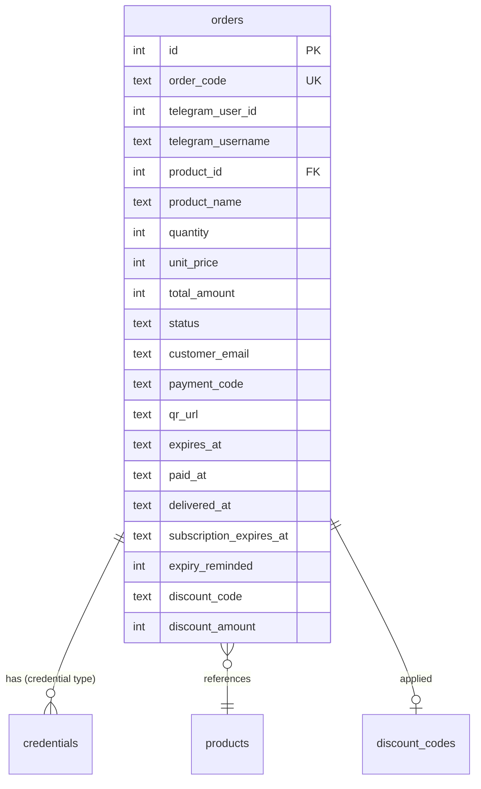
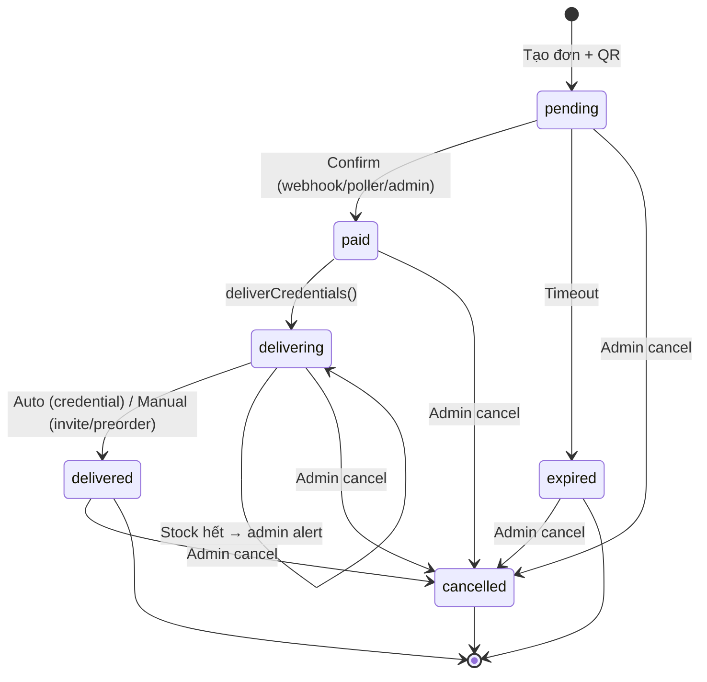

# Feature: Order Management (F-03)

**BE Tech Spec:** [feature_order_management_tech.md](../BE/feature_order_management_tech.md)
**Priority:** P0
**Status:** ✅ Done

---

## 1. Mô tả

Admin quản lý đơn hàng qua admin panel + bot buttons. Confirm thanh toán thủ công, cancel, fulfill invite/preorder, resend credentials, set subscription expiry. Hiển thị 100 đơn gần nhất, sorted by newest.

**Entry point:** Admin Panel → Tab "Đơn hàng" | Bot → order notification buttons

---

## 2. Use Cases + Edge Cases

### Use Cases

| # | Actor | Hành động | Kết quả |
|---|-------|-----------|---------|
| 1 | Admin | Xem danh sách 100 đơn gần nhất | Table sorted by created_at DESC |
| 2 | Admin | Filter đơn hàng theo status | Hiển thị chỉ đơn matching status |
| 3 | Admin | Confirm thanh toán thủ công (pending → paid) | Auto-deliver credential nếu có stock |
| 4 | Admin | Confirm đơn nhưng hết stock credential | Status = `delivering`, admin nhận alert |
| 5 | Admin | Cancel đơn (mọi status) | Confirm dialog → cancelled, KHÔNG revert side-effects |
| 6 | Admin | Fulfill invite/preorder (paid → delivered) | Mark delivered + bot gửi thông báo khách |
| 7 | Admin | Xem credentials đã giao | Modal hiện formatted key/value |
| 8 | Admin | Resend credentials cho khách | Bot gửi lại qua DM + update status |
| 9 | Admin | Set subscription expiry | subscription_expires_at = today + N days |
| 10 | Admin | Xem order detail (click vào đơn) | Full info: timeline, amounts, discount, credentials |

### Flow: Manual Confirm + Auto-Deliver (Credential)

```
Admin mở Tab "Đơn hàng" → tìm đơn pending
     ↓
Click [✅ Xác nhận] → POST /orders/:code/confirm
     ↓
Server: updateOrderStatus('paid') → set paid_at
     ↓
Server: deliverCredentials(order)
     ↓
┌──── Có stock? ────────────────────────────┐
│ ✅ Yes: FIFO assign → mark sold            │
│   → updateOrderStatus('delivered')          │
│   → bot.sendMessage(credentials) to khách   │
│   → setSubscriptionExpiry() nếu có          │
│                                              │
│ ❌ No: status = 'delivering'                │
│   → admin alert: "Hết stock, cần bổ sung"  │
└──────────────────────────────────────────────┘
```

### Flow: Manual Fulfill (Invite/Preorder)

```
Đơn paid (type=invite hoặc preorder) hiện nút fulfill
     ↓
Admin click [📧 Đã invite] hoặc [📦 Đã giao]
     ↓
POST /orders/:code/mark-delivered
     ↓
Server: check status = paid/delivering → OK
     ↓
updateOrderStatus('delivered') → set delivered_at
     ↓
Bot gửi message: "📧 Invite đã được gửi" / "📦 Đơn hàng đã giao"
```

### Edge Cases

| # | Category | Case | Xử lý |
|---|----------|------|-------|
| 1 | Data Integrity | Confirm đơn đã paid | 400 `ALREADY_CONFIRMED` |
| 2 | Data Integrity | Confirm đơn cancelled | 400 `CANCELLED` |
| 3 | Data Integrity | Mark-delivered đơn chưa paid | 400 `INVALID_STATUS` |
| 4 | Cross-Feature | Stock = 0 khi deliver credential | Status = `delivering`, admin alert |
| 5 | Cross-Feature | Resend non-credential product | 400 `INVALID_TYPE` |
| 6 | Data Integrity | Resend nhưng no credentials assigned | 400 `NO_CREDENTIALS` |
| 7 | Cross-Feature | Subscription expiry tracking | set-expiry hoặc auto từ subscription_days |
| 8 | Concurrency | 2 admin confirm cùng đơn | First wins (status check trước update) |
| 9 | UX | Nhiều actions cùng lúc | Disable buttons sau click, loading state |
| 10 | Cross-Feature | Đơn expired nhưng khách CK rồi | Poller KHÔNG match expired → admin confirm thủ công |
| 11 | Data Integrity | Cancel đơn paid/delivered | ✅ Cho phép — admin cancel mọi status |
| 12 | Data Integrity | Cancel không revert side-effects | Cancel chỉ đổi status, **KHÔNG** revert credentials/discount usage |
| 13 | Cross-Feature | Resend cũng update status + expiry | Resend → `delivered` + auto set subscription_expires_at |

---

## 3. Screens & States

### Admin Panel — Orders Tab

**Layout:** Full-width table

| Element | Mô tả |
|---------|-------|
| **Tab header** | "🧾 Đơn hàng" + count badge |
| **Orders table** | 100 đơn gần nhất, columns bên dưới |
| **Empty state** | Icon 🧾 + "Chưa có đơn hàng nào" |

| State | Hiển thị |
|-------|---------|
| **Loading** | Skeleton table (5 rows) |
| **Data** | Table sorted by created_at DESC |
| **Empty** | Empty state component |
| **Error** | Toast "Không thể tải danh sách đơn hàng" |

**Orders Table Columns:**

| Column | Width | Data | Ví dụ |
|--------|-------|------|-------|
| Mã đơn | 100px | `order_code` (monospace) | `ABC123` |
| SP | fill | `product_name` | Claude Pro |
| Loại | 80px | `product_type` badge | 🔑 credential |
| SL | 40px | `quantity` | 2 |
| Khách | 120px | `telegram_username` | @buyer1 |
| Số tiền | 120px | `total_amount` (VNĐ) | 440.000 đ |
| Giảm | 80px | `discount_amount` (nếu > 0) | -20.000 đ |
| Status | 100px | Status badge (color) | 🟡 Pending |
| Thời gian | 120px | `created_at` (relative) | 5 phút trước |
| Actions | 200px | Context buttons | [✅] [❌] |

### Conditional Action Buttons

| Status | Product Type | Buttons hiển thị |
|--------|-------------|-----------------|
| pending | any | [✅ Xác nhận] [❌ Hủy] |
| paid | credential | (auto-delivered, see delivered) |
| paid/delivering | invite | [📧 Đã invite] |
| paid/delivering | preorder | [📦 Đã giao] |
| delivered | credential | [🔑 Xem] [🔄 Gửi lại] [⏰ Set hạn] |
| delivered | invite/preorder | [⏰ Set hạn] |
| expired/cancelled | any | (no actions) |

### View Credentials Modal

**Layout:** Modal 520px

| Element | Mô tả |
|---------|-------|
| **Header** | "🔑 Credentials — {order_code}" + ✕ |
| **Order info** | Product, customer, status (summary) |
| **Credentials list** | Formatted key/value per credential_fields |
| **Footer** | [🔄 Gửi lại] (primary) + [Đóng] |

### Cancel Confirm Dialog

- **Title:** "Hủy đơn {order_code}?"
- **Description:** "Hành động này không thể hoàn tác."
- **Buttons:** [Không] + [Hủy đơn] (danger)

### Set Expiry Dialog

- **Title:** "⏰ Gia hạn subscription"
- **Input:** Number field "Số ngày" (default: 30)
- **Buttons:** [Hủy] + [Xác nhận] (primary)

---

## 4. Domain Model



---

## 5. API Endpoints

| Method | Path | Mô tả |
|--------|------|-------|
| GET | `/api/admin/orders` | List 100 recent orders |
| POST | `/api/admin/orders/:code/confirm` | Confirm payment + auto-deliver |
| POST | `/api/admin/orders/:code/cancel` | Cancel order |
| POST | `/api/admin/orders/:code/mark-delivered` | Manual fulfill (invite/preorder) |
| POST | `/api/admin/orders/:code/set-expiry` | Set subscription expiry `{ days }` |
| GET | `/api/admin/orders/:code/credentials` | Get credentials for order |
| POST | `/api/admin/orders/:code/resend-credentials` | Resend to customer via bot |

---

## 6. Error Codes

| HTTP | Code | Message | Trigger |
|------|------|---------|---------|
| 400 | `ALREADY_CONFIRMED` | "Order already confirmed" | Confirm paid/delivered order |
| 400 | `CANCELLED` | "Order was cancelled" | Confirm cancelled order |
| 400 | `INVALID_STATUS` | "Order status is {status}, expected paid/delivering" | Mark-delivered non-paid |
| 400 | `INVALID_TYPE` | "Resend only works for credential-type products" | Resend invite/preorder |
| 400 | `NO_CREDENTIALS` | "No credentials found for this order" | Resend with no assigned credentials |
| 400 | `VALIDATION_ERROR` | "Days must be > 0" | Set-expiry với days ≤ 0 |
| 401 | — | "Unauthorized" | API key sai/thiếu |
| 404 | `NOT_FOUND` | "Order not found" | Invalid order_code |
| 500 | `INTERNAL_ERROR` | Server error | DB/runtime error |
| 500 | `BOT_ERROR` | "Bot not initialized" | Resend khi bot chưa sẵn sàng |

---

## 7. Analytics Events

| Event | Trigger | Properties |
|-------|---------|-----------|
| `order_list_view` | Mở tab Đơn hàng | `{ totalOrders }` |
| `order_confirm_manual` | Admin confirm thủ công | `{ orderCode, amount }` |
| `order_cancel` | Admin cancel | `{ orderCode, wasExpired }` |
| `order_mark_delivered` | Manual fulfill | `{ orderCode, productType }` |
| `order_view_credentials` | Xem credentials | `{ orderCode, credentialCount }` |
| `order_resend_credentials` | Gửi lại credentials | `{ orderCode }` |
| `order_set_expiry` | Set subscription | `{ orderCode, days }` |

---

## 8. State Machine



> ⚠️ Admin có thể cancel **mọi status**. Cancel chỉ đổi status, **KHÔNG revert** credentials (đã assign), discount usage, hay bất kỳ side-effect nào.

### 8.1 Scenarios by Status (Admin Panel Perspective)

#### `pending` — Chờ thanh toán (5 scenarios)

| # | Scenario | Actor | Trigger | Kết quả |
|---|----------|-------|---------|---------|
| OP1 | Admin xem đơn pending | Admin | Tab "Chờ xác nhận" (L1) hoặc filter status | Hiện table với action buttons |
| OP2 | Admin confirm thủ công (L1) | Admin | ✅ Xác nhận → nhập số tiền | → `paid` → auto-deliver (credential) |
| OP3 | Admin cancel đơn pending | Admin | ❌ Hủy → confirm dialog | → `cancelled` |
| OP4 | Stale order alert | System | Đơn pending > 5 phút | Toast notification "Có N đơn chờ xác nhận" |
| OP5 | SePay/Poller auto-confirm (L2) | System | Webhook/poller match CK | → `paid` (admin thấy status tự đổi) |

#### `paid` — Đã thanh toán (4 scenarios)

| # | Scenario | Actor | Trigger | Kết quả |
|---|----------|-------|---------|---------|
| OPA1 | Auto-deliver credential | System | Product type = credential | → `delivering` → `delivered` tự động |
| OPA2 | Admin click "Đã invite" | Admin | 📧 Đã invite (product type = invite) | → `delivered` |
| OPA3 | Admin click "Đã giao" | Admin | 📦 Đã giao (product type = preorder) | → `delivered` |
| OPA4 | Admin cancel đơn paid | Admin | ❌ Hủy → confirm dialog | → `cancelled` (credentials KHÔNG thu hồi) |

#### `delivering` — Đang giao (4 scenarios)

| # | Scenario | Actor | Trigger | Kết quả |
|---|----------|-------|---------|---------|
| OD1 | Stock-out alert | System | Credential stock = 0 | Admin nhận alert, bổ sung stock |
| OD2 | Admin bổ sung stock → re-deliver | Admin | Thêm credentials → resend | → `delivered` |
| OD3 | Admin mark-delivered (manual) | Admin | ✅ Đã giao | → `delivered` |
| OD4 | Admin cancel đơn delivering | Admin | ❌ Hủy → confirm dialog | → `cancelled` |

#### `delivered` — Đã giao (5 scenarios)

| # | Scenario | Actor | Trigger | Kết quả |
|---|----------|-------|---------|---------|
| ODV1 | Admin xem credentials | Admin | 🔑 Xem | Modal hiện formatted credentials |
| ODV2 | Admin resend credentials | Admin | 🔄 Gửi lại | Bot gửi lại cho khách |
| ODV3 | Admin set subscription expiry | Admin | ⏰ Set hạn → nhập số ngày | Cập nhật `subscription_expires_at` |
| ODV4 | Admin cancel đơn delivered | Admin | ❌ Hủy → confirm dialog | → `cancelled` (credentials KHÔNG thu hồi) |
| ODV5 | Admin xem order detail | Admin | Click row → expand detail | Hiện timeline, payment info, credentials |

#### `expired` — Hết hạn (3 scenarios)

| # | Scenario | Actor | Trigger | Kết quả |
|---|----------|-------|---------|---------|
| OE1 | Admin xem đơn expired | Admin | Filter "Đã hết hạn" | Danh sách đơn expired |
| OE2 | Admin cancel đơn expired | Admin | ❌ Hủy → confirm dialog | → `cancelled` |
| OE3 | Admin phát hiện late CK | Admin | SePay có GD match → confirm thủ công | → `paid` (reopen) |

#### `cancelled` — Đã hủy (4 scenarios)

| # | Scenario | Actor | Trigger | Kết quả |
|---|----------|-------|---------|---------|
| OC1 | Xem đơn cancelled | Admin | Filter "Đã hủy" | Read-only, không có action |
| OC2 | Cancel từ pending | Admin | Hủy đơn chưa thanh toán | Đơn biến mất khỏi "Chờ xác nhận" |
| OC3 | Cancel từ delivered | Admin | Hủy đơn đã giao (edge case) | Credentials giữ nguyên, status chỉ đổi |
| OC4 | Admin note lý do cancel | Admin | Nhập note trong confirm dialog | Lưu `cancel_reason` + `cancelled_by` |

> **Tổng: 25 scenarios** — 5 pending + 4 paid + 4 delivering + 5 delivered + 3 expired + 4 cancelled.

---

## 9. Caching Strategy

| Data | Cache | TTL |
|------|-------|-----|
| Orders list | No cache | Real-time query |
| Order detail | No cache | Real-time |
| Credentials per order | No cache | Real-time |

> Không cache vì order status thay đổi liên tục (webhook, poller, admin actions).

---

## 10. Acceptance Criteria

- [x] Table 100 đơn gần nhất, sorted DESC
- [x] Status badges color-coded (6 statuses)
- [x] Conditional action buttons per status + product type
- [x] Manual confirm + auto-deliver credential
- [x] Cancel with confirm dialog
- [x] Mark-delivered for invite/preorder
- [x] View credentials modal (formatted per credential_fields)
- [x] Resend credentials via bot DM
- [x] Set subscription expiry (with days input)
- [x] Stock-out alert when credential stock = 0

---

## State Coverage Matrix

| Screen | Loading | Ready/Data | Error | Empty |
|--------|---------|-----------|-------|-------|
| Orders Table | ✅ Skeleton | ✅ Table + actions | ✅ Toast | ✅ "Chưa có đơn" |
| View Credentials | ✅ Skeleton | ✅ Formatted list | ✅ Toast | ✅ "No credentials" |
| Cancel Dialog | N/A | ✅ Confirm | N/A | N/A |
| Set Expiry Dialog | N/A | ✅ Number input | ✅ Inline | N/A |
