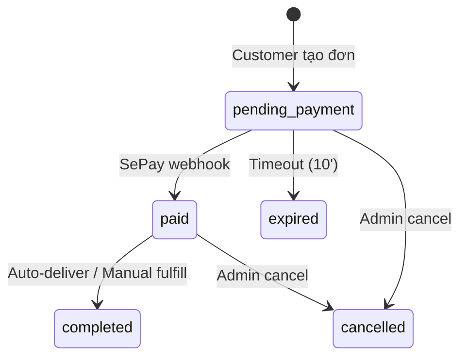

# Feature: Order Management (Admin Panel)

**BE Tech Spec:** [feature_order_management_tech.md](../BE/feature_order_management_tech.md)
**Priority:** P0
**Status:** ✅ Done

---

## 1. Mô tả

Admin xem, lọc, quản lý đơn hàng. Xem chi tiết, cancel đơn, manual fulfill cho invite/preorder. Export CSV.

---

## 2. Use Cases

### UC-1: Xem danh sách đơn hàng

1. Admin tab "Đơn hàng" → stat cards + table
2. Filter: status, date range, search (payment code, username)
3. Table: Mã TT, Khách, Sản phẩm, Số tiền, Trạng thái, Thời gian

### UC-2: Xem chi tiết đơn

1. Click đơn hàng → modal chi tiết
2. Thông tin: khách, SP, payment info, timeline, credential data (nếu completed)

### UC-3: Cancel đơn hàng

1. Admin click "Hủy" → confirm modal
2. Status → cancelled, stock restored (nếu credential)

### UC-4: Manual fulfill (invite/preorder)

1. Đơn paid + invite/preorder → nút "Xác nhận đã giao"
2. Admin click → update status → bot thông báo khách

### UC-5: Export CSV

1. Admin click "Export" → download CSV theo filter hiện tại

### Edge Cases

| Case | Xử lý |
|------|-------|
| Đơn pending quá 10' | Auto-expired |
| Cancel đơn completed | Reject — đã giao |
| Thanh toán đúng, sai SL | Chỉ match exact payment_code |

---

## 3. Screens & States

### Admin — Orders Tab

| State | Hiển thị |
|-------|---------|
| **Loading** | Skeleton stat cards + table |
| **Data** | Stats + filterable table |
| **Empty** | "Chưa có đơn hàng nào." |

### Stat Cards

| Card | Value |
|------|-------|
| Tổng đơn | Count all |
| Đang chờ | Count pending + paid |
| Hoàn tất | Count completed |
| Doanh thu | Sum completed (VNĐ) |

### Order Table

| Column | Data |
|--------|------|
| 💳 Mã TT | `payment_code` |
| 👤 Khách | `customer_username` |
| 📦 SP | `product_name` |
| 💰 Số tiền | `total_amount` (VNĐ) |
| 🏷 Trạng thái | Status badge |
| 🕐 Thời gian | `created_at` (relative) |

### Status Badges

| Status | Badge | Color |
|--------|-------|-------|
| pending_payment | ⏳ Chờ TT | Yellow |
| paid | 💰 Đã TT | Blue |
| completed | ✅ Hoàn tất | Green |
| expired | ⏰ Hết hạn | Gray |
| cancelled | ❌ Đã hủy | Red |

---

## 4. State Machine (Order)

---

## 5. Acceptance Criteria

- [x] Stat cards: total, pending, completed, revenue
- [x] Filterable table: status, date range, search
- [x] Order detail modal: full info + timeline
- [x] Cancel order with stock restore
- [x] Manual fulfill for invite/preorder
- [x] Status badges with correct colors
- [x] Export CSV
