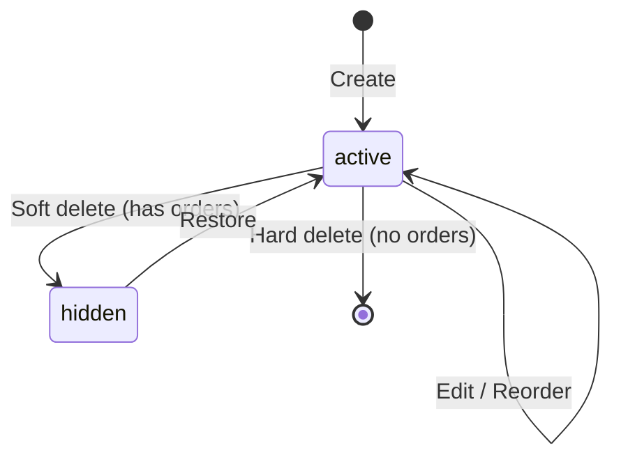

# Feature: Product & Inventory Management (F-01)

**BE Tech Spec:** [feature_products_tech.md](../BE/feature_products_tech.md)
**Priority:** P0
**Status:** ✅ Done

---

## 1. Mô tả

Admin quản lý sản phẩm (CRUD), danh mục, kho credential, reorder thứ tự hiển thị. 3 loại SP: credential (auto-deliver), invite (manual), preorder (manual + delivery time).

---

## 2. Use Cases

### UC-1.1: CRUD sản phẩm

1. Admin tab "Sản phẩm" → danh sách SP + stock
2. "Thêm sản phẩm" → form: tên, giá, loại, danh mục, fields
3. Click SP → edit inline hoặc modal
4. Xóa: có đơn hàng → ẩn (soft), không có → xóa hẳn

### UC-1.2: Quản lý kho (Credentials)

1. Click SP → tab "Kho hàng"
2. Paste credentials (1/dòng) → batch import
3. Xem danh sách: credential data, sold/unsold status
4. Edit credential chưa bán, xóa credential chưa bán

### UC-1.3: Reorder sản phẩm

1. Drag & drop SP trong danh sách → thay đổi thứ tự
2. Nút "Lưu thứ tự" → save sort_order

### UC-1.4: Featured product

1. Toggle ⭐ "Nổi bật" cho SP → hiện đầu trang /products

### Edge Cases

| Case | Xử lý |
|------|-------|
| Import 0 credential hợp lệ | Thông báo lỗi, không thay đổi |
| Tên SP trùng | Cho phép (no unique constraint) |
| Delete SP đang có pending order | Reject — giao đơn trước |

---

## 3. Screens & States

### Admin — Product List

| State | Hiển thị |
|-------|---------|
| **Loading** | Skeleton table |
| **Data** | Table: Tên, Giá, Loại, Stock, Featured, Actions |
| **Empty** | "Chưa có sản phẩm. Thêm sản phẩm đầu tiên!" |

### Admin — Product Form (Modal)

| Field | Type | Validation |
|-------|------|-----------|
| Tên SP | text | Required |
| Giá | number | Required, > 0 |
| Loại SP | select | credential/invite/preorder |
| Danh mục | text | Optional |
| Mô tả | textarea | Optional |
| Fields (JSON) | custom | Key/label pairs |
| Nổi bật | toggle | Boolean |
| Thời gian giao (preorder) | number | Hours |

### Admin — Credential List

| State | Hiển thị |
|-------|---------|
| **Data** | Table: ID, Data preview, Sold?, Order ID |
| **Empty** | "Chưa có credential. Thêm kho hàng!" |

### Bot — Product Display

```
📦 *Claude Pro — 1 tháng*
💰 Giá: 220.000 đ
📋 Loại: Credential
📊 Còn: 15 sản phẩm
⏰ Giao hàng: Tự động sau thanh toán

[🛒 Mua ngay]
```

---

## 4. State Machine (Product Lifecycle)



---

## 5. Acceptance Criteria

- [x] CRUD sản phẩm với 3 loại
- [x] Batch import credentials (paste)
- [x] Stock count = unsold credentials
- [x] Smart delete: soft nếu có orders
- [x] Drag & drop reorder
- [x] Featured toggle
- [x] Customer fields configurable
- [x] Bot hiển thị stock realtime
