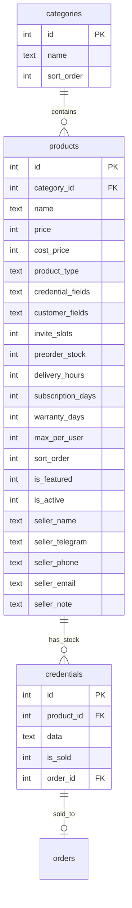
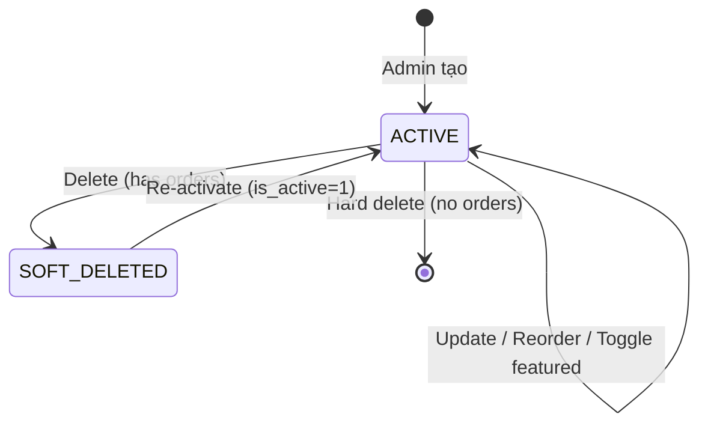

# Feature: Product & Inventory Management (F-01)

**BE Tech Spec:** [feature_products_tech.md](../BE/feature_products_tech.md)
**Priority:** P0
**Status:** ✅ Done

---

## 1. Mô tả

Admin quản lý sản phẩm (CRUD), danh mục, kho credentials, drag-drop reorder, link checker. 3 loại SP hỗ trợ: credential (auto-deliver), invite (manual, slot-based), preorder (manual, delivery SLA). Kho hàng credential quản lý qua add/bulk-import/edit/delete/search.

**Entry point:** Admin Panel → Tab "Sản phẩm"

---

## 2. Use Cases + Edge Cases

### Use Cases

| # | Actor | Hành động | Kết quả |
|---|-------|-----------|---------|
| 1 | Admin | Tạo sản phẩm mới (type=credential) | SP hiện trong table + trên bot |
| 2 | Admin | Tạo sản phẩm (type=invite/preorder) | SP tạo, stock theo invite_slots/preorder_stock |
| 3 | Admin | Sửa thông tin SP (partial update) | Chỉ fields gửi lên được cập nhật |
| 4 | Admin | Xóa SP **có** orders đã bán | Soft delete (is_active=0), giữ credentials |
| 5 | Admin | Xóa SP **không có** orders | Hard delete + cascade xóa credentials |
| 6 | Admin | Thêm credential đơn lẻ vào kho | Credential tạo, stock tăng |
| 7 | Admin | Bulk import credentials (paste nhiều dòng) | Pre-check duplicates → confirm → import |
| 8 | Admin | Search credential trong kho | LIKE search trong data JSON |
| 9 | Admin | Edit/Delete credential **đã bán** | 400 rejected (chỉ unsold mới sửa/xóa) |
| 10 | Admin | Drag-drop reorder sản phẩm | sort_order cập nhật, bot hiện theo thứ tự mới |
| 11 | Admin | Toggle ⭐ featured | SP hiện trong mục "Nổi bật" trên bot |
| 12 | Khách (bot) | Mua SP hết stock | Bot: "Sản phẩm đã hết hàng" |

### Flow: Bulk Import Credentials

```
Admin click "📋 Import hàng loạt"
     ↓
Textarea mở → paste credentials (1/dòng)
     ↓
Click "Import" → POST /check-duplicates
     ↓
┌──────────────────────────────────────┐
│ Kết quả: {X} mới, {Y} trùng        │
│                                      │
│ [Bỏ qua trùng & Import] [Hủy]      │
└──────────────────────────────────────┘
     ↓
POST /credentials/bulk → import {X} credentials
     ↓
Toast: "Đã import {X} credentials"
Stock tự động cập nhật
```

### Flow: Drag-Drop Reorder

```
Admin kéo SP từ vị trí A → vị trí B
     ↓
UI cập nhật tức thì (optimistic update)
     ↓
PUT /products/reorder { orderedIds: [3,1,5,2] }
     ↓
Success → toast "Đã cập nhật thứ tự"
Fail → revert UI về vị trí cũ + toast error
     ↓
Bot hiển thị theo sort_order mới
```

### Edge Cases

**User-side (bot mua hàng):**

| # | Category | Case | Xử lý |
|---|----------|------|-------|
| 1 | Data Integrity | Delete product có orders | Soft delete (is_active=0), keep credentials |
| 2 | Data Integrity | Delete product không có orders | Hard delete + cascade delete credentials |
| 3 | Data Integrity | Edit sold credential | 400 "Cannot edit sold credential" |
| 4 | Data Integrity | Delete sold credential | Silently ignored (WHERE is_sold = 0) |
| 5 | Concurrency | 2 users buy last stock | SQLite single-writer, FIFO delivery |
| 6 | Cross-Feature | credential_fields customizable | Mỗi SP có field schema riêng |
| 7 | Cross-Feature | subscription_days set | After delivery → set subscription_expires_at |
| 8 | UX | Drag-drop trên mobile | Touch drag handler, visual feedback |

**Admin-side (tạo/sửa sản phẩm + credential):**

| # | Category | Case | Xử lý |
|---|----------|------|-------|
| 9 | Validation | `name` rỗng | Inline error: "Vui lòng nhập tên sản phẩm" |
| 10 | Validation | `price` ≤ 0 hoặc rỗng | Inline error: "Giá phải lớn hơn 0" |
| 11 | Validation | `product_type` không chọn | Inline error: "Vui lòng chọn loại sản phẩm" |
| 12 | Validation | `credential_fields` JSON invalid | Inline error: "Định dạng JSON không hợp lệ" |
| 13 | Validation | `max_per_user` < 0 | Inline error: "Giới hạn mua phải ≥ 0" |
| 14 | Validation | `invite_slots` ≤ 0 (khi type=invite) | Inline error: "Số slot phải lớn hơn 0" |
| 15 | Validation | `preorder_stock` ≤ 0 (khi type=preorder) | Inline error: "Số lượng kho phải lớn hơn 0" |
| 16 | Validation | Bulk import empty array | 400 "No valid credentials to import" |
| 17 | Validation | Import credential duplicate data | Pre-check duplicates → user confirm |
| 18 | Validation | Add credential thiếu `productId` hoặc `data` | Inline error: "Vui lòng nhập dữ liệu credential" |

---

## 3. Screens & States

### Admin — Products Tab

**Layout:** Full-width table with drag handles

| Element | Mô tả |
|---------|-------|
| **Tab header** | "📦 Sản phẩm" + count + "＋ Thêm sản phẩm" (primary) |
| **Products table** | Drag-drop reorderable, columns bên dưới |
| **Empty state** | Icon 📦 + "Chưa có sản phẩm" + CTA "Thêm sản phẩm đầu tiên" |

| State | Hiển thị |
|-------|---------|
| **Loading** | Skeleton table (3 rows) |
| **Data** | Drag-reorderable table + stock counts |
| **Empty** | Empty state component |
| **Error** | Toast "Không thể tải danh sách sản phẩm" |

**Products Table Columns:**

| Column | Width | Data | Ví dụ |
|--------|-------|------|-------|
| ☰ | 32px | Drag handle | (icon) |
| ⭐ | 32px | Featured toggle | ⭐ / ☆ |
| Tên SP | fill | `name` (bold) | **Claude Pro 1 tháng** |
| Giá | 120px | `price` (VNĐ) | 220.000 đ |
| Loại | 100px | `product_type` badge | 🔑 Credential |
| Kho | 120px | available/sold/total | 5 / 12 / 17 |
| Actions | 100px | [✏ Sửa] [🗑 Xóa] | |

### Stock Display per Product Type

| Type | Available | Sold | Total |
|------|-----------|------|-------|
| `credential` | COUNT(unsold credentials) | COUNT(sold credentials) | COUNT(all credentials) |
| `invite` | invite_slots − delivered_qty | delivered_qty | invite_slots |
| `preorder` | preorder_stock − delivered_qty | delivered_qty | preorder_stock |

### Product Form Modal

**Layout:** Modal 560px, scrollable

| Field | Type | Required? | Default | Validation / Ghi chú |
|-------|------|----------|---------|---------------------|
| Tên sản phẩm | Text | ✅ **Required** | — | Không được rỗng |
| Giá | Number | ✅ **Required** | — | > 0, đơn vị VNĐ |
| Mô tả | Textarea | Optional | `null` | Hiển thị trên bot, hỗ trợ emoji |
| Ghi chú (nội bộ) | Textarea | Optional | `null` | Chỉ admin thấy |
| Danh mục | Select | Optional | `null` | NULL = không thuộc danh mục nào |
| Loại SP | Select: Credential / Invite / Preorder | ✅ **Required** | — | Không đổi được sau khi tạo |
| Credential Fields | JSON editor | Optional | `null` | JSON schema định nghĩa fields. Chỉ cho type=credential |
| Customer Fields | JSON editor | Optional | `null` | JSON schema cho form khách. Chỉ cho invite/preorder |
| invite_slots | Number | Optional | `0` | Chỉ cho type=invite. `0` = unlimited |
| preorder_stock | Number | Optional | `0` | Chỉ cho type=preorder. `0` = unlimited |
| delivery_hours | Number | Optional | `0` | SLA giao hàng (giờ). `0` = không giới hạn. Hiển thị trên bot cho invite/preorder |
| subscription_days | Number | Optional | `0` | `0` = không có subscription |
| warranty_days | Number | Optional | `0` | `0` = không bảo hành |
| max_per_user | Number | Optional | `0` | `0` = unlimited, mua không giới hạn |
| Giá vốn | Number | Optional | `null` | `cost_price` — giá nhập/vốn (VNĐ). Admin-only, dùng tính lợi nhuận. NULL = không theo dõi |
| ☐ Nổi bật | Checkbox | Optional | `false` | Hiện trong mục "Nổi bật" trên bot |

**Seller Info Section** (collapsible, admin-only):

| Field | Type | Required? | Default | Validation / Ghi chú |
|-------|------|----------|---------|---------------------|
| Tên seller | Text | Optional | `null` | Tên người bán/nguồn hàng |
| Telegram | Text | Optional | `null` | Username Telegram (VD: `@seller123`) |
| SĐT | Text | Optional | `null` | Số điện thoại liên hệ |
| Email | Text (email) | Optional | `null` | Email liên hệ |
| Ghi chú seller | Textarea | Optional | `null` | Ghi chú nội bộ về seller |

> [!TIP]
> Chỉ 3 fields bắt buộc: `name`, `price`, `product_type`. Các fields khác đều có default hợp lý.

### Credential Management Section

**Layout:** Expandable section within product detail

| Element | Mô tả |
|---------|-------|
| **Header** | "🔑 Kho hàng ({available}/{total})" + [＋ Thêm] + [📋 Import hàng loạt] + [🔍 Check Links] |
| **Credentials table** | Sortable: unsold first, newest first |
| **Search bar** | "🔍 Tìm kiếm trong kho..." |

**Credential Table Columns:**

| Column | Data |
|--------|------|
| ID | `id` |
| Data | Parsed JSON (key: value theo credential_fields) |
| Status | 🟢 Có sẵn / 🔴 Đã bán (+ order_code link) |
| Actions | [✏ Edit] [🗑 Delete] (chỉ unsold) |

### Bulk Import Flow

1. Textarea paste (1 credential/line)
2. Pre-check duplicates → summary: "{X} mới, {Y} trùng"
3. [Bỏ qua trùng & Import] hoặc [Hủy]
4. Toast: "Đã import {N} credentials"

---

## 4. Domain Model



---

## 5. API Endpoints

### Products CRUD

| Method | Path | Mô tả |
|--------|------|-------|
| GET | `/api/admin/products` | List all with stock counts |
| POST | `/api/admin/products` | Create product |
| PUT | `/api/admin/products/:id` | Update (partial fields) |
| DELETE | `/api/admin/products/:id` | Smart delete (soft/hard) |
| PUT | `/api/admin/products/reorder` | Save sort order `{ orderedIds: [3,1,5] }` |

### Credentials

| Method | Path | Mô tả |
|--------|------|-------|
| GET | `/api/admin/credentials/:productId` | List credentials (unsold first) |
| POST | `/api/admin/credentials` | Single add |
| POST | `/api/admin/credentials/bulk` | Bulk import |
| PUT | `/api/admin/credentials/:id` | Edit (unsold only) |
| DELETE | `/api/admin/credentials/:id` | Delete (unsold only) |
| GET | `/api/admin/credentials/search?q=` | Search by keyword in data (LIMIT 20) |
| POST | `/api/admin/credentials/check-duplicates` | Pre-check duplicates |
| POST | `/api/admin/credentials/check-links` | 3-phase link validity check (max 100 URLs) |
| GET | `/api/admin/credentials/link-cache` | Export all cached link results |

---

## 6. Error Codes

### Admin API errors (tạo/sửa sản phẩm + credential)

| Code | Error Code | Message | Trigger |
|------|-----------|---------|--------|
| 400 | `VALIDATION_ERROR` | "Vui lòng nhập tên sản phẩm" | `name` rỗng |
| 400 | `VALIDATION_ERROR` | "Giá phải lớn hơn 0" | `price` ≤ 0 hoặc rỗng |
| 400 | `VALIDATION_ERROR` | "Vui lòng chọn loại sản phẩm" | `product_type` thiếu / invalid |
| 400 | `VALIDATION_ERROR` | "Định dạng JSON không hợp lệ" | `credential_fields` / `customer_fields` JSON parse fail |
| 400 | `VALIDATION_ERROR` | "Giới hạn mua phải ≥ 0" | `max_per_user` < 0 |
| 400 | `VALIDATION_ERROR` | "Số slot phải lớn hơn 0" | `invite_slots` ≤ 0 (type=invite) |
| 400 | `VALIDATION_ERROR` | "Số lượng kho phải lớn hơn 0" | `preorder_stock` ≤ 0 (type=preorder) |
| 400 | `VALIDATION_ERROR` | "Không thể sửa credential đã bán" | Edit credential with is_sold=1 |
| 400 | `VALIDATION_ERROR` | "Không có credentials hợp lệ để import" | Bulk import empty/invalid |
| 400 | `VALIDATION_ERROR` | "Vui lòng nhập dữ liệu credential" | Add credential thiếu `productId` / `data` |
| 400 | `VALIDATION_ERROR` | "orderedIds array required" | Reorder thiếu mảng |
| 400 | `VALIDATION_ERROR` | "Query parameter q is required" | Search không có keyword |
| 401 | — | "Unauthorized" | API key sai/thiếu |
| 404 | `NOT_FOUND` | "Credential not found" | Invalid credential ID |
| 500 | `INTERNAL_ERROR` | Server error | DB/runtime error |

**Admin warning toasts** (không block, vẫn cho tạo):

| Type | Message | Trigger |
|------|---------|---------|
| ⚠️ Warning | "Loại SP credential nhưng chưa có credential_fields" | type=credential + credential_fields rỗng |
| ⚠️ Warning | "max_per_user = 0 (unlimited)" | max_per_user = 0 khi tạo SP có giá cao |

### Admin form inline errors

| Field | Validation | Inline error message |
|-------|-----------|---------------------|
| Tên sản phẩm | Rỗng | "Vui lòng nhập tên sản phẩm" |
| Giá | Rỗng hoặc ≤ 0 | "Giá phải lớn hơn 0" |
| Loại SP | Chưa chọn | "Vui lòng chọn loại sản phẩm" |
| Credential Fields | JSON invalid | "Định dạng JSON không hợp lệ" |
| Customer Fields | JSON invalid | "Định dạng JSON không hợp lệ" |
| invite_slots | ≤ 0 (type=invite) | "Số slot phải lớn hơn 0" |
| preorder_stock | ≤ 0 (type=preorder) | "Số lượng kho phải lớn hơn 0" |
| max_per_user | < 0 | "Giới hạn mua phải ≥ 0" |
| delivery_hours | < 0 | "Thời gian giao phải ≥ 0" |
| Credential data | Rỗng khi add | "Vui lòng nhập dữ liệu credential" |

> [!TIP]
> Frontend validate trước khi gọi API. Nếu API trả `400`, map `error.code` → inline error tương ứng.

---

## 7. Analytics Events

| Event | Trigger | Properties |
|-------|---------|-----------|
| `product_create` | Tạo SP mới | `{ name, productType, price }` |
| `product_update` | Sửa SP | `{ productId, updatedFields }` |
| `product_delete` | Xóa SP | `{ productId, action: 'soft'/'hard', orderCount }` |
| `product_reorder` | Drag-drop reorder | `{ orderedIds }` |
| `product_toggle_featured` | Toggle featured | `{ productId, isFeatured }` |
| `credential_add` | Add single credential | `{ productId }` |
| `credential_bulk_import` | Bulk import | `{ productId, imported, duplicates }` |
| `credential_search` | Search credentials | `{ keyword, resultsCount }` |

---

## 8. State Machine



### 8.1 Timeout Specification

| Item | Giá trị | Behavior khi hết hạn |
|------|:-------:|---------------------|
| **`subscription_days`** | Admin-configurable (0 = không hết hạn) | System auto-expire subscription, notify user |
| **`warranty_days`** | Admin-configurable (0 = không bảo hành) | Warranty hết → credential không còn bảo hành |

### 8.2 Scenarios by Status

#### `ACTIVE` (6 scenarios)

| # | Scenario | Actor | Trigger | Kết quả |
|---|----------|-------|---------|---------|
| PA1 | Admin tạo sản phẩm | Admin | Products → Create | SP `ACTIVE`, hiện trên bot |
| PA2 | Admin sửa sản phẩm | Admin | Products → Edit → Save | Update in-place, giữ `ACTIVE` |
| PA3 | Admin reorder (drag-drop) | Admin | Kéo thả thay đổi thứ tự | `sort_order` cập nhật |
| PA4 | Admin toggle featured | Admin | Toggle switch | `is_featured` = true/false |
| PA5 | Admin delete (có orders) | Admin | Delete → confirm dialog | → `SOFT_DELETED` (ẩn khỏi bot, giữ data) |
| PA6 | Admin delete (không có orders) | Admin | Delete → confirm dialog | → Hard delete (xóa vĩnh viễn) |

#### `SOFT_DELETED` (4 scenarios)

| # | Scenario | Actor | Trigger | Kết quả |
|---|----------|-------|---------|---------|
| PD1 | SP ẩn khỏi bot | System | `is_active = 0` | User không thấy SP trên bot |
| PD2 | Admin re-activate | Admin | Products → Re-activate | → `ACTIVE`, hiện lại trên bot |
| PD3 | Admin xem SP soft-deleted | Admin | Toggle filter "Đã ẩn" | Hiện trong danh sách riêng |
| PD4 | Orders cũ vẫn giữ ref | System | Order detail hiện SP đã ẩn | Hiện tên + badge "Đã xóa" |

#### Hard Delete — Terminal (2 scenarios)

| # | Scenario | Actor | Trigger | Kết quả |
|---|----------|-------|---------|---------|
| PH1 | Admin confirm hard delete | Admin | Delete SP không có orders | Xóa vĩnh viễn + credentials |
| PH2 | Bot hiện SP đã xóa | User (bot) | Truy cập link cũ | Error "Sản phẩm không tồn tại" |

> **Tổng: 12 scenarios** — 6 ACTIVE + 4 SOFT_DELETED + 2 Hard Delete

---

## 9. Caching Strategy

| Data | Cache | TTL |
|------|-------|-----|
| Products list + stock | No cache | Real-time query |
| Credentials list | No cache | Real-time query |
| Link cache | SQLite persistent | Per-status TTL (see link_checker) |

---

## 10. Acceptance Criteria

- [x] Product CRUD with 3 types (credential/invite/preorder)
- [x] Smart delete (soft/hard based on orders)
- [x] Credential CRUD: single, bulk, edit, delete (unsold only)
- [x] Credential search by keyword in data
- [x] Stock calculation per product type
- [x] Drag-drop reorder (sort_order)
- [x] Featured toggle
- [x] max_per_user limit
- [x] subscription_days auto-expiry
- [x] warranty_days tracking
- [x] Bulk import with duplicate pre-check

---

## Product Type Comparison

| Feature | credential | invite | preorder |
|---------|-----------|--------|----------|
| Stock source | credentials table | invite_slots field | preorder_stock field |
| Delivery | Auto (FIFO) | Manual (admin confirm) | Manual (delivery SLA) |
| customer_fields | Not used | Email form | Email form |
| credential_fields | Defines data schema | Not used | Not used |
| subscription_days | Optional | Optional | Optional |
| warranty_days | Optional | Optional | Optional |

---

## State Coverage Matrix

| Screen | Loading | Ready/Data | Error | Empty |
|--------|---------|-----------|-------|-------|
| Products Tab | ✅ Skeleton | ✅ Drag table + stock | ✅ Toast | ✅ Icon + CTA |
| Product Form | N/A | ✅ Full form | ✅ Inline errors | N/A |
| Credential List | ✅ Skeleton | ✅ Table + search | ✅ Toast | ✅ "Chưa có" |
| Bulk Import | N/A | ✅ Textarea + preview | ✅ Toast | N/A |
