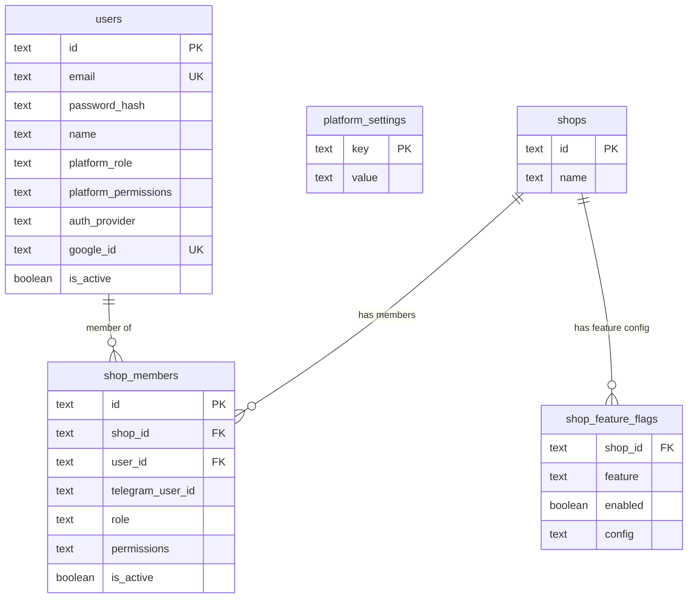
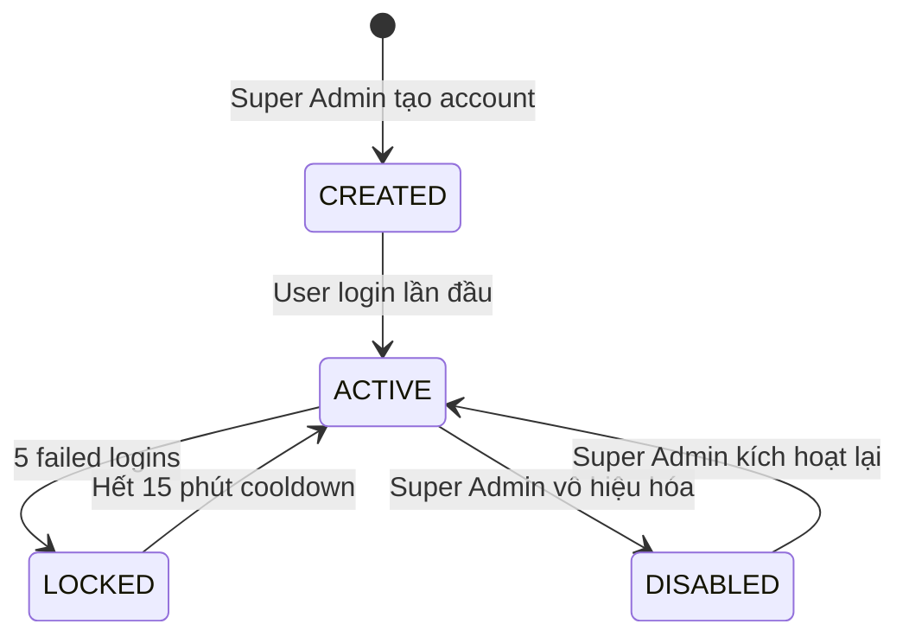
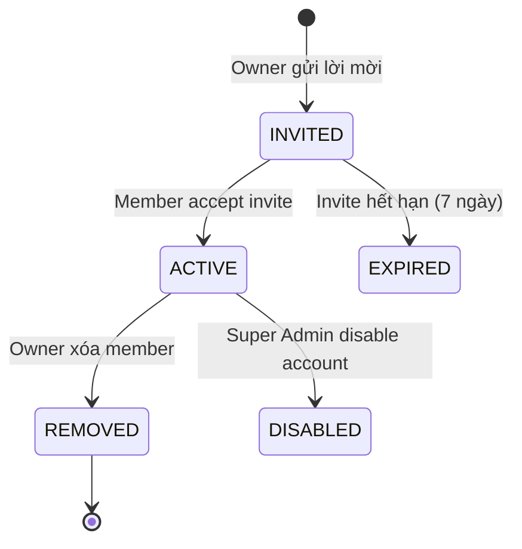

# Feature: Platform RBAC — Roles & Permissions (F-11)

> **🏷 SaaS-only** — Feature này chỉ dành cho phiên bản SaaS (multi-tenant). Standalone bot không bao gồm RBAC/CTV management.

**BE Tech Spec:** [feature_rbac_tech.md](../BE/feature_rbac_tech.md)
**Priority:** P0
**Status:** 📋 Spec

---

## 1. Mô tả

Hệ thống phân quyền 4 tầng cho CloudX Shop SaaS platform:

- **Platform level:** Super Admin → Super Moderator → Moderator
- **Shop level:** Owner → Co-Admin → CTV

Tất cả quyền Moderator / Super Moderator đều **configurable** bởi Super Admin (không hard-code). Role chỉ ảnh hưởng **default permissions** khi tạo mới.

Auth system hỗ trợ **hybrid login**: email + password HOẶC Google OAuth 2.0. Shop admin giai đoạn 1 vẫn dùng API key (backward compat).

---

## 2. Use Cases + Edge Cases

### Use Cases

| # | Actor | Hành động | Kết quả |
|---|-------|-----------|---------| 
| 1 | Super Admin | Tạo Moderator mới (email + role) | Account tạo, default permissions applied |
| 2 | Super Admin | Toggle permission cho Moderator | Permission ON/OFF ngay lập tức |
| 3 | Super Admin | Tạo Super Moderator | Account tạo, Mod defaults + `platform_moderators_manage` ON |
| 4 | Super Moderator | Tạo Moderator mới | Được phép (vì có `platform_moderators_manage`) |
| 5 | Super Moderator | Tạo Super Moderator | Không được phép — chỉ Super Admin mới tạo Super Mod |
| 6 | Moderator | Login bằng email + pass | JWT token, redirect dashboard |
| 7 | Moderator | Login bằng Google OAuth | Google verify → JWT token, redirect dashboard |
| 8 | Moderator | Truy cập feature bị revoke | 403 → redirect về dashboard, toast "Bạn không có quyền" |
| 9 | Owner | Mời Co-Admin mới (email) | Invite sent, co-admin chọn permissions |
| 10 | Owner | Set permissions cho Co-Admin | Co-Admin chỉ thấy/dùng features được grant |
| 11 | Owner | Mời CTV (Telegram user ID) | CTV link → shop, giới hạn quyền cố định |
| 12 | Co-Admin | Truy cập feature không được grant | 403 → hiện message "Liên hệ Owner để mở quyền" |
| 13 | User | Login Google với email chưa register | 403 "Email chưa được đăng ký trong hệ thống" |
| 14 | Super Admin | Vô hiệu hóa account Moderator | `is_active = false`, session bị revoke ngay |
| 15 | Owner | Xóa Co-Admin khỏi shop | Co-Admin mất quyền truy cập shop ngay |

### Edge Cases

| # | Category | Case | Xử lý |
|---|----------|------|-------|
| 1 | Security | Login sai password 5 lần liên tiếp | Lock 15 phút, toast "Tài khoản bị khóa tạm thời" |
| 2 | Security | JWT expired mid-session | Auto-refresh token (silent). Nếu refresh fail → redirect login |
| 3 | Data Integrity | Super Admin revoke permission đang dùng | Real-time: next API call → 403. UI: disable feature section |
| 4 | Concurrency | 2 admins update cùng shop data | Last-write-wins (optimistic). Toast "Dữ liệu đã được cập nhật bởi người khác" |
| 5 | Cross-Feature | Owner transfer ownership | Chỉ Super Admin thực hiện — đổi role `owner` ↔ `admin` |
| 6 | Data Integrity | Xóa Moderator đang online | Session invalidate → redirect login. Pending actions fail gracefully |
| 7 | Security | Google OAuth email không khớp existing account | Reject login. Phải dùng email đã register |
| 8 | Cross-Feature | Owner rời shop → chỉ còn Co-Admins | Block: Owner không thể rời shop. Phải transfer ownership trước |
| 9 | Validation | Invite email đã là member | 400 "Email đã là thành viên của shop" |
| 10 | Validation | Invite CTV with invalid Telegram ID | 400 "Telegram User ID không hợp lệ" |
| 11 | Security | Super Mod cố tạo Super Mod | 403 "Chỉ Super Admin có thể tạo Super Moderator" |
| 12 | Data Integrity | Deactivate user có pending actions | Pending actions complete (idempotent), no new actions allowed |
| 13 | Cross-Feature | Shop bị xóa → members mất quyền | Cascade: xóa tất cả shop_members records |
| 14 | Security | Brute force Google OAuth callback | Rate limit callback endpoint: 10 req/min per IP |

### Flow Diagrams

#### Login Flow

```
User → Login Page
  ├── [Email + Password]
  │     ├── Validate credentials
  │     ├── ✅ Success → Generate JWT → Redirect Dashboard
  │     └── ❌ Fail → "Email hoặc mật khẩu không đúng"
  │           └── 5 fails → Lock 15 min
  │
  └── [Google OAuth]
        ├── Redirect Google consent
        ├── Google callback → get email
        ├── Check email in `users` table
        ├── ✅ Found → Generate JWT → Redirect Dashboard
        └── ❌ Not found → "Email chưa được đăng ký"
```

#### Permission Check Flow

```
API Request → Auth Middleware
  ├── Extract JWT / API Key
  ├── Identify user + role
  │
  ├── Super Admin → ✅ ALLOW (always)
  │
  ├── Super Mod / Mod → Check platformPermissions[]
  │     ├── Permission found → ✅ ALLOW
  │     └── Not found → ❌ 403
  │
  └── Shop Member → Check shop_members
        ├── Owner → ✅ ALLOW (all shop actions)
        ├── Co-Admin → Check permissions[]
        │     ├── Found → ✅ ALLOW
        │     └── Not found → ❌ 403
        └── CTV → Check CTV_DEFAULT_PERMISSIONS
              ├── Found → ✅ ALLOW
              └── Not found → ❌ 403
```

#### Invite Co-Admin Flow

```
Owner → Settings → Team Members → [+ Mời Admin]
  → Nhập email → Chọn permissions (checkbox)
  → POST /shops/:id/members/invite
  → Email invitation sent
  → Co-Admin click link → Register/Login
  → Auto-join shop với permissions đã set
```

---

## 3. Screens & States

### Screen 1: Login Page

**Layout:** Centered card (max-width: 440px), split layout (desktop: left brand + right form)

| Element | Mô tả |
|---------|-------|
| **Logo** | CloudX Shop logo + tagline |
| **Email input** | Placeholder "email@example.com" |
| **Password input** | Toggle show/hide + "Quên mật khẩu?" link |
| **Login button** | Primary CTA "Đăng nhập" |
| **Divider** | "──── hoặc ────" |
| **Google button** | "🔵 Đăng nhập với Google" (outlined) |

| State | Hiển thị |
|-------|---------| 
| **Ready** | Form rỗng, cả 2 options enabled |
| **Loading** | Spinner trên button, form disabled |
| **Error** | Inline error dưới input: "Email hoặc mật khẩu không đúng" |
| **Locked** | Alert banner đỏ: "Tài khoản bị khóa. Thử lại sau {mm:ss}" |
| **Google Error** | Toast: "Email chưa được đăng ký trong hệ thống" |

### Screen 2: Platform User Management (Super Admin)

**Layout:** Sidebar > "Quản lý người dùng" > Table

| Element | Mô tả |
|---------|-------|
| **Header** | "Quản lý người dùng" + [+ Tạo người dùng] button |
| **Filter tabs** | [Tất cả] [Super Moderator] [Moderator] [Inactive] |
| **Users table** | Columns: Avatar, Tên, Email, Role, Trạng thái, Quyền, Actions |
| **Actions** | [Sửa quyền] [Vô hiệu hóa] button per row |

| State | Hiển thị |
|-------|---------|
| **Loading** | Skeleton table 5 rows |
| **Ready** | User list + role badges |
| **Empty** | Icon + "Chưa có thành viên nào. Tạo tài khoản đầu tiên." + CTA |
| **Error** | Toast: "Không thể tải danh sách" |

### Screen 3: Create / Edit User Modal

**Layout:** Modal 520px width

| Element | Mô tả |
|---------|-------|
| **Header** | "Tạo người dùng" / "Sửa quyền — {name}" |
| **Name input** | Required |
| **Email input** | Required, unique validation |
| **Role select** | Dropdown: Super Moderator / Moderator |
| **Permissions** | Checkbox list, auto-populated by role defaults |
| **Footer** | [Hủy] + [Tạo / Lưu] |

**Permission checkboxes:**

| Permission key | Label |
|---------------|-------|
| `platform_shops_read` | 👁 Xem tất cả shops |
| `platform_shops_create` | ➕ Tạo shops mới |
| `platform_shops_delete` | 🗑 Xóa shops |
| `platform_feature_config` | ⚙️ Config features per shop |
| `platform_metrics_read` | 📊 Xem metrics toàn platform |
| `platform_moderators_manage` | 👥 Quản lý moderators |
| `shop_data_write` | ✏️ Sửa/xóa data shop |
| `shop_settings_write` | 🔧 Sửa settings shop |
| `shop_member_manage` | 🤝 Quản lý shop members |

> Khi chọn role → auto-check defaults. Super Admin có thể toggle bất kỳ checkbox nào.

### Screen 4: Shop Team Members (Owner view)

**Layout:** Shop Settings → Tab "Team Members"

| Element | Mô tả |
|---------|-------|
| **Header** | "Thành viên shop" + [+ Mời Admin] [+ Thêm CTV] |
| **Members table** | Avatar, Tên, Role badge, Quyền summary, Actions |
| **Owner badge** | 👑 Owner (không có actions) |
| **Admin row** | [Sửa quyền] [Xóa] |
| **CTV row** | [Xóa] |

| State | Hiển thị |
|-------|---------| 
| **Loading** | Skeleton 3 rows |
| **Ready** | Members list, owner trên cùng |
| **Empty** | Chỉ Owner. "Mời thành viên để quản lý shop cùng bạn" + CTA |
| **Error** | Toast |

### Screen 5: Invite Co-Admin Modal

**Layout:** Modal 520px

| Element | Mô tả |
|---------|-------|
| **Email input** | Required |
| **Permissions** | Checkbox list (shop-level permissions) |
| **Footer** | [Hủy] + [Gửi lời mời] |

**Shop permission checkboxes:**

| Permission key | Label |
|---------------|-------|
| `products_manage` | 📦 Quản lý sản phẩm + credentials |
| `orders_manage` | 📋 Quản lý đơn hàng (xác nhận, hủy, giao) |
| `discounts_manage` | 🎟 Quản lý mã giảm giá |
| `bank_manage` | 🏦 Quản lý ngân hàng |
| `link_checker_use` | 🔗 Sử dụng Link Checker |
| `settings_manage` | ⚙️ Cài đặt shop |
| `bot_manage` | 🤖 Config bot token |
| `ctv_manage` | 👥 Quản lý CTVs |

### Screen 6: Feature Config per Shop (Super Admin / Moderator)

**Layout:** Platform Dashboard → Shop list → Shop detail → "Feature Config" tab

| Element | Mô tả |
|---------|-------|
| **Global toggle** | Link Checker: ON/OFF switch (ảnh hưởng tất cả shops) |
| **Default config** | Daily quota input, Max batch input |
| **Shop overrides** | Table: Shop name, Enabled toggle, Quota, Batch, Actions |
| **Add override** | [+ Override cho shop cụ thể] |

---

## 4. Domain Model



---

## 5. API Endpoints

### Auth

| Method | Endpoint | Mô tả |
|--------|----------|-------|
| POST | `/api/auth/login` | Email + password login |
| GET | `/api/auth/google` | Redirect to Google OAuth |
| GET | `/api/auth/google/callback` | Google OAuth callback |
| POST | `/api/auth/refresh` | Refresh JWT token |
| POST | `/api/auth/logout` | Invalidate session |
| POST | `/api/auth/forgot-password` | Send reset email |
| POST | `/api/auth/reset-password` | Reset with token |

### Platform User Management

| Method | Endpoint | Mô tả |
|--------|----------|-------|
| GET | `/api/platform/users` | List all platform users |
| POST | `/api/platform/users` | Create user (Super Admin / Super Mod) |
| PUT | `/api/platform/users/:id` | Update user info + permissions |
| PUT | `/api/platform/users/:id/permissions` | Update permissions only |
| DELETE | `/api/platform/users/:id` | Deactivate user |

### Shop Members

| Method | Endpoint | Mô tả |
|--------|----------|-------|
| GET | `/api/shops/:id/members` | List shop members |
| POST | `/api/shops/:id/members/invite` | Invite co-admin (email) |
| POST | `/api/shops/:id/members/ctv` | Add CTV (telegram ID) |
| PUT | `/api/shops/:id/members/:memberId/permissions` | Update member permissions |
| DELETE | `/api/shops/:id/members/:memberId` | Remove member |

### Feature Config

| Method | Endpoint | Mô tả |
|--------|----------|-------|
| GET | `/api/platform/features/:feature` | Global config + shop overrides |
| PUT | `/api/platform/features/:feature` | Update global config |
| PUT | `/api/platform/features/:feature/shops/:shopId` | Per-shop override |
| DELETE | `/api/platform/features/:feature/shops/:shopId` | Remove override |

---

## 6. Error Codes

### Auth API Errors

| Code | Error Code | Message | Trigger |
|------|-----------|---------|---------|
| 400 | `EMAIL_REQUIRED` | "Email là bắt buộc" | Body thiếu email |
| 400 | `PASSWORD_REQUIRED` | "Mật khẩu là bắt buộc" | Body thiếu password |
| 400 | `INVALID_EMAIL_FORMAT` | "Email không hợp lệ" | Email sai format |
| 401 | `INVALID_CREDENTIALS` | "Email hoặc mật khẩu không đúng" | Wrong email/password |
| 403 | `ACCOUNT_LOCKED` | "Tài khoản bị khóa tạm thời. Thử lại sau {mm:ss}" | 5 failed login attempts |
| 403 | `ACCOUNT_DISABLED` | "Tài khoản đã bị vô hiệu hóa" | `is_active = false` |
| 403 | `EMAIL_NOT_REGISTERED` | "Email chưa được đăng ký trong hệ thống" | Google OAuth unregistered email |
| 403 | `PERMISSION_DENIED` | "Bạn không có quyền thực hiện thao tác này" | Insufficient permissions |
| 401 | `TOKEN_EXPIRED` | "Phiên đăng nhập hết hạn" | JWT expired |

### User Management Errors

| Code | Error Code | Message | Trigger |
|------|-----------|---------|---------|
| 400 | `DUPLICATE_EMAIL` | "Email đã tồn tại" | Create user with existing email |
| 400 | `INVALID_ROLE` | "Role không hợp lệ" | Invalid role value |
| 403 | `ONLY_SUPER_ADMIN_CREATE_SUPER_MOD` | "Chỉ Super Admin có thể tạo Super Moderator" | Super Mod tries to create Super Mod |
| 400 | `CANNOT_DEACTIVATE_SUPER_ADMIN` | "Không thể vô hiệu hóa Super Admin" | Attempt to deactivate SA |

### Shop Member Errors

| Code | Error Code | Message | Trigger |
|------|-----------|---------|---------|
| 400 | `ALREADY_MEMBER` | "Email đã là thành viên của shop" | Invite existing member |
| 400 | `INVALID_TELEGRAM_ID` | "Telegram User ID không hợp lệ" | Bad telegram ID |
| 400 | `OWNER_CANNOT_LEAVE` | "Owner không thể rời shop. Transfer ownership trước" | Owner self-remove |
| 400 | `MAX_ADMINS_REACHED` | "Số lượng admin tối đa đã đạt" | Shop admin limit |

### Warning Toasts

| Type | Message | Trigger |
|------|---------|---------|
| Warning | "Dữ liệu đã được cập nhật bởi người khác" | Concurrent edit detected |
| Info | "Quyền đã được thay đổi. Một số tính năng có thể bị hạn chế" | Permission revoked |
| Success | "Lời mời đã được gửi tới {email}" | Invite sent |

### Form Inline Errors

| Field | Validation | Inline error |
|-------|-----------|-------------|
| Email | Required | "Vui lòng nhập email" |
| Email | Format | "Email không hợp lệ" |
| Email | Duplicate | "Email đã tồn tại" |
| Name | Required | "Vui lòng nhập tên" |
| Name | Max length | "Tên không quá 100 ký tự" |
| Password | Min length | "Mật khẩu tối thiểu 8 ký tự" |
| Role | Required | "Vui lòng chọn role" |

---

## 7. Analytics Events

| Event | Trigger | Properties |
|-------|---------|-----------| 
| `auth_login_email` | Login bằng email/pass | `{ userId, success }` |
| `auth_login_google` | Login bằng Google OAuth | `{ userId, success }` |
| `auth_login_failed` | Login thất bại | `{ email, method, reason }` |
| `auth_account_locked` | Account bị lock | `{ email, failedAttempts }` |
| `rbac_user_created` | Tạo platform user mới | `{ creatorId, newUserId, role }` |
| `rbac_user_permission_changed` | Sửa permissions | `{ userId, targetUserId, added[], removed[] }` |
| `rbac_user_deactivated` | Vô hiệu hóa user | `{ userId, targetUserId }` |
| `rbac_shop_member_invited` | Invite co-admin | `{ shopId, inviterId, email, role }` |
| `rbac_shop_member_removed` | Xóa member | `{ shopId, removerId, memberId }` |
| `rbac_shop_member_permission_changed` | Sửa quyền member shop | `{ shopId, ownerId, memberId, added[], removed[] }` |
| `rbac_feature_config_changed` | Config feature flag | `{ feature, scope, shopId?, changes }` |

---

## 8. State Machine

### User Account Lifecycle



### Shop Membership Lifecycle



### 8.1 Timeout Specification

| Item | Giá trị | Behavior khi hết hạn |
|------|:-------:|---------------------|
| **JWT access token** | 24 giờ | Auto-refresh via refresh token |
| **Refresh token** | 7 ngày | Force re-login |
| **Account lock cooldown** | 15 phút | Auto-unlock → ACTIVE |
| **Shop invite** | 7 ngày | Auto-expire → EXPIRED, cần mời lại |
| **Login rate limit** | 5 attempts / 15 phút | Account → LOCKED |

### 8.2 Scenarios by Status — User Account

#### `CREATED` — Tài khoản đã tạo (3 scenarios)

| # | Scenario | Actor | Trigger | Kết quả |
|---|----------|-------|---------|---------|
| AU1 | Super Admin tạo account | Super Admin | User Management → Create User | Account `CREATED`, gửi credentials |
| AU2 | User login lần đầu | User | Nhập email/password hoặc Google OAuth | → `ACTIVE` |
| AU3 | User không login trong 30 ngày | System | Account chưa bao giờ login | Giữ `CREATED`, Super Admin có thể xóa |

#### `ACTIVE` — Đang hoạt động (5 scenarios)

| # | Scenario | Actor | Trigger | Kết quả |
|---|----------|-------|---------|---------|
| AA1 | Login thành công | User | Email/password hoặc Google OAuth | JWT issued, redirect dashboard |
| AA2 | Thay đổi permissions | Super Admin | Edit user → thay đổi checkboxes | Permissions updated, force JWT refresh |
| AA3 | Login fail 5 lần | User | Sai password 5 lần liên tiếp | → `LOCKED` (15 phút) |
| AA4 | Super Admin vô hiệu hóa | Super Admin | User Management → Disable | → `DISABLED` |
| AA5 | User đổi password | User | Account Settings → Change Password | Password updated, revoke all sessions |

#### `LOCKED` — Bị khóa tạm (3 scenarios)

| # | Scenario | Actor | Trigger | Kết quả |
|---|----------|-------|---------|---------|
| AL1 | Auto-unlock hết cooldown | System | 15 phút trôi qua | → `ACTIVE` |
| AL2 | User thử login khi locked | User | Nhập credentials khi đang locked | Reject "Tài khoản bị khóa. Thử lại sau X phút" |
| AL3 | Super Admin unlock thủ công | Super Admin | User Management → Unlock | → `ACTIVE` ngay lập tức |

#### `DISABLED` — Vô hiệu hóa (3 scenarios)

| # | Scenario | Actor | Trigger | Kết quả |
|---|----------|-------|---------|---------|
| AD1 | User thử login | User | Nhập credentials | Reject "Tài khoản đã bị vô hiệu hóa" |
| AD2 | Super Admin kích hoạt lại | Super Admin | User Management → Enable | → `ACTIVE` |
| AD3 | JWT đang active bị revoke | System | Disable trigger → force logout | Tất cả sessions bị revoke |

> **Tổng User Account: 14 scenarios** (3 CREATED + 5 ACTIVE + 3 LOCKED + 3 DISABLED)

### 8.3 Scenarios by Status — Shop Membership

#### `INVITED` — Đã mời (3 scenarios)

| # | Scenario | Actor | Trigger | Kết quả |
|---|----------|-------|---------|---------|
| MI1 | Owner gửi invite | Owner | Team → Invite Co-Admin | Email sent, status `INVITED` |
| MI2 | Member accept invite | Member | Click link trong email → login | → `ACTIVE` |
| MI3 | Invite hết hạn | System | 7 ngày không accept | → `EXPIRED`, cần mời lại |

#### `ACTIVE` — Thành viên đang hoạt động (3 scenarios)

| # | Scenario | Actor | Trigger | Kết quả |
|---|----------|-------|---------|---------|
| MA1 | Owner sửa quyền member | Owner | Team → Edit Permissions | Permissions updated |
| MA2 | Owner xóa member | Owner | Team → Remove Member | → `REMOVED` |
| MA3 | Super Admin disable account | Super Admin | User Management → Disable | → `DISABLED` |

#### `EXPIRED` / `REMOVED` / `DISABLED` — Terminal states (2 scenarios)

| # | Scenario | Actor | Trigger | Kết quả |
|---|----------|-------|---------|---------|
| ME1 | Owner mời lại (expired) | Owner | Team → Re-invite | Tạo invite mới → `INVITED` |
| ME2 | Member bị remove truy cập shop | Member | Thử truy cập dashboard shop | Reject "Bạn không còn quyền truy cập shop này" |

> **Tổng Shop Membership: 8 scenarios** (3 INVITED + 3 ACTIVE + 2 terminal)

---

## 9. Caching Strategy

| Data | Cache Location | TTL | Invalidation |
|------|---------------|-----|-------------|
| JWT token | Cookie (httpOnly) | 24h | Logout / revoke |
| Refresh token | DB + Cookie | 7 ngày | Logout / revoke |
| User permissions | JWT payload | Until token refresh | Permission change → force refresh |
| Shop members list | In-memory | 5 phút | Member add/remove → invalidate |
| Feature flags | In-memory | 10 phút | Config change → invalidate |

---

## 10. Acceptance Criteria

- [ ] Hybrid login: email + password VÀ Google OAuth cùng 1 page
- [ ] 3 platform roles: Super Admin, Super Moderator, Moderator
- [ ] Tất cả Mod/Super Mod permissions configurable bởi Super Admin
- [ ] Role chỉ set default permissions, không hard-code behavior
- [ ] Shop: 1 Owner + n Co-Admins + n CTVs
- [ ] Owner set granular permissions cho Co-Admin (8 permissions)
- [ ] JWT auth với auto-refresh
- [ ] Account lock sau 5 failed logins (15 phút cooldown)
- [ ] Google OAuth không cho self-register
- [ ] Feature config: global toggle + per-shop override
- [ ] Link Checker access chain: global → shop flag → user permission
- [ ] Backward compat: API key vẫn hoạt động cho shop admin (Phase 1)

---

## State Coverage Matrix

| Screen | Loading | Ready/Data | Error | Empty |
|--------|---------|-----------|-------|-------|
| Login Page | ✅ Spinner on button | ✅ Form + 2 options | ✅ Inline + Locked | N/A |
| User Management | ✅ Skeleton table | ✅ User list + badges | ✅ Toast | ✅ "Chưa có thành viên" |
| Create/Edit User | N/A | ✅ Form + checkboxes | ✅ Inline + toast | N/A |
| Shop Team Members | ✅ Skeleton | ✅ Members list | ✅ Toast | ✅ Chỉ Owner |
| Invite Co-Admin | N/A | ✅ Form + checkboxes | ✅ Inline | N/A |
| Feature Config | ✅ Skeleton | ✅ Toggle + table | ✅ Toast | ✅ "Chưa có override" |
