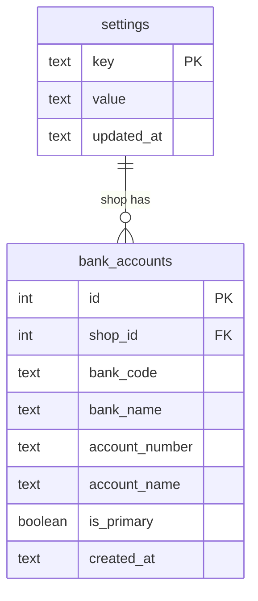
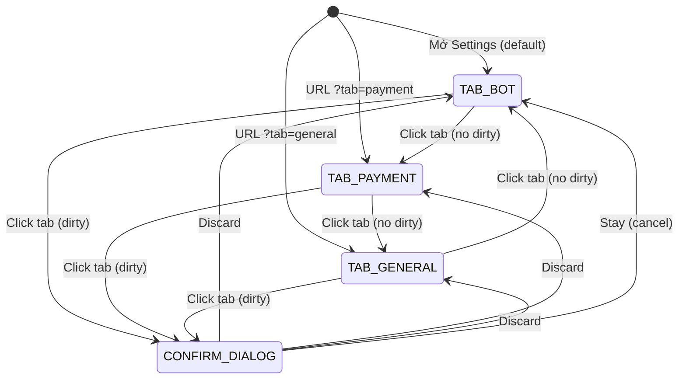
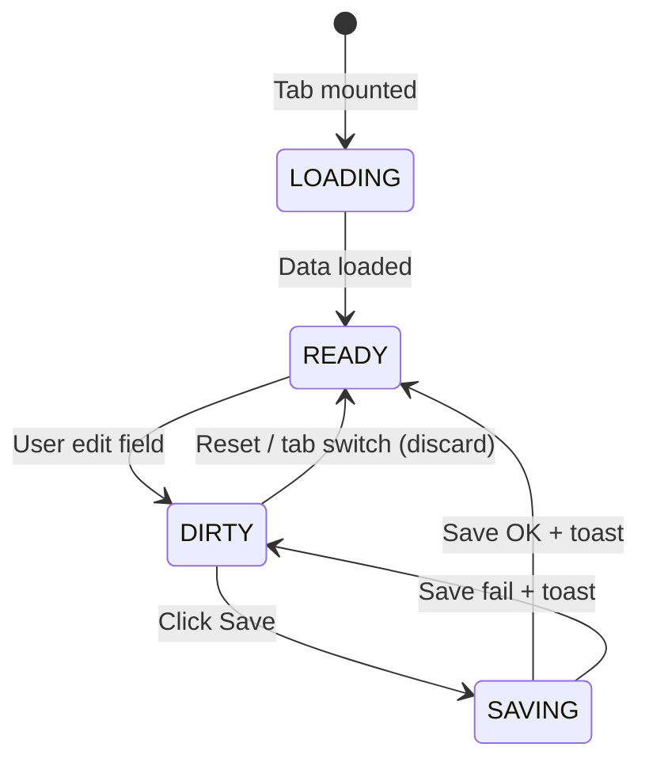

# Feature: Unified Settings (F-09)

**BE Tech Spec:** [feature_settings_tech.md](../BE/feature_settings_tech.md)
**Priority:** P1
**Status:** 🔄 Redesign (Hybrid 3-Tab)

---

## 1. Mô tả

Admin cấu hình **tất cả settings** của shop trong **1 trang duy nhất với 3 horizontal tabs**. Thay vì phân mảnh config qua nhiều màn hình riêng biệt, Settings page tập trung mọi cấu hình tại 1 entry point.

**Entry point:** Sidebar → "⚙️ Cài đặt" → `/settings?tab=bot|payment|general`

### Tab Structure

| Tab | Icon + Label | Nội dung | Sections |
|:---:|-------------|----------|----------|
| 1 | 🤖 Bot & Thanh toán VND | Kết nối bot + nhận thanh toán VND | Bot Token + SePay Webhook + Bank Accounts |
| 2 | 💳 Thanh toán quốc tế | Cấu hình payment methods quốc tế | USDT (TRC20) + PayPal |
| 3 | ⚙️ Chung | Cài đặt chức năng + ngôn ngữ | Language Selection + Link Checker |

> **Lý do gộp Bot + SePay + Bank:** Cả 3 là prerequisites cho shop activation Level 1+, admin setup cùng lúc khi onboard. Bank account **phải trùng** với bank đã setup webhook trên SePay — nằm cùng tab giúp admin thấy rõ connection.

### Responsive Behavior

| Breakpoint | Tab hiển thị |
|-----------|--------------|
| ≥1024px | Horizontal tabs: icon + full text |
| 768–1023px | Horizontal tabs: icon + abbreviated text |
| ≤767px | Dropdown select thay tabs |

---

## 2. Use Cases + Edge Cases

### Use Cases

| # | Actor | Hành động | Kết quả |
|---|-------|-----------|---------|
| 1 | Admin | Mở Settings lần đầu | Default tab = "Bot & VND", form pre-filled defaults |
| 2 | Admin | Switch tab khi có unsaved changes | Confirm dialog "Chưa lưu thay đổi. Bỏ qua?" |
| 3 | Admin | Lưu settings (partial update) | Chỉ fields thay đổi được update, toast success |
| 4 | Admin | Toggle link checker on/off | `checker_enabled` flip, toast confirm |
| 5 | Admin | Cấu hình USDT wallet address | Validate TRC20 format → save → toast |
| 6 | Admin | Kết nối PayPal | Nhập Client ID/Secret → test connection → save |
| 7 | Admin | Thêm bank account | Nhập bank + số TK + chủ TK → confirm match SePay → save |
| 8 | Admin | Đổi primary bank | Click "Đặt Primary" trên bank khác → QR sẽ show bank mới |
| 9 | Admin | Thay đổi ngôn ngữ mặc định | Dropdown chọn ngôn ngữ → save → bot dùng language mới |
| 10 | Admin | Deeplink vào tab cụ thể | URL `/settings?tab=payment` → mở thẳng tab Thanh toán QT |
| 11 | Admin | Save settings khi mất mạng | Error toast, form giữ nguyên state |

### Edge Cases

**Admin-side:**

| # | Category | Case | Xử lý |
|---|----------|------|-------|
| 1 | Data Integrity | Key chưa có trong DB | Fallback: config.js → hardcoded defaults |
| 2 | Security | PUT key không nằm trong whitelist | Silently ignored |
| 3 | Data Integrity | Value rỗng | Allowed (clears setting, fallback chain) |
| 4 | Cross-Feature | Bank trên admin ≠ bank trên SePay | Warning: "Bank này có thể chưa được setup webhook trên SePay" |
| 5 | Validation | USDT address invalid format | Inline error: "Địa chỉ ví TRC20 không hợp lệ" |
| 6 | Validation | PayPal test connection fail | Inline error: "Client ID/Secret không hợp lệ" |
| 7 | UX | Switch tab khi dirty | Confirm dialog → discard hoặc stay |
| 8 | Data Integrity | Xóa primary bank khi chỉ có 1 bank | Block: "Cần ít nhất 1 tài khoản ngân hàng" |
| 9 | Cross-Feature | Xóa bank đang được SePay monitor | Warning: "Bank này đang nhận thanh toán. Xóa sẽ ảnh hưởng auto-confirm." |
| 10 | Concurrency | 2 admin cùng edit settings | Last-write-wins, toast "Cài đặt đã được cập nhật bởi admin khác" |
| 11 | UX | Tab URL param invalid | Fallback → tab đầu tiên (bot) |

---

## 3. Screens & States

### Tab Layout chung

```text
┌─────────────────────────────────────────────────────────────┐
│  Sidebar │  Cài đặt                                         │
│          │  ┌──────────────┬──────────────┬────────────────┐ │
│          │  │🤖 Bot & VND  │💳 Thanh toán │ ⚙️ Chung       │ │
│          │  │   (active)   │  quốc tế     │                │ │
│          │  └──────────────┴──────────────┴────────────────┘ │
│          │                                                   │
│          │  [Tab content area — scrollable]                  │
│          │                                                   │
└──────────┴───────────────────────────────────────────────────┘
```

---

### Tab 1: 🤖 Bot & Thanh toán VND

**3 sections stacked vertically, separated by dividers.**

#### Section 1.1: 🤖 Bot Telegram Token

> **Chi tiết flow:** [feature_shop_activation.md](feature_shop_activation.md) Section 4.2

| State | Hiển thị |
|-------|----------|
| Chưa có token | Input field + nút "Xác thực" (disabled khi rỗng) |
| Đang verify | Input disabled + spinner "Đang xác thực..." |
| Verify thành công | ✅ `@BotUsername` + badge "Đã kết nối" + nút "Đổi token" |
| Verify thất bại | ❌ Inline error "Không thể xác thực bot" + nút "Thử lại" |
| Đã có token | Hiện masked token `7000...DEF` + bot username + nút "Đổi" / "Xóa" |

##### Field Specification — Bot Token

| Field | Type | Required? | Default | Validation / Ghi chú |
|-------|------|-----------|---------|----------------------|
| Bot Token | text (password-style, toggle visibility) | Optional | null | Regex `^\d+:.+$`, verify qua Telegram `getMe` API. Rate limit 5/phút |

---

#### Section 1.2: 🔗 SePay Webhook

> **Chi tiết flow:** [feature_shop_activation.md](feature_shop_activation.md) Section 4.2

| State | Hiển thị |
|-------|----------|
| Chưa config | Input SePay API key + nút "Kết nối" |
| Đang test | Input disabled + spinner "Đang kiểm tra kết nối..." |
| Test thành công | ✅ Webhook URL (read-only + copy button) + badge "Đã kết nối" |
| Test thất bại | ❌ Inline error "API key không hợp lệ" + nút "Thử lại" |
| Đã config | Hiện webhook URL + nút "Đổi" / "Ngắt kết nối" |

##### Field Specification — SePay Webhook

| Field | Type | Required? | Default | Validation / Ghi chú |
|-------|------|-----------|---------|----------------------|
| SePay API Key | text (password-style) | Optional | null | Test connection bắt buộc trước khi lưu |
| Webhook URL | read-only + copy button | Auto-generated | `/webhook/sepay/{shopId}/{secret}` | Unique per shop |

---

#### Section 1.3: 🏦 Tài khoản nhận thanh toán

Bank hiển thị dạng **card list** (không phải table), max ~5 items.

> ⚠️ **Bank phải trùng với bank đã setup webhook trên SePay.** Nếu không, thanh toán sẽ không tự động xác nhận.

**Layout:**

```text
⚠️ Bank phải trùng với bank đã setup webhook trên SePay

┌──────────────────────────────────────────────┐
│ ★ Vietcombank                         Primary│
│   123456789 — NGUYEN VAN A                   │
│   [✏️ Sửa]  [🗑️ Xóa]                        │
├──────────────────────────────────────────────┤
│   MBBank                               Backup│
│   456789012 — NGUYEN VAN A                   │
│   [Đặt Primary]  [✏️ Sửa]  [🗑️ Xóa]         │
└──────────────────────────────────────────────┘
                            [+ Thêm tài khoản]
```

| State | Hiển thị |
|-------|----------|
| **Empty** | "Chưa có tài khoản ngân hàng" + CTA "Thêm tài khoản" |
| **Has banks** | Card list (primary ★ badge on top) |
| **Loading** | Skeleton cards (2 placeholders) |
| **Error** | Toast "Không thể tải danh sách tài khoản" |

##### Field Specification — Bank Account (Add/Edit Modal)

| Field | Type | Required? | Default | Validation / Ghi chú |
|-------|------|-----------|---------|----------------------|
| Ngân hàng | select (dropdown) | ✅ Required | — | Danh sách banks từ VietQR API |
| Số tài khoản | text | ✅ Required | — | Numeric, 6–20 digits |
| Chủ tài khoản | text (uppercase) | ✅ Required | — | Auto uppercase, 3–50 chars, no special |
| Đặt làm Primary | checkbox | Optional | `true` nếu bank đầu tiên | Bank primary = hiển thị trên QR cho khách |

##### Bank Account Use Cases

| # | Case | Flow | Kết quả |
|---|------|------|---------|
| 1 | Thêm bank đầu tiên | Add → auto primary | QR hiển thị bank này |
| 2 | Thêm bank thứ 2+ | Add → backup by default | Có thể "Đặt Primary" sau |
| 3 | Đổi primary bank | Click "Đặt Primary" → old primary thành backup | QR mới show bank mới |
| 4 | Xóa backup bank | Delete → toast success | Primary không ảnh hưởng |
| 5 | Xóa primary bank (còn backup) | Auto-promote backup lên primary | ❗ Confirm: "Bank khác sẽ trở thành primary" |
| 6 | Xóa bank cuối cùng | Block: "Cần ít nhất 1 tài khoản" | Nếu muốn bỏ hẳn → ngắt SePay |
| 7 | Đổi bank đang nhận orders | Warning: "Đơn pending sẽ vẫn hiện QR bank cũ" | Đơn mới show bank mới |
| 8 | Bank chưa có webhook SePay | Warning: "Đảm bảo bank này đã setup webhook trên SePay" | Admin tự verify |

> **Primary bank** = bank hiển thị trên VietQR cho khách. Chỉ có 1 primary tại 1 thời điểm.

---

### Tab 2: 💳 Thanh toán quốc tế

**2 sections: USDT + PayPal, separated by divider.**

#### Section 2.1: 🪙 USDT (TRC20)

> **Chi tiết:** [feature_international_payment.md](feature_international_payment.md) Section 3.4

| State | Hiển thị |
|-------|----------|
| **Empty** | "Chưa cấu hình ví USDT" + nút [＋ Thêm ví USDT] |
| **Configured** | Wallet address (masked: `TXyz...c123`) + badge 🟢 Active + [Sửa] [Xóa] |
| **Loading** | Skeleton row |
| **Error** | Toast "Không thể tải cấu hình USDT" |

##### Field Specification — USDT Config

| Field | Type | Required? | Default | Validation / Ghi chú |
|-------|------|-----------|---------|----------------------|
| Wallet Address | text (monospace) | ✅ Required | — | TRC20 format `^T[1-9A-HJ-NP-Za-km-z]{33}$`. Copy-paste friendly |
| Label | text | Optional | "USDT (TRC20)" | Tên hiển thị cho khách |

---

#### Section 2.2: 🅿️ PayPal

> **Chi tiết:** [feature_international_payment.md](feature_international_payment.md) Section 3.5

| State | Hiển thị |
|-------|----------|
| **Empty** | "Chưa cấu hình PayPal" + nút [＋ Kết nối PayPal] |
| **Configured** | PayPal email + badge 🟢 Connected + [Sửa] [Ngắt kết nối] |
| **Testing** | Spinner "Đang kiểm tra kết nối..." |
| **Error** | Inline error "Client ID/Secret không hợp lệ" |

##### Field Specification — PayPal Config

| Field | Type | Required? | Default | Validation / Ghi chú |
|-------|------|-----------|---------|----------------------|
| Client ID | text | ✅ Required | — | PayPal Business REST app Client ID |
| Client Secret | text (password-style) | ✅ Required | — | Test connection bắt buộc trước khi lưu |
| Mode | select | ✅ Required | `sandbox` | `sandbox` / `live`. Sandbox cho testing |
| PayPal Email | read-only | Auto-filled | — | Fill từ PayPal API sau khi test thành công |

---

#### Section 2.3: 💰 Phí giao dịch

> Shop config ai chịu phí giao dịch quốc tế (USDT network fee, PayPal fee).

| State | Hiển thị |
|-------|----------|
| **Default** | Radio "Shop chịu phí" selected |
| **Customer pays** | Radio "Khách chịu phí" selected + preview số tiền khách phải trả |

##### Field Specification — Transaction Fee Bearer

| Field | Type | Required? | Default | Validation / Ghi chú |
|-------|------|-----------|---------|----------------------|
| Ai chịu phí giao dịch? | radio | ✅ Required | `shop` | `shop` / `customer` |

**Tác động theo payment method:**

| Method | Fee estimate | Shop chịu | Khách chịu |
|--------|------------|-----------|------------|
| **USDT (TRC20)** | ~1–2 USDT network fee | Shop nhận ít hơn (khách gửi đúng giá SP) | Khách gửi giá SP + fee (hiện trên checkout) |
| **PayPal** | ~4.4% + $0.30 | Shop nhận ít hơn (PayPal trừ fee) | Giá SP cộng thêm % fee (hiện trên checkout) |
| **VietQR** | 0 (free) | Không ảnh hưởng | Không ảnh hưởng |

**UI trên checkout (khi khách chịu phí):**

```text
Sản phẩm:     $10.00
Phí PayPal:   + $0.74 (4.4% + $0.30)
─────────────────────
Tổng:         $10.74
```

> [!NOTE]
> - VietQR không có phí giao dịch → config này chỉ áp dụng cho USDT và PayPal
> - Fee estimate hiển thị trên checkout để khách biết trước
> - Config này áp dụng cho **toàn bộ shop** (không per-method)

---

### Tab 3: ⚙️ Chung

**2 sections: Language + Link Checker. 1 nút Save chung cho toàn bộ tab.**

#### Section 3.1: 🌐 Ngôn ngữ bot

> **Chi tiết:** [feature_language_selection.md](feature_language_selection.md)

| State | Hiển thị |
|-------|----------|
| **Default** | Dropdown chọn ngôn ngữ mặc định + checkbox multi-language |
| **Multi-language ON** | Thêm chip selector chọn ngôn ngữ hỗ trợ |

##### Field Specification — Language

| Field | Type | Required? | Default | Validation / Ghi chú |
|-------|------|-----------|---------|----------------------|
| Ngôn ngữ mặc định | select (dropdown) | ✅ Required | `vi` (Tiếng Việt) | Options: vi, en, zh |
| Cho phép khách chọn ngôn ngữ | checkbox | Optional | `false` | Bật = bot hiện `/language` command |
| Ngôn ngữ hỗ trợ | chip multi-select | Required khi multi ON | `[vi]` | Chọn từ danh sách ngôn ngữ available |

---

#### Section 3.2: 🔍 Link Checker

| Field | Type | Required? | Default | Validation / Ghi chú |
|-------|------|-----------|---------|----------------------|
| Bật Link Checker | Toggle | Optional | `'1'` (ON) | `'0'` = tắt API link check, trả 403 |
| Quota hàng ngày | Number | Optional | `20` | Max ScraperAPI calls / ngày. `0` = disable quota |
| Max batch | Number | Optional | `10` | Max URLs per batch. Phải > 0 |

**Access Control States:**

| State | Điều kiện | UI |
|-------|-----------|-----|
| **Platform Disabled** | `link_checker_global_enabled = '0'` | Banner 🔒 "Link Checker đã bị tắt toàn hệ thống" — fields disabled |
| **Shop Disabled** | `shop_feature_flags.link_checker.enabled = false` | Banner 🔒 "Tính năng đã bị tắt bởi quản trị viên" — fields disabled |
| **Enabled** | Cả global + shop flag = ON | Fields editable |
| **Quota Exhausted** | `daily_used >= checker_daily_quota` | Banner ⚠️ "Đã hết quota hôm nay ({used}/{quota})" — quota field hiện đỏ |

---

## 4. Domain Model



> Settings = key-value store. Bank accounts = structured table (1 shop : N banks, 1 primary).

---

## 5. API Endpoints

| Method | Path | Mô tả |
|--------|------|-------|
| GET | `/api/admin/settings` | Get all settings (merged with defaults) |
| PUT | `/api/admin/settings` | Update settings (partial, whitelisted keys) |
| GET | `/api/admin/bank-accounts` | List bank accounts (shop scope) |
| POST | `/api/admin/bank-accounts` | Add bank account |
| PUT | `/api/admin/bank-accounts/:id` | Update bank account |
| DELETE | `/api/admin/bank-accounts/:id` | Delete bank account |
| PUT | `/api/admin/bank-accounts/:id/primary` | Set as primary bank |

### Config Priority Chain

```text
1. settings table (DB, runtime) ← admin panel PUT
2. config.js (env vars)         ← deploy-time
3. hardcoded defaults           ← code-level
```

### Whitelisted Keys

```text
checker_enabled, checker_daily_quota, checker_max_batch,
default_language, multi_language_enabled, supported_languages
```

> **Bot Token & SePay** quản lý qua [feature_shop_activation.md](feature_shop_activation.md). USDT & PayPal qua [feature_international_payment.md](feature_international_payment.md).

---

## 6. Error Codes

### Admin API errors (cập nhật settings)

| Code | Error Code | Message | Trigger |
|------|-----------|---------|--------|
| 400 | `VALIDATION_ERROR` | "Quota phải ≥ 0" | `checker_daily_quota` < 0 |
| 400 | `VALIDATION_ERROR` | "Max batch phải lớn hơn 0" | `checker_max_batch` ≤ 0 |
| 400 | `BANK_REQUIRED` | "Số tài khoản là bắt buộc" | Thiếu account_number |
| 400 | `BANK_DUPLICATE` | "Tài khoản này đã tồn tại" | Trùng bank_code + account_number |
| 400 | `CANNOT_DELETE_LAST_BANK` | "Cần ít nhất 1 tài khoản" | Xóa bank cuối cùng |
| 401 | — | "Unauthorized" | API key sai/thiếu |
| 500 | `INTERNAL_ERROR` | Server error | DB/runtime error |

### Admin warning toasts

| Type | Message | Trigger |
|------|---------|---------|
| ⚠️ Warning | "Quota = 0 sẽ tắt hoàn toàn Link Checker cho shop này" | Save `checker_daily_quota = 0` khi checker bật |
| ⚠️ Warning | "Checker đang tắt — quota/batch sẽ không có hiệu lực" | Save quota/batch khi `checker_enabled = false` |
| ⚠️ Warning | "Đảm bảo bank này đã setup webhook trên SePay" | Thêm bank account mới |
| ⚠️ Warning | "Đơn pending sẽ vẫn hiện QR bank cũ" | Đổi primary bank khi có orders pending |
| ℹ️ Info | "Bank khác sẽ trở thành primary" | Xóa primary bank (còn backup) |
| ✅ Success | "Đã lưu cài đặt thành công" | Save OK |
| ✅ Success | "Đã thêm tài khoản ngân hàng" | Add bank OK |
| ✅ Success | "Đã đặt làm tài khoản chính" | Set primary OK |
| ❌ Error | "Lưu thất bại — vui lòng thử lại" | Save fail (500/network) |

### Admin form inline errors

| Field | Validation | Inline error message |
|-------|-----------|---------------------|
| Quota hàng ngày | < 0 | "Quota phải ≥ 0" |
| Max batch | ≤ 0 | "Max batch phải lớn hơn 0" |
| Số tài khoản | empty | "Vui lòng nhập số tài khoản" |
| Số tài khoản | non-numeric | "Số tài khoản chỉ chứa số" |
| Chủ tài khoản | empty | "Vui lòng nhập tên chủ tài khoản" |
| USDT Address | invalid TRC20 | "Địa chỉ ví TRC20 không hợp lệ" |
| PayPal Client ID | empty | "Vui lòng nhập Client ID" |

---

## 7. Analytics Events

| Event | Trigger | Properties |
|-------|---------|-----------|
| `settings_view` | Mở tab Cài đặt | `{ activeTab }` |
| `settings_tab_switch` | Chuyển tab | `{ from, to }` |
| `settings_save` | Save thành công | `{ tab, updatedKeys, count }` |
| `settings_save_fail` | Save thất bại | `{ tab, error }` |
| `settings_checker_toggle` | Toggle checker on/off | `{ enabled }` |
| `settings_bank_add` | Thêm bank account | `{ bankCode }` |
| `settings_bank_delete` | Xóa bank account | `{ bankCode, wasPrimary }` |
| `settings_bank_set_primary` | Đổi primary bank | `{ bankCode }` |
| `settings_language_change` | Đổi ngôn ngữ mặc định | `{ from, to }` |

---

## 8. State Machine

### Tab Navigation State



### Per-Tab Form State



---

## 9. Caching Strategy

| Data | Cache | TTL |
|------|-------|-----|
| Settings (key-value) | No cache (per-request) | — |
| Bank accounts | No cache (per-request) | — |
| VietQR bank list | Local cache | 24h |

> Settings & bank accounts hiếm khi thay đổi, query nhẹ. Fetch mỗi lần mở tab.

---

## 10. Acceptance Criteria

- [ ] 3 horizontal tabs: Bot & VND, Thanh toán QT, Chung
- [ ] URL sync: `?tab=` query param, deeplink support
- [ ] Dirty state tracking per tab + confirm dialog on switch
- [ ] Bot Token: verify via Telegram API, show connected status
- [ ] SePay Webhook: test connection, show webhook URL
- [ ] Bank Accounts: card list, add/edit/delete, primary selection
- [ ] Warning: "Bank phải trùng với bank trên SePay"
- [ ] USDT: TRC20 address validation
- [ ] PayPal: Client ID/Secret test connection
- [ ] Language: dropdown + multi-language toggle
- [ ] Link Checker: toggle + quota + max batch
- [ ] Access control: platform/shop disabled banners
- [ ] Responsive: tabs → dropdown on mobile
- [ ] Loading/saving/error states per tab

---

## State Coverage Matrix

| Screen | Loading | Ready/Data | Error | Empty |
|--------|---------|-----------|-------|-------|
| Tab 1 — Bot Token | ✅ Skeleton | ✅ Connected / No Token | ✅ Verify fail | ✅ No Token (CTA) |
| Tab 1 — SePay | ✅ Skeleton | ✅ Configured / No Config | ✅ Test fail | ✅ No Config (CTA) |
| Tab 1 — Bank Accounts | ✅ Skeleton cards | ✅ Card list (primary ★) | ✅ Toast | ✅ "Chưa có TK" + CTA |
| Tab 2 — USDT | ✅ Skeleton | ✅ Configured card | ✅ Toast | ✅ "Chưa cấu hình" + CTA |
| Tab 2 — PayPal | ✅ Skeleton | ✅ Connected card | ✅ Inline error | ✅ "Chưa kết nối" + CTA |
| Tab 3 — Language | ✅ Skeleton | ✅ Dropdown + checkboxes | ✅ Toast | N/A (always has default) |
| Tab 3 — Link Checker | ✅ Skeleton | ✅ Toggle + fields | ✅ Toast | N/A (always has defaults) |
