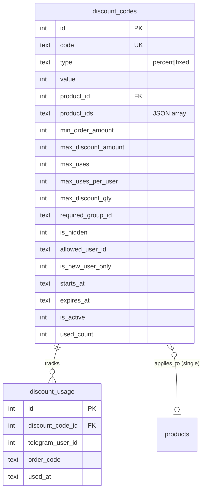
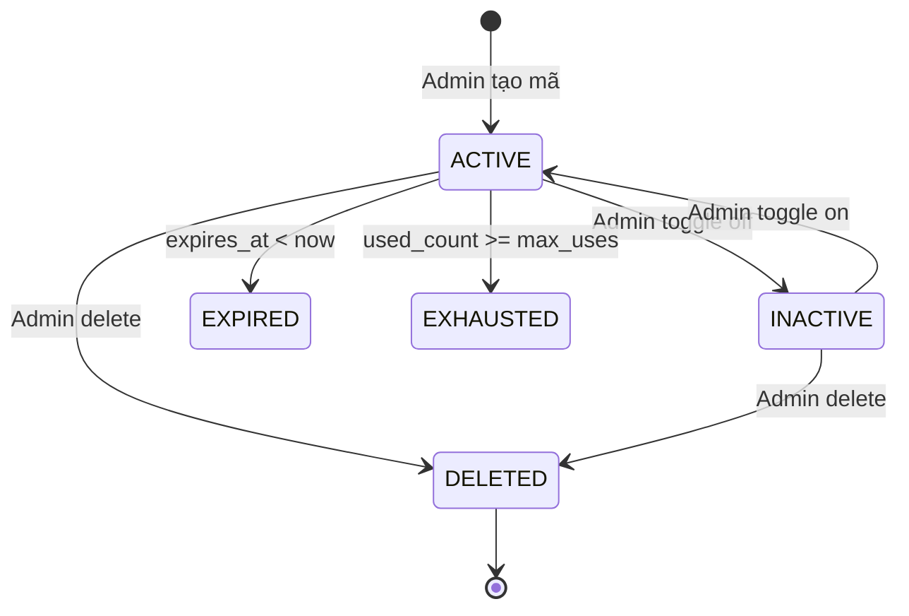

# Feature: Discount Codes (F-05)

> **Phase:** 1+  
> **Priority:** P1  
> **Status:** ✅ Done (v2.2)

---

## 1. Mô tả

Hệ thống mã giảm giá linh hoạt cho phép admin tạo và quản lý các chương trình khuyến mãi. Hỗ trợ giảm theo phần trăm hoặc số tiền cố định, áp dụng cho tất cả/1 SP/nhiều SP, với nhiều ràng buộc: group Telegram, user cụ thể, khách mới, ẩn mã, giới hạn lượt dùng, lịch trình bắt đầu/kết thúc.

**Giá trị cốt lõi:** Tăng conversion rate, khuyến khích mua hàng lần đầu (welcome discount), và tạo ưu đãi riêng cho các nhóm cộng đồng.

---

## 2. Use Cases + Edge Cases

### UC-5.1: Admin tạo mã giảm giá

- Admin vào tab Mã giảm giá → "Thêm mới"
- Nhập code, loại (percent/fixed), giá trị, chọn SP
- Set ràng buộc: group, user, ẩn, khách mới, lượt dùng, thời hạn
- Save → mã active ngay

### UC-5.2: User xem mã khả dụng (/discount)

- User gõ `/discount` → bot query `getActiveDiscountCodes()`
- Filter theo: `allowed_user_id`, `is_new_user_only`, `required_group_id`
- Hiển thị mã + điều kiện + label (🔒 Group, 👤 User, 🆕 Khách mới)

### UC-5.3: User nhập mã khi checkout

- Sau chọn SL → prompt "Bạn có mã giảm giá không?"
- Nếu user mới + có mã `is_new_user_only` → suggest "🎉 Bạn có mã dành cho khách mới!"
- User nhập mã → `validateDiscountCode()` → hiện preview → confirm

### UC-5.4: Multi-product discount

- Admin chọn nhiều SP khi tạo mã → lưu `product_ids` (JSON array)
- UI dạng chip/pill tag selector
- Validate: user chỉ được dùng nếu mua SP thuộc danh sách

### Edge Cases

| # | Category | Case | Xử lý |
|---|----------|------|-------|
| 1 | Security | Bot không phải thành viên group | `getChatMember` throw → catch → deny |
| 2 | Security | User nhập mã của người khác | Check `allowed_user_id` → reject |
| 3 | Data Integrity | Double usage cùng lúc | Check `discount_usage` count trước khi apply |
| 4 | Data Integrity | Mã hết lượt giữa flow checkout | Re-validate tại thời điểm tạo đơn |
| 5 | Concurrency | 2 user dùng mã cuối cùng | SQLite single-writer → first wins |
| 6 | Cross-Feature | SP bị xóa nhưng mã vẫn tồn tại | LEFT JOIN → `product_name` NULL → hiện "Tất cả" |
| 7 | Data Integrity | User mới dùng mã → mua xong → mã biến mất | `isNewUser()` check completed orders |
| 8 | Cross-Feature | Mã hết hạn giữa checkout flow | Re-validate khi webhook confirm payment |
| 9 | Security | Brute force mã giảm giá | Không rate limit (mã phải biết trước) |
| 10 | Data Integrity | `max_discount_qty` > quantity đơn | `Math.min(max_discount_qty, quantity)` |

---

## 3. Screens & States

### Bot — /discount listing

| State | Hiển thị |
|-------|---------|
| **Loading** | N/A (instant query) |
| **Data** | Danh sách mã theo nhóm: Tất cả SP, theo SP, multi-SP |
| **Empty** | "😔 Hiện tại chưa có mã giảm giá nào dành cho bạn" |
| **Error** | N/A (toast — lỗi getChatMember bị catch internal) |

### Bot — Discount prompt (checkout)

| State | Hiển thị |
|-------|---------|
| **Ready** | "Bạn có mã giảm giá không?" + 2 nút [Nhập mã] [Bỏ qua] |
| **New user hint** | Thêm "🎉 Bạn có mã giảm giá dành cho khách mới!" |
| **Valid code** | Preview: mã, SP, giá gốc, giảm, tổng thanh toán |
| **Invalid code** | Inline error + nút [Thử lại] [Bỏ qua] |

### Admin — Discount table

| State | Hiển thị |
|-------|---------|
| **Loading** | Skeleton table |
| **Data** | Table: Code, Type, Value, SP, Usage, Status, Badges |
| **Empty** | "Chưa có mã giảm giá nào" + CTA |

### Admin — Discount form modal

- Code, Type selector, Value, Product chip selector
- Các ràng buộc: min order, max discount, max uses, max/user, max qty
- Group ID, User ID, Ẩn checkbox, 🆕 Khách mới checkbox
- Date range (starts_at, expires_at)

---

## 4. Domain Model

---

## 5. API Endpoints

| Method | Path | Mô tả | Auth |
|--------|------|-------|------|
| GET | `/api/admin/discounts` | List all discounts | Admin |
| POST | `/api/admin/discounts` | Create discount | Admin |
| PUT | `/api/admin/discounts/:id` | Update discount | Admin |
| DELETE | `/api/admin/discounts/:id` | Delete discount | Admin |
| GET | `/api/admin/discounts/:id/usage` | Usage history | Admin |
| POST | `/api/admin/discounts/:id/recalc` | Recalculate used_count | Admin |

**Bot commands:** `/discount` — list available codes for user

---

## 6. Error Codes

| Code | Context | Message |
|------|---------|---------|
| Mã không tồn tại | Validate | "Mã giảm giá không tồn tại." |
| Mã bị vô hiệu | Validate | "Mã giảm giá đã bị vô hiệu hóa." |
| Chưa đến thời gian | Validate | "Mã giảm giá chưa đến thời gian áp dụng." |
| Hết hạn | Validate | "Mã giảm giá đã hết hạn." |
| Hết lượt | Validate | "Mã giảm giá đã hết lượt sử dụng." |
| Đạt giới hạn/user | Validate | "Bạn đã sử dụng mã này đạt giới hạn." |
| User restriction | Validate | "Mã này chỉ dành cho một người dùng cụ thể." |
| New user only | Validate | "Mã này chỉ dành cho khách hàng mới." |
| Group restriction | Validate | "Mã này chỉ dành cho thành viên nhóm." |
| Wrong product | Validate | "Mã này chỉ áp dụng cho: {product names}." |
| Min order | Validate | "Đơn hàng tối thiểu {amount}đ." |

---

## 7. Analytics Events

| Event | Trigger |
|-------|---------|
| `discount_code_created` | Admin tạo mã mới |
| `discount_code_used` | User dùng mã thành công |
| `discount_code_rejected` | User nhập mã bị reject |
| `discount_listing_viewed` | User gõ /discount |

> **Status:** Chưa implement — ghi nhận cho Phase 4+

---

## 8. State Machine

---

## 9. Caching Strategy

| Data | Cache | TTL |
|------|-------|-----|
| Active discount list | No cache | — |
| Group membership check | No cache (real-time) | — |
| isNewUser() query | No cache (real-time) | — |
| Discount validation | No cache | — |

---

## 10. Acceptance Criteria

- [x] Admin tạo mã percent/fixed với value
- [x] Mã áp dụng cho tất cả / 1 SP / nhiều SP (multi-product)
- [x] Multi-product: UI chip selector, `product_ids` JSON
- [x] Ràng buộc: max_uses, max_uses_per_user, min_order_amount, max_discount_amount
- [x] `max_discount_qty` — giới hạn số SP được giảm trong 1 đơn
- [x] `required_group_id` — chỉ thành viên group (bot cần là member)
- [x] `allowed_user_id` — chỉ user cụ thể
- [x] `is_hidden` — ẩn khỏi /discount nhưng vẫn dùng được
- [x] `is_new_user_only` — chỉ user chưa mua đơn thành công nào
- [x] New user được gợi ý mã ở bước checkout
- [x] Schedule: starts_at / expires_at
- [x] `/discount` hiển thị mã theo nhóm (tất cả SP, theo SP, multi-SP)
- [x] Badge hiển thị: 🔒 Group, 👤 User, 👁 Ẩn, 🆕 Mới
- [x] Validate toàn bộ constraints trước khi apply
