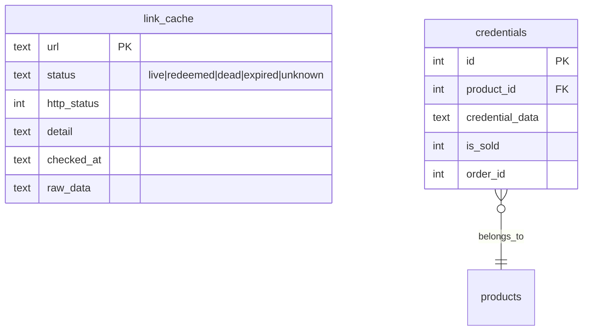
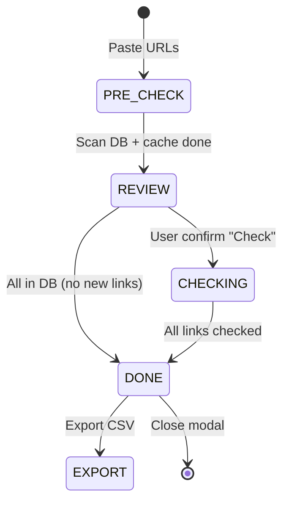

# Feature: Credential Link Checker (F-10)

> **Phase:** 3.5  
> **Priority:** P1  
> **Status:** ✅ Done (v2.2)

---

## 1. Mô tả

Kiểm tra trạng thái link credential hàng loạt (batch ≤100 URLs). Sử dụng multi-strategy approach: regex URL analysis → fetch HTTP status → ScraperAPI tiered rendering. Kết quả được cache trong SQLite để tối ưu chi phí API.

**Giá trị cốt lõi:** Phát hiện credential đã bị redeem/hết hạn trước khi giao cho khách, tiết kiệm chi phí ScraperAPI qua pre-check và persistent cache.

---

## 2. Use Cases + Edge Cases

### UC-10.1: Admin check link batch

- Admin vào tab Sản phẩm → chọn SP → "Check Links"
- Paste links (1 per line, max 100)
- **Step 1 (free):** Quét DB duplicates + cache → hiện kết quả sơ bộ
- **Step 2 (confirm):** User xác nhận → ScraperAPI check các link mới
- Hiện kết quả: live ✅, redeemed ❌, expired ⏰, dead 💀, unknown ❓

### UC-10.2: Export kết quả

- Export batch hiện tại → CSV download
- Export toàn bộ lịch sử cache → CSV download

### UC-10.3: DB duplicate detection

- Link đã có trong kho → hiện thông tin: SP nào, đã giao/chưa, link trực tiếp
- Link đã có trong cache → hiện status cũ + thời gian check

### Edge Cases

| # | Category | Case | Xử lý |
|---|----------|------|-------|
| 1 | Security | ScraperAPI key missing | Fallback to basic fetch only |
| 2 | Concurrency | 2 admin check cùng link | Cache tránh duplicate API call |
| 3 | Data Integrity | Link format invalid | Regex filter trước khi check |
| 4 | Cross-Feature | Link trong kho đã giao | Hiện badge "Đã giao" + SP name |
| 5 | Data Integrity | Cache expired | TTL-based: recheck khi cache quá hạn |
| 6 | Security | Cloudflare blocked | ScraperAPI render tier → geo tier fallback |
| 7 | Cross-Feature | Tất cả link đã có trong DB | Ẩn nút "Bỏ qua", hiện thông báo "Tất cả đã có" |
| 8 | Data Integrity | ScraperAPI tất cả tiers fail | Trả kết quả analyze cuối cùng (không generic error) |
| 9 | Concurrency | Cache SQLite concurrent write | SQLite single-writer handles natively |
| 10 | Security | Rate limit ScraperAPI | Delay giữa các request (1 per link) |

---

## 3. Screens & States

### Admin — Pre-check dialog

| State | Hiển thị |
|-------|---------|
| **Loading** | Progress bar: "Đang quét kho..." |
| **Results** | Bảng: DB duplicates (xanh), cached (vàng), new links (trắng) |
| **All in DB** | Thông báo "Tất cả link đã có trong kho" + chỉ nút "Đóng" |
| **Error** | Toast error |

### Admin — Check results modal

| State | Hiển thị |
|-------|---------|
| **Loading** | Progress bar per-link: "Checking 3/10..." |
| **Ready** | Bảng kết quả + status badges + nút "Export Excel" |
| **Empty** | N/A (luôn có ít nhất 1 link) |
| **Error** | Toast error + partial results |

---

## 4. Domain Model



---

## 5. API Endpoints

| Method | Path | Mô tả | Auth |
|--------|------|-------|------|
| POST | `/api/admin/credentials/check-links` | Pre-check + ScraperAPI check | Admin |
| GET | `/api/admin/credentials/link-cache` | Export toàn bộ cache history | Admin |

### Check-links request body

```json
{
  "urls": ["https://claude.ai/redeem/...", "..."],
  "productId": 1
}
```

### Check-links response

```json
{
  "results": [
    { "url": "...", "status": "live", "httpStatus": 200, "detail": "...", "source": "scraper" }
  ],
  "dbDuplicates": [
    { "url": "...", "productName": "...", "isSold": 0, "credentialId": 123 }
  ],
  "cached": [
    { "url": "...", "status": "redeemed", "checkedAt": "..." }
  ]
}
```

---

## 6. Error Codes

| Code | Context | Message |
|------|---------|---------|
| Batch quá lớn | Validate | "Tối đa 100 URLs" |
| No URLs | Validate | "Vui lòng nhập ít nhất 1 URL" |
| ScraperAPI fail | Check | "(trả kết quả analyze cuối cùng)" |
| Invalid URL format | Validate | Bỏ qua URL, không báo lỗi |

---

## 7. Analytics Events

| Event | Trigger |
|-------|---------|
| `link_check_batch_started` | Admin bắt đầu check batch |
| `link_check_completed` | 1 link check xong |
| `link_check_cache_hit` | Hit cache (không cần API) |
| `link_check_export` | Admin export CSV |

> **Status:** Chưa implement — ghi nhận cho Phase 4+

---

## 8. State Machine



---

## 9. Caching Strategy

| Data | Cache | TTL |
|------|-------|-----|
| `redeemed` links | SQLite `link_cache` | ∞ (never re-check) |
| `dead` / `expired` links | SQLite `link_cache` | 24 hours |
| `live` links | SQLite `link_cache` | 15 minutes |
| `unknown` links | SQLite `link_cache` | 5 minutes |
| DB duplicate scan | No cache | — |

### ScraperAPI Tiers (Claude URLs)

| Tier | Params | Credits |
|------|--------|---------|
| 1 | `render=true` | 10 |
| 2 | `render=true` + `country_code=us` | 25 |

### ScraperAPI Tiers (Generic URLs)

| Tier | Params | Credits |
|------|--------|---------|
| 1 | Basic | 1 |
| 2 | `render=true` | 10 |
| 3 | `render=true` + `country_code=us` | 25 |

---

## 10. Acceptance Criteria

- [x] Paste ≤100 URLs, check batch
- [x] 2-step flow: free pre-check → confirm → ScraperAPI
- [x] DB duplicate detection: hiện SP name, sold status
- [x] Cache results: hiện status cũ + thời gian check
- [x] SQLite persistent cache (survive restart/deploy)
- [x] Smart TTL: redeemed=∞, dead=24h, live=15min, unknown=5min
- [x] ScraperAPI tiered: Claude render→geo, Generic basic→render→geo
- [x] Trả last analyzed result khi tất cả tiers fail
- [x] Export CSV batch results
- [x] Export CSV toàn bộ cache history
- [x] Smart UI: ẩn "Bỏ qua" khi 0 new links, thông báo all-in-DB
