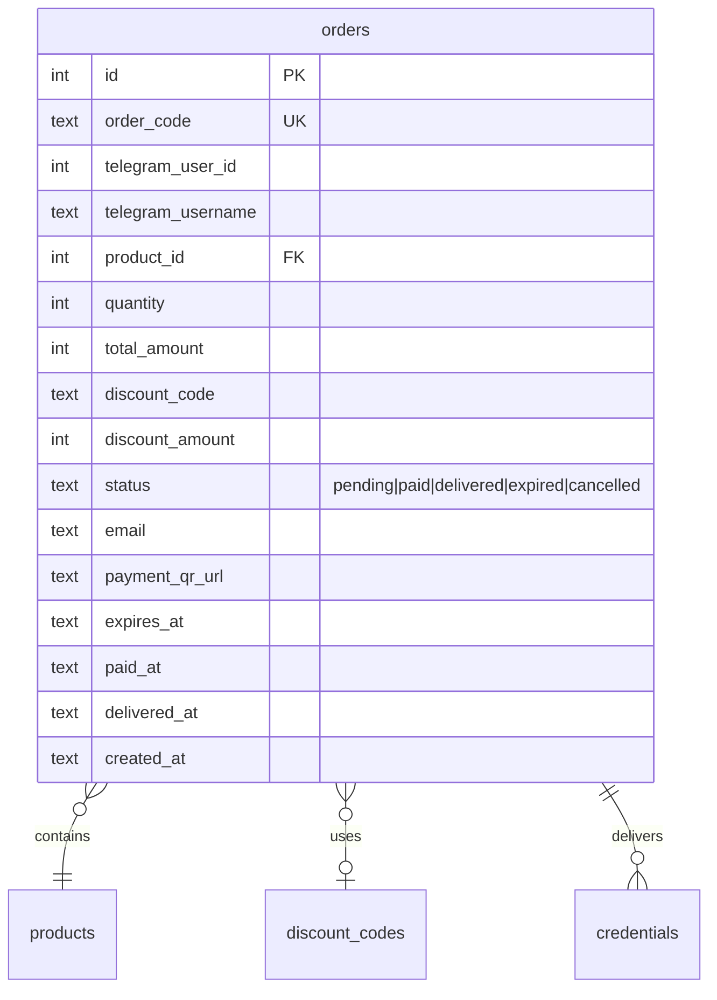
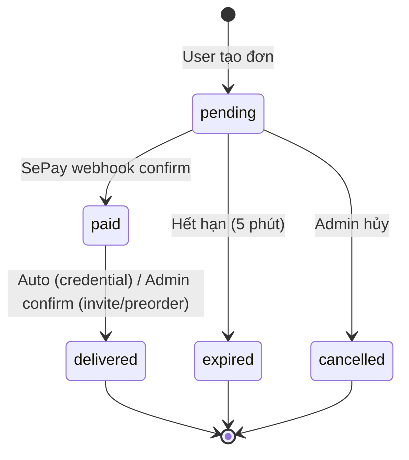

# Feature: Order Flow (F-02)

> **Phase:** 1  
> **Priority:** P0  
> **Status:** ✅ Done (v1.0)

---

## 1. Mô tả

Luồng mua hàng hoàn chỉnh trên Telegram bot: duyệt SP → chọn SL → nhập email → mã giảm giá → tạo đơn + QR → thanh toán → giao hàng tự động. Hỗ trợ 3 loại sản phẩm: credential (auto), invite (manual), preorder (manual).

**Giá trị cốt lõi:** Tự động hóa toàn bộ quy trình bán hàng digital — từ browse đến deliver — không cần admin can thiệp (với product type credential).

---

## 2. Use Cases + Edge Cases

### UC-2.1: Mua hàng (happy path)

1. User gõ `/products` hoặc chọn từ menu
2. Chọn category → chọn SP → xem chi tiết + giá + stock
3. Nhấn "Mua ngay" → chọn số lượng (1, 2, 5, 10, custom)
4. Nhập email (nếu SP yêu cầu `customer_fields`)
5. Prompt mã giảm giá → nhập hoặc bỏ qua
6. Tạo đơn → hiện QR code + countdown hết hạn
7. Chuyển khoản → SePay webhook confirm → giao hàng

### UC-2.2: Đơn hết hạn

- Đơn pending quá `ORDER_EXPIRY_MINUTES` (default 5 phút)
- Auto-cancel → thông báo user → restore stock (nếu credential)

### UC-2.3: Admin xác nhận thủ công

- SP loại invite/preorder → status stays `paid` sau webhook
- Admin nhấn nút confirm → status → `delivered` → thông báo user

### UC-2.4: Gửi lại credential

- Admin panel: nút 🔄 "Gửi lại" → resend credential message

### Edge Cases

| # | Category | Case | Xử lý |
|---|----------|------|-------|
| 1 | Concurrency | 2 user mua stock cuối | SQLite single-writer, first wins |
| 2 | Concurrency | Duplicate SePay webhook | Check order status=pending trước khi process |
| 3 | Data Integrity | Hết stock giữa flow | Re-check stock khi tạo đơn |
| 4 | Data Integrity | Thanh toán thiếu tiền | `transferAmount >= total_amount` check |
| 5 | Cross-Feature | Mã giảm giá hết hạn giữa flow | Re-validate tại thời điểm confirm |
| 6 | Cross-Feature | SP bị xóa có đơn pending | Soft delete (is_active=0), đơn tiếp tục |
| 7 | Data Integrity | Giao credential thất bại | Status stays `paid`, notify admin "GIAO HÀNG THẤT BẠI" |
| 8 | Security | Webhook spoofing | Secret webhook path, validate payload |
| 9 | Data Integrity | Bank account thay đổi mid-order | QR URL dùng bank config lúc tạo đơn |
| 10 | Cross-Feature | Bot restart giữa flow | In-memory state mất → user bắt đầu lại |

---

## 3. Screens & States

### Bot — Product listing

| State | Hiển thị |
|-------|---------|
| **Loading** | N/A (instant query) |
| **Data** | Featured products → Categories → Products |
| **Empty** | "Chưa có sản phẩm nào" |

### Bot — QR Payment

| State | Hiển thị |
|-------|---------|
| **Ready** | QR image + order code + countdown + amount |
| **Expired** | "Đơn hàng đã hết hạn thanh toán" |
| **Paid** | "Thanh toán thành công! Đang gửi sản phẩm..." |
| **Delivered** | Credential message (username/password/link) |

### Admin — Orders table

| State | Hiển thị |
|-------|---------|
| **Loading** | Skeleton table |
| **Data** | Table: Code, Customer, Product, Amount, Status, Actions |
| **Empty** | "Chưa có đơn hàng nào" |
| **Error** | Toast error |

---

## 4. Domain Model

---

## 5. API Endpoints

| Method | Path | Mô tả | Auth |
|--------|------|-------|------|
| GET | `/api/admin/orders` | List orders (filter, sort, paginate) | Admin |
| POST | `/api/admin/orders/:code/confirm` | Confirm order (manual) | Admin |
| POST | `/api/admin/orders/:code/cancel` | Cancel order | Admin |
| POST | `/api/admin/orders/:code/deliver` | Mark delivered | Admin |
| POST | `/api/admin/orders/:code/resend` | Resend credentials | Admin |
| POST | `/webhook/sepay` | SePay payment webhook | SePay |

**Bot commands:** `/orders` — user xem lịch sử đơn hàng

---

## 6. Error Codes

| Code | Context | Message |
|------|---------|---------|
| Out of stock | Order create | "Sản phẩm đã hết hàng" |
| Order expired | Payment | "Đơn hàng đã hết hạn thanh toán" |
| Underpaid | Webhook | Amount < total → không process |
| Delivery fail | Auto-deliver | "GIAO HÀNG THẤT BẠI" → admin notification |
| Order not found | Admin action | "Đơn hàng không tồn tại" |
| Invalid status | Admin action | "Đơn hàng đã được xử lý" |

---

## 7. Analytics Events

| Event | Trigger |
|-------|---------|
| `order_created` | User tạo đơn + QR |
| `order_paid` | SePay webhook confirm |
| `order_delivered` | Giao hàng thành công |
| `order_expired` | Đơn hết hạn auto-cancel |
| `order_cancelled` | Admin hủy đơn |

> **Status:** Chưa implement analytics tracking — ghi nhận cho Phase 4+

---

## 8. State Machine

---

## 9. Caching Strategy

| Data | Cache | TTL |
|------|-------|-----|
| Product list | No cache (real-time stock) | — |
| Order by code | No cache | — |
| User orders | No cache | — |
| VietQR URL | Generated at order creation | — |

---

## 10. Acceptance Criteria

- [x] Full flow: browse → select → quantity → email → discount → QR → pay → deliver
- [x] 3 product types: credential (auto), invite (manual), preorder (manual)
- [x] VietQR QR code generation (no API key needed)
- [x] SePay webhook auto-verify payment
- [x] Order auto-expire sau 5 phút (configurable)
- [x] Stock restore khi đơn expire/cancel
- [x] Credential FIFO delivery
- [x] Admin: confirm, cancel, resend, mark delivered
- [x] Discount integration (prompt + validate + calculate)
- [x] Error handling: notify admin on delivery failure
- [x] Subscription expiry tracking + reminders
